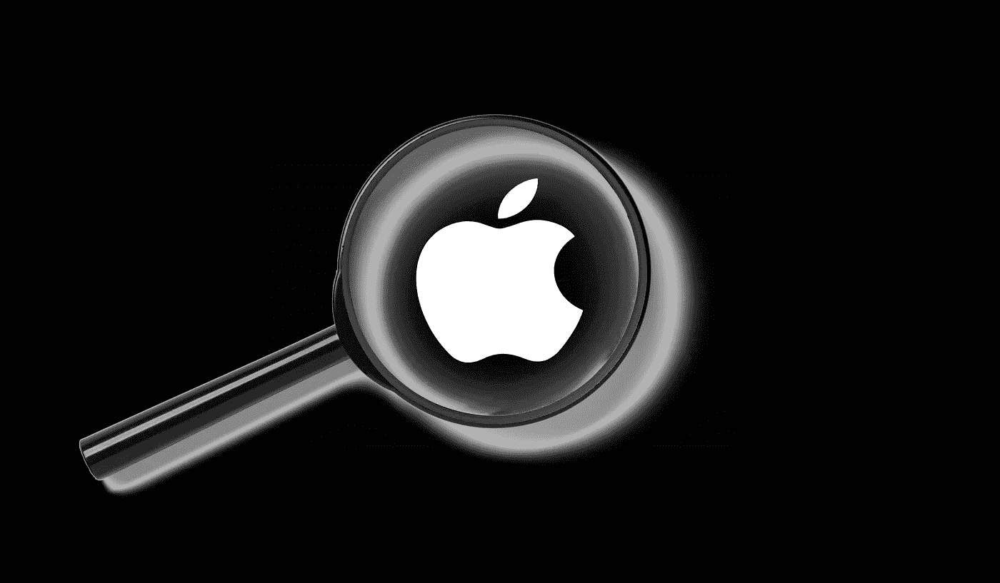

# 苹果如何通过搜索引擎赚钱

> 原文：<https://medium.datadriveninvestor.com/how-apple-can-make-money-through-a-search-engine-12e018a58154?source=collection_archive---------5----------------------->

## 意见

## 苹果如何弥补 120 亿美元的损失

Created with Canva Design

国会希望打破谷歌，声称它非法击败了搜索引擎市场的竞争。截至 2020 年 7 月，谷歌以 86.86%的市场份额占据主导地位。

理由是，谷歌向其他公司支付数十亿美元，成为其消费者的默认搜索引擎。

> 2019 年，谷歌支付了 300 亿美元的“流量获取成本”，几乎是其整个搜索收入的三分之一。这高于前一年的 267 亿美元，也高于 10 年前的 62 亿美元。

[据报道，谷歌向苹果支付了 120 亿美元](https://www.fastcompany.com/90547333/covid-19-robbed-me-of-a-cherished-annual-holiday-heres-how-i-took-it-back)，让谷歌成为 iPhones 手机 Safari 的默认搜索引擎。这意味着，如果谷歌受到监管，苹果每年将损失约 120 亿美元，相当于其全部服务收入的 1/5。

> 苹果依赖谷歌，他们的纽带随时可能被切断。作为替代方案，据传苹果正在开发自己的搜索引擎——苹果搜索。

那么，苹果计划如何将其货币化，并弥补 120 亿美元呢？

# 广告

很难相信苹果会利用广告来使其搜索引擎盈利。这是因为广告主利用用户数据来定向投放相关广告，赚取最大收益。然而，追踪和分析用户并不是从广告中获利的唯一途径。

苹果已经在其应用商店中展示广告。它叫做[苹果搜索广告](https://searchads.apple.com/)。他们可以扩展这项服务来支持他们的搜索引擎。

苹果会也不能使用用户数据，因为它在隐私方面的地位。苹果甚至拒绝帮助联邦调查局解锁一部与圣贝纳迪诺枪击案有关的 iPhone。

因此，苹果将采取不同的方式。与谷歌以用户为特征不同，苹果可以跟随 DuckDuckGo 的脚步。

DuckDuckGo 不会对用户进行简介，相反，它使用关键字来显示一个会话的相关广告:在你关闭浏览器后，DuckDuckGo 并不知道你。每个会话都认为你是新用户。

苹果可以使用同样的方法，但是当然，他们会为它使用一个不熟悉的名字，并称之为广告行业的一场革命。

# 苹果虚拟专用网

在我的一篇文章中，我讨论了为什么 Apple One 应该有 VPN 服务。

 [## 苹果虚拟专用网是下一件大事

### 忘记智能手机和笔记本吧，隐私是新的竞技场

medium.com](https://medium.com/datadriveninvestor/apple-vpn-is-the-next-big-thing-efac18a3a678) 

有了新的搜索引擎，苹果 VPN 比以往任何时候都更有意义。它可以补充苹果搜索，并帮助苹果公司使其产品更加安全。

当世界上最好的搜索引擎是免费的——谷歌在搜索结果方面是最好的——没有人会购买苹果搜索时，苹果将很难对一个搜索引擎收费。

因此，苹果可以对 VPN 服务收费，因为大多数好的 VPN 服务都是付费的。它可以弥补搜索引擎的成本，用户可以选择购买 VPN。

# 创新ˌ革新

苹果对其搜索引擎收费的唯一方式是他们发明新的东西。如果他们能发明一个其他搜索引擎没有的非常有用的额外功能，人们会毫不犹豫地付钱。

我想不出其他搜索引擎没有的东西，但我们谈论的是苹果。他们可能有锦囊妙计。

这些是我认为苹果公司将利用其搜索引擎赚钱的几种方式。不能保证苹果会这么做，但这些是从搜索引擎中赚钱的可能方法。