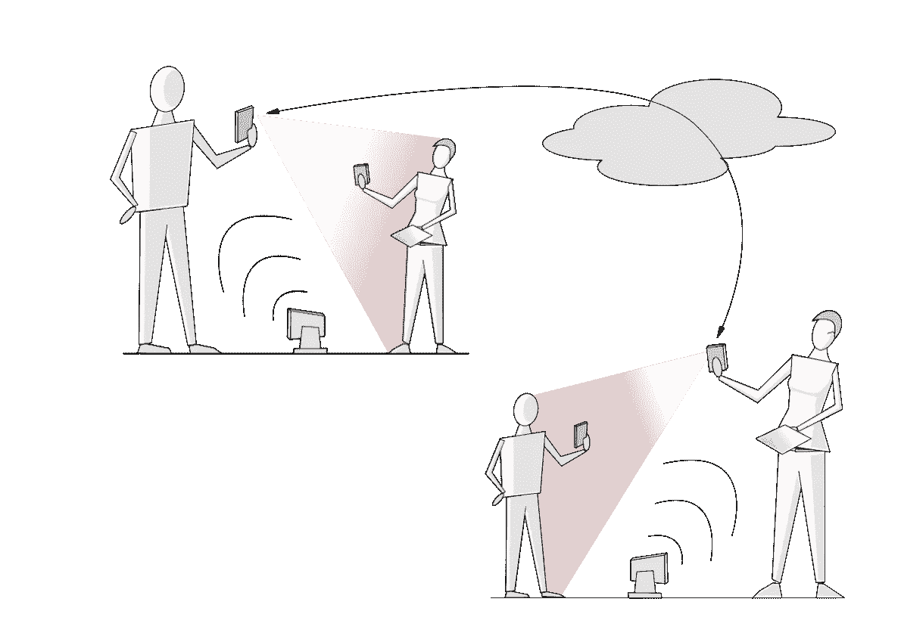
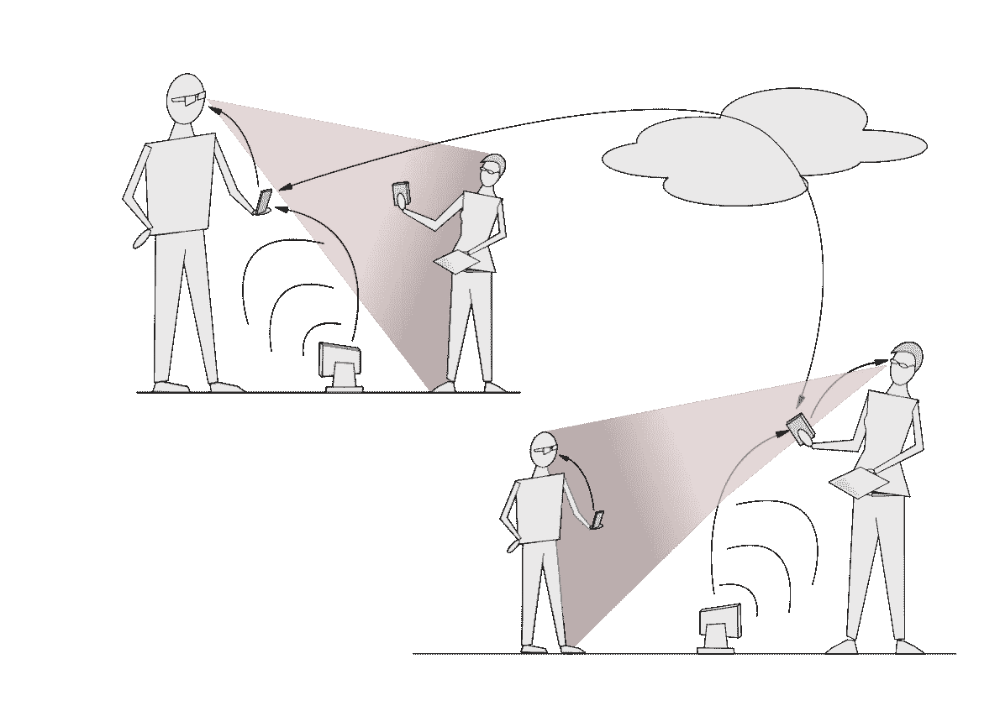

# 苹果如何将增强现实集成到 FaceTime 中，但还不是时候

> 原文：<https://medium.datadriveninvestor.com/how-apple-could-integrate-augmented-reality-into-facetime-but-probably-not-yet-74835427e5e8?source=collection_archive---------2----------------------->

## 我喜欢 AR 的想法，但我会用它来做什么呢？受《星球大战》的启发，我有了一个想法:FaceTime AR，但它需要苹果眼镜

Photo by [Harry Cunningham](https://unsplash.com/@harrycunnningham1?utm_source=medium&utm_medium=referral) on [Unsplash](https://unsplash.com?utm_source=medium&utm_medium=referral)

你是否和我一样对增强现实(AR)感到失望？我看了苹果公司的活动，虽然在第一个 30 秒后有点无聊，但我还是被深深打动了。不要误解我，把虚拟物体放在一个物理世界里是聪明的。

*   是的，把卧室变成金发女孩的虚拟故事板是一件新奇的事情。
*   发现宜家家具放在我的客厅里会有多好看是一件有趣的事情。
*   我甚至尝试了[的测量应用](https://support.apple.com/en-us/HT208924)，虽然我不知道为什么。

它们都是你出于好奇尝试一两次，然后就忘了的东西。AR 是我希望能找到用途的技术。

我在一个不太可能的地方找到了灵感。我在看原版(也是最佳)[星球大战电影](https://www.starwars.com/films/star-wars-episode-iv-a-new-hope)。欧比万·克诺比在 R2D2 身上按了什么东西，莱娅公主的图像闪入眼帘。

 [## 作为可访问存储器的虚拟现实架构|数据驱动的投资者

### 一个好的建筑 app 是由什么构成的？一个详细的模拟，一方面是信息丰富的，但也是视觉和…

www.datadriveninvestor.com](https://www.datadriveninvestor.com/2020/02/15/vr-architecture-as-an-accessible-memory/) 

这有什么关系？现在是 AR ，我认为你可以用苹果技术做类似的事情。我认为它可以和 FaceTime 一起使用，让你与之交谈的人似乎在同一个房间里。将苹果眼镜加入其中，你会有一些特别的东西。

你怀疑？我想解释一下。只是笑一笑。

# 那该怎么做呢？

让我们假设软件和硬件只是暂时存在，并专注于体验。

1.  我决定花些时间和我的朋友萨姆在一起，他和我一样是苹果迷。我决定使用 FaceTime AR。
2.  我找了个有点空间的房间，用我的 iPhone 15 给她打电话。她接受了。
3.  有一个短暂的停顿，然后 iPhone 的 AR 硬件和摄像头激活。
4.  我透过 iPhone 的屏幕看着我面前的房间，那是山姆。
5.  好像她就在房间里。我看到她的动作，她也看到我的动作。我们完美地对口型说话，然后她想让我看她拿着的一本书。
6.  我走过去，看了看封面。
7.  当我们完成后，我挂了电话，山姆的形象从我的客厅消失了。

这里是设置:

Diagram by author

我认为大部分工作可以通过苹果将在未来两年发布的硬件来完成。我知道，大胆的谈话，但是听我说完。

# iPhone + iPad

要做到这一点需要什么？

我认为两端都只有一部 iPhone 是不可能的。每个人面前都需要一台 3D 扫描仪，坐在稍远的地方。这是追踪每个人的位置和行动所需要的。

让我们用 iPads 作为扫描仪。人们可能有 iPad 和 iPhone，但我怀疑很多人会有两部 iPhone。

让我们再次尝试 FaceTime AR 调用，但添加一些细节。

1.  我把 iPad 放在面前的地上，用我的 iPhone 15 给我的朋友萨姆打电话。
2.  山姆接受了我的 FaceTime AR 呼叫，并将她的 iPad 放在她面前的地上。
3.  每部 iPhone 都与其各自的 iPad 配对。
4.  我的 iPad 的 3D 扫描仪打开并扫描我。它开始向 Sam 的 iPhone 发送 3D 数据。
5.  Sam 的 iPhone 开始接收我的 3D 数据，并创建我的 AR 图像，将其放在 Sam 的房间中。她的 iPhone 和 iPad 则相反。
6.  山姆的 AR 图像出现在我的客厅。
7.  我们聊天，就好像我们在同一个房间里。我看着她的书的封面。

Diagram by author

**那还不算太糟。我不需要想象任何已经存在的东西。**2020 年的 iPad Pro 有一个非常好的 3D 扫描仪，我怀疑 2020 年的 iPhone 也会有。

除了软件难以想象的复杂性之外，还有什么大的挑战？

*   数据量(当然)。
*   潜伏期(当然)。
*   看着书的封面(真的？).

# 迎接挑战

## 数据量

数据量真的是一个大问题吗？目前的硬件已经可以轻松处理 4K 视频。

处理 3D 图像会大大增加你需要发送的信息量。让我证明给你看。

我将简化并忽略任何图像压缩。假设我想发送一个正方形的 2D 图像，它是 10 像素宽 x 10 像素高。我发送多少像素？简单，10 x 10 = 100 像素的信息。

我们去 3D 吧。假设我有一个 10 像素 x 10 像素 x 10 像素的立方体。我必须发送 6 面 x 10 x 10 像素的信息= 600 像素。比正方形多六倍的信息，这是一个非常简单的物体

**当然，聪明的人会使用各种技巧来压缩图像，但这仍然是一个非常多的数据**，尤其是当它出现时，你必须处理 8K 视频。我怀疑我们需要更多的 ARM 处理器迭代才能解决这个问题。

与此同时我们要做什么？我们可以通过将 AR 3D 图像转换成卡通来简化它。随着硬件加速，图像变得越来越逼真。硬件也可以逐步构建图像。它开始时很粗糙，然后变得很清晰。

## 拉…十…日历年度(calendar year)

挑战不会随着**数据量**而停止。你必须实时分析所有数据，通过网络发送，然后在另一端重新组合。另一端必须将它投射到房间里。这是一个它也在实时分析的房间！

所有这些处理都有导致延迟的风险，这会给语音带来很大的问题。当我说话时，我的嘴唇在动。3D 扫描仪捕捉到这些信息，iPad 必须对其进行分析、打包并发送出去。与此同时，声音早就消失了，因为这很容易处理。

我们该如何解决这个问题呢？

不是 AR 图像的所有部分都同样重要。我会优先考虑真正重要的细节。我会把精力集中在面部表情和动作上。它们必须是准确无误的。我不认为手臂运动或类似的动作不完全同步会有什么关系。

看看萨姆的书的封面怎么样？这是一个问题，因为扫描 iPad 看不到它。

## 从书的封面判断 AR 错觉

如果 FaceTime AR 要达到宣传的效果，每个参与者都需要能够四处走动，并在 AR 中看到现实生活中会看到的东西。

例如，萨姆想给我看她拿着的一本书。我走过去看它。这是一个问题，因为这本书是平的，iPad 扫描仪无法“看到”书的顶部。

至少有一个解决方案。萨姆放下她的 iPhone，它的摄像头扫描书的封面。iPhone 和 iPads 中的人工智能和原始处理能力使图像出现在我正在享受的 ar 视图中。

这是应对挑战的一种可能方式。你也可以在房间里到处都装摄像头，但是谁想要这样呢？

# 苹果眼镜

AR 的另一大绊脚石是，你必须在你面前拿着手机走来走去。你看起来像个白痴，你可能会撞到柱子。对于 FaceTime AR 来说，这并不是一个阻止秀，因为这一切都将发生在你的前屋的隐私中。尽管如此，还是有点尴尬。

进入苹果眼镜。我知道苹果还没有发布产品，但我打赌他们会的。**没有它们，增强现实就没有实际意义**，苹果公司在增强现实方面做了很多。所以这是苹果眼镜的 FaceTime AR。看起来有趣多了，不是吗？

Diagram by author

iPhone 充当了 iPad 和眼镜的整合点。它从 iPad 上获取 3D 数据并发送到另一端。它接收远程 3D 信息，并为眼镜打包。我怀疑这种眼镜除了显示 iPhone 告诉它的任何东西之外什么也不会做。

# 新的希望

我已经描述了一种我以前认为只是新奇的技术，AR，实际上可以做一些非常酷的事情。与 FaceTime 结合，它可以将我们关心的人投射到我们的客厅，即使他们在世界的另一边。

*   我用非常宽泛的术语描述了它如何与已经存在的技术一起工作——算是吧。可能需要一点额外的速度:-)。
*   我提请大家注意我认为最大的绊脚石是什么，并提出了绕过它们的方法。
*   我疯了，加了苹果还没发布的技术，苹果眼镜。我推测他们会完善幻觉。

最终是不是这样并不重要。酷的是，科技仍然有新的方式来改善我们的生活。我有点担心这一切会变得更好，更快，但是。

## 访问专家视图— [订阅 DDI 英特尔](https://datadriveninvestor.com/ddi-intel)