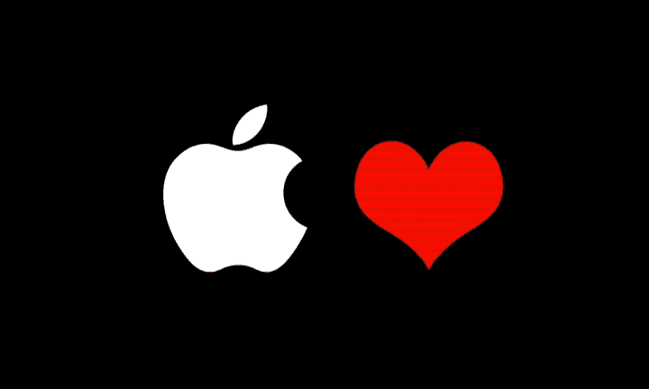

# 苹果公司如何帮助医生监测和治疗病人

> 原文：<https://medium.datadriveninvestor.com/how-apple-inc-helps-physicians-monitor-and-treat-patients-f5b399b9645c?source=collection_archive---------15----------------------->

## 苹果越来越多地涉足医疗保健领域。他们正在为医院、医生和病人做一些非常酷的事情。

自古以来，人类总是依赖工具来满足日常需求。这些工具的基本目的是帮助人类，额外推动他们把世界变得更美好。

在本文中，我们将深入探讨苹果公司如何利用其技术工具和平台改变医疗实践。

## 介绍

从接待处到诊室和实验室，医疗服务的每个方面都需要采用合适的工作工具。医疗保健提供者提供最佳护理的能力始终取决于在每个流程中使用正确有效的工具。

苹果公司的技术正在弥合病人护理和工具采用之间的差距。苹果公司使用创新的技术工具来提高医院的效率，在进行突破性医学研究的同时，远程连接医院和患者。

 [## 2019 年即将改变世界的技术|数据驱动的投资者

### 很难想象一项技术会像去年的区块链一样受到如此多的关注，但是……

www.datadriveninvestor.com](https://www.datadriveninvestor.com/2019/01/17/the-technologies-poised-to-change-the-world-in-2019/) 

这些工具的使用为所有人创造了更加个性化、高效和可靠的医疗保健。这些应用和小工具结合了人工智能和智能设计的力量，以满足不断增长的医疗保健需求。

# 苹果公司是如何改变医疗保健的？

## a.改善医院的医疗服务

最好的医疗服务系统总是依赖于病人、医生和护士之间的有效互动。患者健康记录需要在需要时可用，并且必须是最新的，以适应医生必须考虑的任何最新发展。

有了 iOS 设备上的新应用，在正确的时间访问健康记录和数据非常有效。在住院期间，它通过与医疗团队的沟通使患者了解情况并参与到他们的个人护理中。

人们越来越有兴趣使用 Apple Watch 和其他可穿戴技术，在著名应用程序的帮助下[记录患者就诊](https://www.imore.com/doctors-begin-recording-patient-visits-using-apple-watch-california)。

苹果手表上安装的著名应用程序允许医生在诊所就诊时自然地说话。同时，该应用程序捕获所需的数据，然后添加实验室结果、处方、转诊，并为签字确认做好一切准备。它还提供了更新 EHR 所需的所有必要数据。

这将最终增加患者与医生在医院就诊期间的互动，同时改善服务提供，缓解与满足患者需求的麻烦相关的压力。

这项技术在[赋予**盖辛格**的患者权力，以及在**奥克斯纳**简化医疗保健方面发挥着关键作用。](https://www.apple.com/105/media/us/healthcare/2018/b961bE48_d511_4812_8dee_e470452375a3/films/geisinger/healthcare-geisinger-tpl-cc-us-20180503_1280x720h.mp4)

## b.持续的家庭患者护理

有了最新的 iOS 健康应用程序，患者现在可以与他们的护理人员保持联系，而没有更频繁地去医院的压力。

虽然有现成的应用程序，但苹果公司也允许医疗保健提供商通过 CareKit 创建他们独特的应用程序，以使患者能够管理他们的健康。这些应用程序可以在所有苹果产品上运行，方便患者记录他们的健康数据，并与他们的护理团队分享。

苹果公司凭借其 [**苹果健康记录**](https://www.apple.com/healthcare/health-records/) 和带单导联心电图的 Apple Watch 大举进军医疗领域。

通过苹果健康记录应用程序，患者可以可视化和存储他们的健康记录。这意味着患者可以在移动时将他们所有的健康史都放在手掌上，从而对他们的健康有一个更全面的了解。

[**Apple Watch Series 5**](https://www.apple.com/apple-watch-series-5/health/)是健康倾向的可穿戴技术中最好的一块。它可以监测心率，如果有什么事情要发生，它会通知你。它还在跟踪你的月经周期方面发挥着积极的作用，并告诉你噪音水平是否上升到可能损害你的听力的程度。

在你的 Apple Watch 上安装心电图应用程序，它可以生成类似于单导联心电图的心电图，为医生提供相关的健康数据。将手放在表冠上，ECG 应用程序可以在 30 秒内生成准确的心脏读数。

[**CareKit**](https://developer.apple.com/design/human-interface-guidelines/carekit/overview/introduction/) 是一个开源框架，面向有兴趣开发医疗保健应用的患者。它允许用户通过跟踪症状、创建动态护理计划以及连接到护理团队来管理他们的健康。

感兴趣的人可以使用 CareKit 应用程序来实现他们的健康和健康目标，从手术或受伤中恢复，并管理糖尿病等慢性疾病。它只需要用户跟踪他们的护理计划和症状，并与他们的护理团队分享这些信息。

## c.突破性的医学研究

医学研究需要科学工具和知识的结合来努力。有了苹果公司的新应用程序和建筑应用程序，研究人员现在可以把他们的发现带到世界各地，帮助拯救生命。

您可以使用 **ResearchKit** 构建您独特的基于研究的应用程序，这是一个开源框架，可以简化创建应用程序的过程，从而使研究人员可以非常容易地招募参与者，获得知情同意，并最终更频繁地收集医疗信息。这满足了定期收集数据的需要。

与专注于患者护理的 CareKit 不同， [ResearchKit](http://researchkit.org/) 是严格为医学研究人员和开发人员设计的。作为一个开源框架，它允许研究人员和开发人员严格为医学研究创建精彩的应用程序。

这在使用各种可定制模块创建可视同意流、实时动态、主动任务和调查时非常方便，这些模块可以开发并与社区共享。它允许用户为他们的研究获取相关数据，从而改善医疗保健。

# 结论

欢迎来到可穿戴技术时代，我们需要的一切只需轻轻一点。

苹果公司正在引领一场旅程，让每个人都能更方便地获得高效的医疗保健，无论其健康状况或社会地位如何。

苹果产品与合适的开发者合作的能力简直令人惊叹。

*本文原帖*[*www . aim blog . io*](http://www.aimblog.io/2020/02/14/how-apple-inc-helps-physicians-monitor-and-treat-patients/)*。如果你想了解更多关于人工智能、医学和新兴技术的知识，可以看看我的其他帖子。*