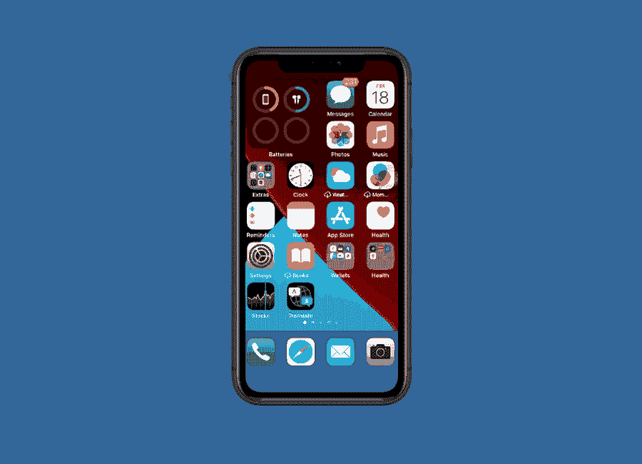
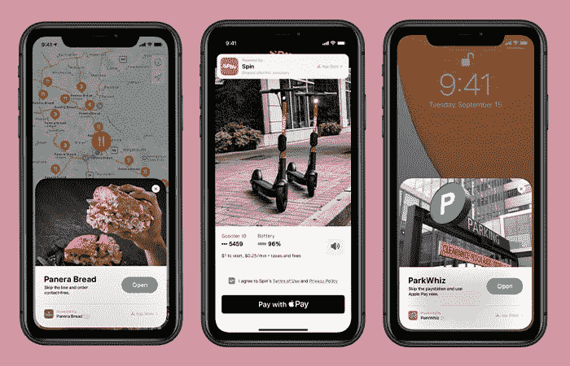

# 应用程序剪辑如何以多种方式惠及企业？

> 原文：<https://medium.datadriveninvestor.com/how-are-app-clips-benefiting-businesses-in-multiple-ways-956108ca0cea?source=collection_archive---------5----------------------->

想象一下，当你要求你的用户下载多个应用程序供一次性使用时，他们会是什么感觉？目前，苹果应用商店非常拥挤，有近**200 万个应用，**而谷歌的 PlayStore 有**280 万个应用。**

想一想，说服用户下载这么多不同的应用程序对你来说是多么具有挑战性。如果你的企业用名为 ***应用剪辑的*迷你应用*打入市场会怎样？*** 有了这个功能，用户将能够比以前更快地与某些 app 功能进行交互。

苹果在 2020 年全球开发者大会上发布了这一消息。该活动发布了一个巨大的公告，称苹果将首次推出类似于 Android 即时应用程序版本的应用程序剪辑。

这些应用程序片段很小，平均约为 10 MB，在用户的 iPhone 或 iPad 上几秒钟内即可启动。当你不需要下载比你真正需要的更多的应用程序时，这个功能看起来很棒。

***这里我们就来看看 app clips 在不同业务领域的好处。***

# **什么是 App 剪辑？**

App Clip 是用户在需要时使用的应用程序的一小部分。因为它们在需要时可以被发现，所以它们被设计成轻量级和快速的，以便任何用户都可以容易地打开它们并在几秒钟内完成体验。

用户将只使用他们需要的那部分应用程序。它提供了两种功能，要么下载完整的应用程序，要么使用应用程序的一小部分。它允许用户随时随地使用重要的功能。

例如，*你的一个用户想在咖啡馆预定一个座位，另一个用户想付钱买一杯饮料。这两个用户将只启动他们在特定时刻需要的那部分应用程序。*

# **App Clips 如何在多个方面帮助您的企业？**

让应用程序剪辑成为你的应用程序的一部分，让你的应用程序在全世界脱颖而出。它会自动提升你的电子商务销售和零售体验。

没有一个用户希望他们的手机空间充满了他们在很长一段时间内使用一次或两次的应用程序。App Clip 使其用户能够在特定时间只使用他们需要的那部分应用程序。

 [## 吸引我还是激怒我:游戏化将主宰世界|数据驱动的投资者

### 不要只想着游戏。想想我们整个生活世界的游戏化。网飞已经认为游戏是一个更大的…

www.datadriveninvestor.com](https://www.datadriveninvestor.com/2020/10/01/engage-me-or-enrage-me-gamification-will-run-the-world/) 

作为一个品牌，你只能在顾客需要的时候向他们展示相关的信息。App Clips 直击客户需求，增加**业务知名度和收益。**如果您需要任何帮助，您可以从印度[顶级移动应用程序开发机构获得帮助](https://www.codersdaddy.com/mobile-app-development)。

> **使用应用程序的子部分**

意思是应用的子集。这里，用户只使用他们希望使用的应用程序的功能。

> **下载应用程序**

如果用户希望下载应用程序，他们可以选择从剪辑中下载应用程序。

> **App 剪辑如何被发现？**

NFC 标签——拥有 NFC 标签的用户可以在他们的 iPhone 上点击标签来启动应用程序剪辑。他们甚至可以通过锁屏来执行任务。

> **应用程序剪辑代码**

到 2020 年底，苹果将提供创建应用程序剪辑代码所需的工具。但这并不意味着我们不能欣赏将要发生的事情。应用程序剪辑代码必须进行编码。URL 和 NFC 标签，这将使代码能够被 iPhone 摄像头点击和扫描。

> **二维码**

用户可以将二维码放在特定位置来启动应用程序。他们需要做的只是使用相机应用程序或条形码阅读器扫描代码。

> **消息中的链接**

用户可以通过消息分享应用剪辑，另一端的人只需进入消息就可以直接打开应用。

> **地图中的卡片**

如果应用程序剪辑链接到特定位置，作为用户，您需要注册它以出现在“地图”中的位置卡上，以便用户可以直接打开它。

> **新的应用程序库**

这是 iOS 手机隐藏却难以想象的功能之一。新下载的应用程序不会造成主屏幕混乱。一些最近使用的应用程序剪辑可以很容易地从新的应用程序库的最近部分找到并启动。

> **Safari 应用横幅**

智能手机用户可以点击配置有智能应用横幅的网页来打开 Apple Clips 应用。

# **应用程序剪辑对业务提供商有何益处？**

企业从新的 iOS14 应用程序中受益匪浅。看看它的一些用例。

*   自行车、汽车、电动车的租赁；
*   付费停车位；
*   预订旅游或公寓；
*   在旅途中购买食物和商品；
*   在繁忙的地方预订房间；
*   在电影院或餐厅预订座位；
*   提前点餐或叫外卖，
*   访问 AR 内容或音频评论(博物馆、艺术空间、游览)。

通过应用程序剪辑，用户只需启动应用程序剪辑即可无缝享受多种体验。

让我们借助一个例子来理解这一点。

假设你拥有一家杂货店，有一长串的人。顾客因此无法付款，正在离开商店。在 App clip 的帮助下，客户可以轻松进行支付，节省等待时间。

他们需要做的只是启动应用程序剪辑，这是他们需要的整个应用程序的一部分，然后你就可以开始了。始终牢记应用程序剪辑设计指南，并遵循深度链接实践，以便应用程序用户可以享受无缝体验。它将允许用户打开您用应用程序剪辑调用的特定屏幕。如果你需要帮助，你可以[在印度](https://www.codersdaddy.com/hire-developer-engineer-programmer/mobile-app)雇佣移动应用开发者。

# **App Clips 有哪些痛点？**

毫无疑问，app clips 将在未来几个月乃至几年取得成功。但是，像其他任何东西一样，应用程序剪辑也有自己的缺点。

*   Apple Clips 主要是为 iOS 用户设计的，尽管 Android 即时应用程序也提供类似的功能。有了这个，你可以通过在零售店或餐厅添加一个 App Clip 二维码或 NFC 控制台，将你的受众仅限于 iPhone 用户。
*   通过 App Clips 进行的交易是在 Apple Pay 生态系统内部进行的，在那里很难收集用户数据并说服他们注册账户或忠诚度计划。
*   使用应用程序剪辑，用户将只下载他们需要的那部分应用程序。由于这款应用在八小时后就会从智能手机上消失，这可能会导致宝贵客户的流失。它限制用户下载整个应用程序。

# **最后的话**

即使用户将与应用程序的一部分进行交互，这也不意味着您可以忽略应用程序的 UI 和 UX。申请中的每一个细节都需要特别注意，这有助于你的业务取得成功。

应用程序剪辑使人们与应用程序的互动更快，并成倍增加您的电子商务业务的转化率。这个迷你的即时应用已经成为一个伟大的工具，它将使用户和企业同时受益。

如果您正在为您的 ios 应用程序寻找应用程序剪辑，请[从顶级移动应用程序开发公司雇佣印度的 iOS 应用程序开发人员](https://www.pixelcrayons.com/hire-iphone-app-developer)。他们在开发不同行业垂直领域的应用程序剪辑方面拥有丰富的专业知识。

**访问专家视图—** [**订阅 DDI 英特尔**](https://datadriveninvestor.com/ddi-intel)