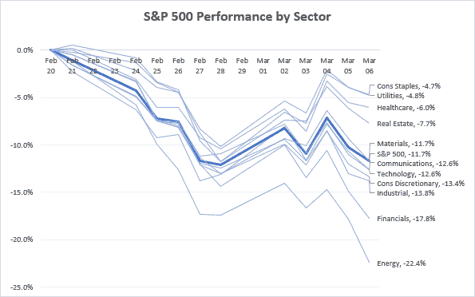
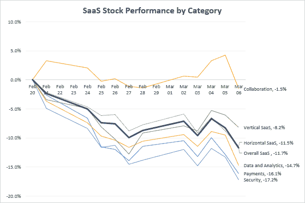
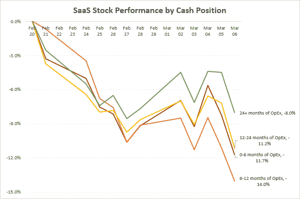

# 软件投资者如何权衡冠状病毒的影响？

> 原文：<https://medium.datadriveninvestor.com/how-are-software-investors-weighing-the-impact-of-coronavirus-29a10e62db30?source=collection_archive---------7----------------------->

过去几周，标准普尔 500 下跌超过 10%，创下近十年来最大单日跌幅。你可能已经看过很多关于受到冠状病毒严重影响的个股的文章，如[嘉年华邮轮公司](https://markets.businessinsider.com/news/stocks/carnival-stock-price-down-nearly-50-percent-since-coronavirus-outbreak-2020-3-1028970212?utm_campaign=The%20DL&utm_medium=email&utm_source=Revue%20newsletter)(年初至今下跌 50%)和 [Zoom](https://www.barrons.com/articles/zoom-video-stock-coronavirus-benefit-51583424435?utm_campaign=The%20DL&utm_medium=email&utm_source=Revue%20newsletter) (年初至今上涨 65%)，但这里有一些关于投资者买卖的分类观察。

**S & P 500 按行业表现**

在 2 月 27 日和 28 日的大幅下跌中，标准普尔 500 各行业走势非常接近，但上周，一些行业开始复苏，而另一些行业则进一步下跌:

*   自 1 月以来，能源行业一直在挣扎，但是随着旅游和经济活动的放缓，对能源的需求急剧下降，而且这种需求的大部分不会在以后得到“弥补”
*   与此同时，消费品(沃尔玛、P&G、可口可乐、好市多)仅下降了 4.7%。这些公司的销售已经被[拉动](https://www.fool.com/investing/2020/03/02/why-costco-stock-surged-today.aspx?utm_campaign=The%20DL&utm_medium=email&utm_source=Revue%20newsletter)(例如[人们囤积卫生纸](https://www.buzzfeed.com/mjs538/tweets-that-show-what-the-coronavirus-toilet-paper?utm_campaign=The%20DL&utm_medium=email&utm_source=Revue%20newsletter))，但随着时间的推移，对这类产品的需求应该会有一个稳定的、可预测的水平

**按类别划分的 SaaS 股票表现**

放大科技板块，从 2 月 20 日到 3 月 6 日，SaaS 公司平均下跌 11.7%，与标准普尔 500 的回报率持平。但是，当您仔细查看数据时，会发现一些有趣的信息:

*   当然，目前 SaaS 最大的“赢家”是合作公司(Zoom、Slack、Atlassian、Smartsheet、Dropbox)。例如，zoom[今年前八周增加的用户](https://www.cnbc.com/2020/02/26/zoom-has-added-more-users-so-far-this-year-than-in-2019-bernstein.html?utm_campaign=The%20DL&utm_medium=email&utm_source=Revue%20newsletter)比 2019 年全年增加的用户都多
*   支付公司(Square、Shopify、Paypal、Zuora)下降了 16%,因为它们依赖于经济活动和交易收入，其中很大一部分来自 [**小企业**](https://www.nytimes.com/2020/03/04/upshot/coronavirus-impact-small-businesses.html?utm_campaign=The%20DL&utm_medium=email&utm_source=Revue%20newsletter) **它们比大公司**更容易受到冠状病毒的影响
*   表现低于 SaaS 平均水平的另外两个类别是数据/分析和安全，这两个**领域通常需要复杂的面对面销售和实施工作**，这将受到限制旅行和面对面会议的严重影响

**按现金头寸划分的 SaaS 股票表现**

最后，在不确定时期，公司需要确保他们能够生存和适应，这意味着手头有足够的现金支付运营费用，如工资、租金和基础设施。

*   上图显示了 SaaS 股票的表现，即假设没有来自收入或融资的现金流，它们的现金相对于其运营费用(SG&A 费用+ R&D 费用)的比例
*   手头现金不足一年的公司下跌了 14%，而现金超过两年的公司仅下跌了 8%，这表明投资者对强劲的现金头寸给予了溢价

大多数时候，个人是相当愚蠢的(见:r/WallStreetBets )，所以观察随着时间的推移，市场如何对新信息做出相对理性的反应是很有趣的。

 [## 算法交易的机器学习|数据驱动的投资者

### 当你的一个朋友在脸书上传你的新海滩照，平台建议给你的脸加上标签，这是…

www.datadriveninvestor.com](https://www.datadriveninvestor.com/2019/01/30/machine-learning-for-stock-market-investing/) 

查看上周的数据，我们已经可以看到投资者青睐具有某些属性的公司，随着我们在未来几周对冠状病毒的了解越来越多，我们将继续从短期波动性转移到了解投资者如何权衡冠状病毒对特定类别和公司的长期影响。

如果你喜欢这篇文章，可以看看我的每周时事通讯,它是关于科技、创业和在西北太平洋地区投资的。