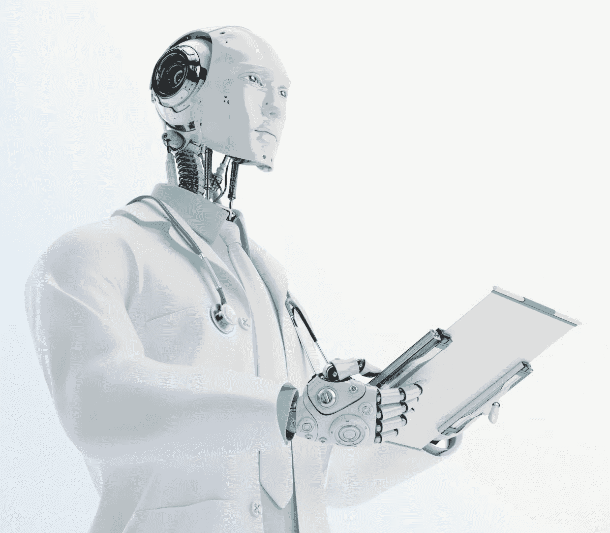

# 如果战略性地实施，人工智能将如何永远改变医学

> 原文：<https://medium.datadriveninvestor.com/how-artificial-intelligence-can-change-medicine-forever-if-implemented-strategically-a3a5a4ec4246?source=collection_archive---------16----------------------->

Credit: Shutterstock

从核磁共振成像和 x 光机的发展到先进修复术和激光手术的应用，医疗保健行业的进步是革命性的。然而，我们正处于医疗保健新时代的黎明，因为数据的复杂性和增长使得人工智能(AI)的使用成为必要。人工智能在医疗方面的潜力是巨大的，例如操作、管理、患者互动和研究(仅举几例)，但事实仍然是，医疗保健仍然是一个由人类主导的行业。而且有合理的理由说明为什么这个行业应该保持这种状态。最终，在人工智能完全融入医疗保健行业之前，必须考虑人工智能在医疗保健行业实施的伦理问题，如机器缺乏问责制和当前医疗保健工作者的潜在替代。因此，人工智能应该根据具体情况融入医疗保健行业。本文将详细介绍人工智能的几个医疗保健应用，这些应用将给行业带来巨大的好处，同时带来最小的缺点。

 [## 大笔资金和尖端技术:人工智能/人工智能投资将如何革新医疗保健…

### 在过去几年人工智能(AI)和机器学习(ML)的显著发展中…

www.datadriveninvestor.com](https://www.datadriveninvestor.com/2018/03/22/big-money-and-cutting-edge-technology-how-investment-in-ai-ml-will-revolutionize-the-healthcare-industry/) 

**患者参与度**

医生只能开出医疗保健计划，让病人独立执行；这完全取决于患者是否按照计划行事，并采取最有利于他们健康的行动。因此，鼓励患者为自己采取先发制人的健康措施是当前医学领域的挑战。人工智能应该在这方面得到利用，因为它能够利用机器学习，特别是监督学习。这使得人工智能可以输入关于患者行为、特征和情况的数据，以便预测对每个患者来说最适合的治疗方案。有了针对个体患者情况而非通用脚本的医疗保健计划，患者将更有可能坚持到底。例如，一名哮喘患者更有可能坚持瑜伽训练，而不是涉及心脏的康复治疗。除了增强医生开出定制治疗方案的能力，人工智能对寻求快速诊断的个人来说也非常有价值。事实上，这样的技术已经存在:Buoy Health 是一种基于人工智能的症状和治疗检查器，它使用聊天机器人来倾听患者的症状和健康问题，以根据其诊断制定医疗保健计划。Buoy 的症状检查器旨在帮助用户更好地了解他们的医疗症状。不再没完没了地搜索。不再猜测。不会再有人为了告诉你得了肠胃感冒而去看医生。既然这种技术已经存在，接下来的步骤就是提高它的可信度，让它更容易获得。人工智能可以帮助患者在小的健康问题出现之前抑制它们，个人可以更好地控制自己的健康，患者可以立即得到治疗，而不是被迫在急诊室等待。

**手术**

人类的外科手术表现受多种身体、精神和技术因素的支配，这意味着在每个外科手术的执行中肯定存在一定程度的可变性。在生命垂危的手术情况下，最大限度地减少可变性是至关重要的。出于这个原因，将机器引入等式是合乎逻辑的，尤其是由人工智能增强的机器。人工智能操作机器比人类有几个优势，包括抗疲劳性，更少的技术错误，更大的运动范围，以及人类随着时间的推移学习的能力。重要的是要注意到，由于这些设备大多依赖于手动操作，进行手术的人的方面将不会被删除。最终，人类外科医生仍然保留了对手术过程做出决定的能力，并且由于人工智能的能力，他们的能力得到了极大的增强。人工智能手术机器人的有限使用已经为微创手术等新的医疗革命创造了条件。用这种方法，医生不必通过大切口给病人做手术；相反，机器人只用最小的切口来操作。人工智能与人类外科医生合作，不仅保持了人类外科医生的长期价值，还让他们有能力进行更广泛的无差错手术。

Credit: Alamy Stock Photo

**研究**

在医学领域有无数的发现等待着被发现，将人工智能融入研究是解开其中许多发现的关键。AI 在这种情况下最有用的能力是无监督学习；换句话说，人工智能可以筛选大量未经排序的数据，并识别出逃过人眼的模式。一家目前为此目的利用人工智能的公司是 Tempus，它正在使用人工智能分析世界上最大的临床和分子数据集合，以便个性化医疗保健治疗，发现新的治疗方法，并找到疾病的治疗方法。通常情况下，人类的医学发现是偶然发生的，但随着人工智能在研究中的使用，发现可以被重新定义为量化以前未被注意到的模式的过程。人工智能在研究行业如此有用的另一个原因是它的图像识别能力。例如，根据*未来医疗杂志*的报道，目前的人工智能算法在识别恶性肿瘤方面已经超过了放射科医生。除了时间和金钱，研究中使用的人工智能没有缺点，因为理论想法可以在孤立的环境中进行测试。此外，人工智能在研究中的回报是潜在的新医学进步，证明了任何潜在的陷阱。一旦研究实际上不再是研究，并进入实施阶段，伦理考虑可以重新评估。

**行政**

十有八九，填写文书工作不是任何人工作的重点，这对于医疗领域的许多工作者来说更是如此。事实上，根据 Ann Hendrich 进行的一项研究，美国护士平均花费 25%的工作时间在监管和行政活动上，该研究发表在《永久杂志》上。⁴花费在完成重复性体力劳动上的时间占用了护士的大量时间，并且妨碍了她们获得更多的医疗经验。在人工智能的帮助下，这种繁忙的工作可以自动处理，更有效，更便宜，让护士有更多的时间来优先考虑病人服务和承担更高层次的责任。实现这一目标的是人工智能工具 Olive 的平台，该平台旨在执行医疗保健行业最重复的任务并削减成本。⁵:强调降低成本尤其重要，因为根据*新英格兰医学杂志*的报道，目前 30%的医疗成本与管理任务有关。⁶:因为像奥利夫这样的人工智能可以以比人更高的效率处理从资格审查到未决索赔和数据迁移的所有事情，不仅人力资源在这一行被浪费，而且他们实际上效率相对较低。文书工作和其他次要管理任务的自动化也将提高待命的卫生保健官员与患者的比率，并且由于健康恐慌和事故的不可预测性，可用的护士越多越好。

**结论**

必须在人工智能的潜力和因其实施而产生的伦理困境之间保持平衡。部分整合是将人工智能应用到医疗保健行业的最实用的方法，因为医疗工作者不是可有可无的，他们的技能随着人工智能的使用而得到提高。这种转变的影响将是巨大的，因为这将改变医疗专业人员在进入医疗领域之前的培训方式，但如果我们不使用现有的技术，将会有同样多的问题。在仔细权衡人工智能在医疗行业的潜力和负面影响之后，我们必须将人工智能集成到医疗保健方面，在那里它可以发挥最大的作用。

[1]:“12 大健康聊天机器人。”医学未来学家，医学未来学家，2020 年 1 月 20 日，medicalfuturist.com/top-12-health-chatbots/.

[2]:戴利，山姆。"手术机器人、新药物和更好的护理:医疗保健中的 32 个人工智能实例."*内置*，内置，2019 年 7 月 4 日，builtin . com/artificial-intelligence/artificial-intelligence-health care。

[3]:达文波特、托马斯和拉维·卡拉科塔。“人工智能在医疗保健中的潜力。”*未来医疗保健杂志*，2019 年第 6 卷第 2 期，第 94–98 页。，doi:10.7861/future host . 6–2–94。

[4]:安·亨德里克。"一项 36 家医院的时间和运动研究:内外科护士如何度过他们的时间？"《永久杂志》 , 2008 年，第 25–34 页。，doi:10.7812/TPP/08–021。

[5]:蓝迪，希瑟。“医疗保健有许多乏味、重复的任务。这位首席执行官正在利用人工智能来解决这个问题。” *FierceHealthcare* ，FierceHealthcare，2019 年 9 月 26 日，[www . fierce health care . com/tech/Yale-new-haven-centura-health-working-ai-company-olive-to-Turk-administra tive-Burgess。](http://www.fiercehealthcare.com/tech/yale-new-haven-centura-health-working-ai-company-olive-to-tackle-administrative-burdens.)

[6]: Woolhandler，Steffie 等人，“美国和加拿大的卫生保健管理费用”《新英格兰医学杂志》，第 349 卷，第 8 期，2003 年，第 768-775 页。，doi:10.1056/nejmsa022033。