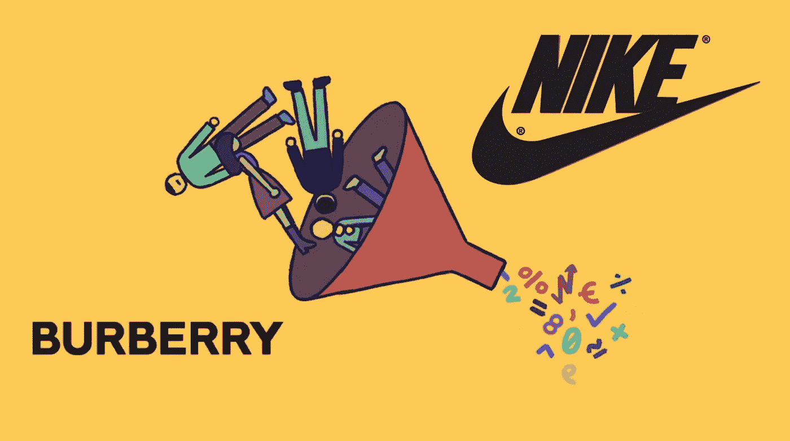

# 人工智能如何帮助博柏利和耐克高度关注客户并赚更多的钱

> 原文：<https://medium.datadriveninvestor.com/how-artificial-intelligence-helps-burberry-and-nike-to-be-hyper-focused-on-the-customer-and-earn-a04a285db4b?source=collection_archive---------5----------------------->

今天，我们可以看到有多少公司试图过度关注客户。当然，这是改善客户体验的重要一步。人工智能(AI)技术深深融入了客户体验的改善。为什么？因为人工智能有一整套方法和技术来成功地做到这一点。

许多公司仍在思考如何改善客户体验，并试图避免创新。创新总是艰难的，但这是成为第一个并将竞争对手远远甩在身后的唯一途径。

在这里，我们将讨论博柏利和耐克将人工智能技术整合到他们的业务中以提供最佳客户体验并赚更多钱的惊人案例。

让我们从博柏利开始。

首先，他们提供个性化推荐，在线和店内。公司可以识别谁进入商店，销售助理根据购买历史和社交媒体活动提供推荐。博柏利开发了一款应用程序，帮助销售助理向客户提供推荐。例如，如果博柏利知道一位顾客最近买了一件特定的外套，那么助手就会受到这款应用的鼓励，向他们展示一款在该外套的其他买家中很受欢迎的手袋。

 [## 今年值得关注的 5 大人工智能趋势|数据驱动的投资者

### 预计 2019 年人工智能将取得广泛的重大进展。从谷歌搜索到处理复杂的工作，如…

www.datadriveninvestor.com](https://www.datadriveninvestor.com/2019/02/19/artificial-intelligence-trends-to-watch-this-year/) 

2015 年，该公司宣布其对个性化客户管理计划的投资导致重复购买增加了 50%。

一个具体的见解对店内销售良好但在线销售不佳的产品销售产生了影响。通过为数据显示发生这种情况的产品创建新的图像，该公司看到某个特定包的销售额增长了 100%。

博柏利使用计算机视觉技术来检测假货，准确率高达 98%。只需将包的照片上传到应用程序中，几秒钟内即可获得其真实性确认。品牌通过这种方式与顾客建立信任。博柏利开发了许多人工智能算法来让客户满意，并不害怕成为一家创新公司。

下一个和公司是耐克。

耐克做了很多预测分析开发。他们学习客户行为模式，为他们提供最好的服务。耐克首席运营官公司的埃里克·斯普伦克说:“随着对我们产品需求的增长，我们必须洞察驱动，数据优化，并高度关注消费者行为。这就是我们如何大规模地为消费者提供更个性化的服务。”耐克分析使用耐克应用程序和 Fitbits 等其他联网设备的客户，以了解他们的习惯并预测购买决定。例如，如果客户通常每六个月购买一次鞋子，而距离上次购买已经过去了 7 个月，Nike 将会主动提示该客户继续购买。

该公司开发了 Nike Fit 应用程序，该应用程序使用人工智能算法和智能手机来找到正确的型号和鞋码。只要拍下你的脚的照片，应用程序就会扫描它，计算出你的尺寸。在此之后，用户还会得到一个最合适的产品列表。公司的最终目标是使产品完全个性化。

人工智能技术帮助公司提供最佳的客户体验，赚更多的钱。永远不要等待竞争对手出现并扰乱你的业务，只需使用人工智能提供智能创新。

如果你还没有使用人工智能技术，现在是时候了。联系 [STET AI](https://www.stetai.com/) 让我们把它搞定。