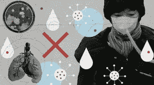

# 人工智能如何在对抗新冠肺炎的战斗中发挥作用

> 原文：<https://medium.datadriveninvestor.com/how-artificial-intelligence-is-helping-in-the-battle-against-covid-19-d1604a0d3821?source=collection_archive---------20----------------------->

Photo by [Max Bender](https://unsplash.com/@maxwbender?utm_source=medium&utm_medium=referral) on [Unsplash](https://unsplash.com?utm_source=medium&utm_medium=referral)

**来源:** [**CIOReview**](https://bit.ly/3htlNMl)

冠状病毒是一个庞大的病毒家族，在牛、蝙蝠、骆驼和猫等几种动物中流行。动物冠状病毒很少能感染人，但它可以在患有严重急性呼吸综合征(SARS)、中东呼吸综合征(MERS)和最近通过新型冠状病毒(nCOV)鉴定的普通公众中传播。去年 12 月，在中国武汉地区发现了首例人类感染该病毒的病例。据预测，这种病毒源于海鲜。感染的症状是咳嗽、发烧、气短和咽炎。冠状病毒主要影响老年人和儿童，因此也影响健康状况不佳的人。此外，最近由于冠状病毒的爆发，在泰国、台湾、美国、韩国和日本等国家记录了几起病例。为了阻止病毒传播，武汉已经被封锁，没有交通联系。
 **| AI 能扮演什么样的角色？当一种疾病流行时，首先要做的也是最重要的事情是了解导致病毒传播的原因。人工智能可以收集每个人旅行时的运动信息，并将其转化为一种工具，这将有助于发现病毒可能攻击的后续区域。一旦当局了解了这个地方，他们就会干预药物和预防措施，以防止它传播。虽然在医学和公共卫生领域，人工智能的地位仍处于萌芽阶段，但它已经通过其计算机模型采取了几个步骤，这些模型将通过扫描大脑，适当地诊断乳腺癌和阿尔茨海默氏症等疾病。**

 [## 一名大学生使用语言生成人工智能工具创建了一个病毒式博客帖子|数据驱动…

### 作为作家，我们喜欢告诉自己，我们处在一个无法自动化的职业中，至少短期内不会。但是…

www.datadriveninvestor.com](https://www.datadriveninvestor.com/2020/09/15/a-college-student-used-a-language-generating-ai-tool-to-create-a-viral-blog-post/) 

大数据通常从许多来源进行分析，如位置、气候数据和健康，研究人员可以创建一种算法来识别数据中的模式，并生成预测模型，从而快速确定疾病的长期发展。因此，该技术将有助于当局和专家在应对未来的此类疫情时变得积极主动。

例如，在 2018 年内，AI 已经成功创建了一个平台，称为登革热爆发预测平台。此外，它还提前三个月有效地预测了巴西和马来西亚登革热的爆发，甚至显示出 80%的准确率。该平台现在专注于为基孔肯雅病毒和寨卡病毒等病毒生成最新的算法。

**|人工智能可有效应对冠状病毒**

冠状病毒的传播速度已经成为寻找有助于阻止它的答案的关键。开发人员必须尽快开发和训练一种算法，以便它能够预测病毒的后续可能性，因为在这种情况下时间是非常重要的。此外，这种病毒的情况变得更加困难，因为它以前从未遇到过。然而，这里有一些解释，由于这些解释，人工智能可以帮助根除冠状病毒。

1。因为人工智能在医疗保健的几个领域的使用，如识别脑瘤和增强治疗，已经取得了成功。因此，如果在冠状病毒的情况下使用该技术，它也有机会对抗那些地区发生的医疗紧急情况。政府将获得大量的知识，这些知识将被用来对付这些病毒。

2。人工智能可以用来模拟和预测病毒的爆发，因为它将提供一个更好的程序，用于治疗局部感染。此外，利用人工智能提供的知识，官方可以精确预测这些特定地点所需的资源，识别治疗过程，并可能阻止病毒的传播。

3。随着技术的进步，寻找病毒的来源将变得容易。此外，人类专家之间的协调、全球合作和人工智能通常是阻止冠状病毒传播的最有效和最快的方法。

**人工智能如何阻止冠状病毒传播**

过去，人工智能(AI)一直在快速发展，并成为不同平台的支持者。由于疫情，不同种类的研究和细节出现了，因此数据池正在以指数级增长，超出了人类智能的能力。人工智能被认为是从大数据中识别模式，并已成为处理危机的积极识别手段。

人工智能应用的进步，如舌头处理，数据分析，机器学习，语音识别，深度学习，以及聊天机器人和人脸识别等其他各种技术平台，不仅可以用于诊断，还可以用于疫苗开发和合同追踪。下面让我们来看看人工智能是如何被应用于对付病毒的。

**|聊天机器人** 
大量的新冠肺炎案例表明，医疗卫生系统和应对措施往往不堪重负。加拿大的种马。人工智能利用其舌头处理能力创造了一种多语言医疗保健代理。该代理帮助回答与新冠肺炎相关的所有问题。它还有助于提供可靠的数据和明确的指导方针，推荐保护步骤和措施，检查和监测症状，甚至建议人们是否需要住院、筛查或在各自家中进行自我隔离。

**|面部识别与发烧检测仪 AI**

热感摄像头用于检测发烧的人。使用这项技术的缺点之一是需要一个人来操作。现在，处理基于人工智能的多传感器技术的摄像机被用于机场、医院和疗养院。使用该技术的最大优势是，它们可以自动检测发烧，还可以跟踪运动，识别面部，并检测该人是否戴着面具。

全世界都在努力应对冠状病毒阳性的后果。这些措施通常来自医疗保健工作者的专业知识和虚张声势，以及人工智能技术为帮助医疗保健平台所做的努力。

**新闻来源:**

[**人工智能能否阻止冠状病毒传播？**](https://bit.ly/3c0g0Ng)

[**艾是如何在对抗新冠肺炎的战斗中提供帮助的**](https://bit.ly/2Ft3g5F)

**访问专家视图—** [**订阅 DDI 英特尔**](https://datadriveninvestor.com/ddi-intel)