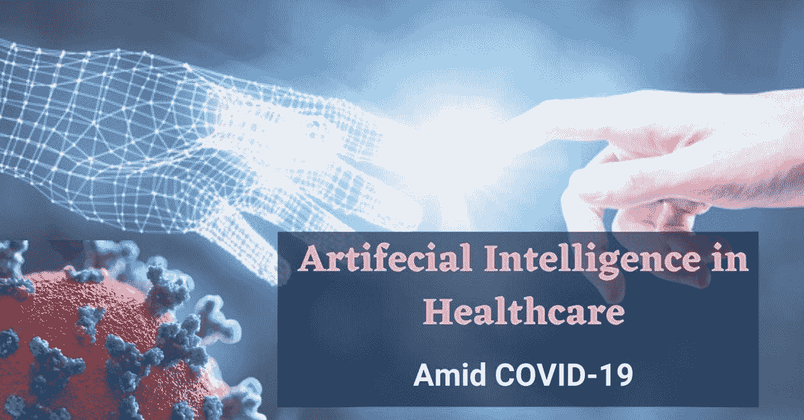

# 人工智能如何塑造健康产业

> 原文：<https://medium.datadriveninvestor.com/how-artificial-intelligence-is-shaping-the-health-industry-82045d046aa3?source=collection_archive---------34----------------------->

# 在危机中

当全世界都在对抗新冠肺炎的时候，每一种形式的技术创新和资源都在为对抗这个疫情做准备，让我们离战胜它更近了一步。

人工智能(AI)和机器学习在全球许多行业中被采用。它以智能手机、可穿戴设备、社交媒体平台和搜索引擎的形式在我们的日常生活中发挥着重要作用。

在目前的场景中，人工智能(AI)和机器学习在解决新冠肺炎危机中发挥着关键作用。机器学习技术使计算机能够模仿人类智能，并消耗大量数据来快速识别模式和见解。

通过结合技术和智能，人工智能不仅改善了患者体验，还为医疗行业节省了大量资金。我相信在医疗保健中使用人工智能工具，可能性是无限的。专家声称，人工智能甚至可以通过在疾病爆发前检测环境中的病原体来防止严重感染的传播。我们可以希望这些技术能在未来的日子里为我们创造一个安全健康的世界。

 [## 商业价值和人工智能的 5 个原则|数据驱动的投资者

### 提取商业价值很难。我是说真的很难...说到高级分析，这一过程甚至…

www.datadriveninvestor.com](https://www.datadriveninvestor.com/2020/07/07/5-principles-for-business-value-and-artificial-intelligence/) 

# 人工智能对医疗保健的影响

人工智能和数字健康带来了许多好处，如预防疾病、降低医疗成本、为满足您的需求而定制药物以及管理慢性病。

随着当前日益严重的健康危机，数字健康和远程医疗正成为 COVID 护理的焦点。远程保健正在成为一线工作人员和患者预防感染传播的救星。

由于感染的风险，病人发现远程保健是一种安全和必要的工具。COVID 感染的全球传播改变了患者的行为。现在，医院被认为是感染区。患者不愿意去医院，积极寻找数字化支持。

## 通过远程医疗以病人为中心的方法

为了适应这种新的规范，医生们更青睐远程医疗和初级保健的数字化参与。在社会距离化的时代，我们的健康产业正在迅速向数字化转变。

人工智能正在通过为每个人提供个性化的方法来改变医疗保健的形式。它有可能指导每个人做出更好的健康选择。智能手机应用程序可以访问电子健康记录(EHR)，人工智能使提供高质量的个人护理变得容易。通过鼓励人们采取健康的生活方式，人工智能正在创造新的健康趋势。

随着生活方式的改变，有可能逆转许多慢性疾病，但我觉得坚持这些严格的指导方针是困难的。这就是人工智能发挥重要作用的地方，它为每个人提供个人医疗保健的即时步骤。某些软件收集所有患者数据，并为患者创建一个完美的矩阵，提供正确的指南来控制特定的健康状况。英国研究人员开发的另一个有趣的人工智能可以预测心脏病发作。在不久的将来，人工智能将在识别健康疾病和制定治疗计划方面发挥不可或缺的作用。

## 虚拟护理

虚拟医疗是最有前途的医疗保健领域，它提供了个性化的方法，并提供了必要的教育和支持。虚拟医疗消除了旅行的需要，从而到达了正在为更好的医疗保健而奋斗的偏远地区。虚拟护理可以有效地帮助患者改变行为，激励他们适应健康的生活方式。虚拟护理给慢性病患者带来了很高的满意度。

如果你住在偏远地区，那里没有高质量的医疗服务，那么虚拟医疗服务可以让你获得所需的医疗服务。人工智能聊天机器人和助手对患者 24/7 开放，提供个性化护理，回答所有问题，并协助预约医疗保健提供商。这些技术带来了更高的患者满意度和更好的治疗效果。虚拟护理是一种给每个病人一个个人健康护理提供者的方式。

# 医疗保健中的人工智能:前进的道路

在这种全球封锁的情况下，在未来几个月，公共场所将受到限制。对数字健身和自我保健策略的需求正在上升。从初级保健到慢性病，患者将寻求可访问的数字医疗解决方案。随着这些进步，人工智能将很快被用于日常临床实践。人工智能革命正在成为健康产业的未来。人工智能可以实现的医疗和金融目标非常有前途。在未来，随着更多的进步，人工智能可能会在没有人类监控或输入的情况下执行一些任务。

很快，人工智能将为临床医生提供正确的诊断和治疗计划，并识别相关的并发症和风险。它将在扩大临床资源和确保更好的患者结果方面发挥主导作用。

总之，人工智能在医疗保健中的采用反映了指数级 COVID 19 传播，具有深远的影响，并将持续下去。

*最初发表于*[*【https://thriveglobal.com】*](https://thriveglobal.com/stories/how-artificial-intelligence-is-shaping-the-health-industry-amid-covid-crisis/?utm_source=Newsletter_Transaction&utm_medium=Thrive&utm_campaign=Published)*。*

## 访问专家视图— [订阅 DDI 英特尔](https://datadriveninvestor.com/ddi-intel)