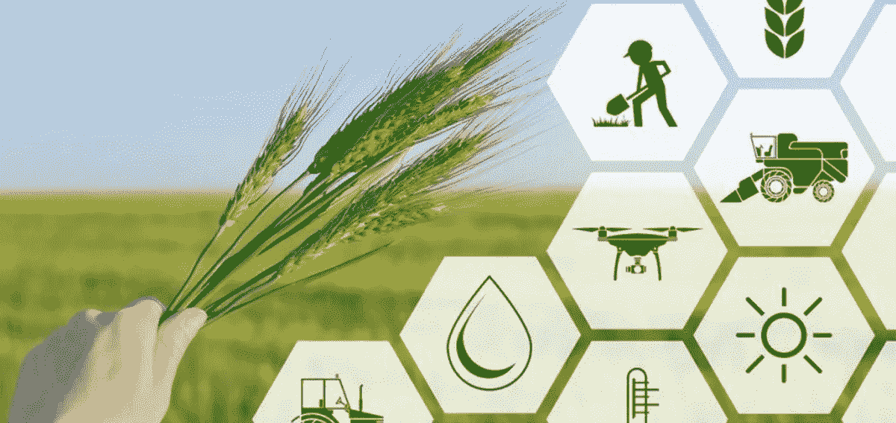

# 人工智能如何改变我们的耕作方式？

> 原文：<https://medium.datadriveninvestor.com/how-artificial-intelligence-is-transforming-the-way-we-farm-7c7e2b591614?source=collection_archive---------9----------------------->

据联合国粮食及农业组织(粮农组织)预测，到 2050 年，世界人口将达到 91 亿。为了养活这些居民，全球粮食产量必须增长 70%。然而，粮农组织预计可耕地面积只会增加 5%。自然资源的过度开发、污染水平的上升、土地退化和水位下降以及气候变化给传统农业带来了障碍。在这种情况下，农业部门需要技术改革和解决方案，通过使用更少的资源和努力生产更多的粮食来提高作物产量。因此，人工智能(AI)正稳步成为在不危及我们的生态系统的情况下改造农业部门的必要条件。让我们探索人工智能和认知解决方案如何惠及农业。

# 应对劳动力挑战的自动化技术

随着世界从农业社会转向城市生活方式，农业部门一直面临劳动力短缺。传统的农场需要工人播种，灌溉土地，收获庄稼，清除杂草，以及许多其他活动。人工智能通过提供自动化解决方案来帮助解决这些挑战。许多公司正在开发自主机器人，用于处理农业中的人力密集型流程。扩大人类劳动力，这种农业机器人可以提高生产率，加快速度，降低成本，提高产出质量。

 [## 人工智能与创意:作为创意引擎的 BigGAN |数据驱动的投资者

### 的确，2018 年可以被视为人工智能创造的创造力全盛时期的开始。当然可以…

www.datadriveninvestor.com](https://www.datadriveninvestor.com/2019/02/13/ai-creativity-biggan-as-a-creative-engine/) 

# 实时监控

先进的遥感技术和高分辨率多光谱图像有助于监测作物和土壤健康状况。公司正在利用人工智能和认知计算来处理传感器捕捉的数据，以跟踪农场的状况。基于人工智能的技术解决方案可以帮助农民从时间和精力的角度评估作物整个生命周期的健康状况。除了作物监测，AI 解决方案还可以识别土壤中潜在的缺陷和养分缺乏。更好地了解土壤的优势和劣势有助于预防植物疾病和有缺陷的作物生产。

# 数据处理和预测分析

人工智能及其技术子集有助于处理大量结构化和非结构化数据。对温度、土壤、湿度、天气、作物表现和各种其他数据源进行分析，以提供更好的预测洞察力。将评估从农业机械到无人机图像收集的大量数据，以跟踪和预测环境对作物产量的影响，从而提高农业准确性和生产率。除了地面数据，人工智能应用程序还可以从安装在无人机和无人驾驶飞机系统上的 IOT 设备中获取数据。人工智能支持的物联网(IoT)设备结合高精度图像，可以捕捉整个可耕地的图像，并对其进行实时分析，以监测和预测土壤健康和作物状况。历史天气模式、土壤报告、湿度水平、地下水位、农药水平以及来自无人机和摄像机的图像经过处理和分析，可以生成实时警报和见解。

# 精准农业——一种新的农业方式

越来越多的农民接受了人工智能、物联网和其他技术进步，以提高他们土地的生产率。这种精通技术的方法被称为“精准农业”也被称为卫星农业，它是“应用现代信息技术提供、处理和分析高空间和时间分辨率的多源数据，用于作物生产管理中的决策和操作”(国家研究委员会，1997 年)。

与传统的农业方法不同的是，精确农业方法根据实际需要不同地对待农田。可变速率技术(VRT)用于处理从传感器、拖拉机和卫星收集的数据，使农民能够定制化肥、除草剂、杀虫剂、灌溉等农业投入。

识别和管理田间的可变性有助于确保作物得到它所需要的。精确响应农田需求可提高作物产量、肥料效率和盈利能力。除了提高生产力和效率，精准农业还确保了环境的可持续性和保护。随着新型传感器和农业机械的不断发展，向精准农业技术的转变变得至关重要。

# 现实世界的应用

世界各地的许多公司都在利用人工智能及其子集技术来最大限度地提高农业企业的效率。引入创新战略和解决方案，以保护和提高作物产量，减少人工劳动，并提高数据来源的价值。美国公司 Blue River Technology 开发了一款名为“See & Spray”的机器人，它利用计算机视觉来清除棉花作物上的杂草。相比之下，Harvest CROO Robotics 推出了一款机器人，在草莓农场提供帮助。在数据预测和监测方面，总部位于柏林的农业科技初创公司 PEAT 开发了 Plantix，这是一款深度学习应用程序，用于检测土壤中的潜在缺陷和营养缺乏。Ceres、Prospera、Farmbot、Farmers Edge 和 Climate Corporation 是其他一些领先的高科技公司，它们一直在利用人工智能和计算机视觉技术帮助农民实现更高的产量、更健康的作物和更高的利润。随着对质量和可靠性要求的不断提高，农业部门发现将农业生产数字化势在必行。

# 总结想法

人工智能驱动的技术正在崛起，并确保农业领域的重大转变。世界各地的农场可以利用人工智能和认知技术的潜力来改善决策，削减数据，自动化繁重的工作，并提高效率。

*最初发表于*[*【https://www.logiticks.com】*](https://www.logiticks.com/blog/how-artificial-intelligence-is-transforming-the-way-we-farm/)*。*