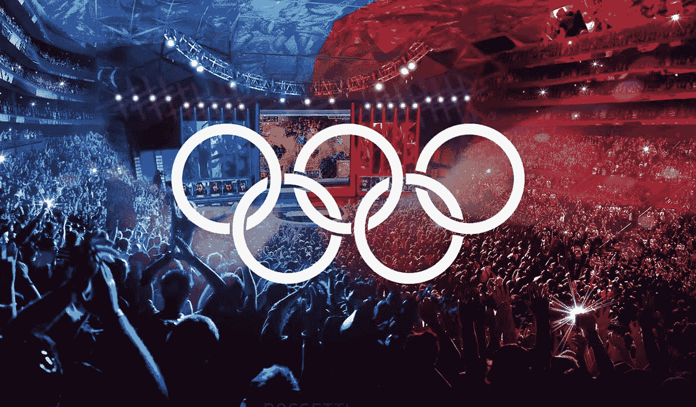

# 运动员如何应对新冠肺炎·疫情的训练和财务影响

> 原文：<https://medium.datadriveninvestor.com/how-athletes-can-deal-with-the-training-and-financial-implications-of-covid-19-pandemic-8e63db56e139?source=collection_archive---------15----------------------->

Adopted from Johan Cruyff Institute.

众所周知，骆驼还是婴儿时就进入帐篷，长大后站起来，带着帐篷离开，让主人暴露在外，这似乎正在上演:电子竞技等弱势群体正在给传统体育带来挑战。随着体育场和其他体育场馆的无限期关闭，以帮助遏制新冠肺炎的侵略性传播，体育焦点现在转移到了电子竞技上。不幸的是，对于大多数当地精英体育人士来说，他们的关注点和资金都被这种破坏所转移。

以传统体育为原型的网络游戏(电子竞技)不仅远离了聚光灯，也远离了金钱。在过去的几年里，电子竞技不仅在网上聚集了大量的观众，也让体育场馆人满为患。最近的一个例子是《英雄联盟》世界锦标赛(T1 ), 40，000 名粉丝挤满了北京的鸟巢体育馆，同时有 1 亿粉丝在线观看了比赛。这与观看 2019 年超级碗的 1.03 亿球迷形成了鲜明对比，超级碗是仅次于国际足联世界杯决赛的第二大总决赛。

对于许多电子竞技玩家来说，这个疫情为他们提供了一个趁阳光明媚之际大捞一笔的机会。传统的体育明星和他们的理疗师、公关人员、教练和幕后工作人员现在要么自我隔离，要么被隔离。这使得他们只能靠储蓄、服装赞助或代言费勉强度日。那些没有这三种选择中任何一种的人将面临一个漫长的黑夜。由于几乎所有行业都在经历同样的黑夜，这可能会安慰许多在家的男女运动员，但不会持续太久。

考虑到今年的情况，许多肯尼亚跑步者期待 2020 年成为经济上有利可图的一年；非洲高级锦标赛、非洲越野赛、世界田径巡回赛、钻石联赛、奥运会等等。虽然在奥运会上获胜没有奖金，但奥运会冠军会带来许多金融机会。这可以通过增加服装合同金额和其他代言套餐的形式来实现。新冠肺炎疫情的不可控制的传播已经导致全球许多体育项目被各自的管理机构暂停，随后，上述财政机会要么消失得无影无踪，要么被推迟。

 [## 使用谷歌搜索趋势预测首次申请失业救济人数|数据驱动的投资者

### 几年来，我的重点一直是使用多种替代数据来预测宏观经济统计数据…

www.datadriveninvestor.com](https://www.datadriveninvestor.com/2020/03/25/using-google-search-trends-to-predict-initial-jobless-claims/) 

在当地，田径管理机构肯尼亚田径协会暂停了计划中的比赛，并下令在 3 月 18 日关闭全国所有的训练营。尽管这一决定是为了运动员和公众的利益，但它打乱了受影响运动员的训练计划和他们的财务前景。关于新冠肺炎对其他部门的破坏性影响，已经写了大量深入的文章，但是，对这种对体育的破坏性影响的关注有限。

两周前，《星期日民族报》和英国广播公司(BBC)一起强调了这一决定对世界马拉松纪录保持者埃鲁德·基普乔格训练计划的影响。文章中引用了 Eliud 抱怨训练时孤独的话。没有被广泛强调的是这一决定对他和其他优秀运动员财务健康的影响。

在这种背景下，重要的是要强调大多数精英运动员通过服装和产品代言合同、出场费、奖金和比赛奖金赚钱。这些合同的价值根据比赛类别、精英运动员的表现状况和受欢迎程度而有所不同。例如，尽管许多肯尼亚和埃塞俄比亚运动员在马拉松比赛中比莫·法拉爵士表现更好，但他的服装和营销合同远高于许多当地马拉松运动员。

全球田径管理机构(World Athletics)根据赛事组织的标准、世界田径(WA)规则的执行情况、地方当局的支持、对运动发展的承诺以及全球兴奋剂控制措施，对公路赛(5 公里、10 公里、半程和全程马拉松)进行标记。这些包括西澳白金，黄金，白银和青铜比赛。另一方面，精英运动员被贴上金、银、铜的标签。特定类别的前 150 名运动员符合金牌资格，而银牌和铜牌资格分别授予排名 151-300 和 301-400 的运动员。

世界主要马拉松系列赛(波士顿、伦敦、柏林、芝加哥、纽约和东京)是西澳大利亚白金标记比赛的例子。这些比赛吸引了巨额出场费、奖金和奖金，使它们成为最有吸引力的比赛。这些白金赛事要求至少有八名金标运动员，而金标赛事至少应有四名男女运动员。据估计，世界职业棒球大赛的累计出场费、奖金和红利在 2000-5000 万肯尼亚先令之间。赢得一场世界大型马拉松比赛进一步使精英运动员有资格获得 1 亿肯尼亚先令的年度累积奖金。因此，如果一名精英马拉松运动员在一年内赢得两次世界主要马拉松比赛并赢得头奖，根据他与比赛组织者的谈判，他的实得收入接近 2 亿肯尼亚先令。这是我们的一些金牌马拉松运动员，如维维安·切鲁伊约特、布里奇德·科斯盖和玛丽·凯特尼在比赛延期和训练营关闭时可能失去的钱。

为什么关闭训练营是一个如此大的问题？

精英级别的训练既紧张又孤独。许多运动员无法坚持一天三次、一周六天的严格训练。由于人多力量大，这些运动员大多求助于团体训练。在这些小组中，运动员制定计划，通过分散压力，帮助他们在个人层面上对抗过度训练。以每周长跑为例。这可能有 40 公里长，如果他/她要冲刺穿过它，可能会对精英运动员造成损害。为了避免这一点，运动员在不同的间隔(比如两个 15 公里的路段)创造一组“起搏器”，并在最后 10 公里领先。因此，当运动员受到干扰时，仅仅维持严格的每周训练计划是一项艰巨的任务。这使得孤独和压力开始出现。

***运动员该如何应对这些挑战？***

让我们从训练开始。个人训练要求运动员减少训练量和强度。这将使他们专注于保持健康，同时也从最初的严格训练中恢复过来。大部分训练应该在柔软的表面进行，以降低肌肉骨骼损伤的风险，如应力性骨折、软组织破裂(跟腱损伤)和肌肉拉伤。在垫子上进行更多的室内阻力训练，使用交叉训练器和个人跑步机就足够了。世界半程马拉松纪录保持者 Geoffrey Kamworor 在他的 Instagram 帖子中很好地证明了这一点。

除了顶尖的身体健康，同样良好的心理健康也是必不可少的。为了管理他们的心理健康，顶级心理学家建议将注意力转移作为一项应该优先考虑的技术。与其担心集体训练的禁令何时解除，何时恢复正常训练，不如把注意力放在个人和社会关系上。个人关系仅仅包括与自己和平相处。这可以通过冥想练习、长篇阅读、充足和规律的睡眠以及心理健康专家开出的其他干预措施来实现。在社会关系方面，与家人和睦相处可以减少争吵，进一步改善心理健康。他们还应该利用社交媒体与粉丝互动。这种积极的能量会让他们的船继续航行。

在财务上，疫情暴露了将收入来源局限于赛事和服装合同的风险。运动员应该开始探索其他收入来源，他们可以通过积极使用社交媒体来增加粉丝群。庞大的粉丝群意味着你的服装合同条款更优惠。它进一步增加了您获得产品代言机会和被邀请参加非领域活动的机会。以尤塞恩·博尔特为例。他庞大的粉丝群使他能够在 2016 年里约奥运会期间举行个人新闻发布会，而其他全球明星不得不满足于共享新闻发布会。庞大的粉丝群带来的名气和知名度使他被要求在 2019 年超级碗期间为表演和金钱进行五十码的粉丝冲刺。埃鲁德·基普乔格也采用了这种方法，他令人羡慕的粉丝群现在遍布全球，这对一个肯尼亚人来说是罕见的壮举。耐克和五十铃等其他本土品牌利用他庞大的粉丝群来扩大营销范围。Eliud 的服装赞助商 Nike，在他们开设新店时经常使用他，最近在伦敦支持学校的“每日一英里”跑步计划，他也是五十铃 D-Max 的品牌大使。

此外，知道这不是我们的运动员将面临的最后一次干扰，他们应该认真考虑组建自己的" *Chamas* "，帮助他们度过这样的艰难时期。由于大多数服装合同每年都可以续签，因此将收到的资金投资于循环基金是谨慎的做法。这些钱可以用来为他们自己和与他们一起训练的业余爱好者购买训练设备和装备，无论是合同期内还是合同期外。运动员也应该认真考虑传统运动和电子竞技之间的交叉。加雷斯·贝尔、梅苏特·厄齐尔、阿莱西奥·罗马尼奥利、安托万·格里兹曼和勒布朗·詹姆斯等全球明星最近在电子竞技领域组建了团队。去年 2 月，当他的 Ellevens 电子竞技队进入意大利国际足联 eClub 世界杯决赛时，贝尔几乎在网络空间复制了他在赛场上的成功。不幸的是，他们输给了团队复杂性。电子竞技的奖金现在与传统体育相匹配。一个典型的例子是去年凯尔·吉斯多夫在堡垒之夜锦标赛中获胜后赢得了 300 万美元，然而，美国高尔夫大师赛的冠军老虎·伍兹赢得的最高奖金比凯尔少 100 万美元。我们的顶级运动员在网上复制他们在赛道上的成功的时机也已经成熟。

最后，大多数世界主要马拉松赛(伦敦、波士顿、柏林、芝加哥和纽约)都被推迟到秋季(9 月至 11 月)。这些比赛大多只相隔一两周。这将要求潜在的参赛者要有战略眼光，避免贪婪。而大多数电竞明星一周玩 6 天，每天玩 12 到 14 个小时；传统体育运动员不可能参加所有比赛。就目前而言，传统运动员仍将不得不健康地安排他们的比赛和比赛。2021 年初还将有许多世界田径赛事在一起。缺乏适当的规划可能会使他们都想通过紧接着竞争来弥补损失的收入。这不仅会增加他们因过度训练而受伤的风险，还会在奥运会前限制他们的职业生涯。