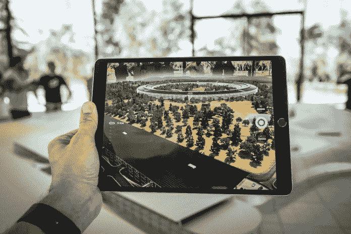
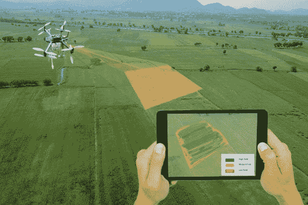
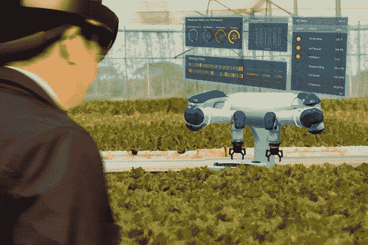

# 增强现实与物联网(AR-IoT)的整合如何改造农民的现实？

> 原文：<https://medium.datadriveninvestor.com/how-augmented-reality-integrated-with-iot-ar-iot-can-transform-farmers-reality-250ca4bfa599?source=collection_archive---------15----------------------->

## 不断增长的粮食需求需要传统农业的过渡性变革。AR-IoT 的融合可以为农民提供经济高效的最佳解决方案。

农民的生活很简单。毕竟，它只涉及一些简单的任务，如耕地、播种、灌溉以及在作物成熟时收割。

你也这么想吗？如果是，那么你并不孤单。大多数没有耕作或农业第一手经验的人认为这是一项简单的活动。事实是，农民的生活相当艰难，尤其是当农业大规模进行时。例如，如果大规模农民希望检查虫害，他必须手动检查整个土地。那一点都不简单。

 [## 物联网和采矿业的未来|数据驱动的投资者

### 物联网可以做出重大贡献的领域之一是采矿！2 月 3 日，在开普…

www.datadriveninvestor.com](https://www.datadriveninvestor.com/2020/03/02/internet-of-things-and-the-future-of-the-mining-industry/) 

随着人口的不断增加，食物需求也呈指数增长。预计到 2050 年将达到 97 亿。自然，食品需求将会激增。这意味着小规模的农业和传统的农业方法将被证明无法满足如此巨大的需求。为了满足如此巨大的粮食需求，农民需要对农业生产方式进行过渡性的改变。但是任何改变都不容易实现。在这里，基于增强现实(AR)的系统结合[世界人口](https://www.un.org/development/desa/en/news/population/world-population-prospects-2019.html) [物联网](https://www.datadriveninvestor.com/glossary/internet-of-things/)传感器可以提供很大的帮助。这种系统为农民提供了强有力的工具。例如，在检查虫害时，基于 AR 的系统可以帮助农民在一个仪表板上跟踪整个田地，而不需要去地里。

# 光有物联网是不够的

[物联网](https://www.datadriveninvestor.com/glossary/internet-of-things/) (IoT)允许通过互联网连接的对象网络收集和[交换](https://www.datadriveninvestor.com/glossary/exchange/)数据/信息。它需要 RFID、传感器或智能手机等技术的帮助。易于扩展且环境友好的物联网技术通过更新和可视化的物联网信息帮助定位作物。它大大提高了农业的效率。然而，传统的农业物联网数据可视化方式无法提供足够的物理特征信息(形状、大小、颜色等)。)并限制了物联网数据的解读。这需要物联网数据的交互式可视化。

# 物联网和增强现实可以创造奇迹

AR 技术可用于支持物联网数据可视化。由于物联网的传感器技术可以发现和收集任何物理对象的数据，因此 AR 可以通过叠加虚拟对象(如图形、文本、声音等)来增强对象的视觉表现。)对用户周围的真实世界环境的影响。这允许增强与对象的交互。

在农业领域，AR 可以帮助农民通过虚拟内容与作物互动。实体作物的物联网数据(实时数据)可以覆盖到 AR(虚拟信息图)的虚拟内容上，这样农民就可以从不同角度可视化作物状况。这种基于 AR 的应用程序极大地帮助了农民在整个耕作过程中的决策。

以下是农业增强现实系统如何帮助农民:

# 昆虫鉴定

农业 AR 可用于筛选受影响作物的捕获图像(实时可视化)，并帮助识别昆虫。并不是所有的昆虫都对农作物有害，需要以同样的方式处理。该应用程序有助于农民理解这些差异。

# 害虫防治

AR 应用程序还会考虑物联网数据输入(关于作物和昆虫)，并建议合适的杀虫剂来控制害虫。此外，它还分析作物的大小/类型，并建议重要的信息，如农药的数量，农药制剂的比例和估计成本。

# 土壤质量评估

AR 技术可用于评估土壤/土地质量及其适合的作物种类。这将有助于农民做出更好的决策，从而提高作物的质量和数量。

# 实时天气信息

许多农业活动依赖于天气。如果某些农业活动在不利的天气条件下进行，农民的努力可能会付诸东流。AR 可以为农民提供实时天气信息，并确保他们明智地安排他们的农业活动。

# 结束了！

AR 在农业上的使用并不是很古老。AR 拥有巨大的潜力，但尚未得到利用。农业系统中 AR 与 IoT 的集成开辟了无限的可能性。在未来几年，AR 将在农业系统中发挥关键作用，并为农业生产方式带来革命性的变化。

Author : Mamta Shanware

Mamta 从一名 IT 专业人员转型为内容开发人员和数字营销人员，帮助企业努力接触更多的受众和新的潜在客户。她利用自己在 IT、工程和管理方面的背景，为各种受众制定战略和制作引人注目的内容。她喜欢尝试、阅读和写作各种主题，从商业和技术趋势到个人经历。想了解更多，可以在 [LinkedIn](https://www.linkedin.com/in/mamta-shanware/) 上联系她。

*原载于 2020 年 4 月 27 日*[*【https://www.datadriveninvestor.com】*](https://www.datadriveninvestor.com/2020/04/27/how-augmented-reality-integrated-with-iot-ar-iot-can-transform-farmers-reality/)*。*