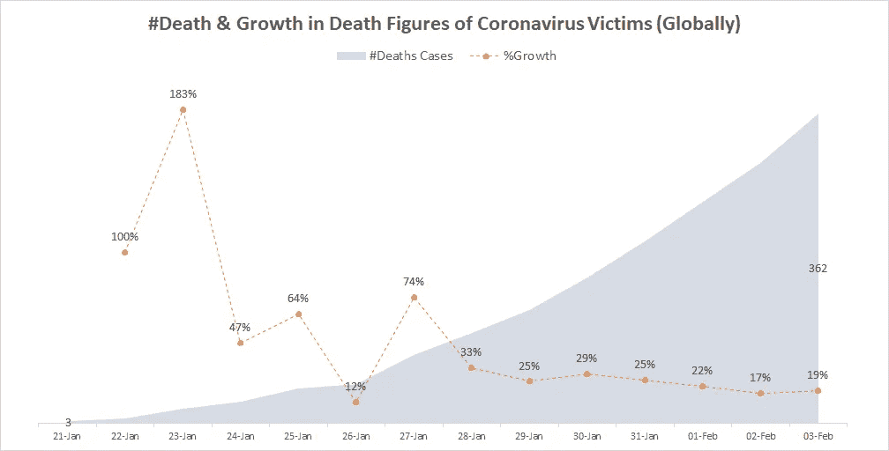
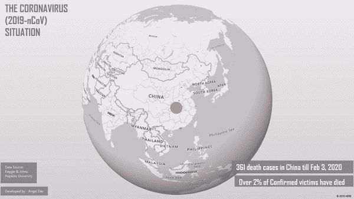
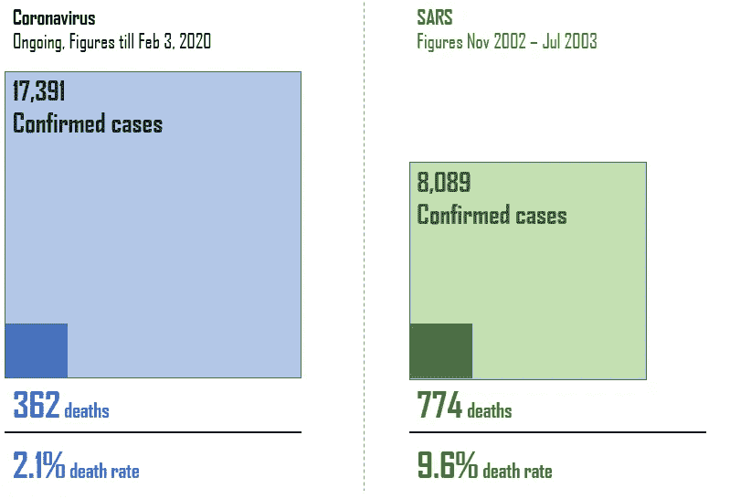
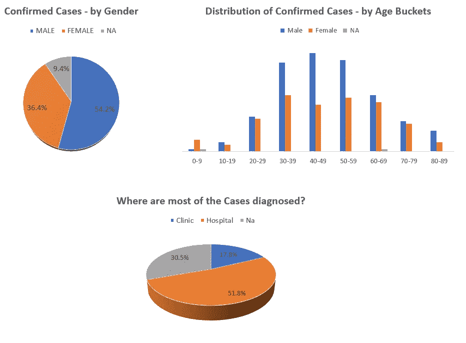
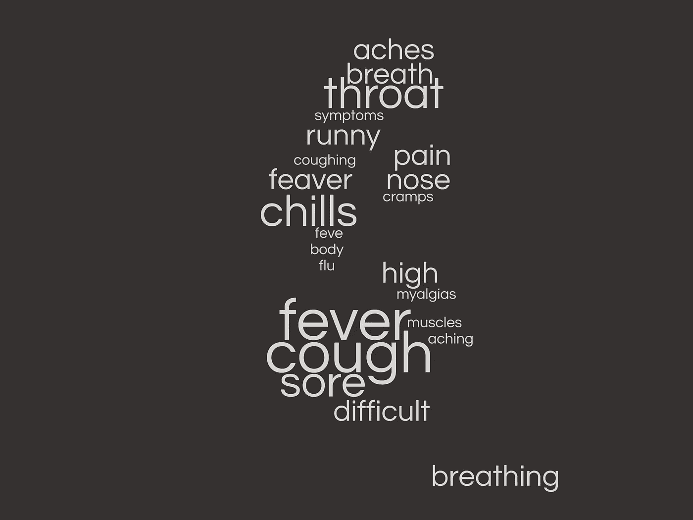

# 冠状病毒爆发会有多糟糕？—疾病爆发—假设分析

> 原文：<https://medium.datadriveninvestor.com/how-bad-will-the-coronavirus-outbreak-get-the-outbreak-hypothesis-analysis-940197ed7815?source=collection_archive---------0----------------------->

## 数据分析师对当前形势的看法

> “所有在中国和其他地方受苦的人，愿上帝加强受害者和他们的家庭，引导他们度过这段艰难的时光。请遵循 [*世卫组织网站*](https://www.who.int/emergencies/diseases/novel-coronavirus-2019/advice-for-public) *中列出的建议，保持安全并受到保护*

*The coronavirus* Credit: ITV News

疫情继续蔓延——截至 2 月 3 日，世界卫生组织已确认约 17，391 例确诊病例，仅周一就有 2，800 例确诊病例(约占确诊病例总数的 16%)。冠状病毒受害者的死亡率持续上升，然而，只有略多于 2%的病例是在中国以外发现的。

 [## 大笔资金和尖端技术:人工智能/人工智能投资将如何革新医疗保健…

### 在过去几年人工智能(AI)和机器学习(ML)的显著发展中…

www.datadriveninvestor.com](https://www.datadriveninvestor.com/2018/03/22/big-money-and-cutting-edge-technology-how-investment-in-ai-ml-will-revolutionize-the-healthcare-industry/) 

# 爆发假说——你应该知道的 3 件事！

*   *“死亡数字和我们应该有多警惕？”* —详细了解死亡数字、死亡时间的进展以及受影响的省份
*   *“能否使用统计数据来验证威胁的大小——SARS 与冠状病毒——一项模拟研究”*——比较两次不同疫情影响的比例显著性检验
*   *“共病—性别—年龄深度调查”* —分析确诊病例的爆发与性别、年龄、症状和共病的关系

# 死亡数字令人担忧吗？

Data Source — WHO Situation Report

SARS 和冠状病毒(2019-nCoV)的爆发都始于中国——据信都源于野生动物市场。疫情爆发后，报道的死亡人数持续增加。*2020 年 1 月 29 日之后，死亡数字的*δ*与时间持平，但鉴于报告的病例数量一直在上升，这仍然是一个令人担忧的迹象。*

*   *湖北仍然是受影响最严重的省份，截至 2020 年 2 月 3 日报告的确诊病例超过 64%*
*   *中国境外报告了 153 例病例，其中 123 例(~80%)有中国旅行史，24 例(~16%)有可能或确诊传播& 6 例(~4%)，传播地点正在调查*

Impacted Provinces/States in China — Developed by the Author Using Excel 3D maps

# SARS 与冠状病毒——模拟研究

*制药业中广泛使用的术语，* ***模拟研究*** *是实验性的* ***研究*** *，其中参与者非常类似目标人群。简单地说，类比研究意味着对两个不同的事件或对象进行比较，而这两个事件或对象在某些特征上是相似的。随着非典的记忆笼罩着武汉病毒，世界卫生组织报告了越来越多的确诊病例，让我们来看看这两次疫情造成的损害。*

Coronavirus vs. SARS — Comparing the two outbreaks

## 比例显著性检验 SARS 的死亡率明显高于冠状病毒引起的死亡率吗？

当您想知道两组是否有显著差异时，可以使用两个总体比例的 *z* 得分检验。9.6%的 SARS 死亡率似乎高于 2019 年的 2.1%——nCoV，但是，让我们来评估其中的一些情景:

*   *~ 18000 例冠状病毒爆发的确诊病例与仅约 8000 例 SARS 病例的对比*
*   各国已采取重大措施来减少疫情。中国证实一天内发现了 300 多名遇难者，除非症状严重，否则不可能立即死亡。这意味着随着确诊病例的增加，死亡率(死亡受害者的百分比)将会下降

***零假设:*** P1-P2 =0，*其中 P1 代表 2019-nCoV 受害者死亡比例(2.1%)，P2 代表 SARS 受害者死亡比例(9.6%)；*

***候补假设:***P1-P2*≠0；*

*进行 95%置信区间的双尾 Z 检验，我们得到的 Z 值为-26.9546，换算成 p 值为< 0.0001\. Since p is <0.05 we can safely reject our null hypothesis, i.e. ***2019 年起死亡率——nCoV 显著低于 SARS 造成的死亡率。****

# **共病—性别—年龄深潜**

*世卫组织已经制定了一套针对新型冠状病毒的基本保护措施，然而，了解一些可能在其传播中起关键作用的因素是重要的。用于分析的[数据集](https://docs.google.com/spreadsheets/d/1jS24DjSPVWa4iuxuD4OAXrE3QeI8c9BC1hSlqr-NMiU/edit#gid=1180262595)的真实性值得怀疑，但它是使用 DXY.cn 进行整理的，这是一个面向医生、医疗保健专业人员、药房和机构的在线社区。我们将使用世卫组织网站上的指南和声明来验证我们的关键要点(这个过程在分析行业被称为质量检查或 QC)。*

**

*Distribution of Confirmed cases by Gender, Age and Diagnosed Location — Data as of Feb 2, 2020*

## *关键要点:*

*   **老年人似乎更容易患这种疾病；一级市场调查表明，健康衰竭的* ***共病&糖尿病*** *在 50 岁以上人群中***。患有这些疾病的人将面临更高的风险***
*   **中国国家卫生委员会表示，大约 80%的死者年龄在 60 岁以上，75%的死者之前患有心血管疾病和糖尿病**
*   **冠状病毒易感性的性别差异仍在研究中。然而，数字显示，迄今为止男性受害者更为集中**
*   *****发烧、咳嗽、发冷、喉咙痛*** *是去诊所或医院就诊的受害者报告的一些常见症状***

****

**Data from the survey — Studied using wordclouds.com**

**这场疫情的致命性还有待观察，但利用现有的数据，如果我们能够确定高危地区，如"**患有糖尿病共病的男性&心力衰竭，年龄在 60 岁以上"**，我们就可以迅速采取行动，对疫情做出一些抵抗。这就是数据科学家&分析师需要携手合作并帮助社区传播更多意识的地方。**

**你可以在下面找到更多我之前关于冠状病毒的工作**

** [## 新型冠状病毒(2019-nCoV)——世卫组织新型交互式、基于网络的冠状病毒在线培训…

### 世卫组织的在线训练是目前对抗冠状病毒爆发的最佳武器；涵盖检测方法…

medium.com](https://medium.com/@angeleastbengal/novel-coronavirus-2019-ncov-whos-new-interactive-web-based-online-training-for-coronavirus-d0865f0b47af)  [## 时间序列预测 vs .数据意义上的预测辩论！—什么行业需求？

### 我如何在预测冠状病毒爆发时实现 1.4%的 MAPE；

medium.com](https://medium.com/@angeleastbengal/time-series-forecasting-vs-the-data-sense-prediction-debate-what-industry-demands-807ef1ae0db2)  [## 冠状病毒爆发会有多糟糕？—预测疫情数字

### 数据分析师的观点—您应该知道的 4 件重要事情

towardsdatascience.com](https://towardsdatascience.com/how-bad-will-the-coronavirus-outbreak-get-predicting-the-outbreak-figures-f0b8e8b61991)  [## 为什么质量和感觉检查在数据科学中如此重要？

### 世界卫生组织和 Kaggle 的 2019-nCoV(冠状病毒)数据库如何讲述同一个故事…

towardsdatascience.com](https://towardsdatascience.com/why-quality-sense-checks-are-so-important-in-data-science-7ef80da760c3) 

*关于作者:高级分析专家和管理顾问，帮助公司通过对组织数据的商业、技术和数学的组合找到各种问题的解决方案。一个数据科学爱好者，在这里分享、学习、贡献；你可以跟我在* [*上联系*](https://www.linkedin.com/in/angel-das-9532bb12a/)*；***