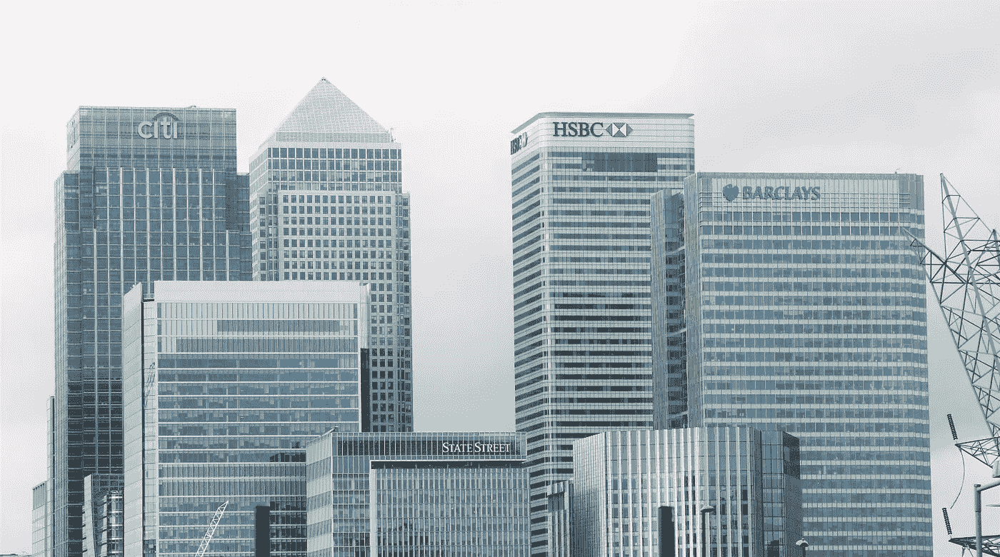
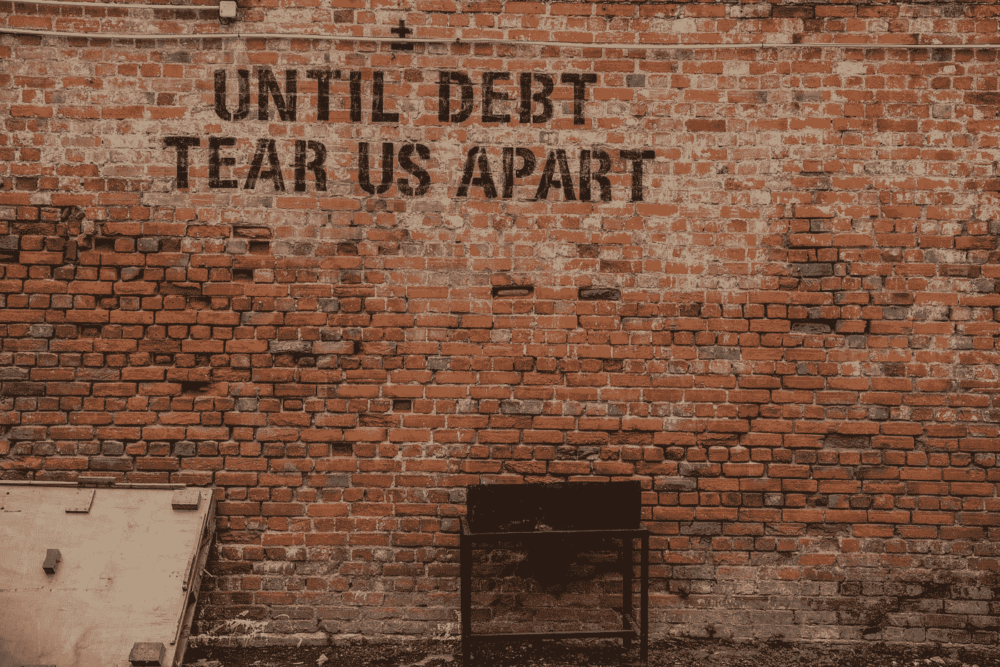

# 银行如何通过无中生有地创造货币来控制一切

> 原文：<https://medium.datadriveninvestor.com/how-banks-control-everything-by-creating-money-out-of-nothing-9584c4821cf8?source=collection_archive---------3----------------------->

## 不，这不是魔术

Photo by [Pepi Stojanovski](https://unsplash.com/@timbatec?utm_source=unsplash&utm_medium=referral&utm_content=creditCopyText) on [Unsplash](https://unsplash.com/?utm_source=unsplash&utm_medium=referral&utm_content=creditCopyText)

亨利·福特曾经说过:“美国人民不了解我们的银行和货币体系，这是很好的，因为如果他们了解，我相信在明天早上之前就会有一场革命。”是什么让福特认为银行和金钱会激怒人们，让他们大动干戈？为了找到答案，我们需要了解钱是如何产生的，以及这个过程的含义。

货币创造的传统形象是由国家银行印制的一张张钞票。但是，这只是故事的一部分。事实上，在美国流通的所有货币中，只有 11%是硬通货。那么其余的从哪里来呢？

商业银行创造了发达经济体中流通的大部分货币。他们确实是通过凭空创造出来的。

举个例子，假设你想买房子。大多数人没有足够的钱买房子，他们需要抵押贷款。当银行同意贷款给你买房子时，它会将贷款金额记入资产负债表的资产部分。然后，它在资产负债表的负债方将同样的金额作为存款入账。瞧啊。你现在可以把钱花在你想买的不动产上了。

> 银行以有息债务的形式通过发放贷款来创造货币。

## 有什么大不了的？

商业银行如何赚钱的影响是巨大的。银行控制着资金的流动，这让它们在社会结构中的影响力大得令人难以置信。

商业银行是我们经济和社会结构的基础。货币创造的最初过程影响着一切。当代社会，条条大路通商业银行。

银行决定贷款给谁，不贷款给谁，有着巨大的影响。

如果你想得到钱做任何事情，你需要去银行，甚至政府也需要遵循这个程序。想建医院？建造一座桥？发展一个城镇？建摩天大楼？要做到这一点，你需要从商业银行获得投资。

 [## 如果资本主义失败了，那么还有什么选择呢？数据驱动的投资者

### 在当前政治领域的修辞之旅中，我们都可以面对面地接触到流行词汇，如…

www.datadriveninvestor.com](https://www.datadriveninvestor.com/2020/03/16/if-capitalism-is-a-failure-then-what-is-the-alternative/) 

这使得旨在创造社会价值的政府计划与金融投机者之间产生了对立。寻求限制我们的环境影响的想法，反对石油公司寻求筹集资金的前景。投资对社会的价值可以忽略不计。什么是，银行有信心你能偿还贷款的利息。

银行家负责做出影响社会及其他领域的关键决策。然而，银行并不对社会负责，也不受社会约束。他们在民主程序之外运作。

Photo by [Expect Best](https://www.pexels.com/photo/architectural-design-architecture-banks-barclays-351264/) on [Pexels](https://www.pexels.com/photo/architectural-design-architecture-banks-barclays-351264/): All roads lead to commercial banks

底线是银行是为银行利益工作的私人公司，而不是国家利益。他们不是通过你或我获得合法性或权威的，所以他们为什么需要向我们证明他们的决定？银行不关心社会，他们关心的是投资回报。

在许多情况下，什么对银行有利，什么对社会有利，这两者之间存在根本的利益冲突。

## 维持现状

银行希望保证其负债的回报。这使得寻求向绿色经济转型的新产业或政府项目更难获得投资。在银行看来，未知是有风险的，这意味着资金倾向于流向它以前流向的地方。这维持了现状。

银行规避风险的问题是，我们的经济正在产生负面的环境影响。气候危机是我们做事方式的不良影响。但是气候危机只是一个结果，气候危机的原因是我们的经济结构。要解决这个问题，我们需要改变目前的做事方式。

气候危机是迄今为止人类面临的最大威胁。你可能会认为，我们面临的问题急需找到解决方案。但是，在某种程度上由于资金的流动，对这场危机几乎没有采取任何措施。

资金继续流向对环境有负面影响的行业，因为它们保证高回报。同样，重要的是要记住银行的功能是获得高投资回报。他们的决策对环境或社会的影响与银行无关。

向低碳经济的转型依赖于流向希望将这一愿景变为现实的新行业的资金。虽然无良行业的回报率仍然很高，但银行将继续投资于这些行业。

目前，没有改变这种动态的激励措施。这是我们在摆脱依赖化石燃料的经济转型中面临的最具挑战性的障碍之一。

## 钱是债务

这还不是最糟糕的。在《货币生态学》一书中，理查德·道斯韦特指出，“用债务方法创造货币的根本问题在于，因为几乎所有的钱都要付利息，所以经济要想不崩溃就必须持续增长。”

货币创造导致了增长的必要性。公司必须盈利才能偿还贷款利息。这就是为什么当经济停止增长时是灾难性的。没有增长，就不可能偿还债务。

金钱作为一种债务形式，是我们生活在一个以消费者为中心的社会中的原因。这就是我们每天被 5000 个广告轰炸的原因。消费是增长机器继续增长的燃料。

Photo by [Alice Pasqual](https://unsplash.com/@stri_khedonia?utm_source=unsplash&utm_medium=referral&utm_content=creditCopyText) on [Unsplash](https://unsplash.com/s/photos/debt?utm_source=unsplash&utm_medium=referral&utm_content=creditCopyText): Money as a form of debt has undesired consequences

如果人们不再买东西，燃料就会枯竭。公司将无法偿还债务，导致债务利息增加。这造成了债务循环，贷款利息越多，偿还债务就越难。最终，债务循环导致个人、公司，甚至在[希腊](https://www.nytimes.com/interactive/2016/business/international/greece-debt-crisis-euro.html?mtrref=www.google.co.uk&gwh=5446CC5624F65716FAFB162A61DBFA9F&gwt=pay&assetType=PAYWALL)这个国家破产。

这就是冠状病毒爆发在我们眼前上演的场景。封锁关闭了部分社会，所以人们不能以传统方式花钱。

一些行业，如酒店业，已经完全关闭。没有收入，公司的招待费将发现自己无法偿还贷款。这些贷款的利息将很快变得难以承受，这将导致无数的企业破产。

令人担忧的是，我们正朝着[萧条](https://www.theguardian.com/commentisfree/2020/apr/03/recession-depression-data-coronavirus)飞奔，这与我们一生中经历过的任何事情都不一样。

## 增长的极限

关于增长必要性的一个更大的问题是，我们依赖自然界来生产保持增长所需的商品。1972 年出版的《增长的极限》是第一次质疑在一个有限的星球上持续增长的可能性。

这本书预测，当我们面临资源限制时，持续增长的压力将在 21 世纪的某个时候导致文明的崩溃。简而言之，在一个有限的星球上增长是不可能的。

这似乎相当武断，然而，增长是经济教条的一部分。一个增长的经济是一个健康的经济，事实上，如果经济不增长，我们认为这是一个经济灾难。

《增长的极限》遭到了激烈的批评，因为它违背了常规，也违背了我们理解经济运行方式的基本原则之一。

虽然许多经济学家对他们的发现有争议，但四十年来的报告[被证明是准确的](https://www.theguardian.com/commentisfree/2014/sep/02/limits-to-growth-was-right-new-research-shows-were-nearing-collapse)。我们对更多的依赖意味着我们开始面临极限。

这就是最终的困境。

> 如果我们继续追求增长，我们将会破坏环境。如果我们不继续增长，经济就会崩溃，导致社会崩溃。鉴于我们的生活本身依赖于环境，如果我们破坏了环境，我们也就破坏了社会。

我们发现自己所处的困境意味着我们正在奔向一个我们自己制造的陷阱。摆在我们面前的结论是，我们无法在一个有限的星球上保持增长。我们需要一种新的做事方式。要做到这一点，我们需要改变我们与金钱的关系，以及*如何*和*谁*创造了金钱。

## 有什么选择？

我们需要的是一个不会通过有息贷款产生债务的货币体系。

芝加哥计划可能是一个时机已经成熟的想法。美国经济学家欧文·菲舍尔在 20 世纪 30 年代提出的计划要求政府发行的货币为银行存款提供 100%的担保。该计划将把货币供应的控制权交还给政府。

由政府控制的货币体系可能会改变游戏规则。政府可以将资金投向社会和环境事业，而不是关注投资回报。以及寻求解决人类面临的最大挑战的项目和企业。

基于债务的体系只会激励我们生产更多，想要更多，拥有更多。这个系统的循环只会以灾难告终，最终以牺牲社会为代价让少数人富裕起来。

政府对他们所治理的人民负责并接受他们的评判。是人民赋予政府合法性和权威。政府收回对货币体系的控制权将会把控制权交还给人民。

## 福特的革命

基于债务的货币体系对社会有着有害的影响。但是，找到解决问题的方法说起来容易做起来难。

对债务收取利息是资本主义的基础，银行控制着债务。如果他们控制了货币的创造方式，他们实际上就控制了权力的杠杆。假设银行会简单地放弃当前结构赋予它们的巨大影响力，似乎是不现实的。

亨利·福特说的确实有道理，如果我们都知道银行和货币如何运作的真相，我们会竭力反对。因为如果我们收回货币供应，情况可能会大不相同。

金钱是最好的想法，也是最坏的想法。它有潜力成为社会公益的推动者，但这一切都归结于我们如何评价金钱，以及谁控制着供应。

在银行手中，货币创造促进了银行的财富，而不是社会或环境的财富。

当前的系统只能通过我们的意志来维持。它之所以能维持下去，是因为我们允许它继续存在，它之所以能维持下去，是因为没人知道银行到底有多强大。是时候让人们收回属于我们的控制权了。如果人们知道事情会有多么不同，明天早上真的会有一场革命。

*阅读原文，在*[*【transformatise.com】*](http://www.transformatise.com/)订阅更多文章