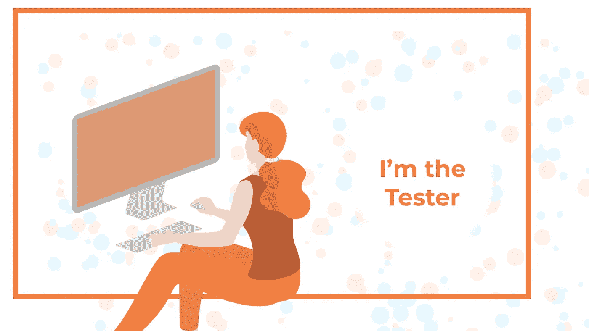

# BDD 是如何让产品所有者、设计师、开发人员和测试人员的生活变得更加轻松的

> 原文：<https://medium.datadriveninvestor.com/how-bdd-is-making-life-easier-for-product-owners-designers-developers-and-testers-30d1fb151547?source=collection_archive---------17----------------------->

本质上，行为驱动开发(BDD)改善了项目涉众之间的沟通，以避免遗漏需求、产生更多 bug、延迟时间表和产品失败。围绕 BDD 方法已经写了很多，但是在这个博客中，我将分享它如何使每个涉众的生活变得更容易。

**BDD 如何让产品负责人的工作变得更简单:**

作为产品所有者，您将对产品的整体成功负责，并且您会希望以用户可能想到的每一种方式来思考，以确保涵盖所有边缘情况。BDD 将帮助你仅仅用简单的英语文本写出那些边缘案例或者任何潜在的案例。BDD 的这个特性将有助于团队对产品的更高层次的协作，因为团队的每个成员都会对产品有更好的理解。此外，产品负责人对确切的需求有着清晰的认识。他们可以列出多个场景，以确保团队中的每个人都不会偏离最初的需求路径。

此外，BDD 特征文件将作为产品的可执行文档，它将在特征文件和测试场景之间建立自动化。因此，一个特性中任何微小或重大的变更请求都必须通过测试场景，除非代码被更改，否则这些测试场景将会失败。这种自动化将有助于保持需求和开发之间的同步。

**BDD 如何提高设计师的效率:**

*“通常，软件的设计和构建并没有过多考虑它的使用和支持生态系统。”*

作为一名设计师，你想为你工作的任何组织建立最好的模型。BDD 将通过提供以用户为中心的设计方法来提供帮助，在这种方法中，每一个可交付的功能都集中在用户的意图和模式上。与团队合作，了解每一个可能的变化将有助于你准备好 UX 设计，考虑用户旅程的所有方面。此外，在项目开始时就有这样的清晰性可以帮助你将你的设计思维发展到新的水平。设计者和开发者必须考虑用户的需求；这是 BDD 中最关键的概念之一，也是以用户为中心的设计的关键。通过分析将使用该系统的用户的行为，我们不断探索各种选项，以选择最能满足需求的替代方案。这样做，设计思维和实现的过程将会在软件开发周期的每个阶段继续发展和变得更好。

 [## 加速科技银行的数字化:云和人工智能成为疫情赢家|数据驱动的投资者

### 疫情新型冠状病毒的经济效应正在把斗争推向每个国家的主要产业…

www.datadriveninvestor.com](https://www.datadriveninvestor.com/2020/05/12/speeding-up-the-digitalization-of-the-tech-banking-cloud-and-ai-as-the-pandemic-winners/) 

**BDD 如何改变开发者的游戏规则:**

作为一名开发人员，您希望有一个清晰的需求集，这样您就可以自信地构建业务所要求的内容。当你已经用简单的英语在特征文件下的多个场景中涵盖了需求时，你不想现在就去找商业专家来弄清楚需求。没有比这更好的了！有一些工具可用于测试，它们只是现有测试库的包装器(即 jest-cumber for Javascript)。所以采用 BDD 方法不会让你仅仅局限于特性文件，还会利用测试，确保需求的每个部分都有相应的测试用例。用简单语言编写的特性可以很容易地自动化。

首先，向自动化工具提供一个例子(比如 Cucumber 或 Spec Flow)，这将产生自动化的规格说明。开发人员可以使用结果来进行应用程序开发。此外，BDD 涉及到与利益相关者和团队其他成员的合作，这将帮助你获得对你将要构建的产品的信心。

**BDD 如何减少测试人员和其他涉众之间的差距:**

作为一名测试人员，您希望成功地运行验收测试，并确保软件按照业务的预期工作。BDD 的另一个优点是它有利于系统的可测试性。BDD 背后的原始概念是基于行为驱动产品，这使得检查事情不会变糟变得至关重要。与 TDD 不同，BDD 更侧重于整体测试产品，而不是测试代码的小部分。BDD 关心的是确保一个人从 A 点到达 B 点，而不太重视或根本不重视所选择的路径。像 Gherkin 这样的工具提供了在测试规范和系统之间实现连接层的灵活性，这是自动化测试步骤的一部分。此外，在协作阶段，测试人员可以与开发人员和设计人员配对，以便更好地理解要测试的特性。

**一个实际的 BDD 用例:**

上图展示了在可伸缩性和可维护性方面，与传统的软件开发方法相比，BDD 可以提供的好处。确保新添加的场景不会扰乱行为实现是平滑发布变更请求的过程，并且通过采用 BDD 很好地涵盖了这一点。使用 BDD 编写多个脚本和任何可能的情况的额外步骤将很快带来回报，使产品易于管理和扩展。此外，BDD 的正确实现将确保产品的行为测试，这很可能导致其他方法变得可用。

# 别忘了给我们你的👏！

**进入专家视角—** [**订阅 DDI 英特尔**](https://datadriveninvestor.com/ddi-intel)