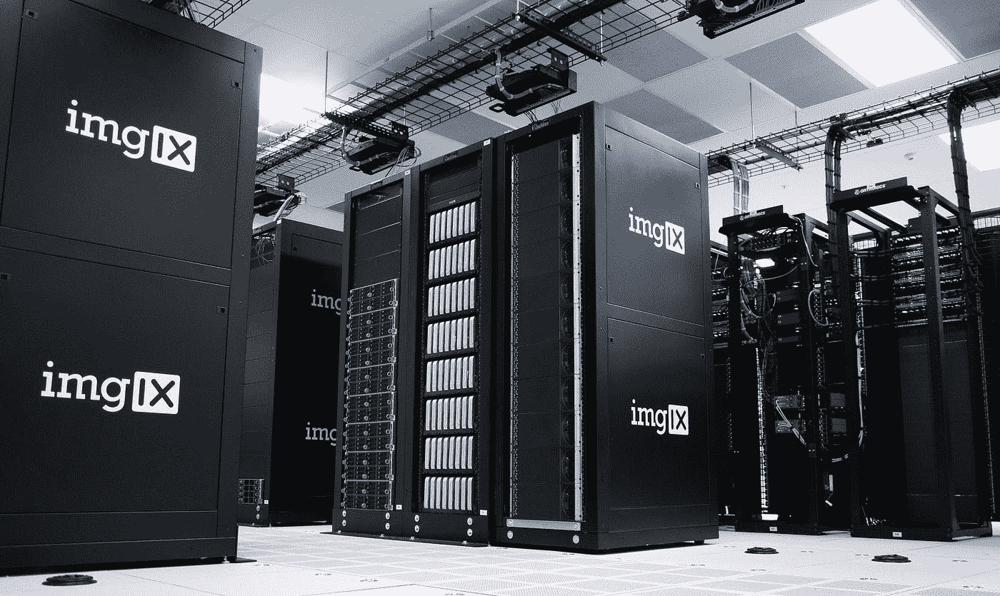
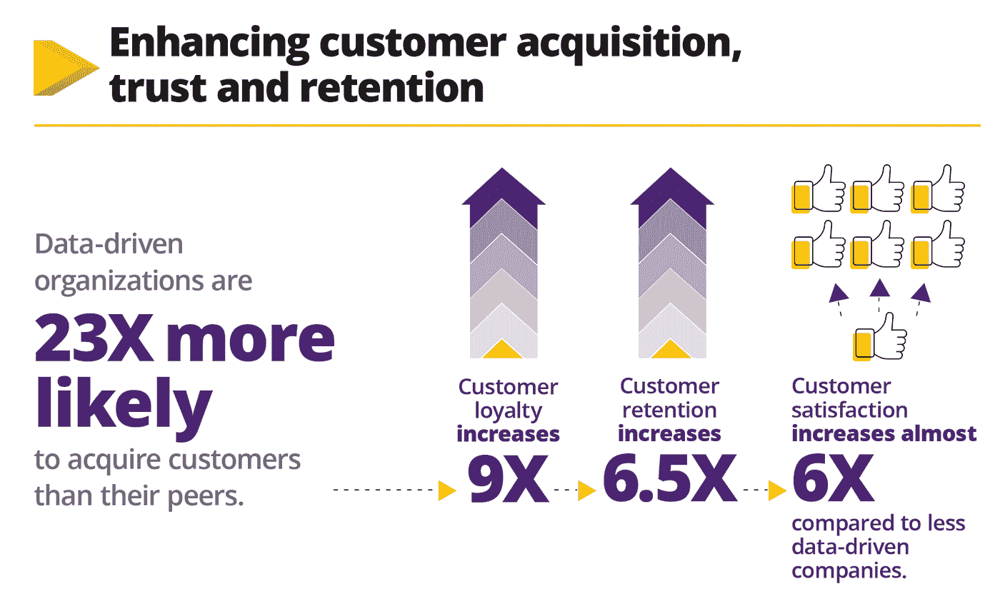

# 大型企业在设定优先级时如何利用数据

> 原文：<https://medium.datadriveninvestor.com/how-big-businesses-use-data-to-their-advantage-when-setting-priorities-497e3395adb2?source=collection_archive---------15----------------------->

## 适应或者死亡

Photo by [imgix](https://unsplash.com/@imgix?utm_source=medium&utm_medium=referral) on [Unsplash](https://unsplash.com?utm_source=medium&utm_medium=referral)

大企业和小企业之间的区别往往在于它们处理数据的能力。

每个企业都围绕着他们的客户——企业努力扩大他们的客户群，为了做到这一点，他们试图了解他们的客户在追求什么，以模型化他们的服务来满足他们的需求。

这就是大企业和小企业的区别——利用收集到的数据，找出客户需求并提供适合他们的产品的能力。

你一定听说过“数据是新的石油”的说法，这是因为如果使用得当，数据可以为企业带来多少利润。

 [## 大数据颠覆了我们所知的信贷应用|数据驱动的投资者

### 融合是金融领域的最新流行词，由于支付和贷款之间的关系，我们现在…

www.datadriveninvestor.com](https://www.datadriveninvestor.com/2020/03/19/big-data-disrupts-credit-applications-as-we-know-them/) 

每一个在线业务——社交媒体、网站或在线商店——都在收集数据。无论是邮件、人口统计、姓名还是购买习惯。即使是完全离线的企业也在利用物联网传感器、定制调查、供应链信号和公共数据集与他们的行业交流，以汇编信息。这些收集的数据旨在为最终用户提供满足其个人需求的最佳服务。

# 大数据在企业中的优势

拥有数据是一回事，但正确管理和分析数据需要人才和工具。这些工具可以确保快速高效地完成所有工作，不会留下任何痕迹。

在业务中使用数据的需求越来越大，大型企业处于这一领域的前沿。由于对大数据分析的需求不断增长，数据工程师有很多事情要做。

各种类型的企业都在拥抱数据，它正在重塑商业空间。麦当劳、耐克、网飞等公司正在采取积极措施，利用数据更好地服务客户。

信息是一回事，将信息作为发展业务的工具是另一回事。

那么，数据对企业到底有多重要呢？

# 为了便于决策

如果你在经营一家企业，你可能会感到每天都有解决问题的压力——投资、员工、营销等。决策永无止境。

例如，在炎热的疫情，公司不得不决定是继续向员工支付全薪还是让他们休假。

随着封锁的放松，公司现在必须决定在新的秩序下让谁回来。

企业主无法仅凭直觉自己做出这些决定。他们必须从数据中获得洞察力。

当人力资源团队试图决定给员工加薪、升职甚至裁员时，数据就派上用场了。借助人力资源分析工具，您的人力资源部门可以全面了解员工的生命周期，他们可以分析招聘、员工绩效、培训、发展和保留。

如果没有数据分析软件，所有这些都会变得更加困难。

# 去了解消费者

数据分析有助于以多种方式了解你的受众。例如，它可以让你看到为什么你的客户会关注你的内容，不管他们是否喜欢你的产品，看到你赚钱的方式，了解你所处的特定市场。

没有数据，你就不容易了解你的市场。

当你能够理解市场和你的客户的行为，你的企业将能够适应未来的趋势，因为无论你是否看到它，你的客户总是在变化。如果你没有利用从他们那里获得的信息来适应市场，你的业务可能会成为过去，正如商业智能供应商 [Sisense](https://www.sisense.com/) 的[这张信息图](https://www.sisense.com/blog/big-data-big-benefits-what-leaders-say/)所示。

[Source](https://www.sisense.com/blog/big-data-big-benefits-what-leaders-say/)

现代营销都是关于数据的。更聪明的企业，[无论规模大小](https://www.smallbiztechnology.com/archive/2020/03/why-small-businesses-need-data-analytics-too.html/#.Xm4WQagzYWU)，都将商业智能用于他们的营销，这使他们在竞争中领先。

例如，在广告场景中，您需要使用消费者数据来匹配他们的期望。公司现在使用大数据，通过观察消费者的在线活动、销售点交易以及获得对趋势和行为的洞察，来获得对消费者需求的准确描述。所有这些都是为了更好地为顾客服务。

例如，网飞利用大数据进行有针对性的广告宣传——根据你之前观看的内容推荐电影。这是为了确保每个人都享有更好的体验，从而使更多的客户使用他们的服务。他们有数百万订户，而且并非所有人都对相同的内容感兴趣，所以他们建议根据最终消费者的兴趣来编排节目。

# 改善业务流程

一个企业中有太多的浪费。公司承担的许多项目可能会浪费资源、时间和金钱。

在每个组织中，这都是常态。但是有了数据分析，你可以监控什么在起作用，并简化你的工作，以确保你不会浪费资源。

例如，营销活动使用数据分析会更有成效。

使用漏斗的销售过程对一些人来说可能是势不可挡的，因为要根据消费者的反应来打勾。

借助正确的数据策略、有才华的团队成员和技术资源，您能够优化营销活动绩效、衡量多渠道营销工作并跟踪社交平台上的参与度。

# 用于风险管理

我之前说过，商业就是做出冒险的决定。有了数据，你可以看到潜在风险的到来，并在它变得严重之前避免它——这是大企业通过大数据分析预防可能影响其利润率的风险的方式。

大数据分析工具帮助大品牌指导业务报告，推动人工智能驱动的 KPI 变化警报的进一步参与，并量化他们每天面临的风险。

例如，银行使用大数据来推动风险管理。发生损失的可能性很大，因此他们可以减少风险价值的计算时间，以确保他们可以进行快速的实时分析。

Photo by [Vidar Nordli-Mathisen](https://unsplash.com/@vidarnm?utm_source=medium&utm_medium=referral) on [Unsplash](https://unsplash.com?utm_source=medium&utm_medium=referral)

# 对于供应链管理

大数据分析让供应商对其网络有了更清晰的认识和洞察力。

以疫情为例，在那里中国不得不停止生产。这导致供应减少，需求增加，打破了供应链。

这让许多公司措手不及，这就是大数据如此重要的原因。它有助于您超越当前的稳定性指标，提前计划以确保避免影响商品供应的风险，从而让最终用户满意。还记得我说过企业是围绕消费者的吗？大公司明白这一点，并在大数据分析方面采取了额外的措施，以确保他们更好地为客户服务。

在供应链中，大数据有助于:

*   避免交货延误。
*   监控装运和交付时间
*   通过整合所有供应商的数据和分析合同支出，增加节约机会。

比如百事可乐[利用大数据进行供应链管理](https://www.tamoco.com/blog/big-data-and-the-supply-chain/)。他们的零售商被要求提供关于仓库和 POS 库存的报告，这些报告将用于调节和预测他们的发货需求。

这是为了确保零售商的货架上总是有百事可乐的产品，从而满足最终用户。

# 最后一个音符

大企业采用大数据分析来确保为客户提供最好的服务，数据帮助您提升水平。

**感谢您阅读**