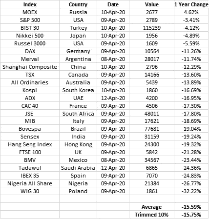
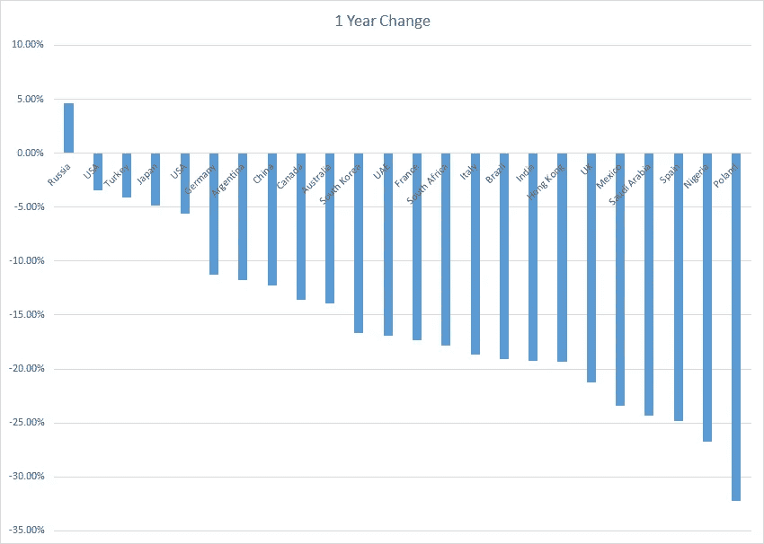

# 以本币计算，全球股市跌幅有多大:金融市场和医疗状况之间的差异

> 原文：<https://medium.datadriveninvestor.com/how-big-is-the-global-stock-market-declines-in-local-currency-terms-disparity-between-financial-2a6d3d22e571?source=collection_archive---------13----------------------->

Photo by [Jason Briscoe](https://unsplash.com/@jsnbrsc?utm_source=medium&utm_medium=referral) on [Unsplash](https://unsplash.com?utm_source=medium&utm_medium=referral)

这是一篇很短的文章，用来透视全球股市的调整。所有数据来自彭博网站。

以下是观察结果..

一般要点:

上述市场的 12 个月全球平均跌幅仅为 15.6%。

从过去 12 个月的高点下跌更高，但回顾过去 12 个月全球下跌 15.6%，并不符合悲观的情景。

然而，由于实体经济正在经历由病毒和公众反应共同引起的医疗保健危机所导致的严重问题，金融市场似乎已经与这个问题脱钩。

最好的指标是标准普尔 500，仅比一年前下降了 3.4%。

病毒热点:

美国大大超过了全球平均水平。

起点中国好 3%。

意大利、西班牙和英国的表现分别落后 3%、9%和 6%的净负差。

 [## 投资区块链前要问的三个简单问题(也是一个困难的问题)|数据…

### 现在是了解区块链的最佳时机。不同货币之间的增长率，比如…

www.datadriveninvestor.com](https://www.datadriveninvestor.com/2020/03/12/three-simple-questions-and-one-difficult-one-to-ask-before-investing-in-a-blockchain/) 

其他评论:

新兴市场的表现各不相同。

在表现较好的方面有更多的例外，主要是俄罗斯、美国、土耳其和日本。

如果将汇率影响考虑在内，由于美元走强，大多数其他市场的表现会更差，一些市场以美元计算会明显更差。

总体而言即使以本币计算 15.59%的跌幅也很大；以本币计算，目前还不是全球崩盘。