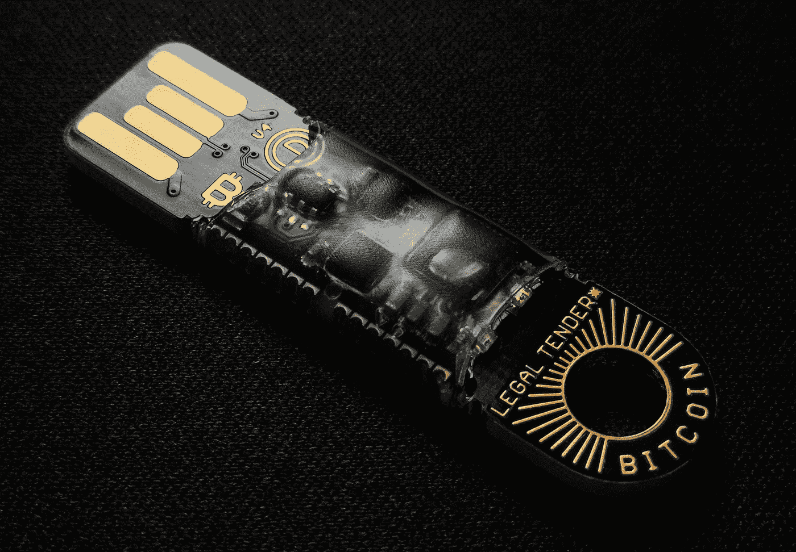
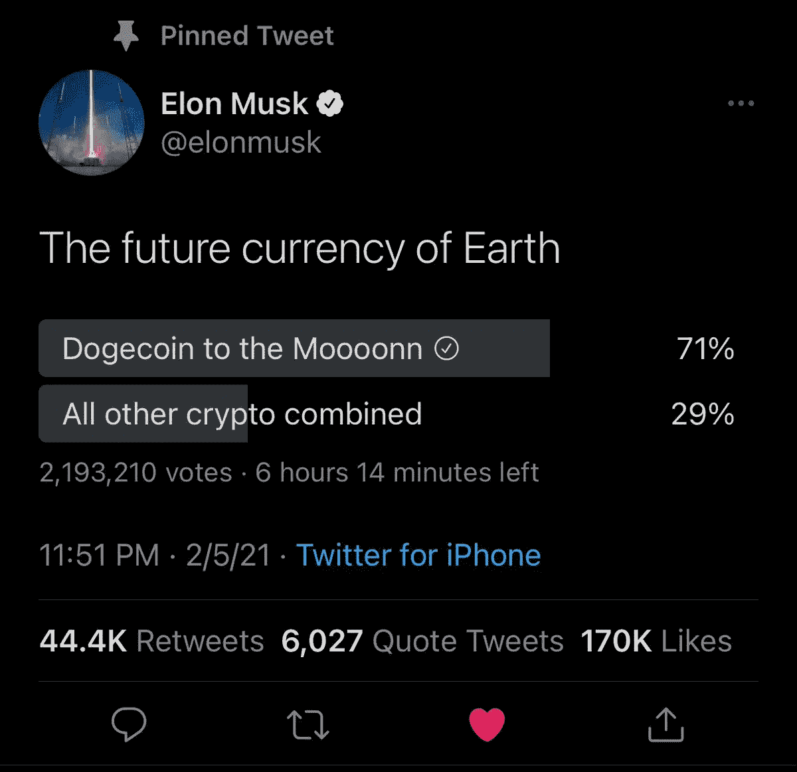

# 比特币将如何改善人类的未来

> 原文：<https://medium.datadriveninvestor.com/how-bitcoin-will-improve-the-future-of-human-race-4d4acbf730c5?source=collection_archive---------11----------------------->

## 成为一级文明

Photo by [Simon](https://unsplash.com/@dropin16?utm_source=unsplash&utm_medium=referral&utm_content=creditCopyText) on [Unsplash](https://unsplash.com/s/photos/bitcoin?utm_source=unsplash&utm_medium=referral&utm_content=creditCopyText)

人类一直在寻找成长和发展的途径。自 1900 年以来，我们的人口已经从 16 亿增加到今天的 78 亿。不断增长的人口加速了我们的技术和经济的发展，随着人口的持续增长，我们的社会已经达到了向先进文明发展的必要阶段。

大约 100，000 年后，根据 T2 的卡尔达舍夫等级，我们将很快成为第一类文明。

什么是卡尔达舍夫音阶？——卡尔达舍夫等级是一种根据一个文明能够使用的[能量](https://en.wikipedia.org/wiki/Energy)来衡量其技术进步水平的方法。这项措施是由苏联天文学家尼古拉·卡尔达舍夫在 1964 年提出的。根据上面的标准，我们已经达到了 0 级…我知道，听起来很悲伤。你看，我们仍然从我们的星球上获取大部分的能量，只是开始使用来自附近的恒星“太阳”的能量。随着从太阳获取和储存能量的过程呈指数增长，我们正在慢慢过渡到 1 型文明。然而值得一提的是，我们已经达到了定义 1 型文明的一些其他组成部分的必要水平。

**1 型语言。英语作为世界语言的采用极大地加快了我们的交流方式。据报道，超过 15 亿人把英语作为他们的第二语言。在**1 类沟通的帮助下，这个数字只会继续增长。**当然，随着技术的发展，我们将不再需要说同一种语言，因为翻译服务的巨头，如谷歌，已经站在创建音频和视频翻译的边缘，将能够实时翻译任何语言。随着人工智能的发展，这种进步只会继续增长。**

**1 型沟通。**互联网。[每天大约有 46.6 亿人在使用互联网。这是全球人口的惊人的 59%。手机现在已经成为全球最重要的互联网接入渠道，因为移动互联网用户占互联网用户总数的 91%。](https://www.statista.com/statistics/617136/digital-population-worldwide)

现在进入第一类文明的另外两大组成部分:由于社会总是需要快速和简单的交易方式，为了服务这几十亿人口，我们将需要区块链的解决方案来使这一过程尽可能简单。加密货币无疑是**“未来的货币”**。成为第一类文明的唯一方法是推进基于区块链技术的数字货币的采用。高级文明的第二个重要组成部分是现代的**1 型政府**。区块链可以帮助我们达到所需的自治水平，并帮助我们建立可靠的政府，为人民服务。总部位于区块链的政府有潜力解决遗留的棘手问题，并实现以下优势:

*   安全存储数据，无论是政府、公民还是企业相关信息
*   减少劳动密集型流程
*   降低与管理责任相关的成本，如文档签名和存储，以及减少对中间人控制交易的需求
*   消除腐败和滥用职权
*   直接民主和公平的选举过程

加密货币是一种数字资产，被设计成交易媒介。个人货币所有权记录存储在数字分类账或计算机化的数据库中，使用强密码保护交易记录条目。这样做是为了控制附加数字硬币记录的创建，并验证硬币所有权的转移。每种加密货币都通过分布式账本技术工作，通常是区块链，作为公共金融交易数据库。这项技术旨在解决信任、洗钱等问题，并帮助人们轻松进行交易，无论其地理位置如何。

加密货币最终将取代虚拟数字货币，虚拟数字货币取代了纸币，而纸币又取代了物物交换。

2009 年 3 月，美国财政部长蒂莫西·盖特纳无意中透露，他对最终走向由国际货币基金组织(IMF)管理的全球货币的想法“相当开放”。同年，世界见证了比特币的诞生。巧合吗？..我不这么认为。你看，目前没有一种法定货币能够成为真正的全球货币。加密货币，无论是比特币、以太币，甚至是 Dogecoin =)，都有更好的机会成为全球货币，因为它们的开发方式。据大约 200 多万 Elon Musk tweeter 订户称，这将是 Dogecoin。这当然是一个笑话…或者是吗？

Elon is forcing the adoption of DOGE in his latest tweet poll

在我看来，比特币也不是世界货币的完美候选。我在这里写过原因: [*加密货币的未来会是什么样子*](https://medium.com/datadriveninvestor/is-bitcoin-dead-again-be22429b7d7b) *。*由于其通货紧缩模式，比特币的供应量是固定的。这看起来没什么大不了的，然而，供给有限的东西总会增值。牢记这一点，我相信比特币是有未来的；然而，它更适合用来储存财富，比如黄金。未来的全球货币也可以由比特币支持，从而有助于接受的过程。比特币做了一些非常重要的事情来帮助我们获得第一类货币，它帮助许多其他人效仿他们的榜样。

比特币或以太坊是否会成为新的全球货币，或者任何其他替代货币都无关紧要。现在重要的是，世界已经不可避免地开始了采用加密货币的过程。即使我们处于早期采用阶段，未来 10-20 年将帮助我们达到完全接受。与此同时，太阳能收集和储存也将变得更加主流，我们将会到达理想的 1 型文明，谁知道呢，也许 NASA、SpaceX、维珍银河和其他人会帮助我们在下个世纪到达 2 型文明。