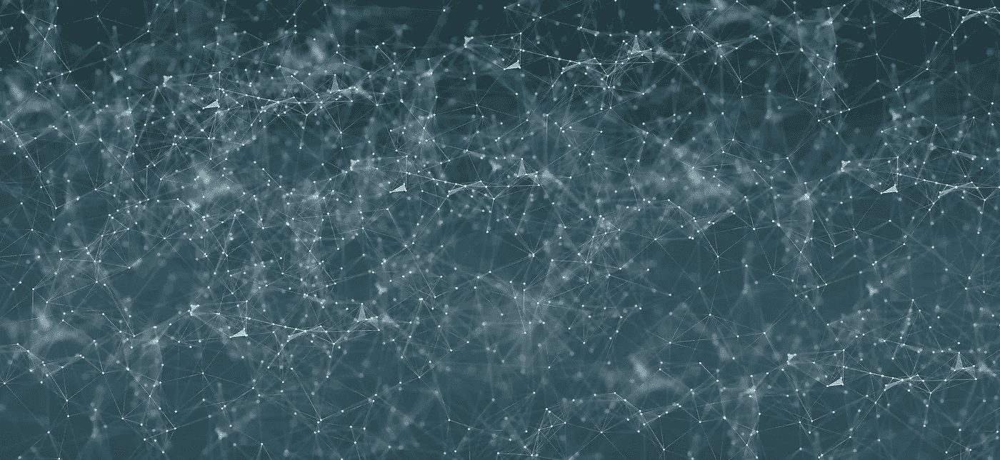
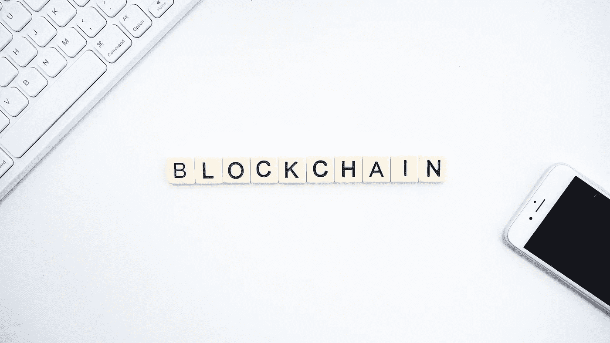
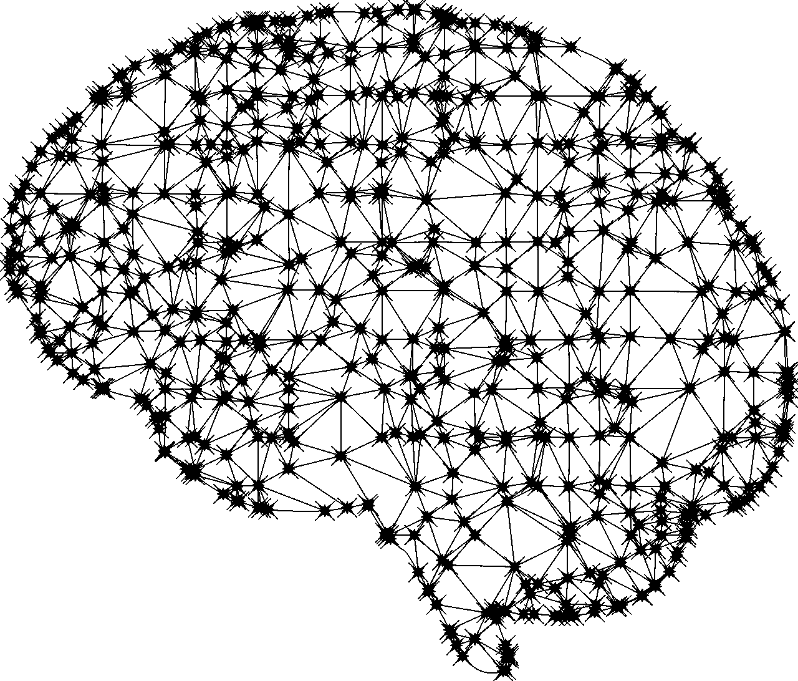

# 区块链和人工智能如何合作

> 原文：<https://medium.datadriveninvestor.com/how-blockchain-and-ai-can-work-together-96a795266ee?source=collection_archive---------4----------------------->

## 在追求哪种职业之间徘徊？两者都不知道？本文不需要任何技术知识。

Photo by [Pete Linforth](https://pixabay.com/users/TheDigitalArtist-202249/?utm_source=link-attribution&utm_medium=referral&utm_campaign=image&utm_content=4556932) from [Pixabay](https://pixabay.com/?utm_source=link-attribution&utm_medium=referral&utm_campaign=image&utm_content=4556932)

流行语！对许多人来说，区块链知识听起来像$$$，人工智能知识似乎是不可能的。尝试结合复杂的技术来创造新的东西现实吗？制造两者都用的东西会需要 3000+的智商吗？下面提供了人工智能、区块链的即时解释，然后是使用这两者的示例应用程序，以激发您的想象力。

## **什么是区块链？**

Photo by [Launchpresso](https://www.pexels.com/@launchpresso-1267072?utm_content=attributionCopyText&utm_medium=referral&utm_source=pexels) from [Pexels](https://www.pexels.com/photo/blockchain-advertisement-2556699/?utm_content=attributionCopyText&utm_medium=referral&utm_source=pexels)

区块链并没有看起来那么复杂。这将是对任何需要熟悉它的人的快速介绍。

 [## 5 行业转型区块链应用|数据驱动投资者

### 除非你一直生活在岩石下，否则我相信你现在已经听说过区块链了。而区块链…

www.datadriveninvestor.com](https://www.datadriveninvestor.com/2019/02/13/5-real-world-blockchain-applications/) 

> “区块链是一个去中心化、分布式的交易账本”(Schmelzer，2019)。

区块链中的几个关键术语可以帮助您理解它的工作原理:

*   **分散化** =一个公司或个人不监管软件本身，例如，谷歌如何使用谷歌驱动。
*   一个**【节点】** = 想要保留区块链上所有交易的副本并帮助运行该链的任何人。
*   一份**【分类账】=一份曾经发生在供应链上的所有交易的副本。事务可以被认为是从一台计算机发送到另一台计算机的一些数据。**
*   **a**【miner】**=**通过检查交易记录(a**【ledger】**)来验证交易可能发生的计算机，例如，确保一个人有足够的钱来发送他们试图发送的金额。矿工在验证交易时所做的计算工作，会得到一种货币的报酬，如**“比特币”**“以太坊”**。******
*   ********分布式** =许多计算机都有相同的交易文件(一个**“分类账”**)，如果它们愿意(一个**“矿工”**)，它们中的任何一个都可以帮助验证交易，交易可以被发送到它们那里并被验证。******
*   ******【工作证明】** =验证交易的第一台计算机(a**【miner】**)将他们在文件中完成的工作发送给链上记录所有交易的其他所有人(a **【分类账】**)。如果其他所有人的所有交易的副本与验证者的信息匹配，则其他所有人更新他们的文件(a **“分类账】** ) (Bradley，2019)。****
*   ******【智能合约】** = 满足特定编码条件时自动运行的代码段。****

****区块链本质上是另一种类型的互联网，任何人都可以连接和使用。作为一个金融系统，它特别伟大的原因之一是因为如何根据交易记录的许多不同副本检查帐户余额，防止中间人篡改信息(通常与运行整个系统的银行相比，使他们的系统集中化)。****

## ******什么是 AI(人工智能)？******

********

****Photo by [Gordon Johnson](https://pixabay.com/users/gdj-1086657/?utm_source=link-attribution&utm_medium=referral&utm_campaign=image&utm_content=2729794) from [Pixabay](https://pixabay.com/)****

****理解人工智能并不像它所能做的那样可怕。以下足以解释人工智能和区块链如何协同工作。****

> ****“人工智能(AI)是机器或计算机程序思考和学习的能力。人工智能的概念是基于制造能够像人类一样思考、行动和学习的机器的想法。(图尼科娃，2019)。****

****人工智能更多地被认为是一个概念，而不是一种技术。它通常分为三类:****

*   ******狭义**——专注于执行单一任务，不为自身考虑，例如 Siri 和 Alexa。****
*   ******一般**——有能力理解事情的来龙去脉，并根据所说的事情做出判断。从经验中学习，像人脑一样运作，然而，现在还没有这样的东西存在。****
*   ******超级**——智力上优于人类，能独立思考，无需任何人类介入就能操作，例如天网。****

****构成人工智能的还有其他类别，如机器学习和深度学习。****

*   ******机器学习** (ML)关注的是一个机器“学习”的能力(De Jesus，2017)。ML 通常是通过利用算法来实现的，该算法从给定的数据中识别模式并创建洞察。算法由人类创建，负责解析数据并从中学习。ML 用于预测，它可以帮助识别任何情况下的可能结果，而不是人类需要自己发现每个结果。****
*   ******深度学习** (DL)被认为是最先进的 AI 领域，是机器学习的子集。DL 需要一个模拟人脑神经网络的复杂架构，需要大量的数据和巨大的计算能力。有些人只是称之为人工神经网络，因为它允许机器以与人类非常相似的结构分析数据。它们不需要人类告诉它们如何处理数据——它们被编程为由数据驱动。我最喜欢的例子是计算机视觉，它基本上从像素开始分解图像和视频，并对机器“看到”的一切进行分类([谷歌](https://www.youtube.com/watch?v=OcycT1Jwsns)关于计算机视觉的精彩视频)。****

## ******区块链和人工智能如何合作？******

****可以创造区块链和 AI 的无尽应用；这里有一些他们可以一起工作的方法，让你对他们的兼容性有一个大概的了解。****

*   ******区块链可以充当人工智能的大脑**——想想[天网](https://en.wikipedia.org/wiki/Skynet_(Terminator))，尽管我们可能应该阻止它达到那个地步。很现实；区块链可以用于共享来自世界各地的多个人工智能模型的学习数据，允许它们从彼此的环境中成长和学习。没有人会拥有这个系统；没有企业或政府能够控制共享大脑的发展。当你想到用信息链接在一起的所有模块时，它实际上有点像大脑，充当分散的智能…至少可以说很有趣。****
*   ******人工智能可以监控区块链**——由于人工智能可以识别数据中的模式，如果有必要，它当然可以用来监控区块链，能够发现链中的任何违规行为，并在必要时帮助纠正它们。****
*   ******区块链可以帮助机器学习数据变得更容易访问** —例如，由于区块链允许任何人上传数据并访问所有数据，因此任何人都可以上传对象识别数据，任何 ML 模型都可以访问这些数据，从而大大提高协作和模型增长的速度。此外，数据不会只为一家公司所有，因为任何人都可以上传和访问数据。Ron Schmelzer 提供了另一个奇妙的例子(见 Schmelzer，2019)，他解释说，“多个较小的在线企业可以在一个区块链中共享他们的客户个性化数据，从而与亚马逊和沃尔玛等已经建立了自己的数据集的公司进行更好的竞争”。****
*   ******区块链可以改善在深度学习神经网络中发现错误的能力** —例如，每当一些输出不如预期时，导致该输出的特定输入数据可能更容易在神经网络内部找到。这是因为区块链上的每个事件都被记录下来，这使得跟踪神经网络中哪里出错变得容易得多。****
*   ******人工智能可以改善区块链中的采矿** —考虑到正在执行的巨大计算，采矿需要大量的能量。采矿的电力使用对于运行区块链来说是一个巨大的负面影响，但人工智能已经以能够大大改善能源消耗而闻名，并且肯定可以用于区块链采矿(Evans，2016)。****

****区块链和人工智能显然可以用来改善彼此的功能，也可以一起用于其他应用。已经有很多公司将人工智能和区块链结合起来用于其他目的，而不是改进技术本身，[下面是一些](https://builtin.com/artificial-intelligence/blockchain-ai-examples)的列表。****

## ******来源******

****布拉德利，R. (2019)。*区块链用不到 100 个字解释了…的内容*。[在线]德勤瑞士。可在:[https://www2 . Deloitte . com/ch/en/pages/strategy-operations/articles/区块链-explained . html](https://www2.deloitte.com/ch/en/pages/strategy-operations/articles/blockchain-explained.html)【2019 年 12 月 28 日访问】。****

****塞西勒·德·耶稣。(2017).人工智能:它是什么，它是如何工作的。从 Futurism 网站检索:[https://Futurism . com/1-evergreen-making-sense-of-terms-deep-learning-machine-learning-and-ai](https://futurism.com/1-evergreen-making-sense-of-terms-deep-learning-machine-learning-and-ai)****

****埃文斯里奇。“DeepMind AI 将用于冷却谷歌数据中心的能源减少了 40%。”*谷歌*，谷歌，2016 年 7 月 20 日，blog . Google/topics/environment/deep mind-ai-reduces-energy-used-for/。于 2019 年 12 月 31 日访问。****

****奥克萨娜·图尼科娃。(2018 年 1 月 5 日)。关于人工智能你需要知道的。检索于 2019 年 12 月 28 日，来自 StopAd 博客:实用内容和见解，不仅仅是关于广告网站:[https://stopad.io/blog/artificial-intelligence-facts](https://stopad.io/blog/artificial-intelligence-facts)****

****Schmelzer，R. (2019 年 10 月 25 日)。AI 和区块链:炒作翻倍还是价值翻倍？检索自[https://www . Forbes . com/sites/cognitive world/2019/10/24/ai-and-区块链-double-the-hype-or-double-the-value/# 6d 58 e 0065 eb4。](https://www.forbes.com/sites/cognitiveworld/2019/10/24/ai-and-blockchain-double-the-hype-or-double-the-value/#6d58e0065eb4.)****

****‌****

****‌****