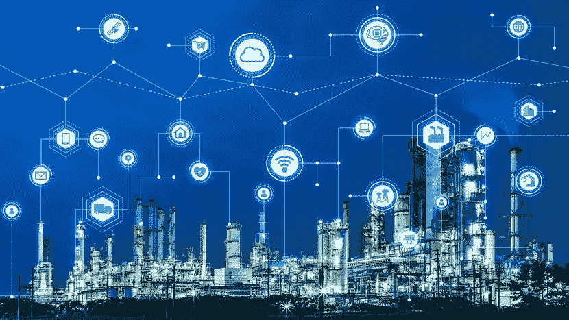

# 区块链如何帮助面向未来的能源行业

> 原文：<https://medium.datadriveninvestor.com/how-blockchain-can-help-future-proof-the-energy-industry-7fa5378f177c?source=collection_archive---------22----------------------->

就在短短几个月前，顶级能源高管们看到了世界和行业的稳定未来。根据 EY 的全球资本信心晴雨表(2019 年 11 月)，各部门普遍乐观地认为，全球经济正在好转，对能源和产品的需求正在上升，2020 年充满增长潜力。

这就是黑天鹅的特点——它们是无法预测的。与 6 个月前相比，现在的世界看起来非常不同。随着数十亿人躲在家中，商店和工作场所关闭，世界经济引擎停止运转，直到疫情决议出台，[彭博分析师](https://theenergymix.com/2020/03/17/analysts-foresee-record-drop-in-oil-demand-as-covid-19-crisis-fossil-price-war-deepen/)现在预测石油和天然气行业历史上最大的需求萎缩。

*“由于政府遏制疫情蔓延的措施限制了人们的流动，并使供应链陷入混乱，全球石油使用量的预测大幅下调。”—彭博*

石油和天然气行业从来没有预料到疫情，或者随之而来的价格战，现在 WTI 的价格已经接近 2018 年平均价格的三分之一。然而，这些危机的汇聚有力地证明了为什么像能源这样的关键行业需要优化、降低运营成本，并得到能够减轻黑天鹅事件影响的强大系统的支持。

能源行业在整个产品价值链中采用了大量技术，但在提升交易和数据管理等核心业务功能方面落后于其他行业。后果是系统效率低下、巨大的 G&A 成本和频繁的纠纷。

 [## 5 个可以拯救环境的潜在区块链用例|数据驱动的投资者

### 区块链技术已经成为创新和颠覆的代名词。而医疗保健等几个行业…

www.datadriveninvestor.com](https://www.datadriveninvestor.com/2020/03/06/5-potential-blockchain-use-cases-that-can-save-the-environment/) 

例如，每年平均有 9%的全球原油交易因交易对手之间的数据不一致而产生争议，给行业带来了巨大的会计、管理和时间成本。G&A 公司在能源方面的其他大笔支出来自于其复杂的合作伙伴关系和供应商关系、具有挑战性的资产交易以及法规遵从性的高负担。这些是石油和天然气开始采用区块链的关键领域。

区块链的一个简单定义是由计算机集群(分散节点)管理的一系列不可变的带时间戳的数据(块)。这些数据块中的每一个都受到保护，并使用加密技术相互绑定，形成了一个完整的链，只能读取或添加，不能更改(不可变)。管理数据的网络可以是公共的，如加密货币，也可以是私有的，需要许可才能访问，如商业应用中使用的网络。

“区块链是一项新兴技术，它让我们有可能重新想象我们今天在整个行业中的工作方式。”

*Rebecca Hofmann，OOC Oil & Gas Blockchain 财团*主席

在其 10 年的历史中，区块链展示了在部门、组织和交易对手之间简化所有类型的数据管理流程的独特能力。它允许通过生产和供应链即时跟踪产品，让公司通过智能合同实现支付和交易自动化，并消除或减少对管理员、会计和法律支持等多种中介的需求。

区块链不仅仅是一种技术，它还是一种数据基础设施，通过自动化和透明性，帮助优化价值在业务网络中的流动方式。在高度不确定的经济环境中，它致力于消除对资本和生产率的系统性拖累，使组织更具弹性和活力。

石油和天然气行业采用数字技术的好处有可能是巨大的——根据[研究公司麦肯锡](https://www.mckinsey.com/~/media/McKinsey/Industries/Oil%20and%20Gas/Our%20Insights/Capturing%20the%20next%20frontier%20of%20value%20Operating%20models%20for%20oil%20and%20gas%20fields%20of%20the%20future/Capturing-the-next-frontier-of-value-operating-models-for-oil-and-gas-fields-of-the-future.ashx)的说法，数字技术可以将公司的总体支出降低 20%,其中很大一部分节省来自于消除数据核对等手动冗余流程。

*“我们的研究显示，到 2025 年，数字技术可能会使海上石油和天然气价值链的总现金流每桶增加 11 美元，每年增加 3000 亿美元。”*

*-麦肯锡，捕捉下一个价值前沿(2017)*

区块链在能源领域有着广泛的潜在应用，而交易是传统流程成本高、时间长且随时可以优化的关键领域。智能合同使用来自区块链数据库的信息来执行预先编程的交易，当达到合同参数(例如，设定的生产量)时，交易会自动触发。智能交易消除了争议，通过将交易时间从数周大幅缩短至数天或数小时来释放资本，并且是当今行业中使用的一种经过验证的应用。

区块链提供可访问、完整的历史和转让来源的能力正在增强高效数字供应网络的创建，在这种网络中，可以实时跟踪产品，并通过整个石油和天然气价值链即时追溯。随着 GPS 数据融入新兴的[地理区块链](https://www.dmtispatial.com/2019/09/04/powering-the-blockchain-with-location-is-revolutionizing-these-industries/)，产品在整个供应网络中的移动可以在地图上可视化，允许公司优化分配和配送，减少错误和延迟，并防止盗窃或丢失。EY 估计[黑市石油——大部分通过工业供应渠道被盗——是一个 1330 亿美元/年的问题，区块链是一个强有力的潜在解决方案。](https://oilprice.com/Energy/Energy-General/Oils-133-Billion-Black-Market.html)

该行业的协作性质是区块链增加价值的另一个机会。上游石油和天然气是复杂的，建立在伙伴关系的基础上，通常有许多公司同时参与同一个项目。这使得记录工作变得艰难、昂贵，而且充满了成本高昂的对账和重复工作，公司试图核实劳动时间、供应商协议和共同运营成本。通过使用共享的区块链数据库，所有各方都可以访问相同的可信、经验证的信息，可以显著减少或消除争议、付款延迟和数据更正。

ESG 合规性是区块链可以理顺交易对手(在这种情况下是生产商和政府监管机构)之间关系的另一个领域。区块链数据库允许访问源自井口的完整的已验证生产数据链，从而消除了监管机构的审计挑战。新的应用正在探索公司如何利用区块链增强排放测量、监测和报告，这可能被用于创造“排放认证”的石油产品，证明每桶石油的气候影响。

根据西门子对石油和天然气公司的调查，70%的公司都经历过至少一次黑客攻击，黑客的目标是窃取数据、转移供应和破坏运营。网络安全是能源行业面临的一个日益增长但往往被忽视的挑战，在世界各地，类似的攻击一直在增加。加密、不可变且具有增强的跟踪能力，分布式区块链可能成为网络安全的核心元素，可以实时监控供应链，阻止数据库泄露和更改，并防止滥用公司身份。

*“当政治紧张局势加剧时，对石油公司的网络威胁似乎变得更加***。石油公司是植根于政治议程和地缘政治担忧的网络攻击的目标。”**

**2019 年趋势科技报告**

*技术变革总是伴随着风险——但在我们这个政治和经济动荡加剧的新现实中，更危险的风险是不向前迈进。随着运营复杂性和规模的增长，冗余、手动流程、缺乏安全性和不必要的成本使该行业更容易受到危机、价格冲击和其他不稳定事件的影响。*

*影响能源部门的许多因素是不可控和不可预测的。然而，可以获得某种程度的代理，因为流程效率低下在很大程度上是可控的，并且可以通过区块链等数字创新进行优化，以便公司可以专注于应对他们面临的更大的全球性挑战。*