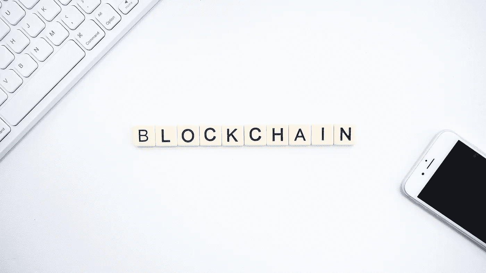

# 区块链如何帮助新冠肺炎医疗供应链

> 原文：<https://medium.datadriveninvestor.com/how-blockchain-can-unblock-the-covid-19-medical-supply-chain-b1cb3698570d?source=collection_archive---------19----------------------->

Photo by [Launchpresso](https://unsplash.com/@launchpresso?utm_source=unsplash&utm_medium=referral&utm_content=creditCopyText) on [Unsplash](https://unsplash.com/s/photos/blockchain?utm_source=unsplash&utm_medium=referral&utm_content=creditCopyText)

## 新冠肺炎危机给每种产品的全球供应链带来了前所未有的压力，但最严重的是关键的医疗用品。

美联社(Associated Press)最近[报道](https://abcnews.go.com/US/wireStory/imports-medical-supplies-plummet-demand-us-soars-69719400)称，美国医疗用品的严重短缺，包括化验棉签、防护口罩、手术衣和洗手液，可能与进口(主要来自中国)的突然下降有关。

贸易数据显示，出货量的下降始于 2 月中旬，此前新冠肺炎疫情在中国不断升级，导致中国关闭工厂和港口。美国的一些急诊室、医院和诊所现在已经没有了关键的医疗用品，而其他一些医院则在配给手套和口罩等个人防护设备。

美国指望从中国获得其绝大多数医疗用品，冠状病毒已在中国感染了 8 万多人，并导致 3200 多人死亡。当中国的医疗用品工厂上个月开始恢复生产时，他们首先考虑的是自己的医院。

美国公司正在转变供应链，制造关键用品，如个人防护设备、新冠肺炎测试套件和通风机。新的开源运动正在世界各地兴起，试图解决日益严重的呼吸机短缺问题。

 [## 数字货币、区块链和货币的未来|数据驱动的投资者

### “区块链”、“加密货币”、“令牌化”，以及现在的“央行数字货币”已经成为…

www.datadriveninvestor.com](https://www.datadriveninvestor.com/2020/02/18/digital-currencies-blockchain-and-the-future-of-money/) 

在国际上，随着中国新冠肺炎病例的减少，工厂正在慢慢恢复生产。与此同时，全球对关键物资的需求开始飙升。

通常需要几个月谈判的数百万美元的合同，在几个小时内就签订了。然而，一个关键的瓶颈是需求、供应和融资机制之间缺乏信任。

## **断裂的医疗供应链**

世界各地的政府和卫生系统对每个系统都有特定的要求(例如，[一系列混乱的欧盟标准、美国 FDA 标准、非欧盟标准](https://www.sciencedirect.com/science/article/pii/S2452302X16300638))。这些标准几乎每周更新一次，以允许更多的供应上线来满足预测的需求。

世界各国政府都在努力克服传统的采购体系，这些体系无法跟上这场危机所要求的步伐。这意味着世界各国正在错过供应，因为它们无法及时(几小时，而不是几周)建立金融机制。

世界各地的许多供应商都坚持要求预付现金，因为他们试图将可靠的买家与经纪人和中间商经销商区分开来。在医疗和个人防护设备供应链中，有大量关于欺诈性生产和欺诈性索赔的报道。存在这样的风险:设备可能无法在正确的时间以正确的规格到达正确的地点。

从本质上讲，全球医疗供应链存在信任危机。

## **医疗供应链面临的信任挑战**

**1。** **产品要求:**不同的卫生系统和国家有不同的标准，这给每个工厂应该生产什么造成了混乱。

**2。** **供应商可信度:**不确定哪些供应商能够在正确的时间以正确的产量生产出质量正确的设备。

**3。财务支付**:随着工人慢慢恢复工作，工厂和货运公司要求提前支付财务款项，他们自己也在努力优先处理可信的采购请求。

**4。** **海关认证:**鉴于医疗设备受到高度管制，海关认证需要快速验证，以允许设备在国际上快速运输。

**5。**

## 什么是区块链？

区块链是经济交易的不朽数字账本，可以通过编程不仅记录金融交易，还记录几乎所有有价值的东西。你可以把[区块链](https://medium.com/the-capital/what-you-should-know-about-blockchain-technology-b852e938011c)想象成“价值互联网”它是任何可以记录的东西(金融交易、合同、实物资产、供应链信息等)的实时分类账。)然而，没有一个人或组织负责整个链条。事实上，它是开放的，链中的每个人都可以看到每条记录的细节，这就是所谓的块。在可持续发展领域，区块链已被用于验证[矿物、海鲜、新鲜农产品和森林产品](https://medium.com/swlh/blockchain-for-agriculture-5b0a0baa0aa3)等的道德来源。

它使用深度加密系统，这使得合同能够以更分散的方式进行监管，并且足够安全，允许金融支付通过这样的机制流动。既有*私有的*和*开源的*区块链系统，每个系统都鼓励协调和合作，防止某一方过多地控制市场，并快速解决争端。

## **区块链在医疗供应链中能扮演什么角色？**

目前，没有由一个中央机构管理的集中采购系统(因为中央银行集中监管金融系统)。在这种情况下，世界各地对关键供应品的需求激增，这些医疗保健系统无法验证哪些系统具有可靠的制造能力，传统供应链在全球范围内被打乱，新的供应商面临信誉挑战，供应商试图区分可靠的买家或确保他们的生产库存将被购买。

excel 表格和谷歌表格等传统工具目前正被用于管理供应，法律合同不确定，个人无法飞去核实工厂的能力，以及对贸易融资和信用证传统支付机制的信任崩溃。

> 缺乏信任是阻碍这个市场快速发展的最大瓶颈，而速度是未来几周的关键。

## **区块链可以帮助的方式**

**1。** **产品需求:**为卫生系统提供一种机制，让工厂不断更新最新的产品需求和规格，就像生产拍卖一样。

**2。** **供应商可信度:**为卫生系统提供一种可信地评估哪些工厂具有高质量控制，并且能够满足所需的规格和产量的方法。

**3。****:作为一种贸易融资机制，确保向工厂支付区块链支持的预付款，然后在预先商定的生产里程碑和供应进入供应链的下一步时作为营运资金发放。**

****4。** **海关认证:**区块链海关认证已被用于监管从野生动物贸易到药品的许多产品的出口，并可在此应用。**

****5。运输跟踪:**需要在世界各地安全地跟踪供应，以确保供应链的透明度，这可以通过基于区块链的来源跟踪来实现。**

## ****区块链还有更广阔的角色吗？****

**随着美国国会探索 2 万亿美元的经济刺激方案，区块链的解决方案也有助于确保公司遵守该方案中设定的条件。**

**例如，保证留住员工，承诺采用新标准重建公司(例如，高管薪酬、股票回购)。这也可以适用于与巴黎协定一致的低碳标准承诺，这应该是任何企业纾困的条件。**

**这是一场不同于这一代人所面临的任何战争时期的努力。**

***如果你喜欢这篇文章，加入我的* [***私人邮箱列表***](https://mailchi.mp/28841fdac390/tendai-tomu)**免费领取我的新书* ***、*** [***区块链农业的崛起***](https://www.amazon.com/dp/B08KHC3WCF) ***的电子书样本。******