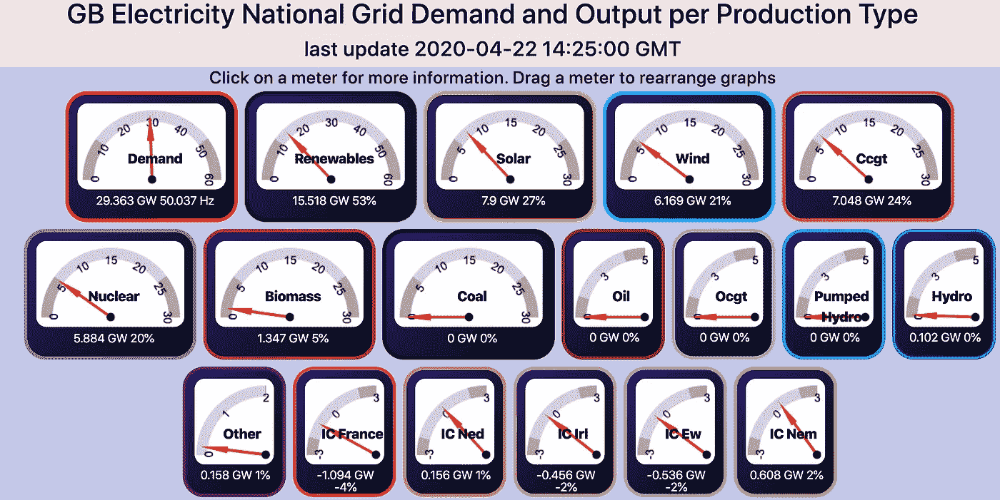

# 区块链技术如何减少我们对化石燃料的依赖

> 原文：<https://medium.datadriveninvestor.com/how-blockchain-technology-can-decrease-our-dependency-on-fossil-fuels-33972ac5d652?source=collection_archive---------18----------------------->

这个来自 Gridwatch 的网站实时展示了英国是如何发电的

·

很高兴看到可再生能源，即太阳能、风能和生物质能占英国能源生产的 50%以上

在澳洲 [PowerLedger](https://www.ledgerinsights.com/power-ledger-blockchain-energy-trading-perth-property-developer-nicheliving/) 正在使用区块链技术实现 P2P 共享

国际能源机构声称[28 亿](https://hackernoon.com/can-blockchain-bring-electricity-to-2-billion-people-off-the-grid-p7we30yd)电力不足，其中大部分可以由微型发电提供

根据 Navigant Research 的一份报告，利用太阳能和风能等当地可再生资源的微电网预计到 2028 年将在全球范围内达到每年超过 12 亿美元的年市场价值，该报告称微发电的复合年增长率预计为 67.8%。

安永预计，电力成本的数据管理可能很快就会超过电力本身的成本，并认为区块链技术可以帮助电力公司降低其中的许多成本

区块链供电的平台能够跟踪 P2P 能源，因此，取代向一个国家的国家电网出售电力，可以以更高的价格直接向用户出售电力。这导致支付安装太阳能或风能微型发电设施的时间减少，从而鼓励更多的人投资和使用更少的化石燃料

然而，随着可再生能源微型发电的增加，谁来支付维护和运营一个国家电力基础设施的费用？

 [## 5 个可以拯救环境的潜在区块链用例|数据驱动的投资者

### 区块链技术已经成为创新和颠覆的代名词。而医疗保健等几个行业…

www.datadriveninvestor.com](https://www.datadriveninvestor.com/2020/03/06/5-potential-blockchain-use-cases-that-can-save-the-environment/) 

关于数字字节的更多主题，区块链和数字资产发展的每周分析，你可以在这里订阅:http://eepurl.com/gTDiwP