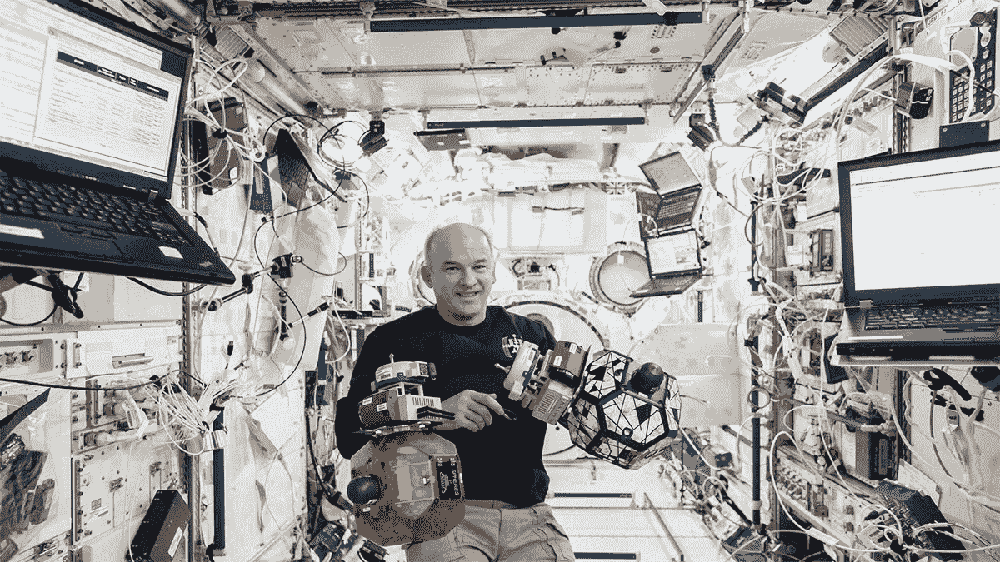
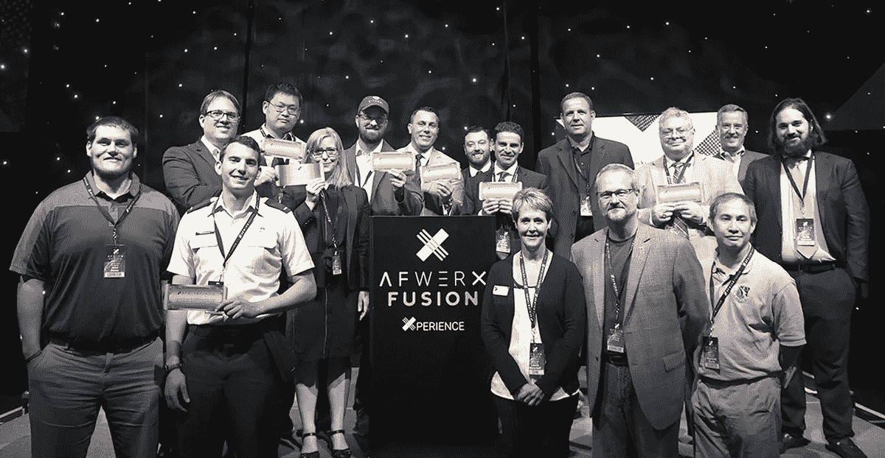

# 区块链技术如何确保太空中的数据安全

> 原文：<https://medium.datadriveninvestor.com/how-blockchain-technology-can-ensure-data-security-in-space-df480aa8f68e?source=collection_archive---------33----------------------->

你可能想过**保护智能设备**如汽车和家庭，但是你想过**用区块链技术保护空间**吗？互联技术的日益普及使飞机、机场、卫星和相互依存的航空航天生态系统面临新型风险。人们对此非常重视。

今年的 **DEFCON 安全模式**甚至将太空[安全](https://www.codemotion.com/magazine/dev-hub/security-manager/)提上了日程。美国空军和国防部国防数字服务主办了 2020 年太空安全挑战，这是一个虚拟研讨会和与确保太空系统安全有关的有奖挑战的混合，包括一场名为“ [Hack-A-Sa](https://www.hackasat.com/) t”的现场捕捉旗帜(CTF)式卫星黑客竞赛。然后，本月白宫发布了一项新的太空政策[太空政策指令(SPD) 5](https://www.whitehouse.gov/presidential-actions/memorandum-space-policy-directive-5-cybersecurity-principles-space-systems/) 。

该政策被安全专家认为是第一个与卫星和相关系统的网络安全有关的全面政府政策，概述了机构和公司防止空间系统遭受黑客攻击和其他网络威胁的最佳做法。

一家名为 **Xage** 的公司正在使用[区块链技术](https://www.codemotion.com/magazine/dev-hub/blockchain-dev/practical-business-cases-of-blockchain-based-solutions/)来**确保太空中的数据安全**。 [Xage Security](https://xage.com/) 为物联网开发了一个受区块链保护的安全平台，为通信、认证和信任创建了一个防篡改的“结构”,确保了大规模的安全性。

该平台支持任何对任何通信，保护对现有系统的基于用户和机器对机器的访问，即使在不规则连接的情况下也能在边缘工作，并且随着每台设备加入网络而变得越来越强大。他们的解决方案已经在包括能源、公用事业、运输和制造在内的一系列行业中得到应用。

我最近与首席执行官邓肯·格林伍德和基普·格林进行了交谈。Xage Security 高级业务发展总监了解更多信息。他们解释说，Xage 已经获得了第二阶段的空军奖励，以帮助保护美国太空司令部。该项目的核心是让太空部队为他们即将面临的挑战做好准备，这些挑战涉及**分布式安全**和不同系统之间的分布式协调。

Duncan 解释说，类似于[在各行各业出现的数字化转型](https://www.codemotion.com/magazine/dev-hub/blockchain-dev/blockchain-and-iot-in-industry-use-cases/)，太空部队正试图实现太空领域的感知，这包括整合卫星数据，试图获得太空和地面上正在发生的事情的完整图片。这包括**创建通用安全和数据框架**。然而，这确实带来了一些比实地挑战更为极端的具体挑战。正如邓肯详述的那样:

“你希望卫星合作，但哪些卫星可以相互通话是不断变化的，因为它们都在不同的轨道上，所以它们在任何给定的时刻都可能看到对方，也可能看不到对方。同样，与实地资产的合作可能随时发生变化。因此，每个卫星或子系统需要能够独立工作，但也需要能够成功地合作**聚合数据，以执行有效的分析**。

还有一个边缘处理的挑战。“因为你可以从卫星上获得大量数据，所以很难将所有这些数据传回地面。因此，边缘的智能处理是必要的。”

 [## 区块链投票和美国选举|数据驱动的投资者

### 在不到 70 天的时间里，这个世界上最古老的民主国家将以前所未有的方式面临最大的摊牌…

www.datadriveninvestor.com](https://www.datadriveninvestor.com/2020/08/26/blockchain-voting-and-the-american-elections/) 

# 区块链技术以及多方访问和混合使用资产的挑战

还有多方和**数据访问**的挑战。

“不再仅仅是空军想要数据，军方或政府的许多不同部门可能都想要查看数据，以及谁可以访问数据，这在大多数情况下都是一个复杂的问题。一些数据可能高度敏感；甚至你已经收集了数据的事实也可能是有争议的。因此，这种复杂的数据访问控制是我们要处理的一个典型的 Xage 问题。”

随着数据而来的是**共享**:“例如，一颗卫星可能能够处理一系列商业通信，但它也可能同时执行一些政府职能。”

传统上，卫星面临的挑战要么是确保它们不会受到攻击，要么是它们的内部网络被侵入，而数据共享带来了新的挑战，如在单个应用程序、单个传感器和相应处理单元的级别上的访问控制和数据安全。

# 介绍动态数据安全性

2017 年，Xage Security 推出了第一个也是唯一一个用于工业运营的受区块链保护的安全结构。从那时起，Xage 在其平台上开发了第一个防篡改系统和第一个适用于所有工业操作和设备的通用访问控制。

这种分层系统支持跨结构的多个同时更新，而不管位置或连接性如何，并且是世界上第一个受区块链保护的安全性。

今年早些时候，Xage 推出了[动态数据安全](https://www.globenewswire.com/news-release/2020/03/31/2009281/0/en/Xage-Introduces-New-Security-Offering-to-Protect-Data-Sharing-From-the-On-Site-Operation-to-the-Cloud-Across-Suppliers-Customers-and-Internal-Operations.html)。这一新产品增强了防篡改数据的安全性，支持在多个系统、多个位置和多方之间安全、动态地共享数据。DDS 系统还可以支持来自数据源的**数据哈希、签名和加密。**

此外，它还在 Xage Fabric 中存储安全元数据。使用该系统还意味着跨结构和所有其他可能使用数据的地方安全地复制数据。

在**数据欺骗**的时代，安全是至关重要的——在这个时代，一颗敌对的卫星可能试图模仿你自己的卫星。无论是从卫星到卫星，还是卫星到地面，Xage 都在零信任的基础上实时保证卫星数据的真实性和保密性。

空军已经变得越来越具有创新性，在 2017 年创建了 [AFWERX](https://www.afwerx.af.mil/index.html) ，这是一个促进创业公司、行业创新者、学术界和军方之间关系的项目，旨在创造变革性机会，并培养跨军事和空间技术的创新文化。

Kip 备注:

“从创新的角度来看，我认为他们启动该计划的原因是，根据他们的情报，从防御的角度来看，坏人实际上在创新，我认为这真的导致他们向前倾斜，暂停，然后创建该计划。他们有非常系统的架构来满足他们的任务需求。挑战的一部分不仅是你必须有一个异构生态系统的安全基础设施。但如果该系统出现故障，必须有一个冗余系统来接管任务需求。”

机会的一部分是创新本身的速度。正如基普所说，“他们认为 3-5 年内会有进步。这就是事物发展的速度。正如你不会在五年后像现在这样运营一个仓库一样，五年后，你也不会以同样的方式运营一个太空系统。”

邓肯总结道，Xage 的最终目标是将 Xage 级别的保护引入太空部队，“这是太空司令部的基本保护级别，通过它可以提高他们的作战能力，并降低我们面临的网络风险。如果我们能做到这一点，我们会非常高兴。”

# 想在区块链技术行业发展吗？

**区块链技术**被认为是今年最受欢迎的开发者领域之一。无论你是想从 T2 转移到区块链的开发者职业，还是想从 T4 提升你在区块链的开发者职业，机会都会不断变化。

邓肯指出，有许多有趣的公司正在解决各种各样的分布式系统问题。“它可能是 Xage 这样的网络安全，也可能更多地是关于分析或人工智能，或者更专注于数据组合和数据聚合。

这是寻找合适的工作公司的一部分，但也是愿意在非常敏捷的环境中用非常新的技术工作的一部分:“我认为这是愿意投入进去，只是尝试新的东西，看看你自己。”

关于区块链的技术资源，Duncan 对开发人员来说是一流的，并建议您下载 TensorFlow 并在 Azure 中玩分布式人工智能系统。

有很多书，他谈到了最近对一名未来员工的采访，指出:“对于一个从未专业实践过的人来说，他似乎对区块链和安全有着深刻的理解，我问他是否找到了一本好书或其他什么。他好笑地看着我，说，“你知道，我在 YouTube 上找到了一些很棒的视频。”

邓肯也承认，“我忍不住说**如果他们是伟大的开发者，那么他们当然应该联系 Xage！**

本文原载于 9 月 25 日的 [*Codemotion 杂志*](https://www.codemotion.com/magazine/dev-hub/blockchain-dev/blockchain-data-security/) *。*

## 访问专家视图— [订阅 DDI 英特尔](https://datadriveninvestor.com/ddi-intel)