# 阿里巴巴的最新数据库如何支持每秒 7 亿次请求？

> 原文：<https://medium.datadriveninvestor.com/how-can-alibabas-newest-databases-support-700-million-requests-a-second-8895aeb208fc?source=collection_archive---------8----------------------->

自 2019 年以来，阿里巴巴的 Lindorm 引擎已开始服务于阿里巴巴集团的几个核心业务部门，包括淘宝和天猫的电子商务平台，蚂蚁金服，[菜鸟](https://www.youtube.com/watch?spm=a2c41.14005934.0.0&v=bgHfEK34xYk)的物流网络，以及其他几个平台，包括[阿里妈妈](https://www.alizila.com/alimama/?spm=a2c41.14005934.0.0)，优酷， [Amap](https://www.scmp.com/tech/enterprises/article/2167114/alibabas-autonavi-blazes-trail-first-chinese-maps-service-cross-100?spm=a2c41.14005934.0.0) ，以及阿里巴巴媒体和娱乐部门，为这些系统带来了新的性能和可用性水平。事实上，在去年的[双 11](https://www.alibabacloud.com/blog/double-11-with-alibaba-cloud-%241b-gross-merchandise-volume-in-68-seconds-with-zero-downtime_595590?spm=a2c41.14005934.0.0) 购物节期间——中国的黑色星期五，轻松成为全球最大的在线购物活动——促销高峰时段的请求数量达到每秒 7.5 亿次，每天的请求吞吐量达到 22.9 万亿次。而且，平均响应时间不到 3 毫秒，总存储容量达到了数百 Pb。

这些令人兴奋的数字反映了阿里巴巴 HBase 和 Lindorm 团队一年来的努力、辛勤工作和奉献。 [Lindorm](https://www.alibabacloud.com/blog/how-alibaba-have-made-a-high-availability-solution-with-hbase_595529?spm=a2c41.14005934.0.0) 是阿里巴巴 HBase 和 Lindorm 团队面对阿里巴巴集团巨大的规模和成本压力，在 [HBase](https://hbase.apache.org/?spm=a2c41.14005934.0.0) 的基础上重构升级的全新产品。该团队利用其过去多年来在处理数百 Pb 数据、管理数亿次请求和处理数千家企业方面的经验和专业知识。就性能、功能和可用性而言，Lindorm 在许多方面代表了对 HBase 的重大改进和发展。

[](https://www.datadriveninvestor.com/2019/01/25/why-data-will-transform-investment-management/) [## 为什么数据将改变投资管理|数据驱动的投资者

### 有人称之为“新石油”虽然它与黑金没有什么相似之处，但它的不断商品化…

www.datadriveninvestor.com](https://www.datadriveninvestor.com/2019/01/25/why-data-will-transform-investment-management/) 

在本帖中，我们将讨论 Lindorm 的核心能力，特别关注 Lindorm 在性能、功能和可用性方面的优势。最后，我们将描述一些正在进行的涉及 Lindorm 的项目。

# Lindorm 的优化性能

与 HBase 相比，Lindorm 为远程过程调用、内存管理、缓存以及日志写入提供了全新级别的优化。同时也引入了很多新技术，通过阿里巴巴的几个业务系统，显著提高了读写速度。虽然使用相同的硬件，但 Lindorm 的吞吐量可以超过 HBase 的 500%以上，而 Lindorm 只遭受过去困扰 HBase 的 10%的故障。这个性能数据不是在实验室中生成的，但是它是通过 Yahoo Cloud Serving Benchmark(YCSB)显示的，并且没有对原始参数进行任何修改。我们在阿里云的帮助文档中发布了测试工具和场景，因此任何人都可以通过遵循我们的指南获得相同的结果。

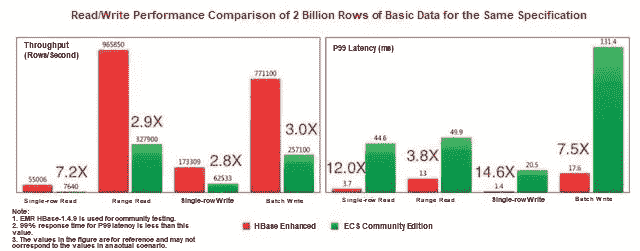

当然，我们所取得的成绩是由一些尖端技术支撑的，这些技术是由 Lindorm 多年来为其开发的。下面几节简要介绍了 Lindorm 内核中使用的一些技术。

# 特里指数

首先，Lindorm 文件 LDFile，类似于 HBase 中的 HFile，是在只读 B+树结构中创建的，其中文件索引是至关重要的数据结构。块缓存中的索引具有高优先级，需要尽可能驻留在内存中。因此，如果可以减少索引空间，块缓存中索引所需的内存空间也可以减少。而且，如果索引空间保持不变，您可以增加索引密度并减小数据块大小来提高性能。在 HBase 中，索引块包含所有行键，而许多行键在一个排序文件中具有相同的前缀。

trie 数据结构可以为具有相同前缀的行键仅保存一个前缀，这防止了通过重复存储操作造成浪费的可能性。然而，在传统的前缀树结构中，从一个节点到另一个节点的指针占用了过多的空间。你可以使用简洁的前缀树来解决这个问题。SuRF 可以说是 SIGMOD 2018 年最好的论文，提出了简洁的前缀树来代替 Bloom filter，并提供范围过滤功能。受到这篇论文的启发，我们的团队使用简洁的 Trie 来创建文件块索引。

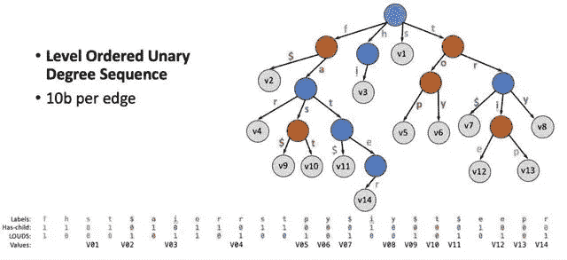

目前，我们在许多在线业务部门中使用由 Trie index 实现的索引结构。结果表明，Trie 索引可以大大降低各种场景下的索引大小，减少的空间需求高达海量的 1200%。节省的空间允许内存缓存中有更多的索引和数据文件，从而大大提高了请求性能。

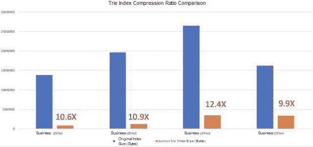

# Z 垃圾收集器

Z 垃圾收集器支持 100 GB 的 5 毫秒暂停。它由 JDK 龙井公司提供支持，是下一代无间断垃圾收集器算法。它使用 Mutator 通过读取内存障碍来识别指针变化，这样大多数标记和重定位操作可以并发执行，这是一个巨大的进步。

经过 Lindorm 团队和 AJDK 团队的多次改进和调整，Z 垃圾收集器已经在 Lindorm 场景中实现了生产级可用性。他们的主要成就包括:

*   使用 Lindorm 的内存自我管理技术来减少对象数量和内存分配窗口。
*   优化 AJDK Z 垃圾收集器页面缓存机制，特别是锁和页面缓存策略。
*   优化 AJDK Z 垃圾收集器触发时间，没有任何并发故障。

特别是，这最后一点是一个相当大的成就，因为它意味着 AJDK 的 Z 垃圾收集器已经在 Lindorm 上稳定运行了两个月，并轻松处理了双 11 购物活动的流量高峰。JVM 的暂停时间大约是 5 毫秒，从来不会超过 8 毫秒。z 垃圾收集器大大改善了在线操作中的响应时间和故障指数，平均响应时间减少了 15%到 20%，P999 响应时间减少了一半。此外，在去年的双 11 期间，通过 Z 垃圾收集器，蚂蚁风险控制集群中的 P999 响应时间从 12 毫秒减少到仅 5 毫秒，蚂蚁风险控制集群用于判断支付宝交易中涉及的风险。只需考虑下面的这个数字。

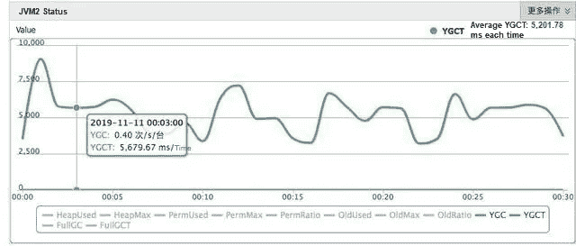

注意，对于这个图，使用的单位是微秒(us ),但是平均垃圾收集(GC)响应时间是 5 毫秒(ms)。

# LindormBlockingQueue

现在我们来讨论 LindrormBlockingQueue。但是，在我们讨论它之前，提供一些背景知识是很重要的。

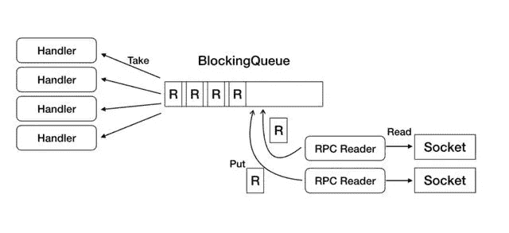

上图显示了 HBase 的 RegionServer 从网络中读取远程过程调用(RPC)请求并将其分发到各个处理程序的过程。HBase 中的 RPC 读取器从套接字读取 RPC 请求，并将它们放入 BlockingQueue 中。接下来，处理程序订阅 BlockingQueue 并执行请求。HBase 使用的 BlockingQueue 是 LinkedBlockingQueue，由 Java 的原生 JDK 提供。一般来说，LinkedBlockingQueue 通过锁和条件来保证线程安全和线程间的同步。但是，当吞吐量增加时，LinkedBlockingQueue 会导致严重的性能瓶颈。

为了解决这个问题，我们在 Lindorm 中设计了新的 LindormBlockingQueue 来维护插槽数组中的元素。它维护头指针和尾指针，并执行比较和交换(CAS)操作来读取和写入队列中的数据，这有助于消除不必要的区域。它还使用缓存行填充和脏读缓存进行加速，并且可以定制各种等待策略，包括旋转、产出和阻塞，以防止在队列为空或满时频繁进入暂停状态。所有这些都带来了明显的改进，LindormBlockingQueue 的性能比 LinkedBlockingQueue 高四倍以上。为了直观起见，请考虑下图。

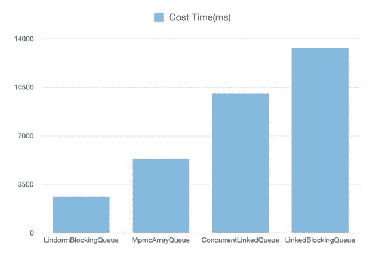

# 版本基础同步程序

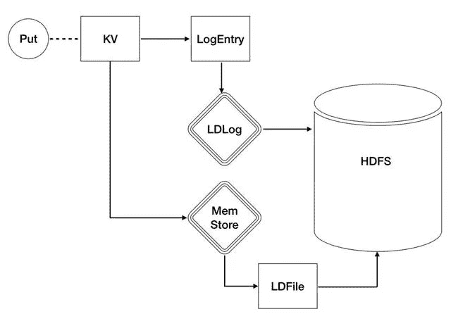

如上图所示，LDLog 是 Lindorm 中使用的一种日志，用于系统故障转移时的数据恢复，确保数据的原子性和可靠性。所有数据必须首先写入 Lindorm 日志，简称 LDLog。只有在 LDLog 写入成功后，才能执行写入 MemStore 等操作。因此，在预写日志(WAL)写入完成后，Lindorm 中的所有处理程序都会被唤醒，以进行下一个操作。在高压力下，无用的唤醒会导致大量的 CPU 上下文切换，从而降低性能。因此，Lindorm 团队开发了 VersionBasedSynchronizer，这是一种基于版本的并发多线程同步机制，可以显著改善上下文切换。

VersionBasedSynchronizer 允许通知程序感知处理程序的等待条件，以减少通知程序的唤醒压力。根据模块测试结果，我们的 VersionBasedSynchronizer 的效率是官方 java 开发工具包的 ObjectMonitor 和 java.util.concurrent (J.U.C)的两倍以上。

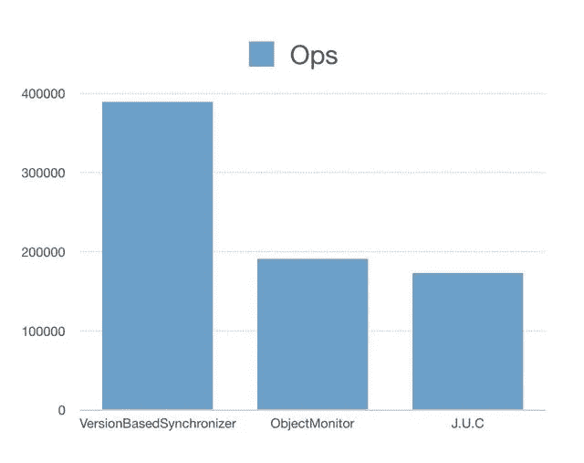

# 完全无锁

HBase 内核在关键路径上有大量锁，因此，在高并发场景中，这些锁会导致线程混乱和性能下降。Lindorm 内核使关键链接无锁，完全消除了多版本并发控制(MVCC)和预写日志(WAL)模块中的锁。此外，在 HBase 操作期间会记录各种指标，如每秒查询数、响应时间和操作的缓存命中率。记录这些指标的操作有大量的锁。为了解决度量性能问题，Lindorm 通过构建 TCMalloc 概念开发了 LindormThreadCacheCounter。

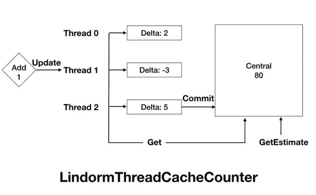

# 处理程序协程

在并发应用中，远程过程调用(RPC)请求涉及多个子模块和多个 I/O 操作。由于这些子模块之间的协作，系统中的上下文切换相当频繁。因此，有必要对高并发系统中的上下文切换进行优化。每个人都有自己的方式来做到这一点，这个行业充满了不同的想法和不同的现实实现。在这里，我们将重点关注协程和分阶段事件驱动架构(SEDA)解决方案。

出于对项目成本、可维护性和代码可读性的考虑，Lindorm 使用协程解决方案进行异步优化。我们使用由 Alibaba JVM 团队提供的 Dragonwell JDK 的内置 Wisp2.0 函数来实现 HBase 处理程序的协同例程。Wisp2.0 是一个简单易用的解决方案，可以有效降低系统资源消耗。客观地展示了优化结果。

# 新的编码算法

为了提高性能，HBase 通常需要将元信息加载到块缓存中。如果块很小，大量元信息无法完全加载到缓存中，从而导致性能下降。如果块很大，编码后块的顺序查询性能可能会成为随机读取的性能瓶颈。为了解决这个问题，Lindorm 开发了可索引 Delta 编码，它允许通过索引快速查询块，极大地提高了查找性能。下图显示了可索引增量编码的工作原理。

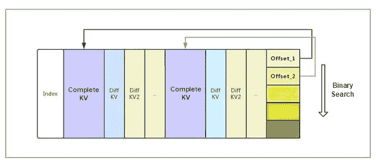

使用可索引 Delta 编码后，HFile 的随机查找性能提高了一倍。以一个 64 KB 的块为例，随机寻道性能和编码前差不多。请注意，当使用其他编码算法时，会出现性能损失。在缓存命中率为 100%的随机 Get 场景中，与 DIFF 编码响应时间相比，响应时间减少了 50%。

# 其他改进

今天的 Lindorm 的开发还包括其他一些性能优化和调整，以及许多新技术。鉴于本文篇幅有限，我们将只列出一些最重要的技术。

*   基于仲裁的写入可自动避免故障节点
*   高效的组提交
*   使用共享 BucketCache 的无碎片高性能缓存
*   MemStore BloomFilter
*   一种高效的读写数据结构
*   GC-不可见内存管理
*   分离的在线计算和离线作业架构
*   深入的 Java 开发套件和操作系统优化
*   FPGA 卸载压缩
*   用户模式 TCP 加速

# 方便开发的多种查询模型

本机 HBase 仅支持 KV 结构查询。这是一种简单的方法，但无法满足当今多种不同业务的复杂需求。因此，我们用 Lindorm 开发了基于不同业务单元特性的各种查询模型。Lindorm 的特定场景 API 和索引设计使得开发比过去更容易。

# 宽列模型(本机 HBase API)

宽列模型是与 HBase 一致的访问模型和数据结构。同样使用宽列模型，Lindorm 完全兼容 HBase API 调用。您可以使用 Lindorm 中高性能 native client 的宽列 API 来访问 Lindorm，或者使用 HBase 客户端和 API——不需要修改代码——通过 alihbase-connector 插件直接访问 Lindorm。Lindorm 还采用了轻量级的客户端设计，在服务器端实现了大量的逻辑操作，包括数据路由、批量分发、超时、重试等，并显著优化了网络传输层。这有助于减少应用程序的 CPU 消耗。与 HBase 相比，Lindorm 的 CPU 使用效率提高了 60%，带宽效率提高了 25%，如下表所示。


注意，表中的客户机 CPU 表示 HBase 或 Lindorm 客户机消耗的 CPU 资源。一般来说，CPU 占用率越小越好。

作为独家，我们还支持 HBase 原生 API 中的高性能二级索引。当使用 HBase native APIs 写数据时，索引数据被透明地写到索引表中。鉴于此，可以在索引表而不是所有表中执行查询，从而大大提高查询性能。

# 表服务模型(SQL 和辅助索引)

HBase 只支持 rowkey 索引模式，使得多字段查询效率低下。这意味着你需要维护多个表来满足不同场景下的查询需求，使得开发应用和保证数据一致性和写效率变得困难。HBase 只提供 KV API，只允许简单的 API 操作，比如 PUT、GET、SCAN，没有数据类型。因此，您需要手动转换和存储所有数据。习惯于 SQL 语言的开发人员不容易转换到 HBase，很可能会出错。

为了解决这个困难，我们在 Lindorm 中添加了 TableService 模型。该模型提供了广泛的数据类型和结构化查询表达式 API，并且本身支持 SQL 访问和全局二级索引。这解决了许多技术难题，并大大降低了普通用户的使用难度。通过使用 SQL 和 SQL like API 调用，您可以像使用关系数据库一样轻松地使用 Lindorm。以下是 Lindorm SQL 的一个简单示例:

```
-- 主表和索引 DDL
create table shop_item_relation (
    shop_id varchar,
    item_id varchar,
    status varchar
constraint primary key(shop_id, item_id)) ;
create index idx1 on shop_item_relation (item_id) include (ALL);   -- 对第二列主键建索引，冗余所有列
create index idx2 on shop_item_relation (shop_id, status) include (ALL);  -- 多列索引，冗余所有列
-- 写入数据，会同步更新 2 个索引
upsert into shop_item_relation values('shop1', 'item1',  'active');
upsert into shop_item_relation values('shop1', 'item2',  'invalid');
-- 根据 WHERE 子句自动选择合适的索引执行查询
select * from shop_item_relation where item_id = 'item2';  -- 命中 idx1
select * from shop_item_relation where shop_id = 'shop1' and status = 'invalid'; -- 命中 idx2
```

与关系数据库中的 SQL 相比，Lindorm 不支持多行事务和复杂分析，比如 Join 和 Groupby。这就是他们之间的区别。

而且，与 Phoenix 在 HBase 上提供的二级索引相比，Lindorm 的二级索引提供了更好的功能、性能和稳定性。下图显示了一个简单的性能比较。

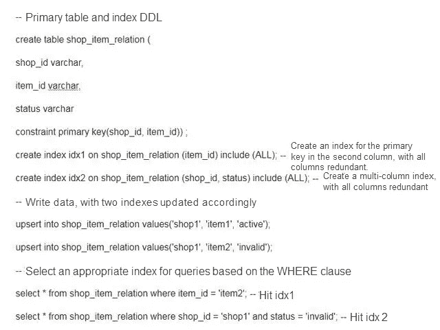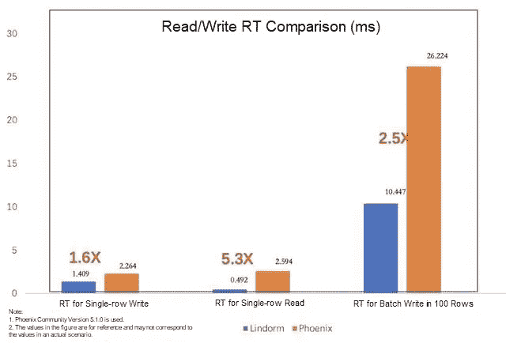

注意，这个模型已经在阿里云 HBase Enhanced (Lindorm)中测试过了。可以联系阿里云 HBase DingTalk 账号或者提交机票进行咨询。

# 进料流模型

在现代互联网体系结构中，消息队列在提高核心系统的性能和稳定性方面起着重要的作用。典型的应用场景包括系统解耦、削峰节流、日志收集、最终一致性保证以及分发和推送。

常见的消息队列工具包括 RabbitMQ、Kafka 和 RocketMQ。尽管这些数据库在架构、使用方法和整体性能上略有不同，但它们的基本应用场景是相似的。然而，传统的消息队列并不完美。在消息推送和订阅源流等场景中，它们存在以下问题:

*   存储:传统的消息队列不适合长期数据存储。通常，存储的数据会在几天后过期。
*   删除:传统的消息队列不支持删除指定的数据条目。
*   查询:传统的消息队列不支持复杂的查询和过滤条件。
*   一致性和性能的保证:Kafka 之类的数据库需要更高的吞吐量，因此数据可能会由于用于实现更高性能的方法而丢失。然而，具有更好事务处理能力的消息队列的吞吐量也是有限的。
*   快速分区扩展能力:通常，一个主题有固定数量的不支持快速扩展的分区。
*   物理和逻辑队列:通常，只支持少量的物理队列。例如，每个分区可以被视为一个队列。然而，业务需要模拟基于物理队列的逻辑队列。例如，如果在即时消息(IM)系统中为每个用户维护一个逻辑消息队列，用户必须执行大量额外的工作。

为了响应前面的需求，Lindorm 推出了 FeedStreamService 队列模型，该模型可以解决大量用户场景中的消息同步、设备通知和自动递增 ID 分配等问题。

今年，FeedStream 模型在淘宝移动的消息系统中扮演了重要角色，解决了消息推送过程中的顺序保持和幂等性等问题。去年双 11 期间，淘宝手机上的造楼活动和大红包赠送都使用了 Lindorm。淘宝移动在高峰时段推送的消息数超过每秒百万条，几分钟内将消息推送给所有用户。

注意，这个模型已经在阿里云 HBase Enhanced (Lindorm)中测试过了。可以联系阿里云 HBase DingTalk 账号或者提交机票进行咨询。

# 全文搜索模型

尽管 Lindorm 中的 TableService 模型提供了数据类型和辅助索引，但它仍然难以满足各种复杂条件查询和全文搜索的要求。SOLR 和 Elasticsearch 是优秀的全文搜索引擎。通过使用 Lindorm 和 SOLR 或 Elasticsearch，我们可以最大限度地发挥他们的优势，构建复杂的大数据存储和检索服务。Lindorm 有一个内置的外部索引同步组件，可以自动将写入 Lindorm 的数据同步到外部索引组件，比如 SOLR 或 Elasticsearch。这种模型适用于需要存储大量数据并需要使用各种查询条件组合和少量查询字段进行查询的企业。下面是三个例子。

*   在常见的物流业务场景中，需要存储大量的轨道物流信息，查询条件可以由多个字段随机组合。
*   在交通监控业务场景中，存储了大量的车辆通过记录，并且可以基于与车辆相关的信息的任意组合来检索感兴趣的记录。
*   在各种网站会员和产品信息检索场景中，存储了大量的产品或会员信息，可以支持网站用户使用少量条件进行复杂任意的查询。

全文搜索模式已在阿里云推出，支持 SOLR 和 Elasticsearch 等外部搜索引擎。目前，您需要在 Lindorm 之前直接查询 SOLR 或 Elasticsearch。稍后，我们将使用 TableService 语法对查询外部搜索引擎的过程进行打包，然后您将只需要与 Lindorm 进行交互来执行全文搜索。

# 正在进行的开发和更多即将推出的型号

除了以上这些模型，我们还会根据业务需求和困难，开发更多易用的模型。我们将很快提供时间序列和图形模型。

# 高可用性，零干扰，几秒钟内即可恢复

感谢客户的信任，Ali-HBase 在经历了无数困难后，已经从一个不起眼的原型发展成为一个强大的产品。经过九年的应用经验，阿里巴巴开发了很多高可用的技术，这些技术都应用到了 Lindorm 上。

# MTTR 优化

HBase 是基于 Google 发布的知名论文 BigTable 的开源实现。其核心特点是数据持久存储在 [Hadoop 分布式文件系统](https://hadoop.apache.org/docs/r1.2.1/hdfs_design.html?spm=a2c41.14005934.0.0) (HDFS)中。HDFS 维护多个数据副本，以确保高可靠性。HBase 不必担心多个副本和数据一致性，这有助于简化整个项目。但是，它也在服务中引入了单点故障(SPOF)。也就是说，当一个节点关闭时，只有在通过重放日志恢复内存状态并将数据重新分配到新节点并加载之后，才能恢复服务。

当群集很大时，从 HBase 的 SPOF 中恢复需要 10 到 20 分钟。大规模集群可能需要几个小时才能恢复。然而，在 Lindorm 内核中，我们做了一系列优化来减少平均修复时间(MTTR)。例如，我们在回切之前首先使该区域在线，并行重放故障，并减少生成的小文件数量。这些优化将回切速度提高了 1000%以上，接近 HBase 设计的原始理论值。

# 多重可调稠度

在最初的 HBase 架构中，每个区域只能在一个 RegionServer 上联机。如果一个 RegionServer 出现故障，相应的区域需要经过重新分配、按区域进行 WAL 分段、WAL 数据回放和其他步骤，然后才能恢复读写能力。这意味着恢复可能需要几分钟时间，这对要求高的企业来说是个问题。此外，虽然 HBase 中的主集群和辅助集群之间的数据是同步的，但您只能在出现故障时手动切换集群，主集群和辅助集群的数据只能实现最终一致性(EC)。然而，一些企业只接受强一致性(SC)，这对于 HBase 来说是无法实现的。

在 Lindorm 中实现了基于共享日志的一致性协议，通过分区的多副本机制支持故障时自动快速的服务恢复，完全适应存储和计算分离的架构。通过使用相同的系统，我们可以支持 SC 语义，并以牺牲一致性为代价获得更好的性能和可用性。这使我们能够提供多种功能，如多活动和高可用性。

Lindorm 架构提供了以下一致性级别，您可以根据自己的业务情况从中进行选择。但是请注意，这个功能目前在 Lindorm 上不可用。

# 客户端的高可用性交换解决方案

尽管 HBase 是一种主从架构，但目前市场上还没有针对客户端的高效交换解决方案。HBase 客户端只能访问特定地址的 HBase 集群。如果主群集出现故障，您需要停止 HBase 客户端，修改 HBase 配置，然后重新启动客户端以连接到辅助群集。作为替代，您需要在业务端设计复杂的访问逻辑来访问主集群和辅助集群。Ali-HBase 修改了 HBase 客户端，以便在客户端内部进行流量交换。切换命令通过高可用性通道发送到客户端，然后客户端关闭旧链路，打开到辅助群集的链路，并重新发送请求。

# 原生云，但成本更低

在 Lindorm 的设计过程中考虑了向云的迁移。为了尽可能重用云基础设施，进行了各种优化。例如，除了磁盘，我们还支持在阿里云[对象存储服务](https://www.alibabacloud.com/product/oss?spm=a2c41.14005934.0.0) (OSS)等低成本存储服务中进行数据存储，以降低成本。我们还对我们的[弹性计算服务](https://www.alibabacloud.com/product/ecs?spm=a2c41.14005934.0.0) (ECS)部署进行了一些优化，以适应小内存模型并增强部署灵活性。这使我们能够实现云原生解决方案并降低总体成本。

# ECS 和磁盘的极限弹性

目前，Lindorm 是通过使用 ECS 实例和云盘部署的——尽管有些客户选择使用本地磁盘。这给了 Lindorm 极大的弹性。

当初阿里巴巴集团在物理机上部署 HBase。在开展每项业务之前，我们必须规划机器数量和磁盘大小。使用物理机部署 HBase 时，您可能会遇到以下问题:

*   难以满足弹性要求:当业务流量激增或出现异常请求时，可能很难在短时间内找到新的物理机来调整大小。
*   存储和计算集成导致的灵活性差:物理机上的 CPU 资源和磁盘资源的比例是固定的，但是每个关联业务的特性是不同的。在同一台物理机上，一些企业可能计算资源不足但存储空间过剩，而一些企业可能计算资源过剩但存储空间不足。特别是在 HBase 推出混合存储之后，很难确定硬盘驱动器(HDD)与固态驱动器(SSD)的比例。一些高要求的企业可能会用完他们的固态硬盘，但有可用的硬盘，而一些有大量数据的离线企业由于成本高而无法使用固态硬盘。
*   运营和维护方面的问题(O&M):使用物理机时，O&M 的工作人员必须经常检查物理机是否在保修期内，以及是否需要修复硬件故障，如磁盘损坏和网络接口控制器(NIC)损坏。物理机器维修需要停机并且耗时，这给 O&M 的工作人员带来了很大的压力。对于海量存储的 HBase 来说，每天都有几个磁盘损坏是正常的。这些问题可以通过在 ECS 和云盘上部署 Lindorm 来解决。

使用阿里云 ECS 服务器迁移到云解决了其中的许多问题。阿里云 ECS 提供了一个几乎无限的资源池。要快速调整业务规模，您只需在资源池中申请一个新的 ECS 实例，启动它，并将其添加到集群中。整个过程只需要几分钟，这可以帮助您的企业和其他企业应对高峰时段的流量高峰。通过使用将存储和计算相互分离的架构，我们还可以灵活地为不同的业务分配不同的磁盘空间。空间不足的时候，我们可以直接在网上扩大规模。此外，O&M 人员不再需要担心硬件故障。当 ECS 实例出现故障时，它可以在另一台主机上启动，而云盘完全保护上层免受损坏的物理磁盘的影响。极大的弹性也提高了成本效率。我们不需要为业务预留太多的额外资源。此外，我们可以在商业促销结束后迅速缩减规模以降低成本。

# 冷热数据的分离

在海量大数据场景下，一个表中的一些业务数据只作为存档数据使用或者很少被访问，而历史数据，包括订单数据或者监控数据的量非常大。降低这些数据的存储成本实际上可以大大降低企业的总体开支。Lindorm 的冷热分离功能就是专门为此开发的。Lindorm 为冷数据提供了新的存储介质。新存储介质的存储成本仅为超磁盘存储成本的三分之一。

Lindorm 将同一个表中的冷数据和热数据分开后，系统会根据用户自定义的冷数据和热数据的分界线，自动将表中的冷数据归档到冷存储中。用户访问模式与普通表几乎相同。在查询过程中，您只需要按提示或时间范围配置查询，然后系统会根据条件自动确定查询应该在热数据区还是冷数据区。这个过程对用户几乎是完全透明的。

# ZSTD-V2 将压缩比提高了 100%

两年前，我们在阿里巴巴集团把存储压缩算法换成了 ZSTD。与最初的 SNAPPY 算法相比，ZSTD 将压缩率增加了 25%。2019 年，我们开发了新算法 ZSTD-v2。通过这种新算法，我们可以使用预采样数据来训练字典，然后使用字典来加速小块数据的压缩。在 Lindorm 中构建 LDFile 时，我们使用这个特性对数据进行采样，构建一个字典，然后压缩数据。在不同业务的数据测试中，我们实现了比原生 ZSTD 算法高 100%的压缩率，表明我们可以将客户存储成本再降低 50%。

# 为什么 HBase Serverless 是初学者的首选

阿里云 HBase Serverless 是利用基于 Lindorm 内核的无服务器架构构建的一套新的 HBase 服务。阿里云 HBase Serverless 把 HBase 变成了服务。您不需要预先规划资源、选择 CPU 资源和内存资源的数量或购买集群。在业务增长的高峰时段，企业不需要复杂的 O&M 操作(如调整大小),在非高峰时段也不会浪费闲置资源。

您可以根据您的业务量购买所有存储资源。鉴于 HBase Serverless 的高弹性和可伸缩性，您在使用它时可能会有一种使用无限资源的 HBase 集群的感觉。这些看似无限的资源可以为您的业务流量的任何突然变化做好准备。此外，鉴于阿里巴巴灵活的支付系统，你只需要为你实际使用的资源付费。

# 面向主要客户的安全性和多租户功能

Lindorm 引擎内置用户名和密码系统，提供多级权限控制，对每个请求进行认证，防止未经授权的数据访问，确保数据访问安全。此外，Lindorm 提供多租户隔离功能，如组和配额控制，以满足主要企业客户的需求。该功能确保同一个 HBase 集群中的业务安全高效地共享大数据平台，互不影响。

# 用户和 ACL 系统

Lindorm 内核提供了一个简单的用户认证和访问控制列表(ACL)系统。您只需在用户身份验证配置中输入用户名和密码。用户密码以密文形式存储在服务器上，并在身份验证过程中以密文形式传输。即使密文在认证过程中被截获，用于认证的通信内容也不能被重用或伪造。

Lindorm 有三个权限级别:全局、命名空间和表，它们是相互包含的。例如，如果 user1 被授予全局读写权限，那么 user1 可以读写所有名称空间中的所有表。如果 user2 被授予了命名空间 1 的读写权限，那么 user2 可以读写命名空间 1 中的所有表。

# 群体隔离

当多个用户或企业使用同一个 HBase 集群时，他们可能会争夺资源。在这种情况下，线下业务的批量读写操作可能会影响线上一些重要业务的读写操作。Lindorm 提供了 Group 函数来解决多租户隔离问题。

区域服务器被分成不同的组，每个组托管不同的表。这允许他们隔离资源。

例如，假设我们已经创建了 Group1，将 RegionServer1 和 RegionServer2 移动到 Group1，创建了 Group2，并将 RegionServer3 和 RegionServer4 移动到 Group2。此外，我们将表 1 和表 2 移到了组 1。这样，表 1 和表 2 的所有区域只分配给组 1 中的 RegionServer1 和 RegionServer2。

类似地，Group2 中的 Table3 和 Table4 的区域在平衡过程中只分配给 RegionServer3 和 RegionServer4。因此，当您请求这些表时，发送到 Table1 和 Table2 的请求仅由 RegionServer1 和 RegionServer2 提供服务，而发送到 Table3 和 Table4 的请求仅由 RegionServer3 和 RegionServer4 提供服务。通过这种方法，可以实现资源隔离。

# 配额限制

Lindorm 内核有一个完整的配额系统来限制每个用户使用的资源。Lindorm 内核根据消耗的资源精确地计算每个请求消耗的容量单元(Cu)的数量。例如，由于过滤器特性，只为您的扫描请求返回少量数据，但是 RegionServer 可能已经消耗了大量的 CPU 和 I/O 资源来过滤数据。所有消耗的资源都被计算为消耗的 Cu。当使用 Lindorm 作为大数据平台时，企业管理员可以将不同的用户分配给不同的业务，并限制一个用户每秒读取的 Cu 的最大数量或配额系统中的 Cu 总数。这样可以防止用户占用过多资源，影响其他用户。配额限制还支持命名空间和表级别的限制。

# 结论

Lindorm 作为下一代 NoSQL 数据库，是 Alibaba HBase 和 Lindorm 团队在过去九年中产生的技术的产物。Lindorm 可以为海量数据场景提供全球领先的高性能、跨域、多一致性、多模式的混合存储处理能力。它旨在满足大数据的无限扩展和高吞吐量、在线服务的低延迟和高可用性以及多功能查询需求，并为您提供实时混合数据访问能力。这包括无缝扩展、高吞吐量、连续可用性、毫秒级稳定响应、强弱一致性、低存储成本和丰富的索引。

Lindorm 是阿里巴巴大数据体系中的核心产品之一，支撑着阿里巴巴集团各个业务部门的数千个业务。也经受住了双 11 购物节多年的考验。前阿里巴巴 CTO 星点表示，阿里巴巴的技术应该由阿里云输出，让所有行业的数百万客户受益。为了实现这一姿态，Lindorm 已经以“HBase Enhanced”的形式在 Apsara Stack 和阿里云上提供给客户，允许云中的客户享受阿里巴巴技术的好处。

# 原始来源:

[](https://www.alibabacloud.com/blog/how-can-alibabas-newest-databases-support-700-million-requests-a-second_595828?spm=a2c41.14005934.0.0) [## 阿里巴巴的最新数据库如何支持每秒 7 亿次请求？

### 阿里巴巴云 2020 年 2 月 14 日 753 由杨文龙，在阿里巴巴昵称为阎正。

www.alibabacloud.com](https://www.alibabacloud.com/blog/how-can-alibabas-newest-databases-support-700-million-requests-a-second_595828?spm=a2c41.14005934.0.0)