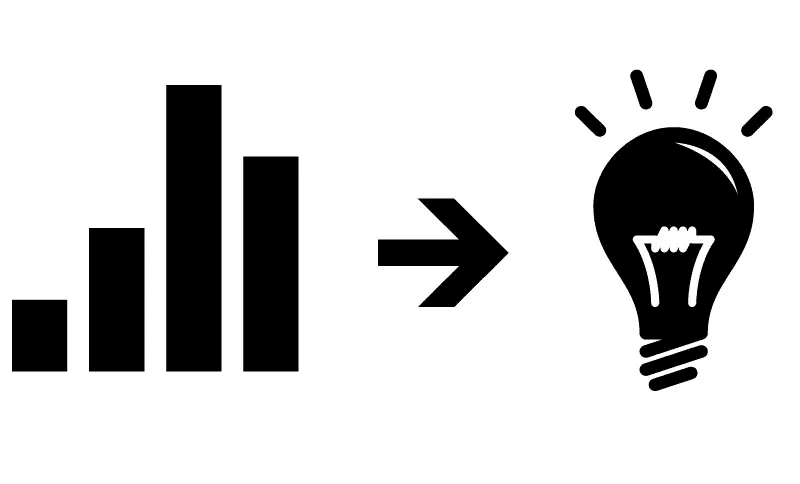

# 公司如何从数据中获取最大价值

> 原文：<https://medium.datadriveninvestor.com/how-can-companies-get-the-most-out-of-their-data-c33ad23d374?source=collection_archive---------6----------------------->

image source: [https://lws-abt5wcf.netdna-ssl.com/blogs/wp-content/uploads/2018/06/why-it-is-better-to-invest-in-data-processing.jpg](https://lws-abt5wcf.netdna-ssl.com/blogs/wp-content/uploads/2018/06/why-it-is-better-to-invest-in-data-processing.jpg)

在过去十年的大部分时间里，我一直在帮助美国和英国的组织使用数据来提高利润、效率和绩效，我认为记录下最佳实践对那些希望从企业级财务和运营数据集获得最大价值的组织会有所帮助。

 [## 成为数据科学家所需的 8 项技能|数据驱动型投资者

### 数字吓不倒你？没有什么比一张漂亮的 excel 表更令人满意的了？你会说几种语言…

www.datadriveninvestor.com](https://www.datadriveninvestor.com/2019/02/07/8-skills-you-need-to-become-a-data-scientist/) 

每一个进入 20 年代的组织都知道，他们必须将数据作为一种战略差异来获得竞争优势，本文列出了所有公司为实现这一目标必须做的五件事。

# **在我开始之前，再介绍一下我自己:**

在过去 8 年多的时间里，我有幸作为数据顾问帮助过的组织跨越了多个行业，例如:零售、金融服务、法律、制药、酒店、食品和饮料以及专业服务公司。

我有机会实施的技术技能和工具的深度跨越了端到端数据价值链，即:

1.  数据获取、摄取和集成(Informatica、Talend、AWS Redshift、S3、PostgreSQL、Hive、Hadoop 等。),
2.  数据可视化工具(Tableau、Qlik、PowerBI 等。),
3.  领先的 EPM 工具(Hyperion、Anaplan 等。)和
4.  新兴的数据驱动的 SaaS 平台，如 Quorso。

话不多说，下面是我的最佳实践，告诉你所有垂直行业的**组织如何最大化其财务和运营数据集的价值。**

# 1.**整顿。**

*整个企业的通用数据层次结构。*

image source: [https://www.onetag.com/uncategorized/](https://www.onetag.com/uncategorized/)

数据和见解不再是高高在上的樱桃。它们是所有成功组织的基础。

构建一个通用的数据层次结构需要做两件事:

1.开发一个公共的数据结构，所有的企业数据都应该驻留在这个结构中。

2.开发数据管道，不断从所有相关数据源获取数据，并将其转换为通用数据结构。

例如，如果位置 A 中的鳄梨被存储为“AVC ”,而位置 B 中的鳄梨被存储为“AV ”,则上面列出的点 1 和 2 的最终结果将是显示以下内容的层次结构:

食品>植物性>鳄梨>价格、数量和销售。

拥有一个连续的数据管道，每天、每周或每月将数据组织成这种格式，将允许任何人从数据集生成并采取行动，而不必在每次需要向数据集提问时进行任何定制的数据争论。

# **2。洞察力>图表。**

*专注于创造洞察力，而不是花哨的图表和视觉效果。*

image source: [https://thenounproject.com/term/light-bulb/122/](https://thenounproject.com/term/light-bulb/122/)

商业智能、企业绩效管理和其他报告套件通过可视化和仪表板提供了洞察力，但仅此而已。

与使用复杂的查询在大量数据集中手动查找相比，可视化数据是一个很好的进步，但是仪表板和视觉效果还不够。

与其关注如何最好地可视化一个趋势，公司应该关注如何最好地利用他们的数据集产生相关的见解。视觉效果可能有助于不时产生洞察力，但目标应该是产生洞察力，而不是到处都是花哨的图表。

例如，使用折线图和时间序列来可视化 100 家杂货店的鳄梨销售，将向我们展示鳄梨是如何上升或下降的。这是一个不错的信息，但它并没有真正告诉我们任何有见地的东西。覆盖去年同期的数据集是另一个不错的信息，但缺乏任何深刻的见解。

相反，将可比较的杂货店聚集在一起，然后根据可比较的同类商店的平均销售额来分析鳄梨的销售额，这要有见地得多。

这是一种洞察力，而不仅仅是一张图表。

它显示了一个潜在的问题，我们知道这个问题必须有一个解决方案或者一个有效的解释。

也就是说，如果其他可比较的杂货店能够保持一定水平的鳄梨销售，那么通过向表现高于平均水平的商店学习，表现不佳的商店也可以保持一定水平的鳄梨销售。

例如，如果 10 家同类商店中有 3 家通过当地活动推动鳄梨销售，那么其他 7 家也应该采取同样的活动。

另一方面，如果存在商店无法控制的因素(鳄梨农场的自然灾害)，应注意这些因素，以确保组织捕捉到这些解释。

# **3。追踪行动。**

*跟踪对每个洞察(好的和坏的)采取的每个行动。*

image source: [https://seconci-pr.com.br/entenda-o-que-e-o-perfil-profissiografico-previdenciario-ppp-29-p](https://seconci-pr.com.br/entenda-o-que-e-o-perfil-profissiografico-previdenciario-ppp-29-p)

每次对每个洞察采取操作措施时，都应该进行跟踪。

这是 BI 和报告工具开始不足的地方。

没有一个 BI 工具具有强大的回写功能，允许运营用户跟踪他们正在采取的操作以及他们的操作如何影响数据。

例如，仅仅有一个显示鳄梨销售趋势线的精美图表，并不能让我们看到自从我们开始本地活动以来，销售是如何上升或下降的。间接来说，我们可以在标准化图表上进行一些手动分析，以找到这些信息，但一个花哨的前端本身不足以跟踪一线根据数据产生的见解所采取的 1000 项运营行动。

企业级沟通工具(Slack、团队、电子邮件等。)允许用户间接分享行动，但这些行动并不与洞察来源的数据相关联。即使像微软这样的企业巨头也只是在通信工具中嵌入了仪表板，但后端并没有链接，跟踪操作仍然是一项非常特别的工作。

# **4。衡量每个行动的影响。**

*每个行动如何影响 EBIT 和您的战略关键绩效指标(KPI)。*

image source: [https://www.pinterest.com/pin/699746860830404987/](https://www.pinterest.com/pin/699746860830404987/)

简单地衡量某个日期前后的绩效是不够的，在该日期之前或之后，启动了一项计划或活动来增加销售额、降低成本或优化劳动力。

跟踪行动如何影响 EBIT(利润)、运营指标和战略 K.P.I.s，使我们能够真正利用洞察力来提高业务绩效。

例如，很容易间接观察基本趋势线，以了解推动鳄梨销售的活动是增加还是减少了销售。然而，这并不是衡量成功最有用的方式。

更难也更有价值的是跟踪可比杂货店之间的差距，以真正了解活动是否奏效，以及跟踪该活动如何影响组织的 KPI 和运营指标。也就是说，鳄梨的销量在上升，但摆放位置不当的展示或标志会导致收银台等待时间延长，从而降低客户满意度，这与销售数字一样重要。

# **5。分享相关的同行行动。**

*在整个企业中推广成功的行动。*

image source: [https://conceptboard.com/wp-content/uploads/effective-virtual-team-collaboration.png](https://conceptboard.com/wp-content/uploads/effective-virtual-team-collaboration.png)

解决运营问题是一项人类活动。有很多技术可以增强良好的决策，但这将永远是一项以人类智慧为核心的工作。

人们仍然经常在孤岛中解决问题，尤其是在大型多站点分布式企业中。当大型多站点企业以特许经营模式运营时，这个问题变得更加明显。

例如，如果简·多伊在主街上经营杂货店 X，并且由于适时的促销、整合鳄梨供应商支出以及培训她的直接下属如何追加销售鳄梨，在*食品>植物类鳄梨>方面一直表现不佳——这个伟大但玛丽·多伊在街上 1 英里处经营着一家由不同特许经营商经营的非常相似的杂货店，可能永远无法向超级明星简·多伊学习。*

这一点很重要，因为不在整个组织中推广最成功的行动会限制组织的全部财务和运营潜力。

# **组织如何完成步骤 1-5。**

从我的经验来看，有很多工具可以帮助任何组织完成上面列出的每一个步骤。

然而，在我的职业生涯中，到目前为止，只有一个工具可以帮助组织在一个工具——**Quorso 中完成上述五点。**

Quorso 由麦肯锡公司的前合伙人创立，他们意识到大约有 2000 万到 3000 万人控制着全球经济的 60%到 70%,特别是在利润方面。这 2000 万到 3000 万人是每天、每周、每月、每季度等做出决策的人。这将直接影响他们组织的损益。随着越来越多的人进入劳动力市场，这将影响的人数和全球经济的百分比只会上升。

在 **Quorso，**我们建立了世界上第一个智能平台，允许任何类型的组织提出相关见解，跟踪每个相关见解的行动，衡量每个行动的 EBIT、KPI 和 Op 指标绩效，并在行动成功时在整个组织内分享最佳实践。

自从推出我们的产品以来，与我们的创意相似的行业有**零售、运输&物流、酒店和食品&饮料。**

我作为他们的第一个数据工程师加入了 Quorso，我们的数据采集和摄取引擎能够处理任何类型的数据源。然后，我们创建一个通用的数据层次结构，并基于适当的时序节奏将数据持续加载到平台中。

我们展示相关机会的方式是使用类似于网飞、Spotify 或 iTunes 的推荐算法，以确保这些机会与用户的先前经验、他们控制的 P&L 地区、战略性公司计划等相关。

我们只展示可控的机会——这就是营销专家所说的“可操作的洞察力”。

Quorso 中的每一个行动都会被跟踪，该应用程序足够智能，可以将相关的同行行动分享给合适的人，以确保问题不会在孤岛中得到解决，因此，**使用 Quorso 的组织可以充分发挥其财务和运营潜力。**

*要了解更多关于 Quorso 的信息，请随时联系 fahad.zaidi@quorso.com*