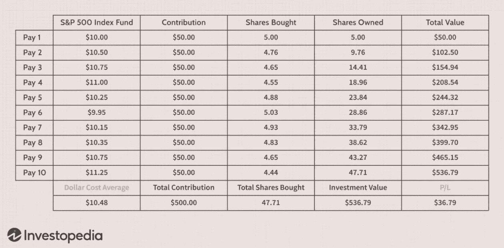
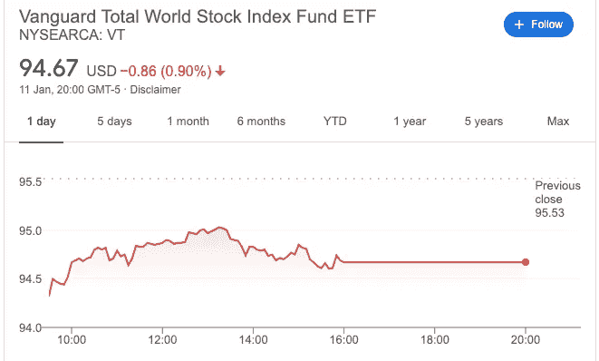
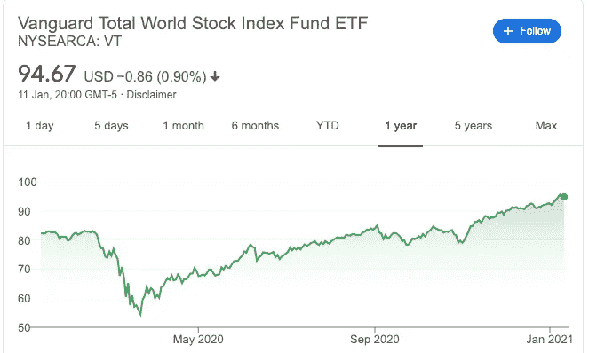
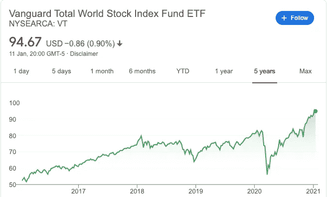
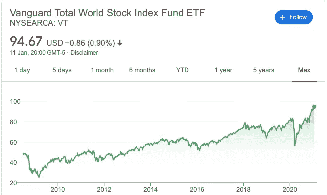

# 在动荡的货币市场中，平均成本如何帮助你积累财富

> 原文：<https://medium.datadriveninvestor.com/how-can-dollar-cost-averaging-help-you-build-wealth-in-volatile-money-market-ff9299408a42?source=collection_archive---------21----------------------->

## 谈到投资，大多数人都有一个误解，认为投资有风险，因为市场波动太大。他们不知道什么时候是买入的最佳时机，什么时候是卖出的最佳时机。在现实中，投资远非交易，使用美元成本平均法可以大大降低风险。这是它的工作原理。

Photo by [Bianca Ackermann](https://unsplash.com/@biancablah?utm_source=unsplash&utm_medium=referral&utm_content=creditCopyText) on [Unsplash](https://unsplash.com/s/photos/slices?utm_source=unsplash&utm_medium=referral&utm_content=creditCopyText)

# 交易与投资

当你谈论投资时，很多人可能会把它和交易联系在一起。有些人可能开始投资资金到市场，但他们这样做就好像他们在交易股票，而不是投资股票。交易和投资的区别如下:

**交易:**

据 Nerdwallet.com 的[称，股票交易包括频繁地买卖股票**，企图**为市场**计时。所以股票交易者的目标是利用短期市场事件卖出股票获利或低价买入。交易者在一天内多次买卖股票。它不仅仅局限于交易者，个人投资者也可以交易股票。但正如你可能想象的那样，你需要很好地了解这个市场，并为此投入大量时间。与全职专业交易者相比，普通投资者远远达不到这个水平。**](https://www.nerdwallet.com/article/investing/stock-market-basics-everything-beginner-investors-know)

也许这就是为什么当人们开始投资时，他们表现得像交易者一样，频繁地买卖，并试图把握市场时机。但是他们应该做的是投资，而不是贸易。

如果你尝试过交易，大部分时间是赚钱还是亏钱？你需要花费大量的时间和精力阅读新闻和研究市场吗？

如果你还没有开始，那些原因阻止你投资吗？当你明白什么是投资的时候，也许你会改变你的想法。

**投资:**

根据剑桥词典，投资意味着购买你认为会升值的东西，例如，股票或房产，以获取利润。投资就像你把钱给一家公司或一项资产，并希望这项资产会随着时间的推移而升值，然后当你卖掉它时，你就获利了。主要的区别在于，交易通过试图把握市场时机来关注短期收益，而投资则关注长期收益。这是一个普通投资者可以做到的，识别你认为会升值的资产，投资它们，一段时间后获利。

当你交易时，你试图利用当天的波动，当你投资时，你试图利用指数中的公司随着时间的推移而升值。对于一个一般投资者来说，哪个更实用？当然是后者。当你投资公司股票时，这些公司是在为你工作，他们有资源发展业务并获取利润。作为投资者，你从他们的成长中获益。或者你投资了一个房地产项目，随着时间的推移，这个项目的价值会随着市场或经济的发展而增加，然后你可以卖掉它来获利。

听起来很简单，对吧？但是，你怎么知道什么时候是买入的最佳时机呢？什么时候是出售的合适时机？嗯，在大多数你不知道的情况下，这就是为什么你需要使用平均成本。

# 什么是平均成本

美元成本平均法(DCA)是一种投资策略，它不是在一个时间点大量购买资产(股票)，而是在目标资产上频繁投资相同数量的资金。你可以每周、每月或每两个月做一次。这样做，你就减少了波动的影响。当价格下跌时，你买入更多的股票，当价格上涨时，你买入更少的股票。但是当价格上涨时，你会获得更多，因为你现在以更高的价格拥有更多的股票。让我们看看它的实际效果。

假设你已经确定了一项你想投资的资产。通过使用平均成本法，你每月投资 100 美元。

source: own computation

在第 4 个月，当股价下跌时，你买了更多的股票，4 股而不是 2 股。在第二个月，当股价上涨时，你买的股票减少了，2。在第 6 个月，股价再次上涨，但由于几个月的低价，你现在有了更多的股票，你的总资产价值是 802.78 美元，尽管你只投资了 600 美元。

当你将这种方法应用于更长的时间范围时，如果资产价值在长期内增加，尽管有短期波动，你的总资产价值将大于你的初始投资。

这样，你可以通过在较长时间内以相同的频率缓慢买入来消除单一市场进入风险。你不应该担心短期波动，而应该着眼于长期。

现在让我们来看一个历史 S&P500 指数基金的真实例子。尽管如此，如果你每期投资 100 美元，比如说每月。您将拥有下表:

Image by Sabrina Jiang © Investopedia 2020

总投资为 500 美元，总投资价值为 536.79 美元。变现(如果你卖的话)是 36.79 美元。

# **一天内的波动性与 1 年、5 年和 22 年内的波动性**

让我们来看看 vanguard 的全球 ETF，这个 ETF 包括 6000 多只公司股票，并且非常分散。它代表了市场运动。

一天之内，图表看起来是这样的:忽上忽下，没有明显的趋势。

一年后，看起来是这样的:

在 5 年内，它看起来像这样:你可以看到这条线的趋势是上升的，尽管这些年来有些下降。

自 2008 年以来的所有时间里，这条线看起来更加平滑了。

通过使用平均成本法，只要资产具有长期增长潜力，你就可以增加投资并降低市场风险。

# **结论**

通过使用平均成本，你不仅可以降低市场波动风险，还可以随着时间的推移增加你的投资。市场上有许多 Rob-advisors 或 auto-invest 服务，如 [**Trading 212**](http://www.trading212.com/invite/FMXbdHfC) **，**您只需设置一次投资组合，并确定投资金额和投资频率，程序就会自动帮助您购买资产。你基本上不需要看也不需要做别的。再过 10 年、20 年，你的投资组合价值会大得多。

这篇文章是为了帮助你理解平均成本是如何工作的，你应该自己做调查和研究，以决定你想投资什么和如何投资。

同样的话题，我强烈推荐 [**<《傻瓜投资指南》>**](https://amzn.to/35AfPWN) 。这本书清楚地解释了什么是投资以及你应该如何投资。必读！

您可能喜欢的相关文章:

[<打造长期财富的三个简单投资组合>](https://www.fasttrack.life/blog/three-simple-portfolios-for-building-long-term-wealth)

[<如何建立投资组合>](https://www.fasttrack.life/blog/how-to-build-an-investment-portfolio)

— — —

我是一个热心的学习者和积极的倾听者。我对营销、技术、个人理财、生产力和企业家精神充满热情。关注我的帐户接收每周文章。

🎧**听听我关于职业、金钱和创业的播客:**[**https://www.fasttrack.life/**](https://www.fasttrack.life/)