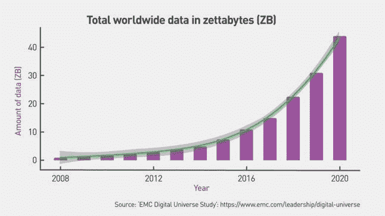
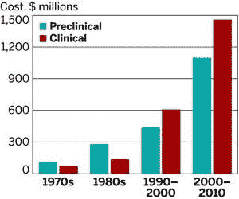
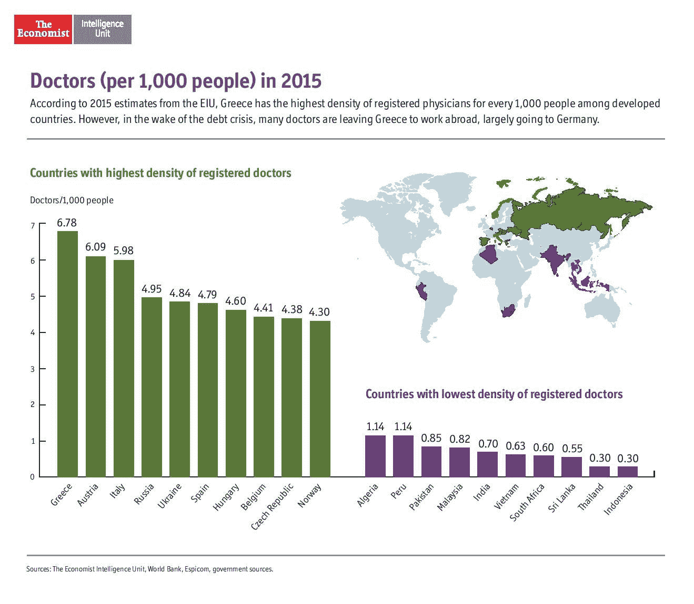
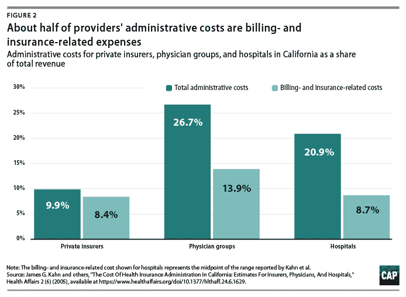

# 健康创业公司如何最好地利用数据赚钱？

> 原文：<https://medium.datadriveninvestor.com/how-can-health-startups-best-monetize-data-874c87026bdd?source=collection_archive---------7----------------------->

Credit: MIT Sloan Management Review

数据爆炸是实实在在的，我们不仅产生了比以往更多的数据，还以更快的速度产生数据。下图是总体数据，但也代表健康状况。

这次爆炸对我们这些病人有着深远的影响；当谈到健康创业时，它需要时间和经过测试的商业模式才能真正成功。这篇文章提供了一个框架——像任何框架一样，它不是详尽的，而是如何构建世界的总体指导方针。

 [## 大笔资金和尖端技术:人工智能/人工智能投资将如何革新医疗保健…

### 在过去几年人工智能(AI)和机器学习(ML)的显著发展中…

www.datadriveninvestor.com](https://www.datadriveninvestor.com/2018/03/22/big-money-and-cutting-edge-technology-how-investment-in-ai-ml-will-revolutionize-the-healthcare-industry/) 

**1)许可——思考制药**

像 23AndMe 和 Ancestry 这样受欢迎的公司向您提供遗传或家谱信息，以换取您知情同意与制药公司共享这些数据。一段时间以来，这两个网站一直在向第三方出售数据，如 P&G 美容和 Pepto-Bismol，以及芝加哥大学等大学。其中一些非常有利可图——葛兰素史克(GlaxoSmithKline)在 2018 年宣布[与 23andMe 达成 3 亿美元的交易](https://www.businessinsider.com/why-gsk-invested-300-million-in-23andme-genetic-drug-discovery-collaboration-2018-7)，这是解释该公司最近一次公开估值 25 亿美元的少数交易之一。跟随这些脚步，几家初创公司正在努力为蛋白质组(基因数据编码的蛋白质)、代谢组(这些蛋白质如何产生你的身体处理能量)、微生物组(想想肠道细菌)，事实上你可以想象的每一个基因组许可数据。为什么制药公司喜欢许可？因为药物发现是出了名的耗时(平均 10 年)和昂贵(平均 1B)，而大量的数据是缩短周期和避免昂贵错误的关键。

**2)分析/诊断—思考提供商**

从医学成像到心律失常检测和糖尿病诊断等不同领域，提供工具和数据洞察是许多初创公司的核心。Zebra Medical 解释患者的扫描，声称他们可以以更低的价格获得更高的准确性，或者至少帮助过度劳累的医生更快地避免错误。Zebra 特别花了三年时间收集足够的数据，并在 2018 年获得了第一个 FDA 批准，用于检测冠状动脉阻塞的算法。从那时起，它们也被批准用于检测脑出血和评估胸部 x 光。为什么提供商喜欢分析/诊断？因为医疗保健在全球范围内都很吃紧，尤其是在新兴国家，我们根本没有足够的医生。

**3)潜在客户——考虑付款人**

除了直接出售数据或为其提供工具之外，健康创业公司赚钱的第三种方式是分析数据，找出线索并出售。HealthIQ 有一个测验应用程序，允许你测试你的健康知识，并根据你的表现，公司预测你的健康行为。鉴于习惯导致结果，该公司可以识别风险较低的人，并为他们提供打折的人寿保险。这实际上是一个大数据精算模型，结合医学测试，在预测人们的预期寿命和生活质量时，会减少误报和漏报。为什么付款人喜欢 lead gen？据许多人估计，保险成本中有一半是管理成本，因此降低这些成本并理想地增加收入尤其具有吸引力。

围绕数据的总体关键挑战仍然存在:

*   隐私—我们如何收集、存储和利用个人信息
*   安全性—我们如何确保数据不会落入他人之手
*   全面性——我们如何确保数据真正代表世界

这使得明智的监管——医疗保健的一个标志——变得更加重要，因为我们正在进入这个勇敢的数据和算法新世界。

*原载于:* [*数据驱动投资人*](https://www.datadriveninvestor.com/2020/01/12/how-can-health-startups-best-monetize-data/) *。”我是*[*Tau Ventures*](https://www.linkedin.com/pulse/announcing-tau-ventures-amit-garg/)*的管理合伙人和联合创始人，在硅谷工作了 20 年，涉足企业、创业公司和风险投资基金。这些都是专注于实践见解的有目的的短文(我称之为 GL；dr —良好的长度；确实读过)。我的许多文章都在*[*https://www . LinkedIn . com/in/am garg/detail/recent-activity/posts*](https://www.linkedin.com/in/amgarg/detail/recent-activity/posts/)*上，如果它们能让人们对某个话题产生足够的兴趣，从而进行更深入的探讨，我会感到非常兴奋。如果这篇文章有对你有用的见解，请评论和/或给文章和* [*Tau Ventures 的 LinkedIn 页面*](https://www.linkedin.com/company/tauventures) *点赞，感谢你对我们工作的支持。这里表达的所有观点都是我自己的。完全披露:我前世是 HealthIQ 的创始人之一。*