# 如何将 Jupyter 笔记本自定义为黑暗模式

> 原文：<https://medium.datadriveninvestor.com/how-can-i-customize-jupyter-notebook-into-dark-mode-7985ce780f38?source=collection_archive---------0----------------------->

## 数据科学变得简单

## 自定义 Jupyter 笔记本主题和轻松调整 Maptlotlib 参数的故事

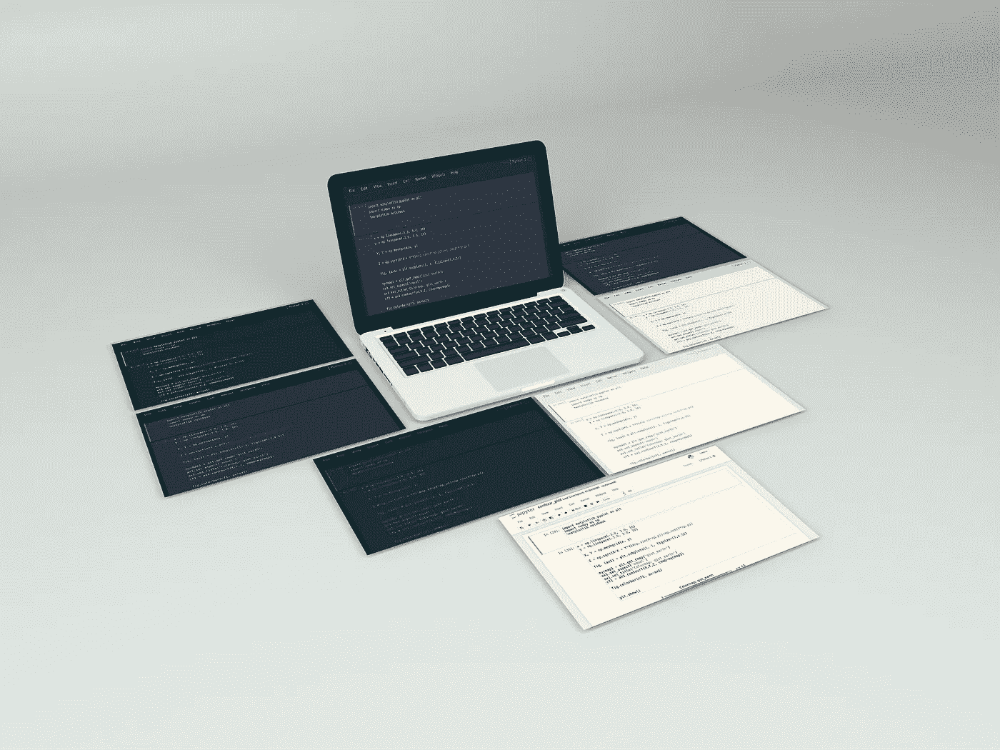

Mock up design by [Behance Designer](https://www.behance.net/gallery/67641283/Beautiful-Perspective-Website-Mock-up-free-download)

Jupyter Notebook 是一个交互式编译器，允许用户创建和共享包含实时代码、等式、可视化和叙述性文本的文档。这是 IPython 的一个衍生项目。几乎所有人都知道 Jupyter 笔记本只能编译 Python 代码。令人惊讶的是，Jupyter 笔记本还可以编译 Julia、R、Haskell 和 Ruby。

安装 Jupyter Notebook 最简单的方法是通过 Anaconda 安装。Anaconda 为您的 Python 或 R 编程提供了一个完整的包。要打开它，你只需在你的应用程序列表中找到 Jupyter 笔记本。您也可以通过命令提示符键入 *jupyter notebook* 并按 Enter 键来打开它。在 Linux 中，你可以通过 *pip 安装它。*您可以在 Windows 中执行相同的步骤来打开它，但只需在终端中键入即可。

打开后，你会看到这样的画面。

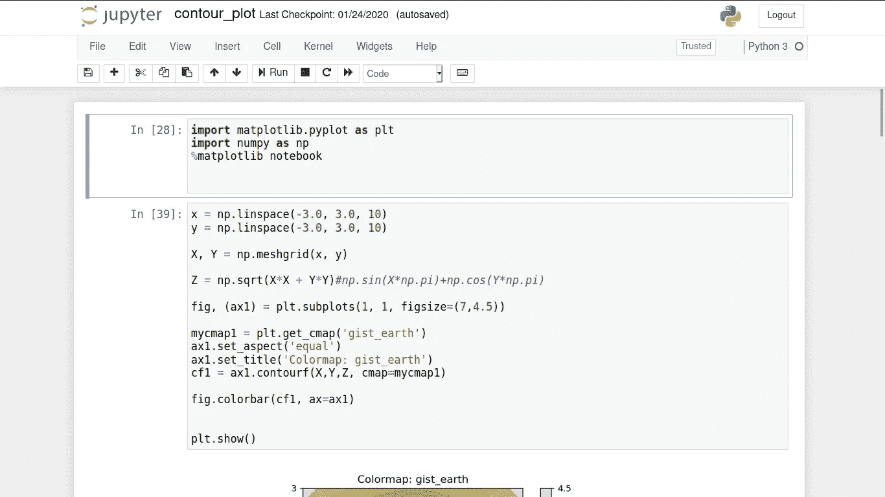

Jupyter Notebook default themes (Image by Author)

至少，有 4 种类型的细胞你可以创建，他们是

1.  **代码**，可以在这种类型的单元格中运行一个代码。
2.  你可以在这个单元格中创建一个 HTML 代码。
3.  这种单元格为您提供原始文本。
4.  **标题**，你可以为你的交互文件创建一个标题。

这是运行 R 代码和 Python 代码的**代码**单元类型的示例。指示器显示在右上角。你可以在上面看到 R 和 Python 的符号。

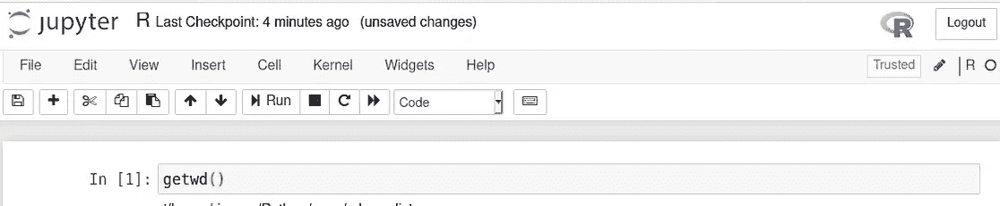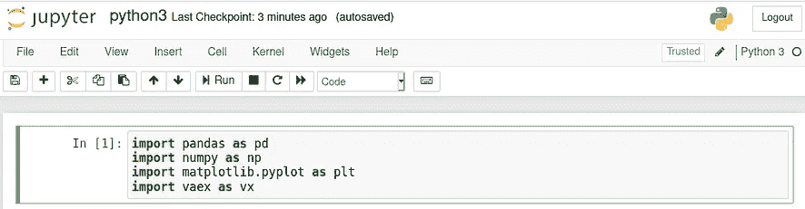

Code cell of R (left panel) and Python (right panel) language (Image by Author)

如果你想知道如何在 Jupyter 笔记本上安装 R，你可以在下面发表评论。

这是**降价**单元格。我向您展示了通过使用 HTML 创建一个漂亮的单元格来增强 Jupyter 笔记本的例子。第一行将产生一个居中的标题，第二行产生两个段落，后面跟着一个图片及其链接。

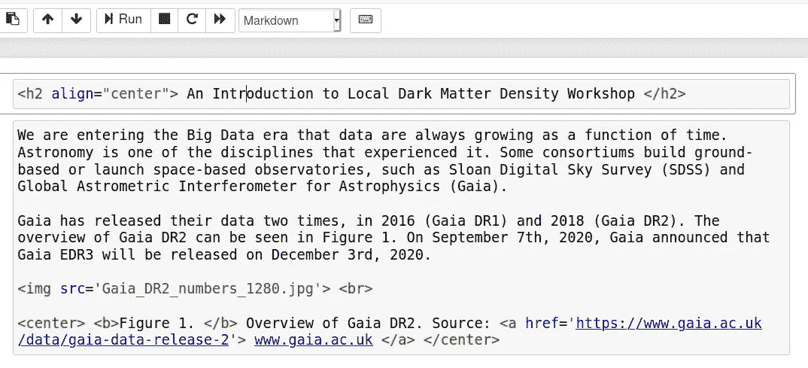

Markdown Jupyter Notebook (Image by Author)

运行上面的两个单元格后，您将得到如下结果

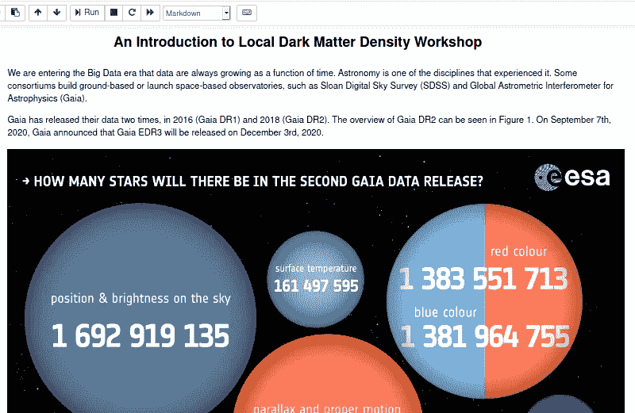

Markdown Jupyter Notebook (Image by Author)

挺爽的！！！

接下来，是 **Raw NBConvert** 单元格类型的例子。在这里。

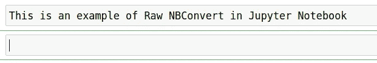

Raw NBConvert Jupyter Notebook cell (Image by Author)

除了一个文本之外，没有任何结果。我认为，原始 NBConvert 类似于 Python 中的注释，但在交互式版本中。

最后是**标题**单元格类型，下面是例子

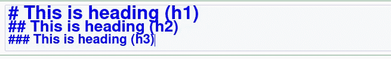

Heading cell type in Jupyter Notebook (Image by Author)

该单元格将给出如下结果


Heading cell type in Jupyter Notebook (Image by Author)

如前所述，您可以使用**降价**单元格类型创建不同大小的标题。

本文将指导您更改 Jupyter 笔记本主题。如果你仔细观察上面的一些图片，你会发现 Jupyter 笔记本的默认主题是白色。Yups 我给你一个教程把它改成黑暗模式。

首先，您需要使用以下代码安装 jupyter 笔记本主题

```
# install jupyterthemes
pip install jupyterthemes

# upgrade to latest version
pip install --upgrade jupyterthemes
```

如果你面临一些问题，最简单的解决方案就是升级你的 Jupyter 笔记本。如果您对权限有问题，只需更改权限。如果你有其他问题，请留下评论。也许，我可以给你一些替代方案。

在安装了 **jupyterthemes** 之后，你可以通过书写来阅读文档

```
jt -h
```

在您的终端或命令提示符下。

由 **jupyterthemes** 提供的有 9 个不同的主题，它们是 chesterish，grade3，gruvboxd，gruvboxl，monokai，oceans16，onedork，solarizedd，和 solarizedl。您可以通过编写以下代码来检查列表

```
jt -l
```

它会给你这个列表


List of themes in jupyterthemes (Image by Author)

要改变你的 Jupyter 笔记本主题，你可以写 **jt -t name_themes**

```
jt -t chesterish
```

完成后，您可以刷新您的 Jupyter 笔记本文件。这里是由 **jupyterthemes 提供的所有主题的例子。**

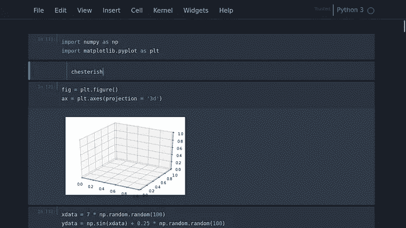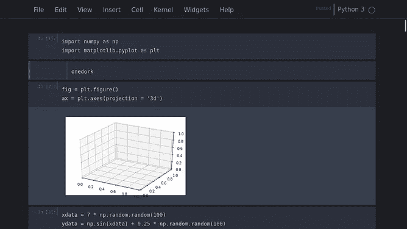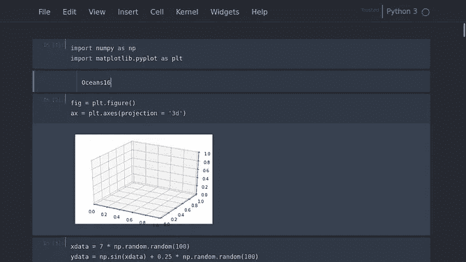

Dark Mode themes in Jupyter Notebook (Image by Author). **Left**: chesterish themes, **middle**: *onedork***, Right**: oceans16.

如果你对黑暗模式不感兴趣，你可以尝试以下主题

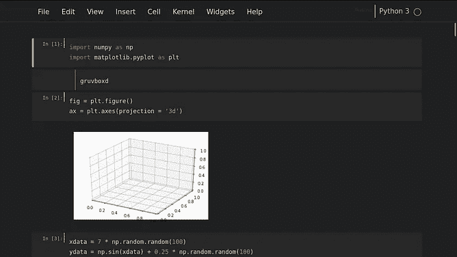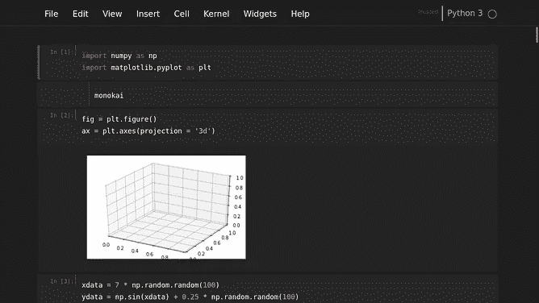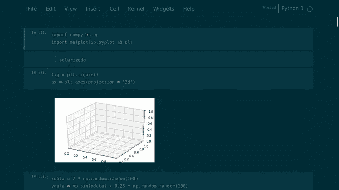

Alternative themes in Jupyter Notebook (Image by Author). **Left**: gruvboxd themes, **middle**: *monokai***, Right**: solarizedd.

或者这个灯光模式主题

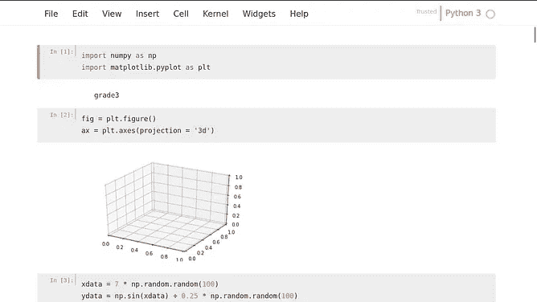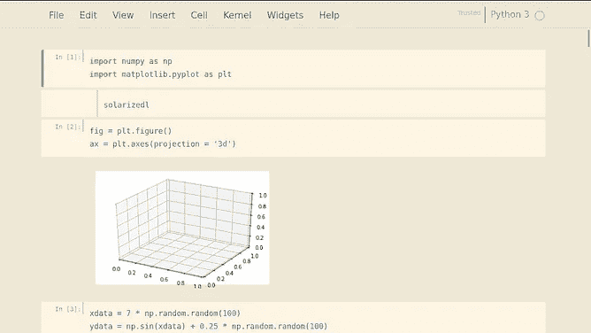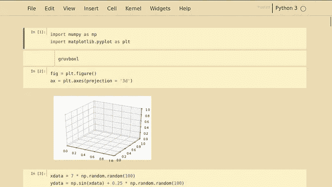

Light themes in Jupyter Notebook (Image by Author). **Left**: grade3 themes, **middle**: solarizedl**, Right**:gruvboxl.

只需选择你喜欢的主题:d。

要将其更改为默认主题，您可以编写以下代码

```
jt -r
```

这里是默认的主题。

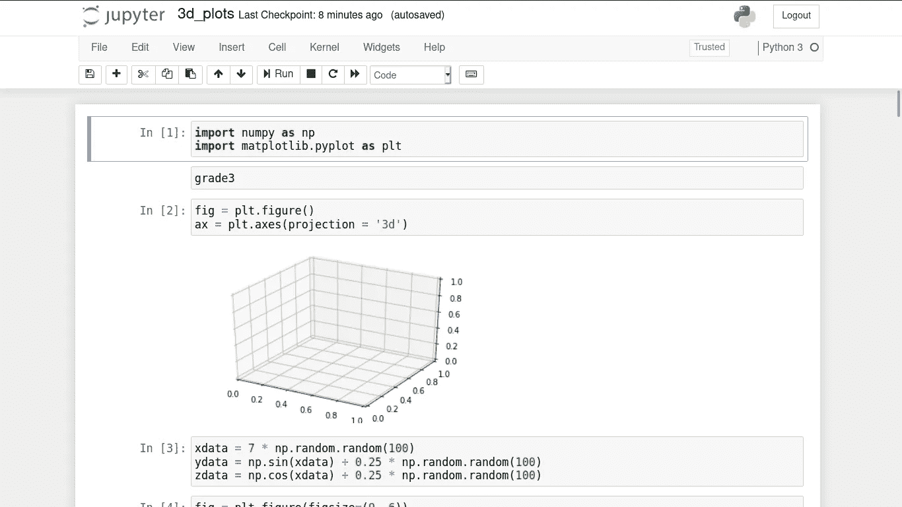

Default Jupyter Notebook themes (Image by Author)

如果你认为这篇文章已经结束了。不要！！:d .我将给出另一个使用 **jupyterthemes** 更改 Matplotlib 参数的酷方法。

***jupyterthemes***为你提供一些很酷的字体应用在你的情节中，它们是

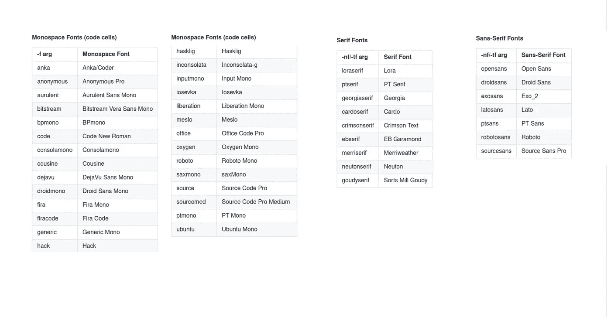

Provided fonts by **jupyterthemes** (Source: [Dunovank](https://github.com/dunovank/jupyter-themes))

如何使用，在这里(来源: [Dunovank](https://github.com/dunovank/jupyter-themes) )

仅此而已。尝试所有的可能性。干杯。