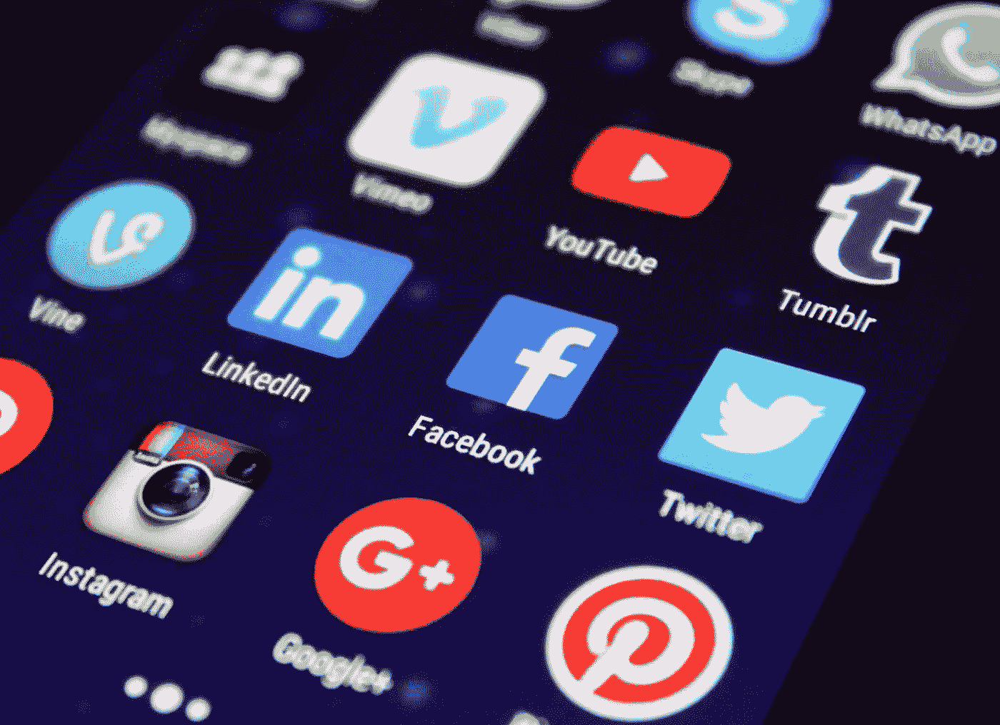

# 创业公司如何在有限的跑道上最好地利用 PR？

> 原文：<https://medium.datadriveninvestor.com/how-can-startups-best-use-pr-on-a-limited-runway-894182aca226?source=collection_archive---------17----------------------->

*由* [*卡罗林维埃拉*](https://bx3.io/carol-lin-vieira) *，合作伙伴，* [*BX3*](https://bx3.io)

最近的一个石英标题很好地总结了这一点:“[当经济的其他部分在新冠肺炎下沉沦时，大多数创业公司都做得很好](https://qz.com/1907540/most-startups-havent-seen-any-negative-impact-from-the-pandemic/)”随着资金回流，风险投资会议已经从面对面交流转变为网上对话，使得新公司的数字表现比以往任何时候都更有意义。创始人如何从公关角度适应这一点？

我们请来自世界各地的传播和营销专业人士给我们提供他们的顶级建议，当创始人希望利用公关来吸引投资者和客户时，他们已经接近现有跑道的尽头，并收到了富有洞察力、令人大开眼界的建议。

著名公关行业教练和培训师迈克尔·斯马特解释说:“在早期阶段，创始人应该考虑的不是公关的影响力，而是可信度。”。“推动流量和线索的病毒式帖子是独角兽，但在你的网站上贴上信任的媒体标志是一个实际的目标，如果你给他们正确的资源，一个好的公关承包商可以实现这个目标。然后也许你会得到一个病毒式的帖子作为奖励。”

对我们的询问的大量高质量的回复令人难以置信地振奋。事实证明，公关专家对这个话题非常感兴趣。为什么不会呢？尤其是在这惨淡的一年，谁不想帮助一位企业家 T21 获得成功呢？

虽然每个人都同意公关对于建立市场认可、保持初创公司的活力和相关性至关重要，但在当前的经济形势下，寻求以有限的资金实现价值最大化的初创公司成功公关背后的备受吹捧的策略分为四个不同的类别:**媒体关系**、**思想领导内容**、**社交媒体**和 **SEO** 。

如果一个创始人有很多激情，但没有很多现金，他们有什么不昂贵的-如果不是免费的-方法可以创建一个有效的公关活动？在本文中，我们将回顾媒体关系和思想领导力的内容。(后续文章将深入探讨社交媒体和 SEO。)下面，我们挑选了最好的、最有帮助的回答，为了便于参考进行了分类。

# 媒体关系

媒体关系描述了一个公司与编辑、记者和记者的互动。媒体关系的目标是与媒体分享有新闻价值的信息、消息或更新，希望他们会写出来。结果，也称为**赢得媒体**，是基于内容的新闻价值或被采访者的专业知识而获得的宣传。这对你、你的公司和你的品牌都是免费的。挣得的媒体提高了知名度和可信度，从而提高了你和你的企业的知名度。

免费媒体，无论是广播、电视、杂志、报纸还是网络，都为企业提供了扩大受众范围的机会。更好的是，当在社交媒体上分享时，一个赚来的位置可以获得更长的寿命，在那里它通常会到达一个全新的受众。

# 作为一家创业公司，你是如何做媒体关系的？

1.**媒体监控:**从跟踪对你的组织重要的行业有影响的新闻、趋势和问题开始。谷歌新闻提醒运行良好，而且是免费的。比如说，当你看到一篇关于竞争对手的报道，或者你的公司正在解决的一个问题时，你可以伸出手，让你的发言人作为专家发表评论。这种对及时问题的响应受到经常在紧张的截止日期前工作的记者的高度赞赏，并欢迎来自合法来源的积极响应/引用。

纽约 [VC Inc. Marketing](http://www.vcincmarketing.com) 的 Rafe Gomez 说:“研究你的竞争对手的新闻报道——特别是，谁写了这些报道，它们出现在哪里。“一旦收集了这些细节，你将有一个非常清晰的路线图可以遵循，并且你获得有价值的媒体报道的旅程将会非常精确。”

2.HARO: 注册参加 [HARO](https://www.helpareporter.com) ，或者“帮助记者”，这是一项连接记者和消息来源的免费服务，几乎每个人都这么说，我们也同意。一天三次，HARO 的电子邮件被广播，询问记者寻求回应或新闻故事的来源。你可以注册获得所有 beats 的查询，或者选择与你的兴趣和专业知识最相关的。

3.**创建媒体数据库:**跟踪媒体列表数据库中谁在报道什么。有一些昂贵的机构级系统，如 Meltwater，其存在的全部理由是保存记者及其联系信息的列表，以便公关人员可以代表他们的客户研究和联系数百名记者。你也可以在更小的范围内免费这样做:

*   确定你公司相关行业的记者、博主、有影响力的人，作为你公司的目标和来源。谷歌一下他们的电子邮件地址，如果你找不到，那就查查他们的 Twitter 账号，开始关注他们。喜欢并评论他们那些你真正觉得重要或有趣的故事。
*   了解他们和他们报道的各种故事，这样你就知道如何构建自己的故事，并能够证明为什么你的愿景/产品/旅程值得他们去写。
*   媒体关系就是建立关系。通过在正确的时间密切跟踪和锁定正确的记者，你将自己树立为一个可信和可靠的消息来源。

4.**使用推介库跟踪你的故事创意:**开发一个推介库，从几个不同的角度出发，针对不同的新闻节拍和行业话题进行定制。一旦你开始推销，并与你跟踪并认为可能对你的公司/任务/专家感兴趣的记者建立融洽的关系，就要记录下这些推销。

以后，您也许可以重复使用它们发送给另一位记者。根据角度或主题对它们进行分类，你将创建一个关键公司故事库，你可以将其重新用作博客帖子、社交内容或话题。

5.**脸书/ LinkedIn 群体:**脸书/LinkedIn 群体可能是最被低估的公关来源，你可以轻松地用它们来建立你的个人资料，而不用花一分钱，印度古尔冈一家编制技能评估工具的公司的公关和企业沟通主管何娜·考萨尔指出。许多记者、博客和其他有影响力的人都在寻找初创企业的创始人，讨论他们的考验和磨难、成功、他们的经验以及对后新冠肺炎时代的规划。这是最不用的反向链接，思想领导，并支持你的品牌影响力的来源。

# 思想领导力内容

如果你开创了自己的[事业](https://www.valuewalk.com/2020/10/transition-team-sell-a-business/)，你就已经成为了领导者。为什么不说清楚是什么让你与众不同，并把这个信息传递出去呢？你的思想领导内容将建立你的羽翼未丰的公司。你可能不是麦肯锡(McKinsey)或贝恩(Bain)，但对于那些希望维护其长期声誉的公司来说，创造优秀内容的原则同样适用于寻求让别人听到自己声音的[企业家和初创公司创始人](https://medium.com/swlh/5-thought-leadership-tips-for-scrappy-startups-2e82adbb0e66)。

1.**写下你所知道的。**你为什么选择创办自己的公司？你想填补市场上的哪个空缺？用你的公司博客来写一些你关心的问题；例如，我们最近的文章[讲述了风险投资界如何能够对多元化给予更多的支持](https://www.valuewalk.com/2020/07/venture-capital-firms-diversify/)。

2.**启动一个介质通道。对于任何品牌的内容战略来说，博客平台/数字出版宝库[媒介](https://medium.com)的作用再怎么强调也不为过。(你现在在这里，不是吗？)Medium 托管的内容范围广泛，从知名的商业出版物(如)到规模较小的专注于行业的行业(如 [Age of Awareness](https://medium.com/age-of-awareness) )以及个人作者的思考。**

《媒介》的美妙之处在于它为每个人提供了有用的、引人入胜的故事。从公关/营销的角度来看，这是一件非常方便的事情:一旦你阅读了 Medium 中的一个故事，它将带你进入无数作者和出版物的其他有趣故事的兔子洞；包括，也许是你自己品牌的渠道。

**内容联合:**不仅如此，如果你一直在制作高质量的内容，你的品牌故事可以联合到媒体网络中的其他出版物上。

以我们的客户 [Narbis](https://narbis.com/?utm_source=Medium&utm_medium=social&utm_campaign=organic&utm_content=&utm_term=) 为例，它基于美国宇航局的算法创造了[神经反馈智能眼镜，以帮助训练大脑集中注意力。我们写的一个故事，“](https://www.nasa.gov/directorates/spacetech/spinoff/Smart_Glasses_Focus_Attention_with_NASA_Neurofeedback_Technology)[注意力分散的国家——为什么成年人正在接受注意力障碍](https://medium.com/swlh/distraction-nation-why-adults-are-getting-treated-for-attention-disorders-44f625fe93d9)的治疗，”在初创公司的[上联合发表，该公司拥有超过 719，000 名粉丝，是 Medium 最大的活跃出版物。](https://medium.com/swlh)

SEO: 常规的博客文章不会仅仅产生可信度；它们是您的 SEO 策略的关键，我们将在本系列的下一期文章中进一步详细讨论。

“初创公司经常被搜索引擎优化吓倒，但最好的开始方式也是最容易的，”与 SaaS 公司合作进行搜索引擎优化的[思想性散文](https://www.thoughtfulprose.com)公司的斯蒂芬·罗说。“让一位创始人记录他们对某个行业话题的看法。找个自由职业者转录出版。每周只需 30 分钟，你就能产生强大的思想领导力。”

Mercer | Mettl 的 Kausar 还提出了一些方法来展示你的经验和知识，而不仅仅是书面内容。她建议:

3.**作为专家加入网上研讨会/创建自己的网上研讨会:**你可以写信给你所在行业的各种公司，与他们进行一系列连续的协作网上研讨会；或者作为专家加入，如果他们正在进行这些。如果你找不到这样的机会，你可以发起自己的网上研讨会，邀请他们作为专家加入。在几个月内，你将会在这个主题上创造出你的专业知识，并且在一个特定的领域内成为一个思想领袖。

超元案例:BX3 内容营销团队继续在营销播客上谈论思想领导营销(T21)。

4.**客座博文:**开始给你所在行业中受欢迎或知名的人和公司写信，告诉他们你对他们网站上的客座博文感兴趣。你经常会在他们的“资源”或“新闻编辑室”找到这样的人。一些网站甚至提供为他们写作的机会，还有一些规定。你可以马上把你的内容发给他们，然后等待他们的消息。一定要给你所在行业的人写信，因为你需要在某个特定的领域建立你的个人品牌和专业知识，如果你作为嘉宾发布的网站与你或你的公司无关，这不会有多大帮助。

媒体关系和思想领导力内容可能是任何初创公司营销箭筒中的两支重要箭。做得好的话，这些策略可以提高你在投资者中的可信度，吸引顾客，提高你的数字形象和[搜索引擎](https://www.valuewalk.com/2020/10/top-7-most-popular-social-media-platforms/)排名。在本系列的第二部分，我们将有更多专家的见解来分享，当谈到使用社交媒体和启动 SEO 程序时。

*原载于 2020 年 10 月 29 日***。**