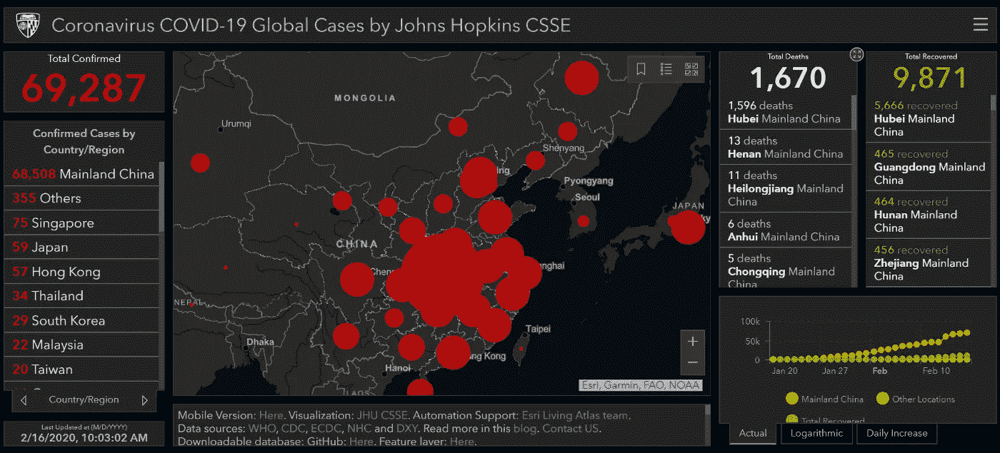
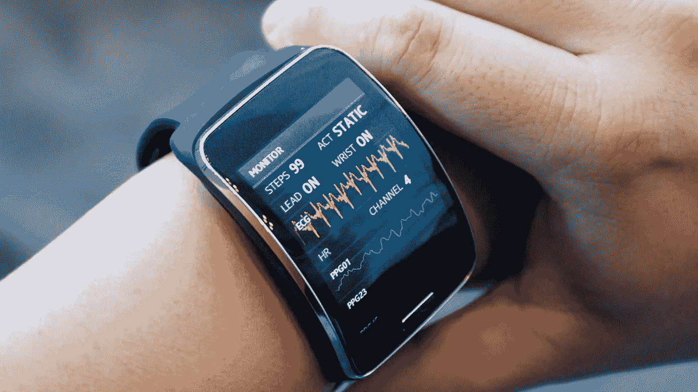
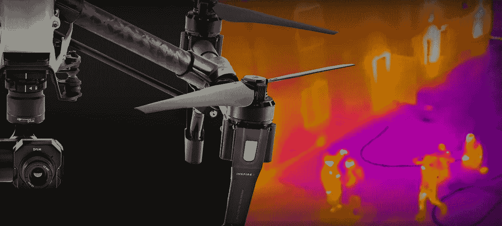
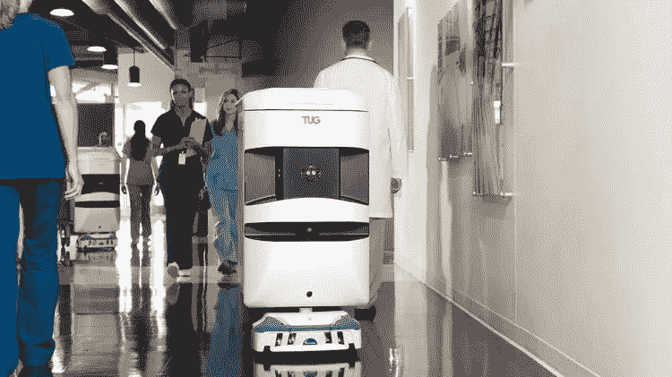
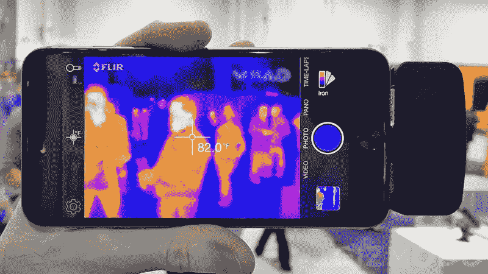
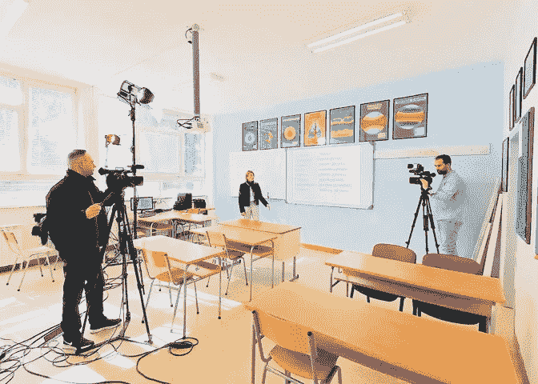
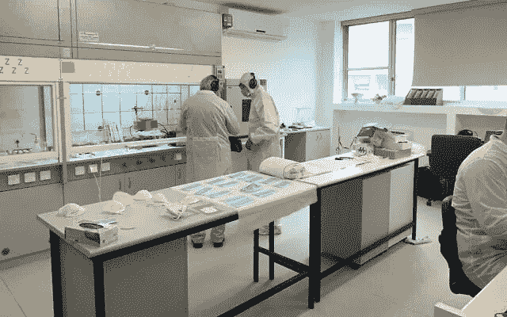

# 技术如何帮助更好地对抗冠状病毒？

> 原文：<https://medium.datadriveninvestor.com/how-can-technology-and-ai-help-fight-coronavirus-better-f8681041ccd0?source=collection_archive---------11----------------------->

Source: zesium.com

冠状病毒的传播没有很快结束的迹象。

许多国家都受到了这种病毒的影响，但目前还没有治疗这种病毒的疫苗。随着冠状病毒的持续传播，最重要的任务是尽可能地遏制疫情。

在全球疫情中，技术可以用来帮助和拯救生命。

科技和 [AI(人工智能)](https://en.wikipedia.org/wiki/A.I._Artificial_Intelligence)如何在对抗 COVID19 中帮助人们？

# 人工智能跟踪冠状病毒爆发

AI ( [人工智能](https://en.wikipedia.org/wiki/Artificial_intelligence))可以帮助我们追踪冠状病毒的爆发。

今天，我们可以通过实时[仪表板](https://gisanddata.maps.arcgis.com/apps/opsdashboard/index.html#/bda7594740fd40299423467b48e9ecf6)追踪数据——它从[世界卫生组织(世卫组织)](https://www.who.int/)提取数据，以更好地定位可能的疫情爆发，并提供安全措施，以最大限度地减少传播。

Source: John Hopkins University

一家加拿大健康监测公司使用人工智能删除外国新闻报道、论坛和公共卫生官员的公告，以保护世界各地的人们免受传染病的影响。BlueDot 的预警系统使用 AI ( *ML 或* [*机器学习*](https://en.wikipedia.org/wiki/Machine_learning) *和 NLP 或* [*自然语言处理*](https://en.wikipedia.org/wiki/Natural_language_processing) )来跟踪和分析数据，这有助于他们了解何时通知有关传播的信息。

 [## AI 将军是否已经超过了人类的智力容量？数据驱动的投资者

### 不仅在游戏中，而且在劳动力市场上，机器都比人类聪明。在今天的许多领域，使用…

www.datadriveninvestor.com](https://www.datadriveninvestor.com/2020/02/12/has-general-ai-exceeded-the-intellectual-capacity-of-humans/) 

在疫情的情况下，速度是最重要的，人工智能可以迅速发现疫情，并进行干预，以将其保持在最低限度。人工智能监控使用大量关于冠状病毒的帖子来获得更准确的数据，并预测疫情爆发的速度。

越来越多的国家开始部署人工智能监控，以监控和跟踪公民的各种目的。尽管它提出了严重的隐私问题，但人工智能监控已被证明是监控和应对冠状病毒等全球疫情的有用工具。

# 人工智能和可穿戴设备来跟踪人们

一些国家，如中国，使用基于人工智能和人工智能的工具来检测冠状病毒病例——不仅检测，还跟踪被隔离或自我隔离的人。

[面部识别](https://en.wikipedia.org/wiki/Facial_recognition_system)可以帮助检测人们的面部，特别是被诊断出感染了病毒的人，如果在任何情况下都无法找到他们的话。

许多应用程序也被开发出来，帮助人们追踪他们是否去过确诊的病毒患者所在的地方。

Source: visagetechnologies.com

[可穿戴技术](https://en.wikipedia.org/wiki/Wearable_computer)是另一种可能有助于对抗病毒的伟大方式——它使医疗专业人员能够在没有身体接触的情况下监测患者的生命体征。

中国的一些医院已经使用了连续的温度传感器来帮助减少病毒的传播——传感器被应用到病人身上，并向卫生机构发送实时信息。

可穿戴设备已被证明是有益的，可用于监测患者的心率和呼吸频率。

Source: thenextweb.com

# 无人机协助

无人机在最大限度地减少传播方面已经变得至关重要——人们使用无人机执行任务，如喷洒消毒剂、驱散公共集会或跟踪隔离区内的人。轻型无人机通常用于检测和监控，而其他类型的无人机可以用于[运送食物和口罩](https://en.wikipedia.org/wiki/Delivery_drone)，这有助于防止病毒传播。

Source: wetalkuav.com

无人机可以升级为[航空热成像](http://www.bdg-usa.com/lc/thermal-infrared-aerial-imagery.html)——使用配备有热感相机扫描仪的无人机来检测人群中人们的温度，他们可以识别出体温最高的人。

Source: thedronegirl.com

# 机器人和技术工具使非接触式通信成为可能

在疫情疫情爆发期间，机器人变得比以往任何时候都更加重要，因为医务人员在为患者提供治疗的同时保持安全极其困难。

医务人员短缺已经成为一个首要问题，因为他们直接接触病人，可能会被病毒感染。

使用机器人可以最大限度地减少医务人员与受感染患者的接触——与受感染患者接触的人越少越好。

机器人可以帮助执行任务，如运送食物和药物，清洁病人的房间，实现非接触式援助，防止进一步传播。

Source: bizjournals.com

医疗保健应用程序可以提供实时咨询——患有类似冠状病毒症状的患者可以通过视频电话咨询医生，而不是与患者近距离接触。

虚拟咨询可以为医生提供一个人的当前状态以及血压、心率等医疗数据。

Source: smarthealth.nl

在中国，电子商务巨头走得更远，部署机器人送餐以防止病毒传播。无接触递送系统试图将人类接触最小化，从而减少病毒本身的传播。自动驾驶汽车可以运载多达 100 公斤的货物，每次运送 3-4 轮货物。

自动驾驶机器人可以用于医院的消毒，比如 [UVD 机器人](http://www.uvd-robots.com/about/)释放集中的 UV-C 光，具有杀菌作用，可以杀死表面的细菌和空气传播的病毒。

最受欢迎的机器人“消毒剂”之一是由[蓝海机器人](https://www.blue-ocean-robotics.com/)开发的，它使用紫外线来杀死病毒和细菌。

Source: blue-ocean-robotics.com

# 热成像摄像机检测早期病例

虽然冠状病毒是当前的危险，但人们仍然需要工作和旅行。

许多国家的机场都安装了许多热筛选相机——它们使用热成像设备来检测一个人的体温是否超过正常范围，并做出相应的反应，而不会传播恐慌。

[热感相机](https://en.wikipedia.org/wiki/Thermographic_camera)利用红外辐射产生图像——热传感器记录人们身体的热量，并显示带有温度水平的 2D 图像。

热传感器可以扫描一大群人，并立即找出那些高温或发烧的人，而不是检查每个人的体温，并造成大规模的延迟。

Source: gizmodo.com

正如已经提到的，热感相机的另一个伟大用途叫做[空中热成像](https://uavcoach.com/aerial-thermography-applications/)，它包括一个无人驾驶航空设备(无人机)和一个红外相机扫描。

无人机显示出更高的安全水平，因为它们可以在更少或没有接触的情况下完成任务，并且可以以可承受的成本获得。

这种数据可以发送到卫生机构，以便治疗可以立即开始，并产生最大的效果。

# 人工智能有助于发展医学

冠状病毒与埃博拉和 SARS 相似，因为它们是 RNA 病毒，这意味着它们对突变有反应，并且在开发疫苗方面更复杂。

Source: theblockbox.io

许多公司已经部署了他们的资源，试图开发药物——谷歌的 DeepMind 已经使用其 [AlphaFold](https://deepmind.com/blog/article/AlphaFold-Using-AI-for-scientific-discovery) 系统发布与病毒相关的结构预测。虽然这些还没有被实验证明，他们希望这将导致更好地了解病毒如何运作。

百度研究院向科学界和防疫中心免费开放了其 [LinearFold](http://research.baidu.com/Blog/index-view?id=131) 算法，这样所有关于 Covid19 结构的研究都可以持续加速——该算法识别和求解 Covid19 的 RNA 结构只需 27 秒，比经典算法快 100 多倍。

对于这些算法来说，最重要的事情是访问数据，因此公布所有对算法寻找治疗方法至关重要的细节是至关重要的。

# 技术工具提供在线教育项目

由于冠状病毒爆发，许多学校和大学关闭，而学校教育是通过在线教育计划组织的。

简单的[技术工具和应用](https://www.teachtomorrow.org/education-technology-tools/)使许多教育机构能够组织预先录制的课程或实时流，教师可以在白板或 PowerPoint 演示的帮助下上课，从而继续学年。

在塞尔维亚，学校和大学节目已通过国家电视频道或在线频道播出，因此每个人都可以收看。

Source: politika.rs

许多在线教学和教育平台也在疫情期间免费提供服务，帮助学生不受冠状病毒的影响。

冠状病毒引发的危机引发了对在线教育、课程和内容的需求增加。

# 人工智能将打击虚假信息

全球疫情影响了世界人口，人们注意到一些社交媒体网络开始发布与冠状病毒及其预防相关的误导性内容——从病毒的起源到各种关于奇迹治愈的说法。

在疫情的情况下传播恐慌是极其危险的，假新闻数量的增加只会让情况变得更糟。

Source: blo88er.wordpress.com

人工智能可以用来分析单词或单词模式，以试图揭露虚假的故事。

例如，脸书使用人工智能来解决这个问题，通过模式识别快速学习行为——人工智能的力量可以非常准确地检测出互联网上的虚假故事。

这就是为什么最大的互联网和社交媒体公司付出额外的努力来检测虚假信息和过滤可以通过他们的网络发送的信息。

# 在人工智能的帮助下生产口罩

随着冠状病毒疫情在一些国家迅速蔓延，缺乏医疗设备已成为全球许多卫生机构的共同问题。

缺少口罩、手套、防护服等。这是一个巨大的问题，我们需要解决它，如果我们打算保持我们的医疗工作者的健康，并最大限度地减少病毒在第一线的传播。

Source: sonoviatech.com

对医疗产品短缺问题做出贡献的公司之一是 [Sonovia](http://sonoviatech.com/) ，这是一家以色列初创公司，致力于生产对病毒具有免疫力的织物，直到我们开发出疫苗。最重要的是，他们使用的技术可以在不使用任何化学物质的情况下用抗病毒剂覆盖织物。

在塞尔维亚，一群热心人士于 2020 年 3 月 20 日成立了一个脸书团体“ [Vizionari Srbije](https://www.facebook.com/groups/vizionarisrbije) ”，目的是帮助他们面临冠状病毒感染风险的公民。第一个项目是创建 3D 打印的安全面罩，以保护[保健专业人员和医务人员](https://www.sindikatlfs.rs/zahvalnost-vizionarima-srbije/)免受病毒的直接传播。该项目获得了巨大的反响——该团队为超过 22，000 人制作了护目镜，而且还在增加。

Source: [https://www.facebook.com/groups/vizionarisrbije](https://www.facebook.com/groups/vizionarisrbije)

# 一锤定音

随着冠状病毒危机的加剧，我们可以看到一些技术在未来如何有助于对抗传染病。

技术可以成为我们的盟友，帮助拯救生命，但让我们不要忘记，人类和人与人之间的团结使同样的技术能够发挥其全部潜力，并在疫情爆发期间让我们团结在一起。

我认为，在能够阻止传染病爆发之前，技术仍需要时间，因此我们需要积极投资于它。

人类专家和技术的结合是未来时代的赢家。

通过以下链接安排与[**Maja Dakic**](https://app.ddichat.com/experts/maja-dakic)**的 DDIChat 会话。**

** [## 马贾达基奇-迪迪恰特

### 技术行业(软件、移动应用、物联网、人工智能等)的资深作家。)以及在…

app.ddichat.com](https://app.ddichat.com/experts/maja-dakic)**