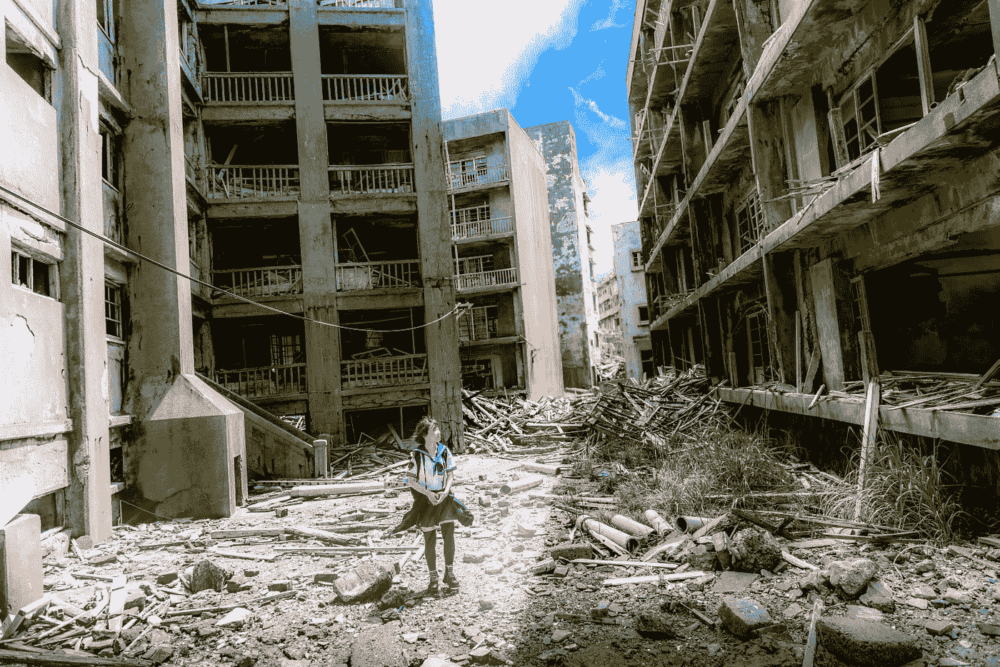

# 战争杀了人怎么对 GDP 有好处？

> 原文：<https://medium.datadriveninvestor.com/how-can-war-be-good-for-gdp-if-it-kills-people-12b4fc8a9cf9?source=collection_archive---------8----------------------->

## GDP 衡量一切，除了让生活有价值的东西。那么，我们为什么继续使用它，有什么替代方案呢？

Photo by [Jordy Meow](https://unsplash.com/@jordymeow?utm_source=unsplash&utm_medium=referral&utm_content=creditCopyText) on [Unsplash](https://unsplash.com/?utm_source=unsplash&utm_medium=referral&utm_content=creditCopyText) showing Gunkanjima, Japan, a city devastated by war

战争是死亡，战争是城市的毁灭者，战争撕裂社会。这种令人痛苦的事态怎么会有积极的一面呢？这完全取决于你的观点。虽然战争带来了痛苦，但也花了很多钱。据估计，美国在 2003 年伊拉克战争上花费了超过 2 万亿美元。从国内生产总值(GDP)的角度来看，这是积极的。GDP 并不衡量一个社会的福利或任何一种情感幸福。它衡量财富的创造。好家伙，战争创造财富。

GDP 不在乎所创造的财富对社会的贡献是积极的还是消极的。这就是度量的危险。单一数字是追踪一个国家健康状况的便捷方式。但是这些财富是怎么来的呢？只看到结果而不考虑过程是衡量一个国家成功的一种相当粗糙的方式。

 [## 如果资本主义失败了，那么还有什么选择呢？数据驱动的投资者

### 在当前政治领域的修辞之旅中，我们都可以面对面地接触到流行词汇，如…

www.datadriveninvestor.com](https://www.datadriveninvestor.com/2020/03/16/if-capitalism-is-a-failure-then-what-is-the-alternative/) 

GDP 让不公平、不平等等系统性问题以及所有问题之母——气候危机变得更糟。要解决这些问题，我们必须制定鼓励行为的指标，推动我们找到解决方案。

## 我们为什么要用 GDP？

西蒙·库兹涅茨在 1934 年提出了 GDP 的概念。自二战结束以来，它已成为衡量一个国家经济生产率的主要工具。库兹涅茨当时就警告过它的局限性[说](https://fraser.stlouisfed.org/title/national-income-1929-1932-971)；

> “一个国家的福利…很难从国民收入的衡量中推断出来”

社会福利和人民的情感幸福与一个国家的经济增长并不同步。不平等就是一个恰当的例子。假设一个国家的 GDP 越高，这个国家就越富裕和发达。每个人都应该从 GDP 增长中获益。如果财富被平均分配，这将是真的。

事实上，情况恰恰相反。基于 GDP，美国是地球上最富有的国家。然而，最富有的 0.1%的人拥有大约 T2 20%的财富。从全球来看，T4 最富有的 26 个人拥有的财富相当于最贫穷的 38 亿人的财富。一车人的财富比中国、印度、美国、印度尼西亚和巴基斯坦的人口加起来还多，而且还有几亿人的空间。

当国内生产总值增加时，财富分配减少。

## 为什么 GDP 被认为是一个有用的指标？

如果 GDP 有如此明显的局限性，为什么它经受住了时间的考验？因为它被认为是一个国家经济健康状况的有用晴雨表。GDP 增长是经济增长的标志，鼓励投资。GDP 下降表明经济正在萎缩，并面临衰退的风险，从而抑制投资。

好的，所以这是一个对经济学家和投资者有用的衡量标准。但是这和战争有什么关系呢？

如果我们看看伊拉克战争的例子，这是一次规模巨大的协同努力。它需要将美国军队和他们的一系列尖端装备运送到全球各地。军队需要食物、衣服和住所。在推翻萨达姆·侯赛因政权的过程中，美国摧毁了伊拉克的城市和基础设施。重建这个被毁坏的国家需要巨大的建设努力。这个过程的每个阶段都需要大量的投资。因此，总账单超过 2 万亿美元。

那些无法用美元符号来衡量的人类影响呢？那些至今仍在遭受身体或心理痛苦的战争伤亡人员呢？那些冒着生命危险去拯救他人的志愿者呢？

GDP 如何衡量他们的苦难或贡献？并没有。

正如罗伯特·肯尼迪所说，GDP“衡量一切，简而言之，除了那些让生活有价值的东西。”

## GDP 的替代品是什么？

一个可以将战争视为积极因素的衡量标准必须受到质疑。但是我们还没有到达最糟糕的部分。GDP 忽略了我们赖以生存的环境。

几十年来，气候变化一直被认为是事后的想法，因为处理这个问题将涉及减少碳排放。假设这将对 GDP 产生影响。更不用说威胁人类和地球上所有生命的危机了。如果 GDP 在增长，那才是最重要的。对吗？

我们正奔向一个不确定的未来，但仍有希望。其他指标正变得越来越受欢迎。像联合国的世界幸福报告这样的衡量标准根据各国的幸福水平进行排名。而经济合作与发展组织已经建立了一个衡量幸福和进步的 T2 框架。

我们仍然需要一个包含三个关键因素的指标。环境健康、社会福祉和经济发展。创建一个考虑到这些因素的指标，可以创造一个引发人类行为变化的杠杆点。

因为度量是强大的。[丹·艾瑞里](https://hbr.org/2010/06/column-you-are-what-you-measure)在《哈佛商业评论》中解释了原因:

> “人类根据他们所参照的标准来调整行为……你衡量的就是你将得到的。”

如果我们继续依赖 GDP 来衡量经济的健康状况，我们将继续看到违背直觉的行为。但是，如果我们改变我们赖以成功的标准，由 GDP 引发的行为特征也会改变。根据环境健康、社会福祉和经济发展来衡量国家的成功可能会产生变革性的结果。各国和人民将根据这些因素集中努力实现目标。

任何从正面看待战争的标准都不应该用来衡量任何事情。我们需要一套驱动人类行为的标准，让战争的前景变得不合逻辑。因为战争是死亡，战争是城市的破坏者，战争撕裂社会。

*阅读原文，在*[*transformatise.com*](http://www.transformatise.com/?source=post_page---------------------------)订阅更多文章

**访问专家视图—** [**订阅 DDI 英特尔**](https://datadriveninvestor.com/ddi-intel)