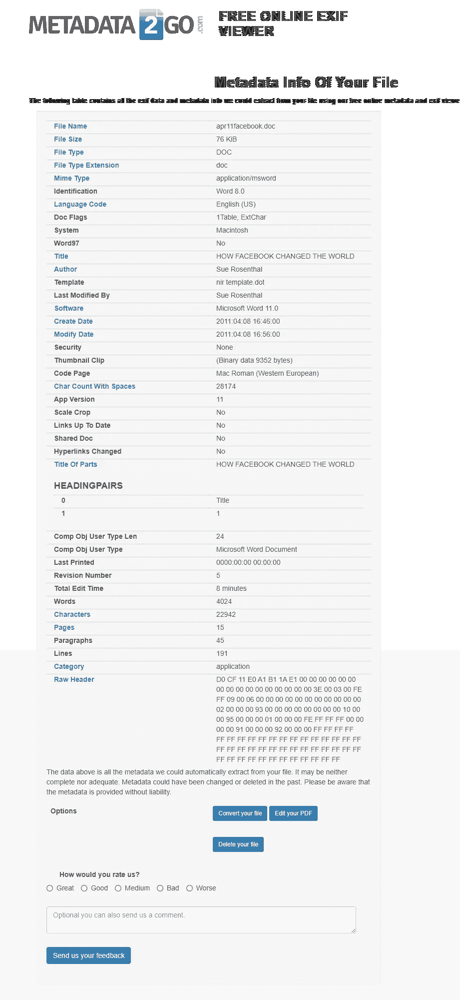
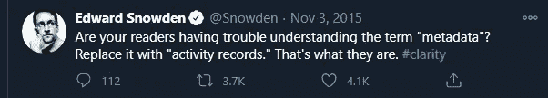
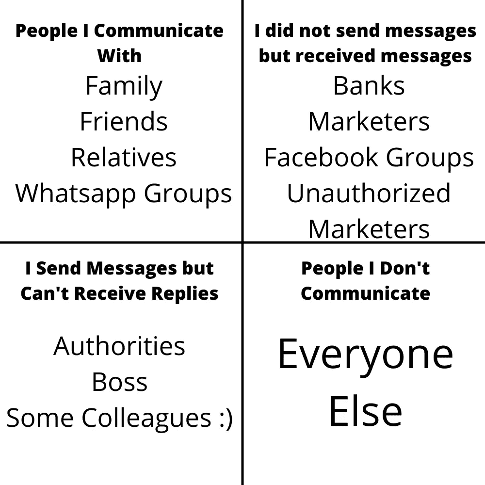
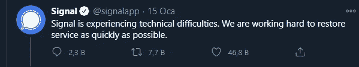

# 怎样才能可靠地进行网上交流？

> 原文：<https://medium.datadriveninvestor.com/how-can-you-communicate-in-a-reliable-way-d06763d75834?source=collection_archive---------26----------------------->

## 或许是 Whatsapp 危机后我们所有人被问得最多的问题之一。

Photo by [Franck](https://unsplash.com/@franckinjapan?utm_source=medium&utm_medium=referral) on [Unsplash](https://unsplash.com?utm_source=medium&utm_medium=referral)

过去，人们很难与远方的人交流。他们为此开发了许多方法。其中一个在用烟交流。

但是让我告诉你最安全的交流方式。

source: [Youtube — Mission Impossible Film](https://www.youtube.com/watch?v=MA2KmJMKFrQ)

使用自毁磁带，就像电影《碟中谍》一样。但是现在磁带不是很常见。一切都是数字化的。即使眼镜上有微小的芯片，你也可以发送信息。

然而，我们必须像保护人权一样保护我们的数字权利。

如你所知，据说 Whatsapp 的隐私政策将于 2 月 8 日生效。你肯定听说过它，因为它引起了很多争议。

事实上，他们把这个决定带到了五月。我不确定是不是因为反应过激，但这东西改变不了这个事实。

由于这些新的燃烧事件，让我们更深入地看看 Whatsapp，它的创始人，以及“数据-元数据”的概念。

因为这不仅仅是关于 Whatsapp 和他们的决定。它关系到我们所有的数字身份和信息。当我们在现实世界中呼吸时，我们在数字世界中创造了大量的数据。不幸的是，从这里没有回头路了。

就像我们在现实世界中努力保持健康，去运动，健康饮食一样，我们也应该在数字世界中为我们的健康做点什么。因此，我们应该知道“元数据”的概念。

我们不仅在传递信息时产生“数据”之外的元数据，而且在我们在数字环境中无意识地做的每一个动作中也产生元数据。

例如，你想给某人写封信。你要怎么办？你打开你的文字处理程序，开始写。不是吗？

你信的内容就是你的数据。但是，你所使用的违背你意愿的程序会产生并保存其他信息。

我们来做一个例子。

screenshot by author

如你所知，我们可以在谷歌上搜索文件类型。所以，让我们寻找。文档类型文件夹。第三个对我有吸引力。所以还是下载吧。

文件中没有作者姓名。我们用一个普通的元数据[网站](https://www.metadata2go.com)查一下。

screenshot by author

我们可以访问各种信息，从作者的名字到创作日期，到创作的程序。我们不能说这个信息是 100%真实的，但它可以在以后改变。

因此，我们的数字数据安全问题是一个更古老的计算机发明。它不是从 Whatsapp 开始的，也不会以它结束。

正如我之前所说，Whatsapp 将[这些强加于欧盟国家以外国家的原则](https://www.whatsapp.com/legal/updates/privacy-policy/?lang=en)推迟到了五月。

即使它对你端到端发送的信息内容进行加密，我们知道即使在那里也有一些隐藏的后门，加密的部分只是信息本身，数据。

然而，围绕它形成的元数据已经从 2016 年开始使用[。这也不是什么秘密。他们](https://techcrunch.com/2016/08/25/whatsapp-to-share-user-data-with-facebook-for-ad-targeting-heres-how-to-opt-out/)[以一种非常易懂的方式详细分享了这个故事](https://www.whatsapp.com/legal/privacy-policy)。

【Whatsapp 会如何处理我的信息？最糟糕的是什么？

爱德华·斯诺登目睹了这样的对话，降低了事态的严重性，他发了以下推文。

screenshot by author

我们发送和接收的信息内容可能会被加密。但是，我们的活动是保留和共享的。甚至他们都被跟踪了。

用户配置文件是在这些文件合并后创建的。

让我们来看看我如何根据我在和谁发短信以及没有和谁发短信来进行分析。

首先，我创建了 4 个不同的组。

created by author

虽然最后一组看起来最不重要，但对其他人来说可能非常重要。因为通过组合成千上万个这样的元数据，你可以建立起世界上最先进的网络。

这只是元数据。脸书从数十亿人中收集了数千个这样的人，对他们进行比较，并创建详细的个人资料。

> *它知道周一 16:14 有人给计生中心打电话，14:42 到 15:26 和妇科医生发短信，8 分钟语音通话后，给“…大学生”群发信息。但是他不知道消息的内容。加密了！*

活动记录，我用一句话概括的元数据，包含了非常详细的人口统计信息，信息在这个年龄段以下。

2014 年[脸书以 190 亿美元从两名前雅虎员工手中收购了](https://about.fb.com/news/2014/02/facebook-to-acquire-whatsapp/) [WhatsApp 应用。](https://www.wired.com/2015/10/whatsapps-co-founder-on-how-the-iconoclastic-app-got-huge/)

他开发了 WhatsApp，以 190 亿美元的价格出售，并在脸书谋得一份工作。事实上，他继续在那里工作，并开发了 3 年的产品。

Whatsapp 的创始人之一布莱恩·阿克顿(Brian Acton)突然成为全球第 339 位富豪。我之所以特别提到这一点，是因为他之前申请过脸书的一份工作，但他们没有录用他。

从他在我阅读的采访中所说的来判断，他做了很大的努力不将用户数据与脸书的其他服务合并。正如扎克伯格所说，让我们在 WhatsApp 的消息上获得广告，他寻求加密这些消息内容的方法，并最终在 2016 年推出了这一功能。

但当他们之间的分歧继续存在时，他在 2017 年辞职，离开了脸书和 WhatsApp。

导致那次辞职的最重要的事情是这样的:尽管消息在 2016 年夏天开始被加密，并对该用户产生了信任感，但 WhatsApp 开始与脸书共享用户信息，甚至电话号码。

当这个问题像现在这样被公之于众时，他们发表声明说:“自动合并脸书和 WhatsApp 的用户信息在技术上是不可能的。”

但这是一个误导性的声明，欧盟委员会没有放过他们，宣布对[处以 1.1 亿欧元的罚款。从那以后，WhatsApp 一直在为欧盟国家和世界其他地区发布和使用不同的政策。](https://ec.europa.eu/commission/presscorner/api/files/document/print/en/ip_17_1369/IP_17_1369_EN.pdf)

不要误会我的意思，脸书当然必须想办法从一项初期投资 190 亿美元、每年持续花费数百万美元的服务中获利。

但是如果用户在试图获利时做出了会打破他们信心的举动。即使离开时迈出一步，也未必能履行这份失去的信任。那么我们该怎么办呢？他们说他们现在正在推迟决定。对了，要不要删除 WhatsApp？删除了要装什么？

我们自己定原则吧。社交媒体上几乎所有人都推荐 Telegram 和 Signal 应用。让我们用分析的方法来处理这个问题，而不仅仅是道听途说的信息。有人总共检查了 12 种不同的通信应用，并对这些应用提出了以下主要问题。

> *“它有自毁信息功能吗？”*
> 
> *“独立的安全分析已经完成了吗？”*
> 
> *“元数据加密了吗？”*
> 
> *“消息是否默认加密？”*
> 
> *“是开源的吗？”等等。*

看[这张表](https://www.securemessagingapps.com)大家可以根据自己的原则使用自己选择的应用。Signal 似乎是最靠谱的 app。它使用一种叫做“T2”信号协议的方法来加密信息。你知道还有谁用这种方法吗？**WhatsApp。**

然而，WhatsApp 的得分下降是因为它没有独立的安全分析，也不是开源的。Signal 是作为一个非营利基金会成立的，并且是完全开源的。它继续通过捐赠提供服务。

***那么，你认为目前为止谁的捐款最多？***

布莱恩·阿克顿。正如我所说，WhatsApp 的创始人之一布莱恩·阿克顿(Brian Acton)因与脸书意见不合于 2017 年辞职。然后，他积极参与了 Signal Foundation 的建立以及这一新应用程序的开发和维护。

简而言之，开发 WhatsApp 以应对未被脸书聘用的人，现在站出来反对扎克伯格通过 Signal 应用程序赚钱的愿望。当然，当他被最近的这些事件所累的时候，他开始有技术上的困难。

screenchot by author

我很高兴这些问题已经开始公开讨论。因为，具体来说，WhatsApp、Signal 等即时通讯应用，以及脸书和 Twitter 等社交媒体渠道对我们生活的影响比我们想象的要大得多。

*原载于*[*sellim . me*](http://sellim.me)