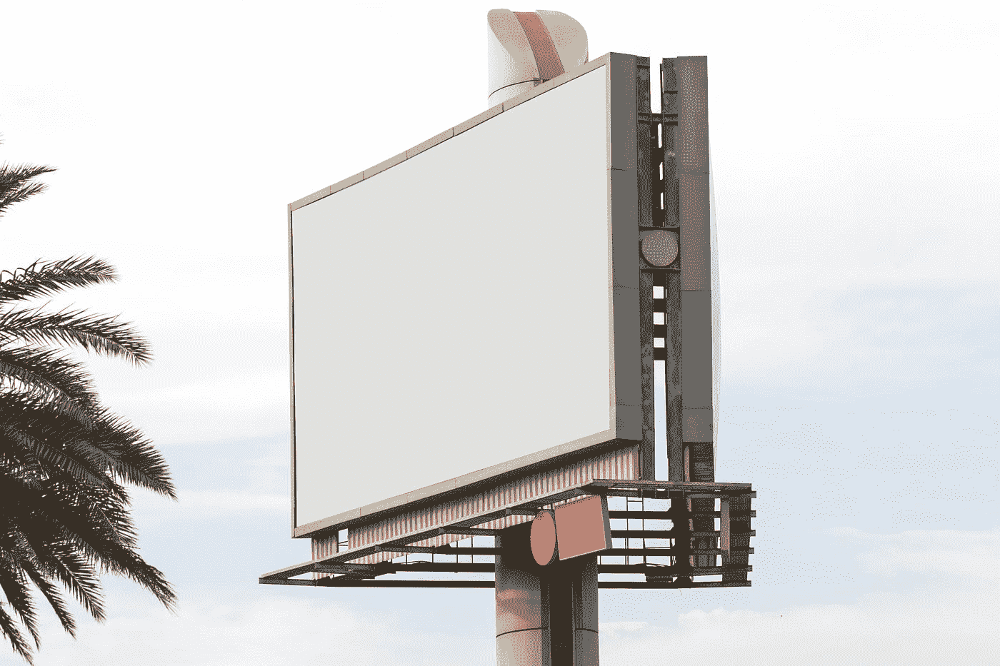

# 你怎么能通过适当的广告销售一件无用的东西呢

> 原文：<https://medium.datadriveninvestor.com/how-can-you-even-sell-a-useless-item-with-proper-advertising-f5b21396e6fe?source=collection_archive---------3----------------------->

## 广告对营销有什么影响

Photo by [Kate Trysh](https://unsplash.com/@katetrysh?utm_source=medium&utm_medium=referral) on [Unsplash](https://unsplash.com?utm_source=medium&utm_medium=referral)

作为一个在广告行业工作多年，并为最知名的国际品牌管理过最大的土耳其广告公司之一的人，我将向你展示如何将一篇无用的文章变成开创性的想法。

你们一定都听说过一个想法开始时的话，比如“没人需要这篇文章，或者为什么有人要用印有卡通人物的卫生纸”，对吗？

这是一个简单的思维过程，每个人都不知道操纵艺术可以做什么来销售产品。

首先，你必须明白，世界上几乎没有任何产品是因为“需要”而产生的，而是我们广告行业告诉你“需要”。

否则，如果你的智能手机今天几分钟不工作，你仍然会从家里打电话，而不会有“尼古丁戒断”。

 [## 您的企业今天需要虚拟现实营销的 3 个原因|数据驱动的投资者

### 新冠肺炎是并将继续是一个前所未有的全球性事件，将医疗保健系统和全球经济带到…

www.datadriveninvestor.com](https://www.datadriveninvestor.com/2020/04/09/3-reasons-why-your-business-needs-vr-marketing-today/) 

这意味着每一件商品，不管它是一个好主意还是听起来很傻，都有一个会购买它的顾客。因为每个人都有不同的心理基础来指导他的决策过程，无论他的生活中是否需要什么，我们是解释这一点的人，或者说，让他相信这一点。

因此，当你创造了一个产品时，记住这些黄金思维过程，这是 50%的工作，剩下的 50%是广告，这使它要么成为畅销书，要么成为失败者。

## **1)不要相信古典神话**

永远不要相信“你必须相信你的文章”这样的谎言

即使这听起来很残酷，但这不是真的。在 70 年代，汽车制造商制造的汽车肯定可以使用 10-20 年，今天，同样的制造商生产的内饰材料可以使用两年，因为他们希望你比以前更频繁地更换汽车，因为这是关于数字而不是质量。你看到销售数字在下降吗？没有。

## 2)选择正确的广告活动

不幸的是，如果你这几天去广告公司，他们大多会给你一个错误的定位，让你赚更多的钱，但它是否是正确的广告，你的文章在这里值得怀疑。

例如，如果你能从网上广告中找到 50 倍多的买家，广告专家可能会为你提供数千美元的户外广告牌广告。但是你必须自己决定你的真空吸尘器在一个 15X15 米广告牌的快餐连锁店前是否真的有效。

有时候在家庭主妇整天在家的家里，往邮箱里扔一张非常经典又不贵的宣传单，可以便宜很多，效果也很好，可以让她们的老公在晚上头疼买这个吸尘器。

## 3)颜色的心理效应

色彩不仅仅是颜色，无论是广告或创意或标志的一般颜色，所有这些颜色都会对人产生心理影响。你不能在卫生棉条广告中使用“橙色”,这对每个人来说都意味着普通。

卫生棉条是每个人都要的吗？

在这个世界上，在数百个社会中，正常和自然的月经仍然被认为是一种禁忌，如果你使用橙色，攻击的颜色，你从一开始就失败了。但如果你把同样的颜色用于女装，它会很有吸引力，因为它直接打击了女性穿上它的意愿，她们会在潜意识里把它视为“必须”。

## 4)没有什么是“不需要的”

你还记得这篇文章开头我谈到卫生纸上的卡通人物的台词吗？

当我们做一些肮脏的事情，并用它来清洁我们神圣的部分时，谁需要这样的东西？

如上所述，这是一个简单的思维过程。但是我们为我们的一个客户卖了这篇文章，扮演了成千上万个角色。

**给谁？**

不是想马上离开肮脏厕所的成年人，而是第一次自己或和父母一起学习上厕所的孩子，对他们来说，这是一种痛苦的记忆，父母花了很多精力和他们一起去浴室，希望他们不会给他们带来太多麻烦。在这个过程中，这些卡通是孩子们在他们讨厌的过程中跳进童话故事的救命稻草。

然后当他们看到广告里这个唱歌的快乐的孩子非常详细地看着纸上的这些漫画时，卫生纸突然成为他们购物时清单上最重要的物品之一。

## 5)包装的魔力

你们中的许多人以前收到过数百万的礼物。

现在我想问你一次，当你收到礼物时，你更高兴的是那些包装精美的彩色包装纸，还是简单地放在袋子里给你，也许是一个丑陋的包装甚至根本没有包装？

永远不要低估人类身上的惊奇效果。即使你为自己购买文章，你也想发现它背后的魔力。不管你以前对这个物品有多了解，你仍然会有这种好奇心，直到你回家打开漂亮的包装。(说到包装，我们在广告行业为你发明了这种包装纸的效果，让它成为一种‘必需品’。)

即使里面的产品有时不完全符合你的要求，如果包装非常优雅，或者根据你的期望，运动、紧凑或不寻常，你将唤醒客户心理的“魔法效果”，将一个平均水平的产品变成一个最终的惊喜装置。

## 结论

一个想法或产品的成功几乎与你投入了多少工作或进行了多少研究无关，而是你如何表现它并唤醒客户头脑中的**【需求效应】**。

否则，你不会在社交媒体上看到一个 18 岁的年轻人写的一篇关于“最佳投资方法”的文章，他甚至还没有赚到零花钱，在家里用 5 分钟写完了这篇文章，脚上穿着拖鞋，桌上摆着一个汉堡，但包装得如此之好，以至于你认为你可以在短时间内致富，甚至不知道这个男孩是否真的有投资经历。

销售的不是产品，而是你头脑中创造的梦想。

作者:哈伦·雷斯特·艾登

**访问专家视图—** [**订阅 DDI 英特尔**](https://datadriveninvestor.com/ddi-intel)