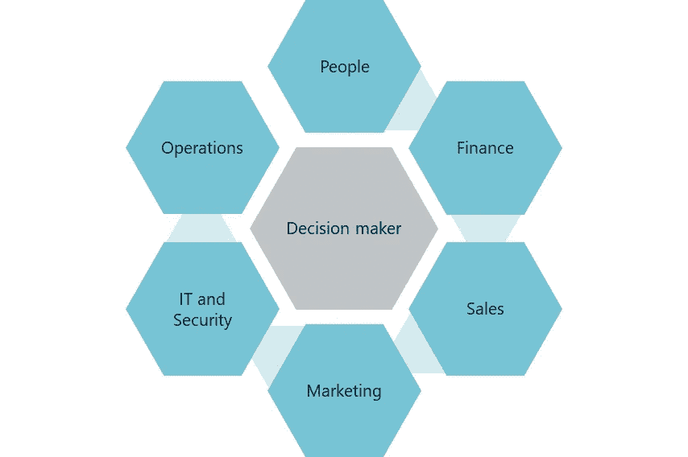

# 如何能让商业洞察触手可及？

> 原文：<https://medium.datadriveninvestor.com/how-can-you-get-business-insights-at-your-fingertips-965540cc79d7?source=collection_archive---------18----------------------->

“给我说实话。“给我事实”——当今每一位应对冠状病毒疫情的世界领导人都这样说。当我们呆在家里保持安全的时候，我们都在消费的一样东西就是信息。

和你们大多数人一样，每天下午 1 点，我都会收看总理关于新冠肺炎局势的最新报道。让我对这些更新感到放心的是，它们不是基于直觉的，而是有坚实的事实和数据支持的。现在，数据比以往任何时候都更像是拯救世界的英雄。

原则上，经营一家企业难道不与管理一个国家相似吗，尽管规模非常不同？就像内阁一样，企业也有财务、销售、营销、人员、IT、运营、安全等部门。

如果你现在像世界上任何其他商业领袖一样，我可以想象你将面临比以往任何时候都更大的压力，要迅速向企业提供关键的见解。作为你所在公司或部门的决策者，你是如何决策的？它们有实时数据支持吗？

> 你知道你的顾客或市民现在的感受吗？他们开心吗？他们沮丧吗？他们想离开你的服务吗？
> 
> 你坐在家里就能掌握企业运营的脉搏吗？需要多少面粉包来保持货架上的库存？我们满足了对牛奶的需求吗？
> 
> 我们的制造工厂能满足日益增长的需求吗？机器是否能达到其目标整体设备效率(OEE ),还是会失败？我们能否主动采取措施来提高机器的可用性，以满足需求？

振作起来，以上问题可以在数据和分析的帮助下得到解答！企业从来不缺数据，只是没有能够将这些数据的价值最大化。在这些数据的基础上使用分析，有可能揭示决策者**如何理解组织的故事； ***客户、财务、过去、现在和未来的运营。*** 洞察上述情况可以极大地改善你对客户需求的回应方式。**

# 你能从哪里开始？

1.  从理解你的企业愿景开始
2.  定义您的关键绩效问题(kpq ),即您需要回答的紧迫问题
3.  盘点一下您的数据资产，这将有助于回答这些问题。数据资产的例子包括客户、产品、供应商、位置等。
4.  将所有不同的数据资产整合到一个弹性的、健壮的 Azure 云数据平台中。让数据专家清理并在其上构建数据模型
5.  使用 Power BI 仪表盘可视化您的数据并与之交互

一旦你做到了这一切，你将有关于你的人，财务，销售，营销和运作的信息唾手可得。

现在，重新想象您可以用这些数据做些什么…

*   如果决策是自动化的会怎么样？
*   如果端到端流程实现自动化会怎样？
*   如果整个业务都自动化了会怎么样？
*   如果您的运营速度提高 10 倍，或者成本效益提高 10 倍，会怎么样？
*   你明天能做什么而今天没做的事？

这就是自动化企业的样子。这就是商业的未来。这就是数据在重塑您的运营中所能扮演的角色。

 [## 将爱好展示变成赚钱机器|数据驱动的投资者

### 这是造梦者奥斯卡·冈萨雷斯响应号召的地方。他是一名独立的在家工作的顾问，担任…

www.datadriveninvestor.com](https://www.datadriveninvestor.com/2020/02/14/turn-hobby-showcase-into-money-maker/) 

以上所有的事情一开始可能看起来让人不知所措，但是最好的前进方式就是开始行动！