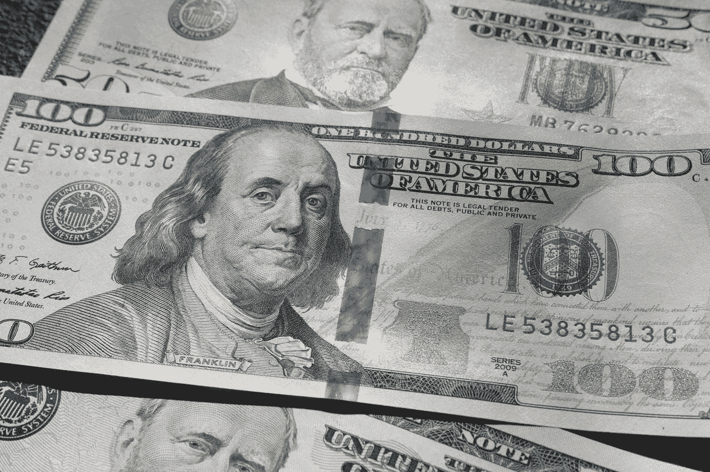

# 央行如何凭空创造货币

> 原文：<https://medium.datadriveninvestor.com/how-central-banks-create-money-out-from-the-thin-air-e01453d81ab?source=collection_archive---------0----------------------->

## 简化的量化宽松

Photo by [Colin Watts](https://unsplash.com/@imagefactory?utm_source=medium&utm_medium=referral) on [Unsplash](https://unsplash.com?utm_source=medium&utm_medium=referral)

美联储于 2020 年 3 月 15 日宣布了 7000 亿美元的量化宽松计划，以应对病毒爆发对经济的影响。

中央银行再次凭空创造货币。如果你认为这与你无关，那么你可能住在火星上。

如果你活在这个世界上，你需要知道钱是怎么回事。

这将是量化宽松政策的一个过于简化的版本，每个人都很容易理解。那么，让我们开始吧。

# 基本定义

量化宽松是一个简单的过程，央行通过用之前不存在的现金买断债务(大多数情况下是坏账)向经济注入更多现金。

为了更好地理解，让我们用一个例子。

克拉拉用 100 美元从黛西那里买了一个玩具。克拉拉支付了 50 美元，并承担了 50 美元的债务(她将分期付款)。经济衰退，克拉拉再也无力支付黛西的费用。还有，这个玩具现在值 20 美元。布鲁诺来救克拉拉。

 [## 现金为王，比我们想象的更强大|数据驱动的投资者

### 2020 年 3 月 12 日，在川普总统宣布新冠肺炎进入国家紧急状态的前夕，纽约时报报道…

www.datadriveninvestor.com](https://www.datadriveninvestor.com/2020/03/26/cash-is-king-more-potent-than-we-think/) 

克拉拉将玩具的所有权转让给布鲁诺。但她仍然可以使用它，玩它。然后布鲁诺给黛西(代表克拉拉)开了一张支票，付清了玩具的 50 美元债务。但是有一个问题。布鲁诺没有钱。

然而，布鲁诺有权威。布鲁诺所说的钱就是钱。布鲁诺需要做的就是用钢笔在卫生纸上写下 50 美元，然后交给黛西。然后黛西可以想怎么花就怎么花。

如果有人向黛西挑战写有 50 美元的卫生纸，她只需说:“布鲁诺给我的”。它会被接受的。没有人敢违背布鲁诺的意愿。

布鲁诺是中央银行。克拉拉是在经济低迷时期需要拯救的公司(或实体)。Daisy 是商业银行或投资银行等。

这就是事情变得疯狂的地方。有些情况下，黛西和克拉拉是同一个实体。其实这种情况是最常见的。并发症还会继续下去。

如果出现经济下滑，布鲁诺如何选择帮助谁？显然，布鲁诺并不能帮助所有人。布鲁诺只帮助那些失败会给社会带来重大影响的人。布鲁诺只帮助大人物。

人们期望大国帮助小国，但它们可以选择不这样做，并逍遥法外。

> 差不多就是这样。如果你想要一个更复杂的解释，那么看看这里的。

# 中央银行

世界上有 5 家顶级央行控制着他们所在的 5 个国家或选区的经济和货币政策。它们包括:

*   美国美联储银行
*   英格兰银行(英格兰)
*   欧洲中央银行
*   日本银行(日本)
*   中国人民银行(中国)

这些是世界上最大的布鲁诺。有趣的是，他们不受政府控制。他们(在某种程度上)对政府负责，但他们不受政府约束。

让我们谈谈美国的美联储，因为它与最大的经济体打交道，并领导所有其他中央银行。

# 美联储

美国的美联储是在 1913 年[建立的](https://en.wikipedia.org/wiki/Federal_Reserve)，这是由于该国在那之前经历了金融动荡。该法案于 1913 年 12 月在 T4 获得美国国会通过(并由美国总统签署成为法律)，美联储由此诞生。但是真正的策划创作发生在 1910 年，当时几个银行家在哲基尔岛举行了一次秘密会议。

1971 年，尼克松总统取消了美元的金本位制。因此削弱了世界上其他货币与美元挂钩的国家的竞争力。这一事件被称为[尼克松冲击](https://en.wikipedia.org/wiki/Nixon_shock)。

美元货币在 1971 年之前基本上是一种黄金证书。你可以用这种货币兑换实物黄金。但是在 1971 年 8 月，当尼克松总统宣布取消美元的金本位制时，已经有一部法律禁止个人拥有黄金。(该法律后来在 1974 年被废除)。

这是什么意思？以前，如果美国想要创造一张 20 美元的钞票，他们必须确保他们的储备中有等值的黄金。

1971 年尼克松宣布后，美国可以随心所欲地印钞票。这种货币不再与任何东西挂钩，而是与美国的实力和声誉挂钩。请这样想:

> 印刷一张 100 美元的钞票大约要花费 15.4 美分

大多数其他国家通过布雷顿森林协定将他们的货币与美元挂钩。因此，协议不得不失败。这基本上把央行变成了印钞机。

自 1971 年以来，美元一直在贬值。现在黄金的价格大约是每盎司 1648 美元。当你阅读这篇文章的时候，你可以查看[的实时黄金价格。当然，自 1971 年以来，金价总体上一直在上涨。一盎司黄金过去是 35 美元。](https://www.moneymetals.com/precious-metals-charts/gold-price)

下图显示了自 1971 年以来黄金是如何以美元定价的:

source: [gold.org](https://www.gold.org/goldhub/data/gold-prices)

今天的重点不是美联储金库里有多少黄金。相反，这取决于他们的资产负债表上有多少债务。这告诉你世界发生了多大的变化。

# 2008 年的事件

美国经济在经历了 2006 年的惊人高点后，于 2008 年开始下滑。对实际发生的事情有几种解释。但是问题的主要部分与次级抵押贷款有关。显然，太多不该给的贷款给了。这造成了坏账。

坏账是债务人拖欠的债务。贷款的基础资产已经损失了太多的价值，以至于卖掉它毫无意义。即使有人试图出售，也找不到买主。

2008 年的房地产市场就是如此。美联储迅速介入以挽救局面。为了从 2008 年的危机中拯救经济，超过 1.4 万亿美元被印了出来。

所以，布鲁诺选择了他要帮助的人，于是就有了更多写有数字的卫生纸。

那么，它对你有什么影响呢？

# 量化宽松如何影响你

假设你有 50 美元(在市场下跌时),并且你是布鲁诺领地上最富有的人。黛西(在大多数情况下也是克拉拉)拿着布鲁诺的支票(写在卫生纸上的 50 美元)去购物时，店主立即收下了钱，并承诺将来会送货。于是，店主一夜之间变得和你一样富有。

而且渐渐的大家都会知道街上又多了一个有钱人。那些卖给你的人看到了这一点，并在你和店主之间制造了一场需求竞争(而供应并没有改变)。

以前，他们唯一的需求来自于你，因为你是唯一一个足够有钱向他们购买的人。现在店主也有了 50 美元，需求增加了，因此他们会提高价格来平衡竞争。涟漪效应将贯穿整个经济，直到波及到最小的项目。

因此，你的 50 美元不再能做它能做的事。它再也买不到它能买到的东西了。已经贬值了。

这里面有意思的地方不是现在的店主和你一样有钱。相反，钱不是工作或价值创造的结果。布鲁诺创造了金钱。这是什么意思？

# 新的货币法则

在量化宽松成为可能之前，货币是对价值创造的奖励。然而，量化宽松成为现实后，金钱不再是对所创造价值的奖励。

如果你继续将金钱视为对所创造价值的回报，你将继续成为布鲁诺街上的富人，看到你的钱的价值会进一步下跌。

你可以努力创造更多的价值，并为此获得报酬，但布鲁诺可以更快地在卫生纸上写数字。在大多数情况下，他会的。

> 新的货币法则是用货币创造价值

知道布鲁诺是谁，知道他有什么能力，不如尽可能多的把他的卫生纸钱弄到手，用它来为社会创造价值。

你不是因为创造价值而获得报酬，而是因为创造价值而获得报酬。这是新的金钱法则。这就是我们今天的社会。

# 今天的现实

当我写这篇文章时，世界正面临着严重的健康挑战。一种传染性病毒使商界陷入瘫痪。各地的经济都在下滑。布鲁诺再次飞来拯救世界。

你能看到发生了什么吗？各国政府宣布向经济注入的刺激方案，猜猜是从哪里来的？布鲁诺。

看看这个:

这就是现在金融界的运作方式。你打算怎么办？

# 结论

我不认为这个系统不公平，因为我不喜欢它(老实说，我一点也不喜欢)。我认为这不公平，因为没有这方面的正规教育。

成千上万的人仍然希望通过每天努力工作赚钱来谋生(因为他们在学校受到的训练)。悲哀。

我希望这有助于你理解量化宽松和金融世界是如何运作的。

> 附:这篇文章是书中的一章— [如果你想变得富有，不要为金钱而工作](https://www.amazon.com/dp/B08BDT947T)