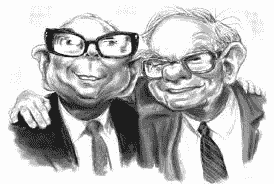

# 查理·芒格如何忍受痛苦的生活成为有史以来最伟大的投资者之一。

> 原文：<https://medium.datadriveninvestor.com/how-charlie-munger-endured-a-life-of-suffering-to-become-one-of-the-greatest-investors-of-all-time-ca108a61c4cf?source=collection_archive---------9----------------------->

你知道查理·芒格是沃伦·巴菲特无限聪明的合作伙伴。

很少有人知道他所经历的挣扎。每一次，他都受到挑战。

大多数人会屈服于自怜。面对逆境，他不屈不挠。

以下是他的胜利。

1943 年从大学辍学，随美国陆军参加第二次世界大战。

没有学位，他设法成为一名军官。他受训成为气象学家，被调到阿拉斯加。

没有本科文凭，他选择了研究生课程，并因此被哈佛法学院录取。

查理 21 岁结婚，在加利福尼亚从事法律工作。他 29 岁时离婚，有三个孩子。他妻子拿走了一切，让他一贫如洗。

离婚两年后，他的儿子泰迪死于白血病。他在两个孩子之间周旋，一边做律师，一边去医院看望泰迪。

他和一个有两个孩子的女人再婚了。他父亲突然去世后不久。

他放弃法律从事投资管理。他遭受了严重的损失，导致他关闭了他的投资伙伴关系。

他患有白内障，接受了摘除手术。手术不太顺利。他的一只眼睛失明了，并选择摘除它。他本可以责怪外科医生，但他责怪自己不知道还有另一种并发症几率更小的手术方法。

手术后，他与沃伦·巴菲特一起创建了伯克希尔·哈撒韦公司。他们可以说是有史以来最伟大的投资者。

面对厄运，我们中的任何一个人都会放弃。

查理继续前进。他把障碍变成了机会。

感谢阅读。如果你喜欢这个，请考虑给我一个关注。

*原文由 schmaynes(*[*@ schmaynes*](https://twitter.com/schmaynes)*)于*[*2021 年 2 月 16 日*](https://twitter.com/schmaynes/status/1361755859236364292) *发推。*