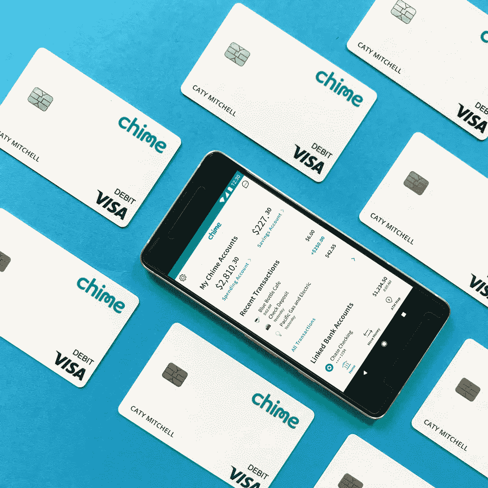
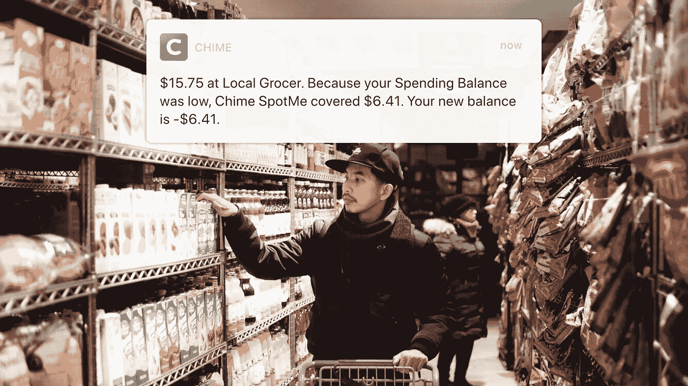
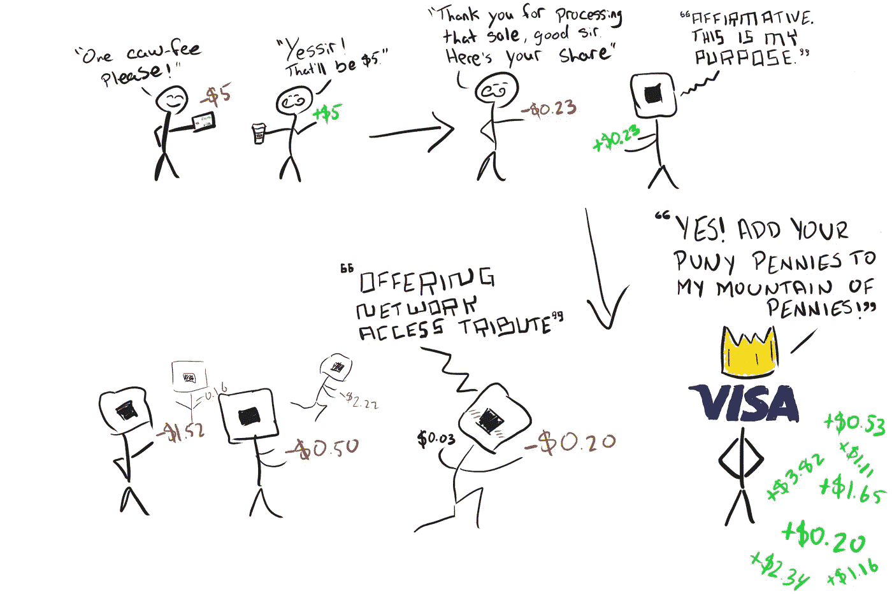

# Chime Bank 如何通过调查用户的不满来取消传统的银行费用

> 原文：<https://medium.datadriveninvestor.com/how-chime-bank-removed-traditional-bank-fees-by-investigating-customers-frustrations-742044ba3697?source=collection_archive---------4----------------------->

## (金融)技术评论

## 没有所有典型的银行策略，Chime 如何创收？Chime 花时间了解其客户的失望，并设计了一个银行应用程序来利用补救措施。

> “没有免费的东西。没什么。甚至不好，*尤其是*不好。”——林登·约翰逊

我不知道约翰逊总统先生，Chime 似乎做了一些好事，而且几乎是免费的！

你经历过，我也经历过。透支屎风暴。你的天平正在冒烟，但你的胃也是。你看到你的账户里有足够的钱去买便宜的东西，但是第二天你因为之前的一笔交易最终打到你的账户上而被过度提取，然后又有一笔交易打到你的账户上，一笔又一笔。现在你欠你的银行 75-102 美元，因为你花了其中的一小部分。

像 your Chase 或 Wells Fargo 这样的传统银行在透支费用上赚了大钱，事实上，2017 年美国人支付了超过[343 亿美元](https://www.marketwatch.com/story/overdraft-fees-havent-been-this-bad-since-the-great-recession-2018-03-27)的透支费用！那是一个 B，就是说，这一集是由字母 B 为 Buh-billion 带给你的。

那么，Chime 是如何改变游戏的呢？这家初创公司有什么不同，更重要的是，他们如何在没有传统银行收费结构的情况下创造收入？

# 透支费？不，谢谢你！

Chime 根本不收透支费。如果您的帐户中没有足够的钱，您的费用将被拒绝。

You know what I meme, I mean “mean”

如果你从未被允许透支，你就不会被收取透支费。

最重要的是，如果您在您的 Chime 帐户上有直接存款设置，每月至少存款 500 美元，Chime 将解锁他们的 SpotMe 功能。如果您的交易将透支您的帐户，Chime 将根据您在 Chime 的回报情况向您收取 20 至 100 美元。

如果您的下一笔费用是 25 美元，而您的帐户中只有 5 美元，那么 Chime 将允许交易通过，并要求您偿还您的帐户以支付这 20 美元，任何未来的交易都将被拒绝。一笔小额无息贷款。

Gotta buy that almond milk. (Source: [Chime Press Kit](https://drive.google.com/drive/folders/0BzFsMDc0N1PMZm1uWlZBT1dqaVk))

相比之下，传统银行的相同场景将让交易通过，然后向您收取额外的 34 美元作为透支费。为了 54 美元让你陷入困境。哦，如果你再次透支，那是另一笔费用。

# 我撒谎了，Chime 确实通过收费赚钱…交换费

我从小就知道，如果某件事听起来好得不像是真的，那么它很可能就是真的。现在我长大了，每当我看到一些听起来不错的交易时，我不是逃跑，而是调查。浏览 Chime 的网站时，我发现了这个关于 Chime 如何赚钱的信息:

> “每当您使用 Chime Visa ️借记卡购物时，Visa 都会向商户收取所谓的交换费，以处理您的付款。
> 
> 该交换费的一部分将支付给 Chime。
> 
> 每当你用 Chime 卡支付账单和购物时，这些 Visa 交换费就会增加，因为 Chime 会得到一小部分。”— [钟声](https://www.chimebank.com/2018/04/30/how-does-chime-make-money/)

这主意不错。为了说明 Chime 正在做什么，请参见下面我粗略绘制的流程图:

Everything is easier to learn when you use adorable stick figures!

当你在一家商户使用你的 Visa 卡(或万事达卡或美国运通卡)时，该商户通过他们的收银机或 PoS(销售点)刷卡。PoS 向使用其支付处理服务的商家收取少量费用。在上图中，正方形是我们的支付处理器，你可以在这里看到他们的费用结构。通常每笔交易的利率范围为 2.5% + $0.10 至 3.5% +$0.15。Square 与 Visa 达成协议，可以接受 Visa 借记卡和信用卡，作为允许 Square 处理客户的 Visa 借记卡和信用卡的交换，Square 同意向 Visa 支付商定的交换费。Visa 实际上列出了他们所有的各种交换费[在这里](https://usa.visa.com/dam/VCOM/download/merchants/visa-usa-interchange-reimbursement-fees.pdf)。

因此，当 Visa 从支付处理器收取费用时，Visa 可以确定使用了哪张卡(在我们的情况下是一张 Chime 借记卡),然后向 Chime 支付约定的百分比。

因此，如果你去咖啡店消费了 5 美元，而咖啡店使用 Square 处理你的付款，你的咖啡店支付 Square 0.23 美元:

> (5 美元 x 2.6%)+0.10 美元= 0.23 美元

然后 Square 必须向 Visa 支付 0.20 美元:

> (5 美元 x 1.9%)+0.10 美元= 0.20 美元

从 0.20 美元的钟声将得到一份。我们不知道份额是多少，因为该信息在 Chime 和 Visa 之间是保密的。

这看似微不足道，但 Visa 每秒钟能处理 65，000 笔交易 ***，*** ，迄今已交易超过 11 万亿美元( [*来源*](https://usa.visa.com/dam/VCOM/download/corporate/media/visanet-technology/aboutvisafactsheet.pdf) )。所以在感恩节晚餐中，这几美分加起来比卡路里还快。那是一份肥缺，我想加入。

# 最后的想法

所以看起来有些事情好得像真的一样。我们只需要花时间去了解事情是如何在后台运行的，以真正了解一个产品或服务是有助于还是阻碍我们的目标。

我写这篇文章的意图是双重的；首先，我想了解并教授交换费是如何运作的，因为这似乎不是一个众所周知的话题。其次，当一家公司或初创企业以公平公正的方式开展业务时，我认为他们应该得到反其道而行之的表扬。拥有 500 万用户且仍在增长的这家“小型”初创企业似乎真的引起了人们的共鸣。如果你想亲自尝试一下 Chime，请点击这里查看它们。(*该链接是一个附属链接，所以我可能会得到补偿，如果你创建一个与 Chime 的帐户)。*

如果你喜欢这篇文章并且对我的其他文章感兴趣，我欢迎你在这里注册我的个人每月简讯[！](http://thought.coffee/home)

快乐学习！