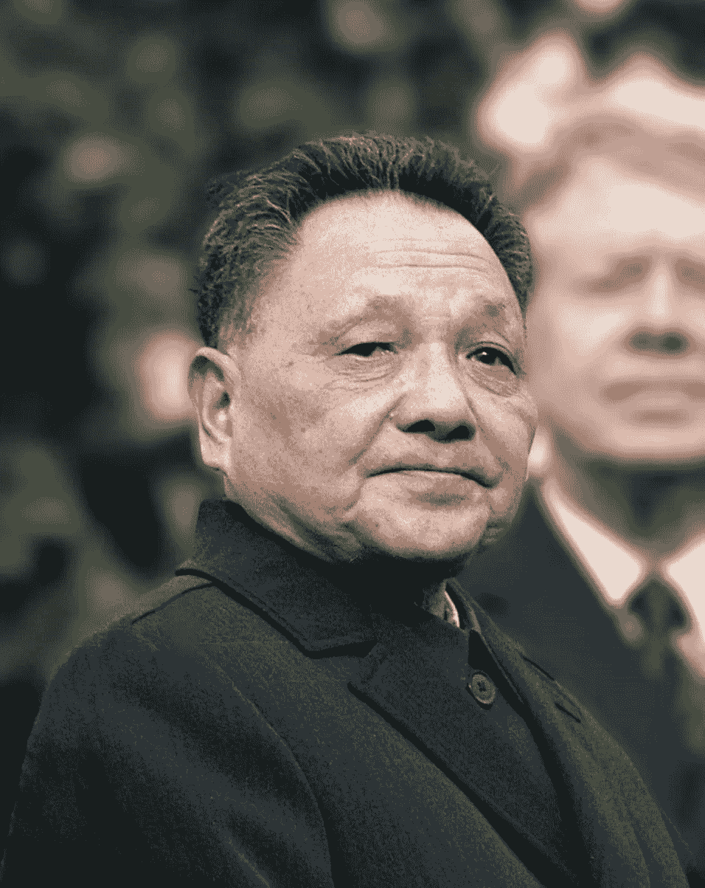
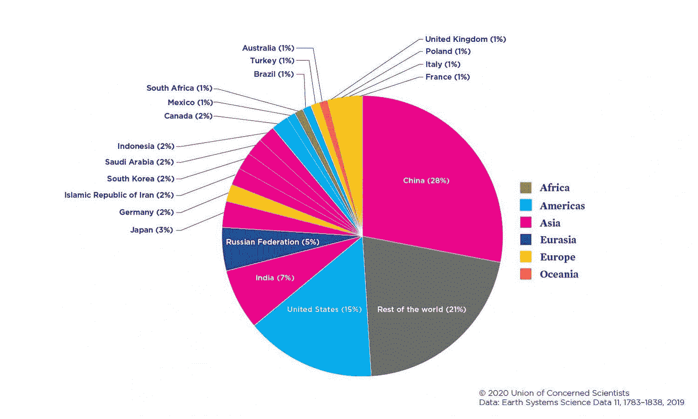

# 中国如何变得如此强大

> 原文：<https://medium.datadriveninvestor.com/how-china-becomes-so-powerful-d829ca2ebea3?source=collection_archive---------31----------------------->

## 世界工厂

大约在 19 世纪，它开始发生变化。在欧洲和美国，一场重大革命开始发生(科学、机器、武器、工业)。随着新力量的出现，这些国家开始扩张，占领大片土地。中国仍然是一个伟大的文明，因为西方开始出现，用他们的大炮敲中国的门。中国无法与强大的火力相抗衡。所以中国用他们的土地(香港)向他们妥协。

工业革命的开始方式与西方不同。在 1800 年中期，中国经历了大规模的衰落。当邻国日本入侵时，情况变得更糟。中国的经济绝不是繁荣的中央王国，而是自身的影子。

随着西方经济向公司、股票市场发展。中国仍在衰落。中国没有加入资本主义政党，而是拒绝转向一党制。

到 20 世纪 70 年代，中国是一个普遍贫困的地方。这个繁荣的王国到达了它的谷底。这一切都将改变。

20 世纪 70 年代末，中国新领导人邓小平。他上台，希望扭转一百五十年的屈辱。在该地区的其他地方，中国的邻国经济加入了资本主义正在发生的全球经济聚会。他们看到了让数百万人摆脱贫困的巨大奇迹。邓上任之初曾专门去过一次新加坡，那里的华人实行自由市场经济。他感到很受鼓舞，是时候看到中国可以通过尝试一些资本主义模式来重建经济了。但邓必须小心行事，以免扰乱一党专政的中国。邓开始着手这项工作，他从深圳的一个小村庄开始。深圳是中国南方的一个只有大约 3 万人口的村庄。小平把这部分国家称为经济的中心部分，外国可以在这里建立和投资。因为这个村子位于香港旁边。

接下来发生的是地球上前所未有的令人震惊的经济奇迹。作为经济中心的这个沉睡的小村庄从一个渔村变成了一千万人口的聚集地。平均收入从一天一美元到一年三万美元，这在全中国都开始了。很快，中国的一些城市被指定从事特殊的经济活动。越来越多的外国公司转向中国寻求廉价劳动力。它成为了世界工厂。

我知道这个话题是关于中国在某种程度上是如何变得强大的。但它完全忘记了这种发展在中国土地上留下了什么印记。此外，中国人离开西方失业，因为他们在制造业的增长。我写这些都是因为中国崛起的故事往往是资本主义在全世界的崛起。而是它以发展的名义从你们身上夺走了什么。如上图所示，中国是世界上最大的二氧化碳排放国之一。发展不应被视为一枚硬币的一面，它还有另一面。这一发展并不意味着它使 1%的顶层人口受益。

- [dharnish](https://www.facebook.com/giridharnish/?view_public_for=100235262077830)

*最初发表于*[T5【https://weekendblogbydk.blogspot.com】](https://weekendblogbydk.blogspot.com/2021/01/how-china-becomes-so-powerful.html?fbclid=IwAR0LPWYDvsv49VuvogUjPbde-DZ-DRVZZ_wkEe3N7XXQ8HrpA-KJDfVJamE)*。*