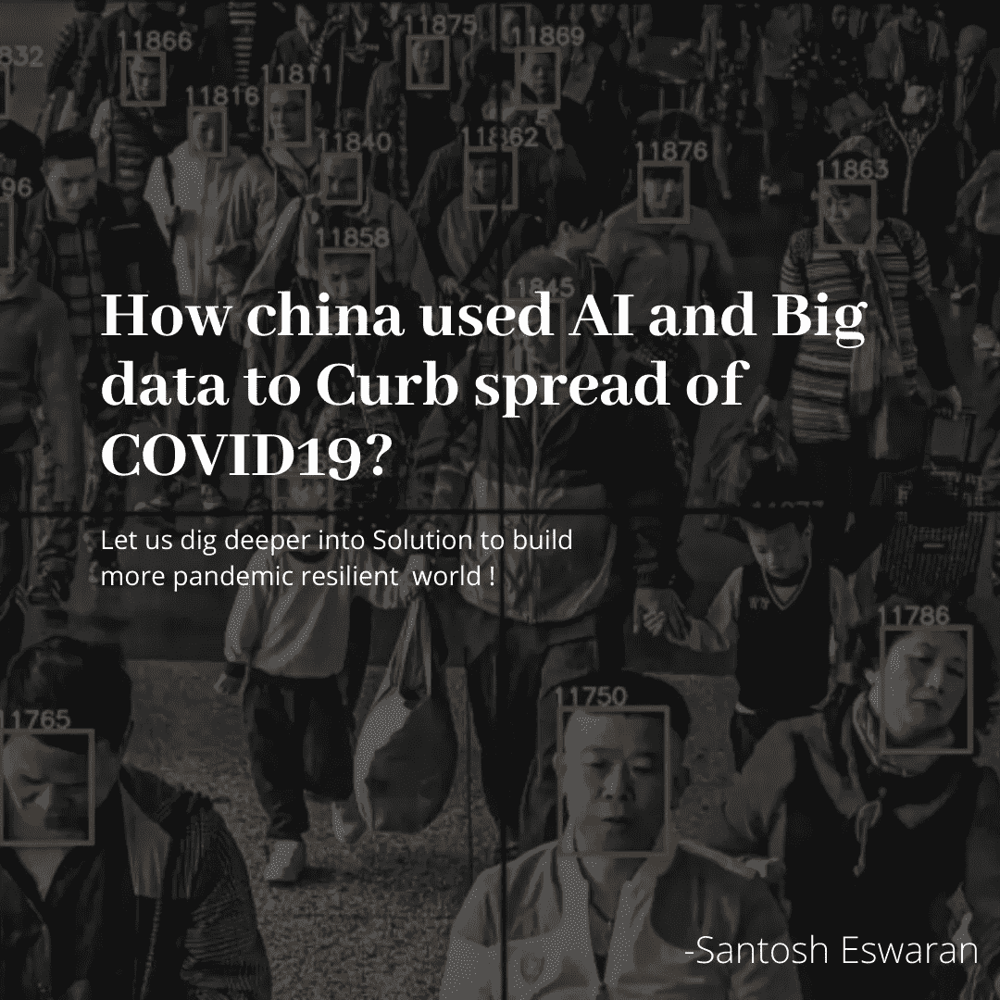
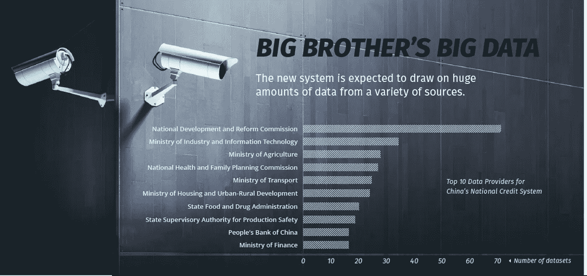
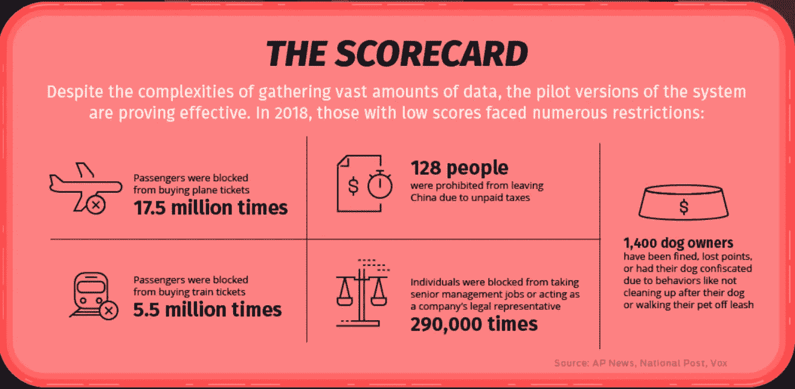

# 中国如何利用人工智能和大数据来抑制新冠肺炎病毒的传播？

> 原文：<https://medium.datadriveninvestor.com/how-china-used-ai-and-other-technologies-to-curb-covid-19-spread-68c2ac2fdfa3?source=collection_archive---------4----------------------->

作为一名技术顾问和企业家，当全球问题或危机出现时，我的思维总是围绕着技术解决方案，而不是我的日常事务(很抱歉我错过了最后期限，因为我更沉迷于此)。类似地，当我四处寻找许多发达国家政府、普通公众等由于新冠肺炎的全球疫情而面临的关键问题时。作为一个系统的程序，我列出了印度和其他发展中国家面临的一些主要问题，

# 第 1 和第 2 阶段全球面临的问题

> 1.隐藏旅行记录。
> 
> 2.非自我隔离的个人病毒进口商(大规模传播者)。

受过良好教育的人和需要更多社会责任感的名人也被认为违反了实施的规定，从像奥运冠军玛丽·科姆参加印度总统举办的早餐会而不是自我隔离这样的事件开始，[卡妮卡·卡普尔](https://timesofindia.indiatimes.com/entertainment/hindi/music/news/all-266-contacts-of-kanika-kapoor-traced-with-over-60-samples-testing-negative-for-covid-19/articleshow/74842941.cms)也是如此。旁遮普邦和印度其他地区的情况非常危急，政府知道大约 90，000 人([报纸上报道的旁遮普邦 NRI 数字](https://theprint.in/health/preacher-who-was-punjabs-1st-covid-19-death-could-have-been-a-super-spreader/388946/?utm_campaign=fullarticle&utm_medium=referral&utm_source=inshorts))在过去几个月中有去外国地区或国家的旅行史，但无法找到那些旅行过的人。政府发出了一份公共通知，要求人们自我报告，但某些人，如 Baldev Singh，隐瞒了他们的旅行史，未自我隔离，成为大规模传播者。与此类似，印度的另一个宗教集会事件被认为是印度 30%的 COVID19 病例的原因。

# 第 3 和第 4 阶段全球面临的问题

> 1.无法追踪传染源。
> 
> 2.缺乏医疗设备、设施和卫生工作者。
> 
> 3 .食品和基本供应链需求和成本管理。

在接下来的会议中，让我们看看中国是如何利用技术来应对这个问题的。

# 解决方案搜索矛

在确定了关键问题后，我采取的下一步是深入研究和了解不同国家如何使用技术反击 COVID 19。这时，我突然想到了中国的社会信用体系。

 [## 人工智能和监督资本主义|数据驱动的投资者

### 大科技，总是现在:人工智能推动的大科技，已经使购物，搜索，在你的…

www.datadriveninvestor.com](https://www.datadriveninvestor.com/2020/03/04/on-artificial-intelligence-and-surveillance-capitalism/) 

我最近读了一些关于中国社会信用体系的文章，我个人并不十分支持社会信用体系，但是作为一个企业家，我认为这个体系创造了无数的机会来帮助政府对抗某些危机(这是我在疫情崩溃之前的想法)。所以我幻想着中国将如何利用社会信用系统背后的技术来对抗新冠肺炎。

# 中国社会信用体系背后有哪些技术？和它的事实！

如果我说我买了多少公斤/升洋葱/酒，政府也知道，是的，中国有一个系统来记录你的所有数据，包括你的购买数据，你在不同旅行模式下的旅行历史，金融交易数据，甚至我的位置跟踪，通过我手机里的应用程序，闭路电视和支付。

Above Image Shows how much data sets are pumped by a different Government agency of China. Source:[https://www.visualcapitalist.com/](https://www.visualcapitalist.com/)

这里提到的所有大数据都是针对近 14 亿人的实时数据，如果你违反交通规则，考虑你的社会信用分数为 600，而你的分数下降到 550，例如，你可能会被限制立即购买公共交通系统的车票，直到你的分数增加到一定的限度以上。

想简单了解[社会信用体系](https://www.youtube.com/watch?v=NXyzpMDtpSE)的趣事，点击这里。

# 中国会如何利用现有的基础设施来对抗 Covid19？

我花时间建立我的思维过程和世界各地的情况。现在是时候深入研究技术解决方案了。

## 深入了解技术解决方案:

请注意，中国已经有了一个名为社会信用系统的系统，可以跟踪和抽取大数据，根据你的个人身份和社会信用评分来限制某些访问。

## 已经可用的数据点和系统:

这些是自 2008 年以来开发和测试的中国社会信用体系良好构建的大数据系统中可用的少数数据点，

1.  公共交通旅行历史和旅行票限制系统。
2.  个人和团体的实时位置跟踪系统。
3.  通过在几秒钟内与人数据库中的 13 亿张照片进行匹配，对人脸进行图像识别。
4.  通过与腾讯和阿里巴巴的合作，人们的大多数支付和购买模式都通过社交信用系统进行跟踪。这些模式将受到监控，以根据您的购买行为降低您的分数(例如:如果您购买了酒，您的分数将会降低)
5.  识别在公共场所乱丢垃圾的人并施以严厉处罚的系统。

Above Image Shows, Restriction implied on People with Low Credit Scores. Source: [https://www.visualcapitalist.com/](https://www.visualcapitalist.com/the-game-of-life-visualizing-chinas-social-credit-system/)

## 输入激励系统的数据点:

根据旅行和个人接触历史数据，将人员分类/标记为**受感染、有症状、有可能暴露于感染**的人员。(嗨，数据工程师们，如果你对需要输入系统以确保准确性的更多数据有什么想法，请在评论区留言)

## 最终解决方案:

使用已经存在的数据和数据反馈，以及少量的算法调整，中国会做什么，

## 追踪感染源的解决方案:

*   人们被标记为受感染，这些数据正在用社会信用系统数据进行分析

> 1.发现没有症状但感染风险高的人可以通过使用来自相机的数据集的可用性进行分析，并使用人工智能实时跟踪感染者和有症状的人的位置来识别。
> 
> 2.然后隔离没有症状但很可能感染病毒的人，这将有助于抑制病毒的传播，并对他们进行隔离。如果有人走出去，他们将被跟踪并得到通知。给地方当局

## 为隐瞒旅行史和违反非自我隔离的个人病毒输入者(大规模传播者)规则的人提供解决方案

> 有症状和暴露可能性高的人将被标记(所有最近的旅行者都可以被标记)，如果有任何未经授权的移动，需要使用实时位置摄像机等进行持续跟踪，然后立即通知该机构并受到惩罚。

> 例如:考虑一下玛丽·科姆/卡尼卡·卡普尔的情况，她们两人都坚持自我隔离，因为她们最近有去外国旅行的历史。如果印度有社会信用系统这种技术，当她参加总统早餐会或组织生日聚会时，就会限制她参加任何公共/私人活动。在规定的时间内，对任何有旅行史的人都会采取同样的措施。

## 供应短缺和必需品价格上涨的解决方案:

> 1.隐藏股票，高价出售，购买超过需要的，使用支付系统数据跟踪，然后报告和惩罚。
> 
> 2.跟踪特定位置的需求并根据需求管理供应链将有助于平等地服务所有公众。
> 注和结论

# 注释和结论

> 这种思维过程确实是我的意识形态，可能与中国会被用来抑制 COVID19 的传播略有相似。如果中国没有使用特定的概念，我的建议是，中国和其他发展中国家的领导人以一种向前的方式思考，使用大数据、人工智能、数据分析等技术，在这种新的疫情疫情和全球危机中有效地采取行动。

感谢阅读，

桑托什·埃斯瓦兰。

[https://www.linkedin.com/in/santosh-eswaran/?originalSubdomain =在](https://www.linkedin.com/in/santosh-eswaran/?originalSubdomain=in)