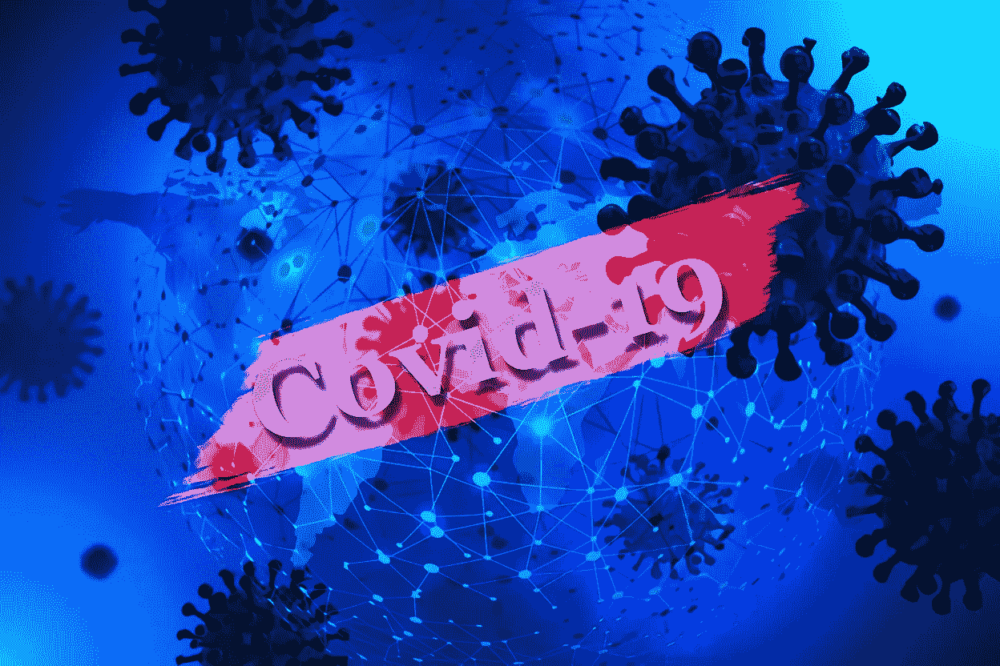
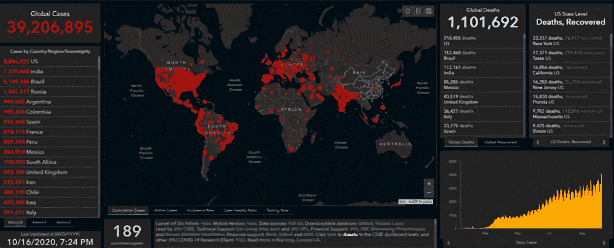
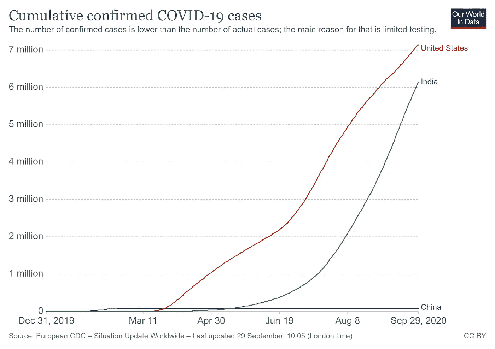
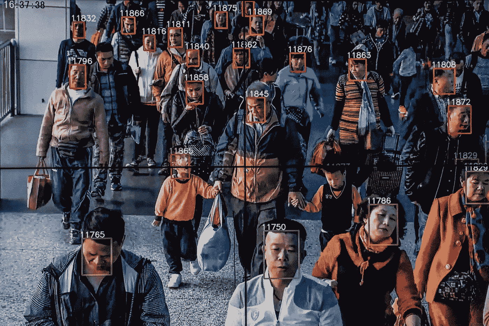
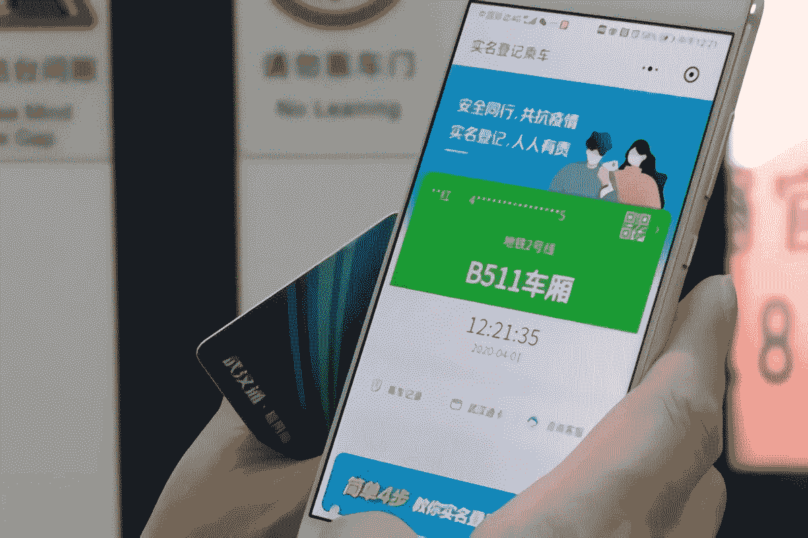
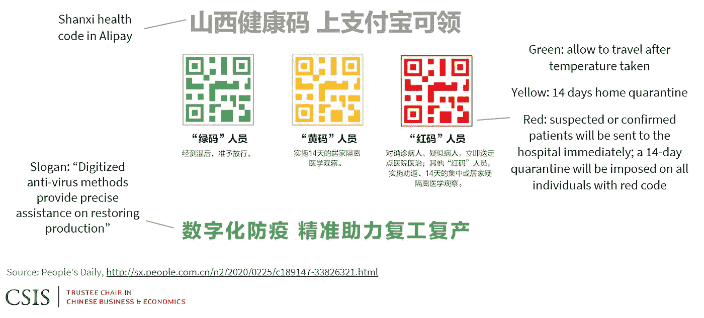
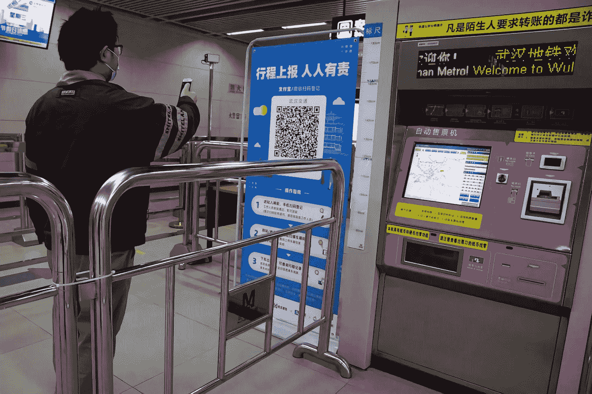
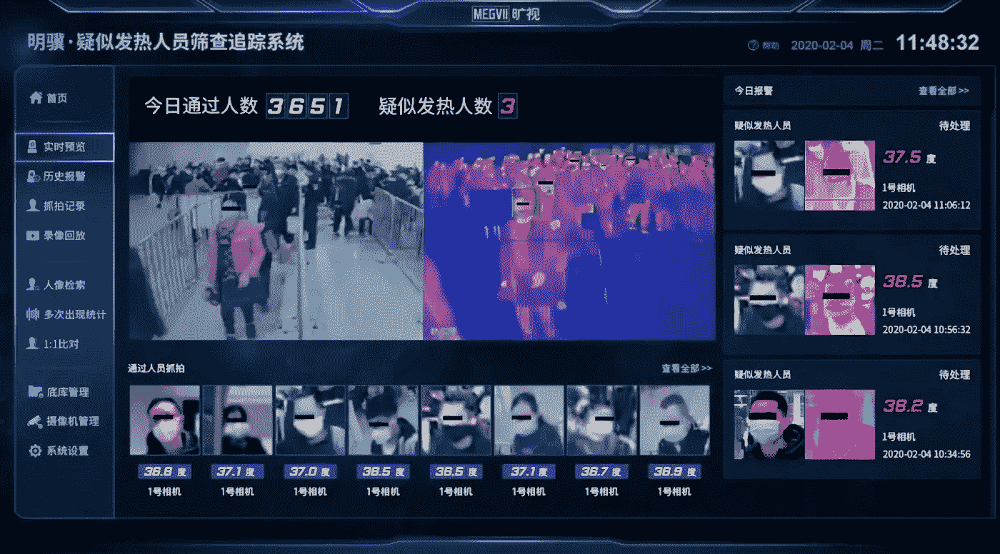
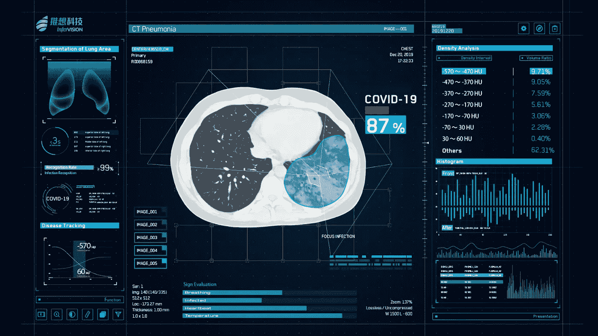
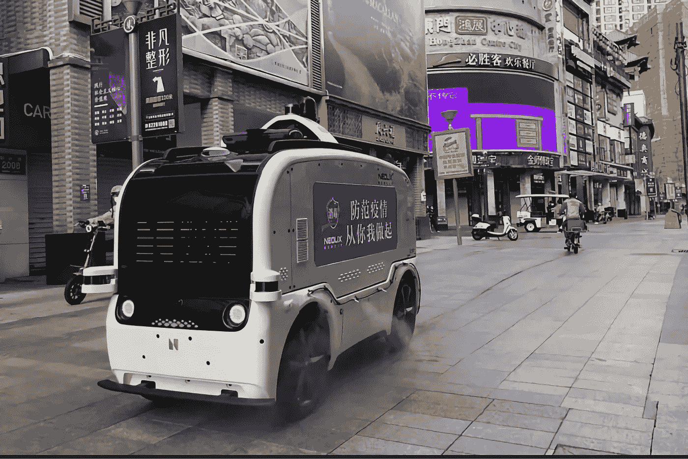

# 中国如何利用人工智能对抗新冠肺炎

> 原文：<https://medium.datadriveninvestor.com/how-china-used-artificial-intelligence-to-combat-covid-19-f5ebc1ef93d?source=collection_archive---------1----------------------->

计算机视觉(CV)和自然语言处理(NLP)使中国取得了成果。

2020 年将被载入史册，因为这一年见证了一场由新冠肺炎疫情引起的全球性危机。当然，新冠肺炎不是世界范围内的第一个疫情。在有记录的历史中，曾有过大量此类影响全球不同地区的疾病爆发。但是新冠肺炎由于如此高的国际旅行而显得与众不同。它在世界范围内迅速传播，导致大多数国家完全封锁。在撰写本文时，仅在 7-8 个月内，全球已有 3900 万新冠肺炎病例，110 万人死亡。

John Hopkins Covid-19 resource center ([Source](https://coronavirus.jhu.edu/map.html))

新冠肺炎也不同于早期的流行病，因为这是全球政府机构和卫生组织首次使用大数据和人工智能的新兴技术来抗击疾病。人工智能一直被描绘成一种有潜力改变我们生活的世界的技术，这次疫情是人工智能证明其承诺的试金石。
一个利用人工智能对抗新冠肺炎的有趣案例来自中国，它是这种病毒的源头。中国最初出现了新冠肺炎病例激增，但很快，它可以在几个月内控制住传播，而世界其他地区仍在努力应对不断增长的病例。如果你观察下面的图表，你会看到中国是一条平坦的线，而作为一个视角，美国和印度也是人口大国，但病例仍呈指数增长。

Covid-19 cases in China vs. India vs. the USA ([source](https://ourworldindata.org/coronavirus/country/china?country=~CHN))

*如果新冠肺炎或类似的疫情发生在十年前，上图对中国来说会有不同的结果。这里是我之前的* [*文章*](https://towardsdatascience.com/traditional-ai-vs-modern-ai-5117b469a0c9) *支持这个理论。*

# 在抗击新冠肺炎的战斗中，中国做了哪些与其他国家不同的事情？

与其他国家不同，为了应对新冠肺炎疫情，中国坚持不懈地以各种可能的方式利用人工智能技术来控制传播。人工智能的主要关注领域是防止传播的大规模监控，其次是提供快速诊断和有效治疗的医疗保健。这不应令人惊讶，因为中国已经是全球人工智能的主要市场之一。根据一份[报告](http://www.xinhuanet.com/english/2019-12/08/c_138615098.htm)，中国人工智能市场预计到 2023 年将达到 119 亿美元。

所以让我们仔细看看中国在人工智能方面采取的各种措施。

 [## 人工智能让我们回归人情味|数据驱动的投资者

### “疫情迫使我们在一夜之间对世界进行数字化改造，”首席技术官 Guibert Englebienne 说

www.datadriveninvestor.com](https://www.datadriveninvestor.com/2020/10/13/artificial-intelligence-brings-us-back-to-the-human-touch/) 

# 1.大规模监控和接触追踪

众所周知，中国对其公民实施大规模监控，而不考虑人们的数据隐私。中国估计有 2 亿个由基于人工智能的面部识别技术驱动的监控摄像头，以密切跟踪其公民。如此广泛地使用人工智能来控制公民，总是引来全球对中国的批评。

China’s existing Mass Surveillance ([source](https://www.nytimes.com/2018/07/08/business/china-surveillance-technology.html))

但当新冠肺炎袭击中国时，其已经建立的大规模监控系统被证明是非常有效的，因为政府可以使用该系统跟踪患者的旅行历史，并预测与患者接触过的其他人可能存在风险。

Contact Tracing App ([Source](https://www.worldpoliticsreview.com/articles/28682/coronavirus-contact-tracing-and-the-right-to-privacy-in-a-pandemic))

中国不仅收集了人们的跟踪数据，还利用这些信息提醒人们注意潜在的新冠肺炎病毒风险，这要归功于在阿里巴巴和腾讯等公司帮助下设计的联系追踪移动应用。该应用程序根据用户的风险状况为他们分配颜色代码。没有风险的人被指定为绿色，而有旅行史或与其他患者关系密切的人根据风险的严重程度被指定为黄色或红色。黄色表示自我隔离，红色的人需要去医院。

China’s Health Code ([Source](https://www.csis.org/blogs/trustee-china-hand/chinas-novel-health-tracker-green-public-health-red-data-surveillance))

这部卫生法规现在已经成为中国允许其公民使用公共场所和服务的基准。许多健康代码扫描仪安装在所有公共场所，如办公室、地铁、火车站和机场，用于筛查人们的黄色或红色代码。中国还强制规定，只有当人们的健康代码为绿色时，才允许他们开车上路。

Man Scanning Health Code in Subway ([Source](https://abcnews.go.com/International/china-rolls-software-surveillance-covid-19-pandemic-alarming/story?id=70131355))

另一个对中国人非常有用的应用是百度地图，它提供了高风险地区的实时信息，以便人们可以远离这些地区。它使用 GPS 定位获得的数据和卫生机构的医疗数据来通知用户他们离新冠肺炎热点的准确距离，以避免他们在旅行中出现。

Baidu Map showing Covid-19 Hotspots ([Source](https://www.capgemini.com/2020/04/new-post-lockdown-use-cases-for-artificial-intelligence-in-china/))

在 2020 年，戴口罩已经成为人们的一种常态，为了自己的安全和防止自己不戴口罩时感染他人，它是强制性的。中国的人工智能公司，如百度、旷视科技、商汤科技和汉王科技，帮助政府建立了面部识别监控，能够识别戴口罩或不戴口罩的人。如果检测到有人没有戴口罩，系统会立即发出安全警报。这些系统还配备了热扫描，以提高公共场所高温人群的警惕。百度在北京清河火车站的监控系统在一月下旬安装后的一个月内能够检测出[190 例疑似病例。](https://www.capgemini.com/2020/04/new-post-lockdown-use-cases-for-artificial-intelligence-in-china/)

Facial recognition with a thermal scan at Chinese Railway Station ([Source](https://www.scmp.com/tech/policy/article/3049215/ai-firms-deploy-fever-detection-systems-beijing-help-fight-coronavirus))

“weChat” ([Source](https://www.wechat.com/en/))

中国政府机构和医疗科技公司最全面的数据源来自移动应用程序“微信”中国科技巨头腾讯集团开发了这款手机应用，现在已经拥有大约**12 亿用户。腾讯是亚洲最有价值的公司，市值 3000 亿。“微信”是所有新冠肺炎联系人追踪背后的主要来源之一。当它与大规模监测数据相结合时，它使接触者追踪成为一项简单的任务。**

> **“微信和大规模监控一起为计算机视觉(CV)和自然语言处理(NLP)专家提供了许多基础，以建立革命性的联系人追踪应用程序的天堂。”**

# **2.医疗保健服务**

**医护人员面临的主要挑战是大量新冠肺炎病例的涌入，这些病例在中国早期就开始接受诊断。当肺部 CT 扫描成为聚合酶链式反应测试确诊前初步诊断的参数时，这对放射科医生来说是一场噩梦。放射科医生不得不手动检查成千上万人的扫描，以确认诊断。快速诊断和早期药物治疗/隔离对于阻止新冠肺炎的传播至关重要，但诊断过程本身在当时成为了一个瓶颈。很快，阿里巴巴、易图科技等中国人工智能公司介入了 CT 扫描图像的人工智能辅助诊断，在最少的放射科医生干预下实现了过程自动化。**

****

**AI-assisted CT scan diagnosis for Covid-19 ([Source](https://www.itnonline.com/article/artificial-intelligence-assisted-radiology-technologies-aid-covid-19-fight-china))**

**这些系统是使用深度学习构建的，并被证明是快速而准确的。使用人工智能评估 CT 扫描对中国来说是一个巨大的转折点，因为它加快了诊断速度。阿里巴巴的诊断系统可以在 20 秒内提供新冠肺炎的[诊断](https://www.capgemini.com/2020/04/new-post-lockdown-use-cases-for-artificial-intelligence-in-china/)，准确率达到 99.6%。到 2020 年 3 月，超过 170 家中国医院采用了这一系统，潜在患者达 340，000 人。**

**另一方面，腾讯人工智能实验室与中国医疗保健科学家合作，开发了一种深度学习模型，可以预测新冠肺炎患者的危急疾病，这可能是致命的。他们把这个[工具](https://aihealthcare.tencent.com/COVID19-Triage_en.html)放到网上，以便提前给予高度优先处理。**

**新冠肺炎是一种新型病毒，这意味着当它出现时，医学研究人员对它一无所知。这一发现一出来，全世界的研究人员就开始研究这种病毒的基因，以创造一种诊断过程，这种诊断过程也可能为疫苗接种打开大门。但是这样的科学研究并不容易，需要大量的资源。**

**阿里巴巴和百度现在都向医疗界提供了他们专有的人工智能算法，以加快研究和诊断过程。阿里巴巴的 LinearFold AI 算法可以[将研究冠状病毒 RNA 结构的时间](https://www.weforum.org/agenda/2020/04/how-next-generation-information-technologies-tackled-covid-19-in-china/)从 55 分钟减少到仅 27 秒，这对快速基因组测试非常有用。同样，百度的开源人工智能算法也比传统的基因组研究方法快 120 倍。**

**在这种危机中，无人机通常有助于提供物资或进行监视。但这一次，自动驾驶汽车和百度、Neolix、Idriverplus 等中国机器人公司也加入了这项任务，他们出租自动驾驶汽车，为医院提供医疗设备和食品。**

****

**Autonomous Vehicle disinfecting public place ([Source](https://www.geospatialworld.net/article/the-sino-approach-use-of-technology-to-combat-covid-19/))**

**Idriverplus 自动驾驶汽车还被用于在公共场所和医院喷洒消毒剂进行消毒。另一家通常为餐饮业制造机器人的公司普都科技，也将他们的机器人部署到 40 多家医院，以支持卫生工作者。**

**中国公司也在迎合全球对自主机器人的需求。[举个](https://www.gaussianrobotics.com/)的例子，[高斯机器人公司声称](https://news.cgtn.com/news/2020-06-01/More-Chinese-AI-companies-offer-extra-help-during-COVID-19-QXWln8dypO/index.html)他们的机器人在本届疫情期间已经销往 20 多个国家。**

# **结论**

**事实上，中国已经想尽一切办法在与新冠肺炎的斗争中最大限度地利用人工智能，一些人可能会质疑为什么其他国家在这方面不成功。中国如此成功的主要原因之一是它无情地使用现有的人工智能大规模监控系统，这些系统不考虑人们的数据隐私。中国使用面部识别来跟踪公民是非常正常的，但在世界上其他地方，数据隐私是一个严重的问题，因为这些监控系统不能如此大规模地存在。尽管人工智能已经在世界许多地方的医疗保健领域得到应用，但没有其他国家能够像中国一样实施大规模监控来限制新冠肺炎病毒的传播。因此，中国在利用人工智能控制新冠肺炎的竞赛中领先了。**

## **获得专家观点— [订阅 DDI 英特尔](https://datadriveninvestor.com/ddi-intel)**