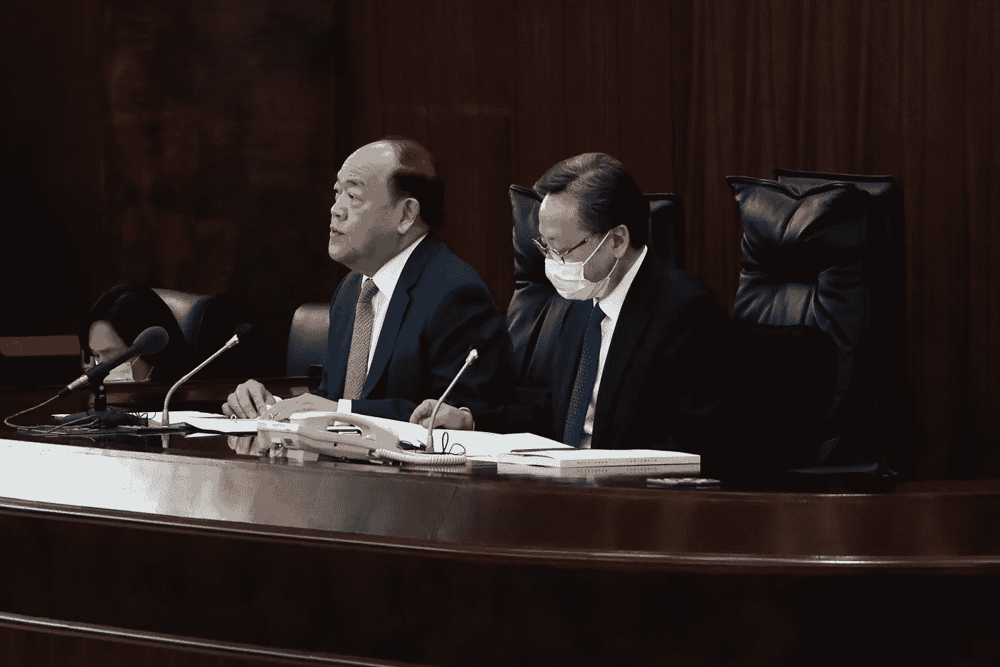

# 中国如何使用面部识别来控制他们的居民

> 原文：<https://medium.datadriveninvestor.com/how-china-uses-facial-recognition-to-control-their-residents-c71e1d5b197f?source=collection_archive---------9----------------------->

## 人们已经习惯了人脸识别的存在

Photo by [Matthew Henry](https://unsplash.com/@matthewhenry?utm_source=unsplash&utm_medium=referral&utm_content=creditCopyText) on [Unsplash](https://unsplash.com/s/photos/security-camera?utm_source=unsplash&utm_medium=referral&utm_content=creditCopyText)

酒店接待旅客，验脸，办理入住。路上车辆川流不息。司机习惯于通过面部识别解锁手机，他们头顶上的摄像头也在使用同样的技术自动拍照。

作为近年来 AI 浪潮中的标志性技术，面部识别已经大规模实施，并应用于安全、金融等日常生活的重要场景。

但这项给生活带来美好改变的技术正处于前所未有的争议之中:当人脸识别技术不断引发个人信息安全问题时，人们称之为“*危险武器”。*

面部识别开始陆续被叫停。从中国发生的“*面部识别第一案*”到杭州某社区抵制面部识别技术，人们对面部识别技术产生了警惕。

从美国巨头到中国科技公司，法庭上被告众多。一些公司被勒令停止和暂停使用面部识别技术。他们站在 AI 浪潮的顶端，但是盲目奔跑的时候却忘了设置。《红线》。

更糟糕的变化是，人脸识别的滥用已经无孔不入，防不胜防。

最近，中国城市济南的一名房屋检查员戴着头盔进入售楼处。这种滑稽的行为揭示了技术开发者、用户和受益者的利益链。人脸识别还没有成为服务消费者的技术。反而成了地产商的精准营销工具。

> 对于用户来说，如果无法避免风险，就只能选择完全避开人脸识别技术

技术的开发者和推广者也会陷入沮丧。这项技术本来就没有恶意。在中国，创新工场董事长曾表示，隐私保护不是非黑即白的问题。作为人工智能技术和多个技术公司的投资者，他的立场代表了许多支持者。

争议和困惑可能是人脸识别发展的必经过程。从目前的情况来看，这个过程会持续很长一段时间。

# 1。 **谁在滥用人脸识别？**

面部信息是人的重要生物特征，具有强烈的个人身份属性。

面部识别技术越来越多地出现在日常生活中，但人们没想到的是，在你注意到之前，你的面部数据已经被“窃取”了。

戴头盔看房这种不正常行为的背后，是一些房地产公司利用人脸识别技术进行精准营销，甚至不惜牺牲购房者的利益。

据《南方都市报》报道，这可能与房地产公司的分配模式有关。销售部配备了人脸识别系统，可以将来访客户区分为自然访客和渠道客户。

自然拜访客户指的是购房者自己了解信息后来售楼部看房的客户，渠道客户指的是通过中介介绍的客户。

一旦渠道客户完成交易，房地产公司会从每笔房产的成交金额中返点佣金。中间商可以利用这个返利把利润转移给消费者，让他们享受销售部门的渠道折扣。

一位与房产中介打交道多年的官方人士告诉《在线洞察》，“这种给中介回扣的模式在业内很常见。根据中间商的级别不同，营业部给的返点占销售额的 0-5%。13%."

在这种情况下，人脸识别系统将自然拜访客户和渠道客户明确分类，这样可以更方便地计算佣金。

但是，一些房地产公司可能会稍微改变流程，这可能会损害购房者的利益。

Photo by [CHUTTERSNAP](https://unsplash.com/@chuttersnap?utm_source=unsplash&utm_medium=referral&utm_content=creditCopyText) on [Unsplash](https://unsplash.com/s/photos/cctv?utm_source=unsplash&utm_medium=referral&utm_content=creditCopyText)

房地产媒体曾发表文章称，某项目推出了一系列年终购房优惠。只要购房者第一次去项目现场看，现场下单，各种优惠就能少花 30 万。但买家必须是第一次来，或者之前没有被相机拍到过。

几个月前也发生过类似的事件。今年 6 月，据《宁波晚报》报道，宋先生的姐姐收受该楼盘售楼部销售经理回扣 2 万元。宋先生也打算买房，但返利审批程序即将结束。当时销售经理汇报说审批没有通过。

审批不成功的原因是，如果想拿到返利折扣，宋先生需要在备案后一小时去营业部，但宋先生在备案后一小时内去了营业部，被人脸识别系统记录。

对于房产这类高价产品，买家在购买时通常会咨询多个渠道。房地产公司用面部识别技术来设定这个规则，实际上是“剥夺”了购房者的比较权。

男人戴头盔的行为，可能是对房地产公司规则的一种反抗和规避。同时也是对自己人脸信息的保护。

在这个事件被曝光之前，很多人都不知道售楼部安装了面部识别系统，在没有事先通知的情况下，房地产公司抓取了消费者的面部信息。这可以说是滥用人脸识别技术的典型案例。

而这只是人们面部信息数据隐私被侵犯的冰山一角。

 [## 阿根廷-对美国和中国的警告|数据驱动的投资者

### 人们可能会问，为什么北美繁荣昌盛，而拉丁美洲却远远落在后面。毕竟，关于…

www.datadriveninvestor.com](https://www.datadriveninvestor.com/2020/02/17/argentina-a-warning-to-the-united-states-and-china/) 

# 2。 **为什么要警惕人脸识别技术？**

人脸识别技术的准确率可以达到 98.52%，超过人眼识别能力的 97.53%。

2014 年，中科院深圳先进技术研究院副院长唐晓鸥带领的团队在原有人脸识别算法的基础上发布了这一研究成果，也为人脸识别技术打开了巨大的商业想象空间。

然而，自从人脸识别技术大规模实施以来，人脸数据的隐私问题一直没有得到法律的明确规定。企业在人脸采集和人脸应用方面没有现行的法规和标准，而是更多地依靠自己的道德标准。

> 维护自身的信息安全甚至成为一个难题

今年 6 月 15 日，“中国人脸识别第一案”在杭州市富阳区人民法院开庭审理。将浙江理工大学副教授郭冰和杭州野生动物世界告上法庭。

Photo by [Macau Photo Agency](https://unsplash.com/@macauphotoagency?utm_source=unsplash&utm_medium=referral&utm_content=creditCopyText) on [Unsplash](https://unsplash.com/s/photos/court--china?utm_source=unsplash&utm_medium=referral&utm_content=creditCopyText)

“全国人脸识别第一案”庭审现场，来源于杭州市富阳区人民法院官网

回到 2019 年 4 月事件发生时，郭冰为杭州野生动物世界购买了一张 1360 元的年卡，并通过指纹识别确认他进入了公园。然而，2019 年 7 月和 10 月，杭州野生动物世界向郭冰发来短信称，年卡的入场系统将由指纹识别改为人脸识别。如果没有激活人脸识别系统，将无法入园，也无法办理退卡。

这意味着杭州野生动物世界正在迫使郭冰使用人脸识别技术。

之后双方就入园方式和退卡事宜协商未果。郭冰将杭州野生动物园告上法庭，称杭州野生动物园存在违约和欺诈行为，要求杭州野生动物园赔偿年卡费、交通费、删除个人信息等费用。

今年 11 月 20 日，“中国人脸识别第一案”结果正式公布。一审判决显示，商家无权强制消费者配合其人脸识别管理方式。这也给了国内一些公司强制用户使用人脸识别的机会。行为敲响了警钟，对本案的法律审判具有一定的借鉴意义。

> 对人脸识别保持警惕不是一件坏事

在美国，人脸识别技术正在成为侵犯人权和滥用数据的罪魁祸首。今年 6 月，[微软](https://www.microsoft.com/)、[亚马逊](https://www.amazon.com/)、 [IBM](https://www.ibm.com/) 停止了人脸识别技术的应用。

IBM 首席执行官克里希纳在给国会的一封信中写道，“IBM 坚决反对并且永远不会容忍使用任何技术(人脸识别技术)进行大规模监控、种族定性、侵犯基本人权和自由，或者任何与我们的价值观和原则相冲突的目的。”

关于人脸识别，一个典型的案例是脸书在未经用户许可的情况下，非法收集用户生物数据，在海量照片中识别用户的人脸，并分析人物标签信息。

这种侵犯用户信息和数据隐私的行为最终引起了用户的集体诉讼。

根据伊利诺伊州当地法律，每个受影响的用户将被处以最高 5 万美元的罚款。考虑到此事影响到 5000 万脸书用户，其他州也可能提起类似诉讼。这也导致了可以称之为脸书历史上最大的危机。

脸书希望用 5.5 亿美元达成和解，但遭到伊利诺伊州法官的拒绝。他认为，该协议没有充分惩罚脸书，这侵犯了隐私权。

直到今年 7 月，脸书表示愿意支付 6.5 亿美元的赔偿以终止诉讼。一名加州联邦法官最初批准了和解协议，但最终和解协议尚未正式公布。

> 在中国，数据滥用是司空见惯的

在个人信息黑产的链条中，人脸数据正在被交易。今年 10 月，据央视新闻报道，大量人脸照片被私下交易。2 块钱就能买到上千张照片，不到 10 块钱就能买到 5000 张人脸照片。这些照片落入不法分子手中，可能被用于精准诈骗甚至洗钱。、黑社会相关违法犯罪活动。

Photo by [h heyerlein](https://unsplash.com/@heyerlein?utm_source=unsplash&utm_medium=referral&utm_content=creditCopyText) on [Unsplash](https://unsplash.com/s/photos/data?utm_source=unsplash&utm_medium=referral&utm_content=creditCopyText)

除了强制使用和数据滥用，人脸识别技术还有很多争议点。

比如 2019 年，陌陌旗下的 AI 变脸软件 ZAO，只需上传一张人脸照片，就能轻松改变明星和电影、电视剧的面孔。然而，ZAO 的一夜走红也引起了人们对数据泄露的担忧。人们发现，ZAO 的用户协议规定，一旦照片被上传，用户同意 ZAO 及其附属公司和 ZAO 用户的权利是完全免费的，不可撤销的，永久的，可再许可的，在世界范围内可再许可的。

此外，人脸识别领域巨头们曝光的一些信息也令人担忧。

今年 9 月，创新工厂董事长李开复在一次公开演讲中表示，他前期帮助旷视科技找到了美图、蚂蚁金服等合作伙伴，让他们可以获得大量的人脸数据。

尽管李开复后来澄清这是他自己的言语失误，但仍然没有办法消除外界对肆意分享面部数据的担忧。

获取面部识别的设备越来越多，越来越多的公司，在收集面部数据后，更多考虑的是如何给自己带来更多的收益，而忽略了隐私保护，这也削弱了消费者接受人脸技术的信心。

# 3。 **人脸识别需要红线**

人脸识别技术本应帮助人们创造更美好的生活。

利用算法分析面部数据，可以检测遗传疾病，帮助盲人识别聊天对象的面部表情。常用于手机解锁、刷脸消费等场景。

除了帮助普通用户，面部识别技术还为政府机构提供技术支持。例如，在车站、机场、街道，甚至音乐会上，面部识别可以用于跟踪犯罪嫌疑人和寻找失踪人员。技术可以帮助政府机构更有效地维护公共安全和公共利益。

> 然而，如果你想让人们享受这项技术，你必须首先让人们感到安全

人脸识别技术具有远程分析诊断的技术特点，可以在用户不知情的情况下，轻松、非接触地获取信息。

同时，人脸信息是重要的个人信息，如果泄露和使用不当，会造成严重后果。

但在监管尚未成熟的情况下，很多公司在使用人脸识别技术时，并没有主动给自己设置限制。

亚马逊已经多次部署安全和其他应用人脸识别技术的领域。

2018 年，当 AWS 全球公共部门业务副总裁卡尔森面对“亚马逊的安全业务是否有红线标准”的问题时，他给出的令人惊讶的答案是，“我们没有设立线……我们坚定地支持执法、安全和智能社区。”

亚马逊等巨头并没有设置“红线”的意识，所以整个市场其他公司的普遍态度可想而知。

人们对数据和信息安全的担忧越来越严重。

目前法律保护也在完善。

长期以来，我国没有对个人信息保护进行单独立法，相关规定散见于其他法律中，缺乏系统性和可操作性。

直到 2020 年 10 月 21 日，《中华人民共和国个人信息保护法》(以下简称个人信息保护法)公布，公开征求意见。征求意见截止时间为 2020 年 11 月 19 日。

《*个人信息保护法*》特别规定，在公共场所安装图像采集和个人识别设备，应当是维护公共安全所必需的，符合国家有关规定，并设置显著的提醒。所收集的个人图像和个人身份信息只能用于维护公共安全的目的，不得披露或提供给他人。

这两个规定直接规定了不能强制用户使用面部识别技术，也不能滥用面部识别技术获取的个人信息。虽然有意见认为这一条款的规定还比较宽松，判断标准也比较模糊，需要更详细地界定，但这是向前迈出的重要一步。

Photo by [Tingey Injury Law Firm](https://unsplash.com/@tingeyinjurylawfirm?utm_source=unsplash&utm_medium=referral&utm_content=creditCopyText) on [Unsplash](https://unsplash.com/s/photos/law?utm_source=unsplash&utm_medium=referral&utm_content=creditCopyText)

但是，技术的双重性实际上造成了立法和监管的困难。美国是一个典型的参照。今年 7 月，美国国会议员要求联邦政府全面禁止面部识别技术，因为他们在公众不知情或未经同意的情况下进行面部识别搜索，但两党最终没有对这项技术进行监管。这个问题已经达成一致。直到现在，关于美国人脸识别的法律和监管方面的争议也一直存在。

## 结果

目前人脸识别技术还不够安全。对于用户来说，在相信技术好的同时，也不能放下警惕。

大家有必要重视人脸识别技术对自己的侵害，积极维护自己的个人信息安全。

日常生活中，回避“危险”的应用和场景。比如每年都有侵犯个人隐私的应用被中消协曝光。在适当的时候，每个人都有权拒绝使用面部识别技术。

目前人脸识别行业还处于技术领先于监管的局面。人脸识别的“红线”应该尽快划出来。只有这样，才能抑制这种技术被大规模滥用。

## 访问专家视图— [订阅 DDI 英特尔](https://datadriveninvestor.com/ddi-intel)