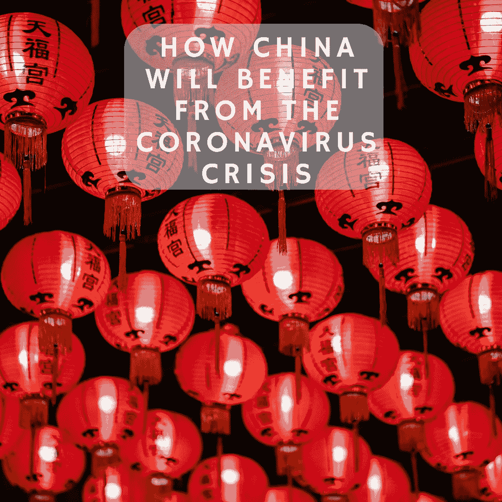

# How China Will Benefit from the Coronavirus Crisis

> 原文：<https://medium.datadriveninvestor.com/how-china-will-benefit-from-the-coronavirus-crisis-882dbce7f87?source=collection_archive---------13----------------------->

# The Worst is Behind China

In November of 2019, doctors in Wuhan, a city in China, began treating patients presenting with flu-like symptoms. As some patients developed respiratory issues, doctors began to suspect the spread of a coronavirus like SARS. The Chinese government initially made efforts to suppress these suspicions. They feared that raising alarm bells may hurt the economy. It turned out, though, that the doctors’ suspicions were valid. A novel coronavirus, now named COVID-19, originated in a Wuhan wet market. It has since spread across the globe and is wreaking havoc on healthcare systems and financial markets. Make no mistake. China’s failure to react quickly led to the global outbreak of the coronavirus. The government watched as the situation in Wuhan grew more dire before they decided to act. They will, however, capitalize on this mistake.

 [## Big Money and Cutting Edge Technology: How Investment in AI/ML Will Revolutionize The Healthcare…

### Among remarkable developments in Artificial Intelligence ( AI) and Machine Learning (ML) over the last couple of years…

www.datadriveninvestor.com](https://www.datadriveninvestor.com/2018/03/22/big-money-and-cutting-edge-technology-how-investment-in-ai-ml-will-revolutionize-the-healthcare-industry/) 

China ultimately implemented draconian measures to stem the outbreak. The government imposed a quarantine on Wuhan, isolated the sick, and emphasized the importance of social distancing. The measures proved effective. China has significantly slowed the spread of the virus. In fact, as the rest of the world reels from the outbreak, the Chinese economy is coming back online. This crisis, which China could have prevented, will ultimately pass. One thing is for sure, though. China will benefit from the new world order established during the global recession we’re entering. Below, I share three ways in which China will benefit from the coronavirus crisis.

# 1\. China’s Autocratic Model of Government is More Effective at Containing a Pandemic

China has an [autocratic government](https://bunkerbasics.com/autocratic-government/) that has nearly unlimited control over the country. The state censors information, which enables it to more easily direct narratives. Also, the Chinese government does not need to run decisions through a system of checks and balances. If Xi Jinping wants to implement a quarantine, a quarantine gets implemented. There is no congressional debate between Democrats and Republicans as to how federal money should be spent. There are no requests for pork-barrel spending. Partisan gridlock is a tradeoff democratic nations need to accept. Autocracies face no such tradeoff.

## A Broken Democracy Exacerbates the Crisis

To be clear, I think a democratic form of government is the reason the United States has been the most successful country up until this point. Unfortunately, the democratic system is broken. Social media has polarized the population. Corporations and special interest groups are prioritized over the nation’s people. Unlimited campaign funding nearly ensures that the wealthy and powerful will see their political pick get elected. Worst of all, our government officials care far more about themselves than those they are governing. We’re in an election year. The United States election cycle caused our presidential administration to prioritize reelection prospects over our nation’s safety. As a result, as many as [2.2 million US citizens may die](https://www.nytimes.com/2020/03/16/us/coronavirus-fatality-rate-white-house.html).

## Long Time Horizons Lead to Smarter Decisions

Xi Jinping, on the other hand, has a lifetime tenure as president. He doesn’t need to think in four-year cycles. With a much longer time horizon, he can afford short term economic pain in a way that Donal Trump cannot. Xi’s focus on China’s long term prospects is the reason China will recover from this pandemic much faster than other countries around the world. We are already seeing China begin to regain control of the narrative. They are avoiding responsibility for the crisis. I can guarantee they will begin to act as leaders during the recovery period.

It’s worth again mentioning that China is to blame for this pandemic. Assigning blame, though, isn’t going to help us fight COVID-19\. Once the fight is over, we have more reason to worry, as China will benefit from the coronavirus crisis.

# 2\. The Eurozone Will Collapse, Giving China an Opening

Low-interest rates across the world encouraged small and medium businesses to assume high levels of debt. Having enjoyed a decade-long bull market, many businesses didn’t question whether they could service their debt should the market face a downturn. Unsurprisingly, governments didn’t manage their balance sheets much better. Keynesian economics suggests that countries should replenish their surpluses during a bull run, but Keynes’s wisdom has obviously been long forgotten. Unfortunately, the coronavirus became the matador that slayed the bull. Countries are now ill-equipped to handle the economic fallout.

## The Eurozone is Being Kicked While it’s Down

远在有人感染新型冠状病毒之前，欧元区就已经面临压力。希腊债务危机威胁到欧盟的生存，因为国际货币基金组织被迫救助 T2。作为欧盟救助计划的一部分，严格的紧缩措施已经被强制执行。也就是说，希腊可能永远无法偿还债务。随着冠状病毒危机雪上加霜，违约几乎是不可避免的。

希腊只是欧元区被迫应对的一个问题。[英国退出欧盟](https://bunkerbasics.com/brexit-box/)，英国试图脱离欧盟，一直是一个没有解决方案的问题。笼罩在英国退出欧盟谈判上的不确定性给了中国与英国合作的机会。英国新当选首相鲍里斯约翰逊(Boris Johnson)希望后英国退出欧盟时代的英国成为一个科技中心。为了实现这一愿景，英国需要一个 5G 网络。进入中国。尽管受到国家支持的间谍活动的指控，但中国有争议的电信公司华为已经获准建设英国 5G 网络的一部分。我们可以预计，随着英国退出欧盟进程的继续，中国将努力继续与英国建立关系。

## 意大利无法复苏

现在让我们来看看意大利。可悲的是，意大利受到冠状病毒危机的打击已经超过了中国。意大利的老年人口尤其危险。雪上加霜的是，意大利毫无准备。意大利领导人一开始并没有把冠状病毒当回事。直到人们开始死亡，社会距离措施才得以实施。这一错误导致冠状病毒病例数量呈指数级上升。在危机的压力下，意大利的医院系统已经崩溃了。像欧元区其他国家一样，在新冠肺炎开始肆虐意大利人民之前，意大利就陷入了困境。它的债务问题现在将考验欧盟的弹性。

Italy’s debt before the coronavirus crisis forced an economic shutdown stood at [138% of GDP](https://www.reuters.com/article/italy-debt-eurostat/italys-public-debt-rises-to-138-of-gdp-in-q2-eurostat-idUSL5N2772GG). This incredibly high figure led Matteo Salvini, Italy’s populist party leader, to float the idea of an Italexit to avoid a fate similar to Greece’s. Now, Italy will be unable to repay its debt without suffering from a multi-year depression. Default and exit from the Eurozone are much more likely. China is undoubtedly watching these developments closely. As populist figures like Johnson and Salvini defy the cooperation implicit in the EU partnership, China will look for a foothold. China will expand its influence throughout Europe. And again, China will benefit from the coronavirus crisis.

# 3\. Strong, Smart Leadership is in Short Supply

Poor leadership is not unique to the United States. Boris Johnson flirted with the idea of building herd immunity among the UK population through mass infection. He course-corrected after learning of the consequences, but not before [creating widespread confusion](https://www.theatlantic.com/health/archive/2020/03/coronavirus-pandemic-herd-immunity-uk-boris-johnson/608065/). The indecision and slow pace of action exhibited by the US and the UK contrasts sharply with China’s overwhelming response to the spread throughout Wuhan. A signal is sent to the rest of the world when superpowers fail to act decisively and for the benefit of their people in times of crisis. China received this signal and will fill the leadership void. Tragically, further erosion of democracy will follow.

# China Will Benefit from the Coronavirus Crisis and Become the Premier Superpower

China has its own tough road to recovery. Its rapid pace of growth will slow as it deals with the economic consequences of the quarantines. Other countries, like the US, will be slower to recover. Some Eurozone countries will fail to recover altogether. The coronavirus crisis will redefine the world order. Weaknesses will be exploited. Old alliances will be abandoned and new alliances will be created. However, these changes will take time to unfold. Xi Jinping, with his lifetime tenure, isn’t in any rush to see China become the premier superpower. I have no doubt that they will, though. Yes, China caused the disaster that is bringing the world to its proverbial knees. Yet, China will benefit from the coronavirus crisis. As China benefits, democracy will suffer. Let’s just hope the suffering isn’t irreversible.

Originally posted at: [https://bunkerbasics.com/china-will-benefit-coronavirus-crisis/](https://bunkerbasics.com/china-will-benefit-coronavirus-crisis/)