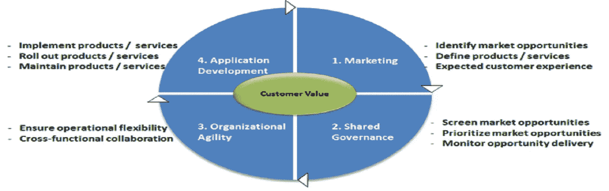
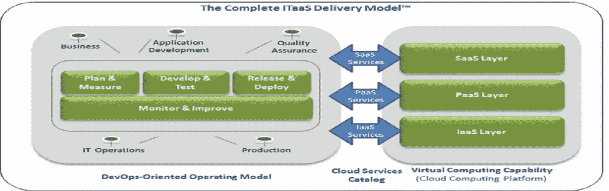
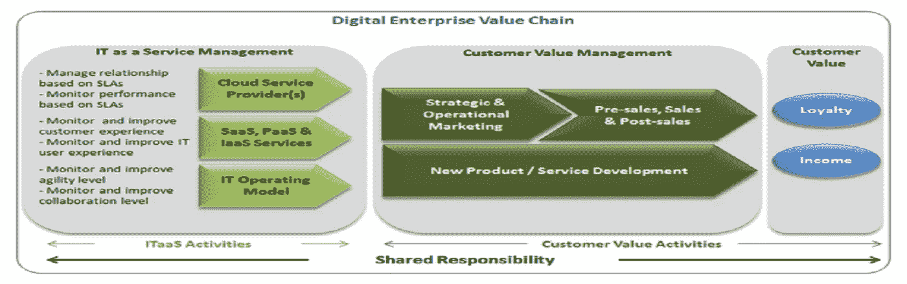
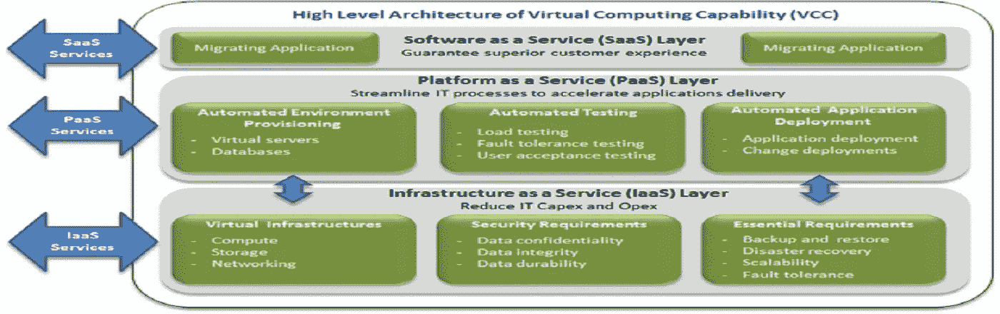
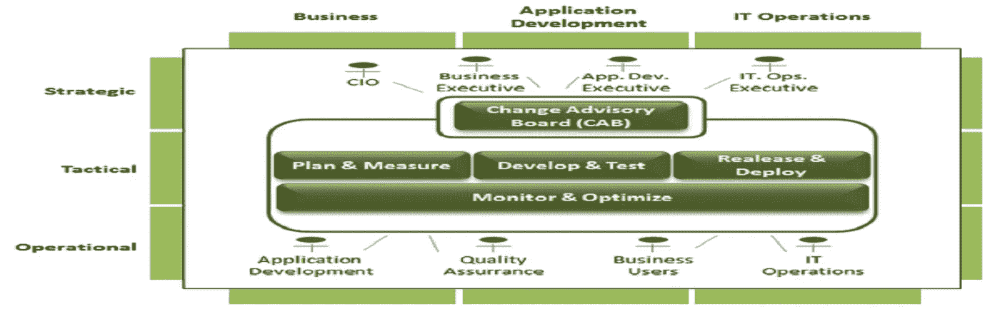

# 首席信息官如何利用云计算重塑 IT 组织

> 原文：<https://medium.datadriveninvestor.com/how-cios-can-reinvent-the-it-organization-with-cloud-computing-7f45f894a404?source=collection_archive---------20----------------------->

# 帮助首席信息官利用云计算将他们的 IT 组织转变为战略合作伙伴业务线所需的战略。

T 近年来，业务部门越来越多地走影子 IT 路线来实现他们的关键目标，这表明在如何利用云计算方面，IT 部门确实存在脱节。

问题在于云供应商忽视了业务愿景的问题。他们认为低 IT 成本和加速的应用交付是业务增长的驱动力，而企业更关心通过将业务和 IT 结合在一起的敏捷和协作环境实现的市场响应能力。

 [## 信息图:云之旅|数据驱动的投资者

### 聪明的企业领导者了解利用云的价值。随着数据存储需求的增长，他们已经…

www.datadriveninvestor.com](https://www.datadriveninvestor.com/2018/09/22/infographic-journey-to-the-clouds/) 

业务是正确的:组织孤岛、层级障碍、不明确的业务优先级和人员问题(如权力斗争、抵制变革、蔑视政策和政治)都是障碍，只会使实现灵活性、快速解决问题和做出决策变得更加困难。

解决方案是以人员、流程、实践、治理结构和工具的集成平台的形式实施 IT 即服务(ITaaS ),这些平台是专为将业务和 IT 结合在一起而构建的。

> 数字革命的商业层面才是最重要的

首席信息官们并没有完全理解这场引起如此大反响的数字革命。他们必须明白，要想成功，企业需要实施整合的数字战略。

The Integrated Digital Strategy — Credit [Philippe Abdoulaye](https://www.itaasnow.com/)

如图 1 所示，最重要的是增加客户价值，而不是技术人员建议的应用程序部署的广泛自动化。事实上，业务理念是客户价值(客户购买服务的花费)来自组织动态，通过共享治理*、*解决市场营销优先考虑的机会，并利用组织灵活性和加速的应用程序部署机制来持续交付增值服务。

> 云交付模式的重要性

以上观点是业内公认的。VMware 和 EMC 甚至将 ITaaS 指定为实施 it 的模式。然而，仍然没有一个阐明其原则、组织和业务影响以及部署做法的总体框架。

大多数顾问和供应商仍然停留在技术人员的思维模式中，业务问题处于外围，而不是核心。该解决方案依赖于完整的 ITaaS 交付模式***等框架的原则，该模式寻求通过三个基本驱动因素增加客户价值:云平台、云服务和 IT 运营模式，如图 2 所示。***

******

***The Complete ITaaS Delivery Model — Credit: [Philippe Abdoulaye](https://www.itaasnow.com/)***

***逻辑是，增加客户价值并不像通过自动化 IT 流程以光速交付应用程序那样简单；相反，这是一个良性循环的一部分，这个循环跨越了有效的营销、加速的应用程序部署以及最重要的组织效率提高。前麻省理工学院计算机科学教授迈克尔·m·哈默在他的畅销书《再造公司》中警告说:“自动化一团乱麻会产生自动化的一团乱麻。”***

***我们需要来自供应商的可信云服务，通过明确的 SLA 保证可用、可靠和可扩展的 IT 资源，以自助和按需方式使用。它们释放了为组织敏捷性创造条件的操作纬度。***

***同样，组织运营模式的要素(包括人员、流程、实践、工具和治理结构)必须以能够创造运营灵活性的方式进行安排。没有它，市场反应就是一厢情愿的想法。***

> ***首席信息官必须采取的关键步骤，以使其 IT 与云服务交付模式保持一致***

***正如 Joe McKendrick 在他的必读书“ [*中所称，数字化转型仍然是一个“难以捉摸的奥秘”的原因之一是，包括主要 it 供应商在内的 IT 参与者都被困在短期目标中。他们缺乏宏观视野，不了解云解决方案、运营模式和云服务如何结合起来产生客户价值。*](http://www.forbes.com/sites/joemckendrick/2015/09/29/the-elusive-mystique-of-the-digital-enterprise/)***

***以下是让您的 IT 与 ITaaS 保持一致的三个关键步骤。***

1.  *****重塑你的首席信息官角色，超越技术思考**。从影子 IT 的使用可以看出，与业务的脱节已经到了临界点。通过将技术是唯一的业务增长驱动力这一观点合法化，IT 厂商将首席信息官限制在了 IT 工具提供商的有限角色上。***

******

***The Digital Enterprise’s Value Chain — Credit: [Philippe Abdoulaye](https://www.itaasnow.com/)***

***为了赢得合法性，首席信息官必须将他的工具提供商外衣换成商业战略推动者的外衣。如图 3 所示，他必须通过关注 IT 即服务管理活动，为其组织的数字企业价值链(一组增值活动)做出贡献。***

*****2。开发您未来虚拟计算能力的愿景(VCC)并释放云的成本节约。**让您的 IT 组织转向 ITaaS 包括将您的数据中心转变为 VCC，这将削减您的 IT 成本并简化您的 IT 流程，如图 4 所示。***

******

***The Virtual Computing Capability (VCC) Credit — [Philippe Abdoulaye](https://www.itaasnow.com/)***

***与您的 IT 团队讨论以下问题:***

*   ***要迁移的工作负载，包括应用程序、软件和硬件配置，以及安全性、备份、灾难恢复和容错要求***
*   ***您的 VCC 的整体架构，特别是将充当的 IaaS 层，即经济高效的虚拟基础架构，以及将实施持续交付平台以支持加速应用交付的 PaaS 层***
*   ***整个 VCC 的运营管理和执行控制***

*****3。重新思考与业务部门的协作，将开发运维制度化以消除运营灵活性的障碍，并使您的 IT 变得敏捷**。多年来，组织和运营一致性、共享治理、执行共识和跨职能协作等基本价值驱动因素一直被忽视。无论技术人员承认与否，不良的 it 专注于优先级、组织功能障碍、不良的策略采用等是价值的主要障碍，并且它们不能通过技术来解决。***

***如果不局限于改善应用程序开发和 IT 运营之间的沟通以及自动化应用程序部署流程，DevOps 是一个可以采用的敏捷协作平台。扩展到业务问题，其原则、流程和实践简化了组织的协作网络，加快了优先排序和决策制定，有助于提高运营模式的灵活性。***

******

***The New IT Operating Model — Credit: [Philippe Abdoulaye](https://www.itaasnow.com/)***

***建立一个涉及业务和 IT 的 ITaaS 任务组，以讨论以下问题:***

*   ***建立扩展的 DevOps 结构，不仅专注于应用程序开发，还涵盖整个企业数字战略(EDS)活动***
*   ***使 DevOps 原则、实践、流程和工具符合您的业务考虑***
*   ***建立变革咨询委员会(CAB ),作为共同治理机构，以确定优先事项，就优先事项达成共识，并提供行政领导以促进优先事项的实现***
*   ***建立一个持续交付平台提供加速应用交付所需的逻辑和基础设施***

> ***包扎***

***为了帮助他们的业务在数字经济中成长和繁荣，首席信息官们必须利用 ITaaS 重塑他们的 IT。广泛传播的观点认为，云解决方案本身将使 IT 组织变得敏捷并促进业务增长，这是一个智力骗局，不仅使他们保持了 IT 工具提供商的过时角色，还扩大了业务和 IT 之间的差距。***

***Joe McKendrick 在他的文章“ [*云计算的第二幕是所有的业务，*”](http://www.forbes.com/sites/joemckendrick/2014/06/09/cloud-computings-second-act-is-all-business/)**中警告说，“这是云故事的一小部分。一个更大的故事来自商业本身。这也是最难的部分。”故意讲述不同故事的 IT 供应商没有帮助。*****

> *****了解更多*****

*****我创建了一个关于如何成功领导云转型项目的完整在线课程。遵循这些建议，您将提高您的 IT 组织的绩效，进而提高您公司的绩效。*****

*****[拿过来！](https://www.udemy.com/course/managing-cloud-transformations/)*****

*****喜欢你读过的吗？点 50 次手给我一些掌声，或者在下面的评论中告诉我。*****

*****祝你继续成功！*****