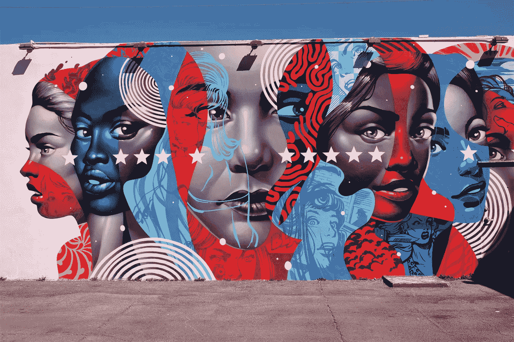
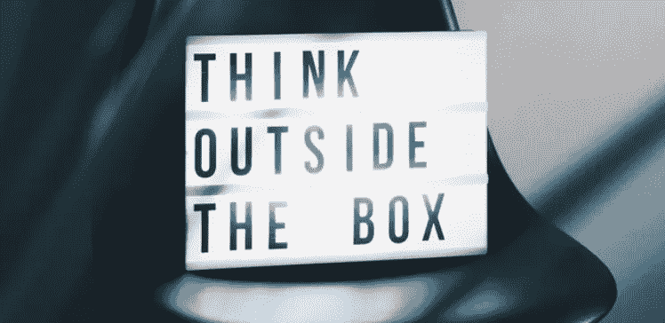

# 创造术语如何将你的整个业务推向新的高度

> 原文：<https://medium.datadriveninvestor.com/how-coining-terms-can-propel-your-entire-business-to-new-heights-d145bd74207a?source=collection_archive---------23----------------------->

## 我们这个时代的互联网奇才教给我的 8 堂营销课

Photo by [Bruce Warrington](https://unsplash.com/@brucebmax?utm_source=unsplash&utm_medium=referral&utm_content=creditCopyText) on [Unsplash](https://unsplash.com/s/photos/einstein?utm_source=unsplash&utm_medium=referral&utm_content=creditCopyText)

伟大的营销是你成功的基石。

无论你从事什么行业，向特定的受众传达正确的信息都是至关重要的。你可以拥有人类历史上最好的产品或服务，但没有合适的营销，你将一事无成。

你可以选择自己做，但为什么要做呢？让我们向前人学习。

在这篇文章中，我列出了在研究了我们这个时代的一些互联网奇才后脱颖而出的营销经验和概念。杰克·布彻、[大卫·佩雷尔](https://twitter.com/david_perell)和[沙恩·普里](https://twitter.com/ShaanVP)教给我的营销和创业知识比我的高中老师还多。除此之外，他们还讨论了想法的真实性、文案以及创造自己的知识产权的重要性。以下是我学到的 8 件事。

# 1.创造一个术语就像创造一个想法

建立个人品牌很难，超级难。如何在人群中脱颖而出？

你是独一无二的——我明白，但其他人也是如此。

保护你的网上阵地的一个很好的方法是创造新的术语，并长期坚持使用。

重新排列单词以创造新的术语。朗朗上口、易于记忆和重复的术语。这极大地助长了病毒的传播。

除了一个术语的读法，想想它的发音。用耳朵听会说:[大卫·佩雷尔](https://medium.com/u/39663aeb73b3?source=post_page-----d145bd74207a--------------------------------)说:“增加某些东西的声音可以带来指数级的收益。”。

分享给全世界，看看有没有共鸣。接受社会反馈。

## 示例:

—构建一次，销售两次

个人垄断

—自由职业者(*它最初描述的是不效忠特定国家的雇佣军骑士或士兵，他们提供服务以换取金钱*

——顿悟桥

—照做就是了

# 2.品牌名称应该通用，但不要太多

小心好奇心的差距。为每个人做，但不是同时为每个人做。

[可视化价值](https://twitter.com/visualizevalue)就是一个很好的例子。

它向最终用户描述了品牌为他做了什么，并暗示了他在与 Visualize Value 合作时将获得的服务。其次，让它永远持续下去。任何行业都可以实现价值可视化，并且适用于任何可能的形式。与此同时，它是具体的，并在逐案的方法。

同样适用于个人垄断。

即使不知道是什么意思，也想拥有。这听起来很酷，如果建造你自己的东西只是你最轻微的愿望，你想有一种个人垄断的形式。

它是通用的，但对每个人来说都是超特异性的。你希望人们说“我真希望我说过这句话”..

# 3.拥有他妈的任期

公共建筑带来了透明度，也带来了别人会拿你的想法冒险的风险。至少这意味着你有所发现。如果你的想法是狗屎，没有人想偷它。

不要害怕模仿者。每个试图模仿你的人，最终都会提拔你。拥抱连锁反应。

通过拥有杜撰的术语，你积累了知识产权。

人们分享你的知识产权是圣杯。你的工作代表你周游世界，而你却原地不动。人们帮助发展你的品牌，向世界传播你的语言。

变得如此优秀，以至于人们谈论你和你的工作。

# 4.制造一加仑枫糖浆需要 50 加仑的树液——[大卫·佩雷尔](https://medium.com/u/39663aeb73b3?source=post_page-----d145bd74207a--------------------------------)

投资者不指望他们的整个投资组合是赢家，回报丰厚。他们只需要一个赢家来弥补他们的每一点损失。

这同样适用于创造术语和建立你的品牌。

玩量的游戏，但不要完全忽视质量。继续向世界发布你的想法，看看什么能坚持下来，毕竟你只需要 1 个赢家。

不要害怕失败。注意在不经意的谈话中引起共鸣的内容，并乐于接受社会反馈。Twitter 也是一个社交环境，所以不要害怕询问别人的意见。

加倍关注有效的，剔除无效的。

用不同的方式包装你的想法是至关重要的，它最大化了成功的机会:

*   [写一篇精彩的 Twitter 帖子](https://medium.com/better-marketing/the-best-thing-ive-done-for-my-writing-this-year-b1d65e39a776)——这要求你只写 280 个字符的片段，并迫使你尽可能简洁。
*   使用 Figma 使其可视化——从文字转换到设计迫使你以不同的方式思考。有可能你会发现一种看待自己想法的新方式。
*   将它定位为一个产品——在 Gumroad 上作为一个模板出售，围绕它开始一个时事通讯，或者创建一个简单的登陆页面。

 [## 给数字营销工作者的 5 本书推荐|数据驱动的投资者

### 随着就业率的上升，由于疫情和人们花更多的时间在网上，数字营销的技巧…

www.datadriveninvestor.com](https://www.datadriveninvestor.com/2020/10/28/5-book-recommendations-for-those-who-work-with-digital-marketing/) 

# 5.这个世界奖励的是最善于交流想法的人，而不是有最好想法的人。

包装你的想法是关键。让它成为别人想打开的东西。将其定位为产品。擅长宣传你的产品，你就遥遥领先了。

你怎么知道一个想法的力量是好的呢？Shaan Puri 花了 12 年的时间建立创业公司，他采用了以下方法:

*   这是个现实问题吗？
*   他们对解决方案有独特的观点吗？
*   这能成为真正的赢家吗？

你必须相信自己的判断。

Photo by [Nikita Kachanovsky](https://unsplash.com/@nkachanovskyyy?utm_source=unsplash&utm_medium=referral&utm_content=creditCopyText) on [Unsplash](https://unsplash.com/s/photos/marketing?utm_source=unsplash&utm_medium=referral&utm_content=creditCopyText)

# 6.伟大的旅行家往往是伟大的作家

要成为更好的作家，你必须成为更好的思想家。你不会坐在你的卧室里实现这一点。出去看看这个世界。与各种背景、各种信仰的人接触。花时间在国外，发现你从未听说过的地方。拿起你永远不会拿起的书，只是为了知道它是什么，你不知道。

你知道的越多，你能用来过滤你的想法的层次就越多，你就能更好地对它进行压力测试。

想象一下你最糟糕的批评者会对你的想法做出怎样的反应，对你的想法进行压力测试。变得好到连那个人也说不出个所以然来。如果是这样的话，你就走对了路。

# 7.人们永远不会厌倦一个好主意

如何知道一个想法实际上有多好？

约束增强创造力。你施加的约束越多，就越需要你的创造力。你得到的结果越好，越独特。一个想法的保真度只取决于你无限的创造力。

为什么我们一遍又一遍地听着同样的音乐，而其他的热门音乐却来来去去。

这是为什么呢？

质量比数量重要无数倍。

这些点只在回来的路上连接，所以继续努力。如果你是长期的，你会没事的。

# 8.建造一辆意外之车

只有 1 个赢家之后才开始提炼你的想法是没有意义的。你需要数量和数据才能真正说出一些东西。再次播放音量——保留不变的，丢弃其余的。建立一个杜撰术语的组合。

更好的是，造一辆意外之车。大卫·佩雷尔创造了这个术语，他是这样描述的:

> 写作是最好的人际关系网。
> 
> 通过让人们很容易在网上找到你，你就创造了一个意外收获的载体。当你想制造奇遇，并且你需要一些激活能量时，召唤你的车辆。
> 
> 我的车是[北极星播客。](http://perell.com/podcast)

创建一个数字资产的图书馆，让人们很容易在网上找到你。

创建一个属于你但可供他人使用的杜撰术语、数字资产和想法的集合。

为了创造一个有利可图的生意，你必须创造一个创造词汇的垫脚石，以到达河的另一边。

不知不觉中，你就有了自己的个人品牌。你拼命寻找的那个人。

# 如果你什么都没读，一定要读这个

1.  硬币术语。很多。
2.  让它们易于记忆和重复。让他们听起来很酷。
3.  继续发布。玩音量游戏。
4.  看看在社会背景下有什么共鸣。
5.  对有用的东西加倍下注，忽略其他的。
6.  建造你的意外之喜交通工具。一天一天来。
7.  构建您的数字资产库。
8.  与成功的个人品牌一起茁壮成长。

感谢阅读。

***让我们成为朋友。*** [***加入我的邮箱列表***](https://jessie-work.ck.page/) ***。***

> 杰西

**访问专家视图—** [**订阅 DDI 英特尔**](https://datadriveninvestor.com/ddi-intel)