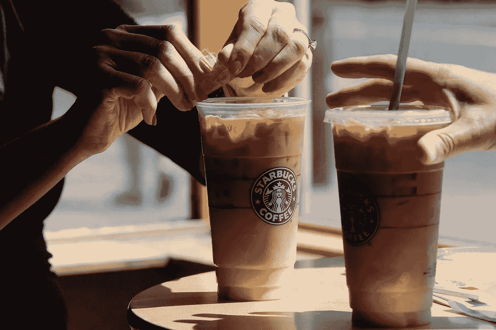
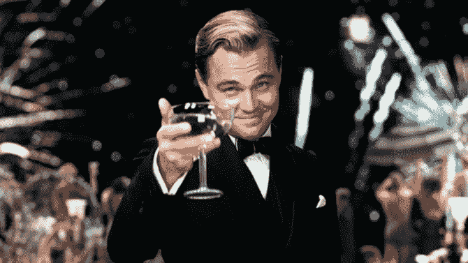

# 冷咖啡如何能让你成为百万富翁

> 原文：<https://medium.datadriveninvestor.com/how-cold-coffee-can-make-you-a-millionaire-8660ecc24116?source=collection_archive---------4----------------------->

作者:塔努什里·维尔马

很多人喝咖啡，喜欢咖啡，尤其是星巴克的咖啡。工作的人通常在上班的路上买星巴克。但你有没有想过，如果你只是在家喝咖啡，经济上的可能性？

让我们看看你如何仅仅通过喝自制的冷咖啡就能成为**百万富翁**。

假设你一天喝两次一杯咖啡。那就是每天两杯咖啡。制作咖啡，假设你买了以下原料-

1.  **糖**1 公斤₹43.00(1 公斤可以让你坚持 3 个月，每天制作 2 杯咖啡)
2.  两包雀巢经典**咖啡**400 克(两包每包 200 克)- ₹980(每包₹490)(两包咖啡可以让你坚持大约 3 个月，每天制作两杯咖啡)
3.  雀巢 A+ **牛奶**(一箱装 12 包牛奶，每包 1 升)——₹895(现在每天两杯咖啡，1 升牛奶够你喝 2 天，所以 12 升够你喝 24 天，所以基本上你 3 个月需要 3.75 箱)(所以这将花费你 3 个月的₹3356.25)

**现在让我们来计算两杯咖啡的每日费用:**

1.  **糖**——₹43/90 = ₹0.47
2.  **咖啡**——₹980/90= ₹10.8
3.  **牛奶**——₹3356.25/90= ₹37.29

总成本=每天₹48.57 或每杯咖啡₹24.28

星巴克的一大杯冰镇咖啡(最小杯)的价格是₹255.所以一天两杯咖啡，你就可以在₹510.度过与₹48.57 自制咖啡的成本相比，你在家喝咖啡每天可以节省₹461.43。这相当于每天节省大约 6 美元。

如果你在未来 55 年内每天投资 6 美元，平均回报率为 7%，这是标准普尔 500 经通货膨胀调整后的历史平均回报率，股息再投资，在这 55 年结束时，你将有 1，331，086.16 美元

# 就这样，你成了百万富翁！

这篇文章背后的想法并不是告诉你不应该在外面喝星巴克咖啡或任何其他咖啡。这是为了告诉你投资储蓄的重要性。你不应该让你的钱闲置&让通货膨胀年复一年地降低它的价值。相反，投资和创造与你如何度过你的日常时间无关的被动收入来源。无论你做什么，钱都会流入。用钱创造钱。