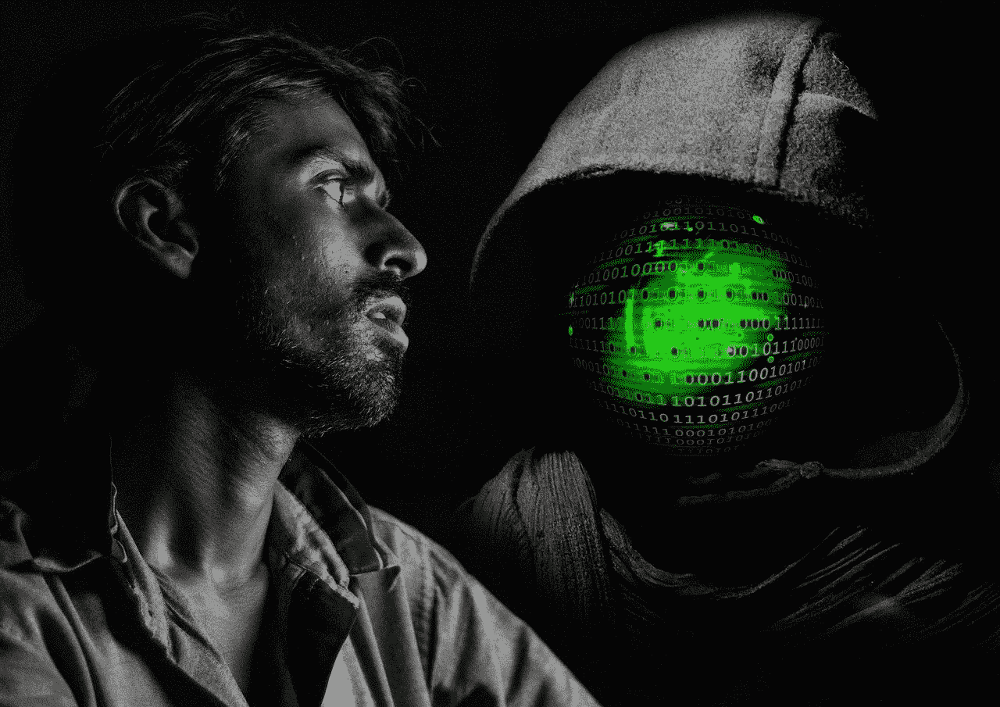
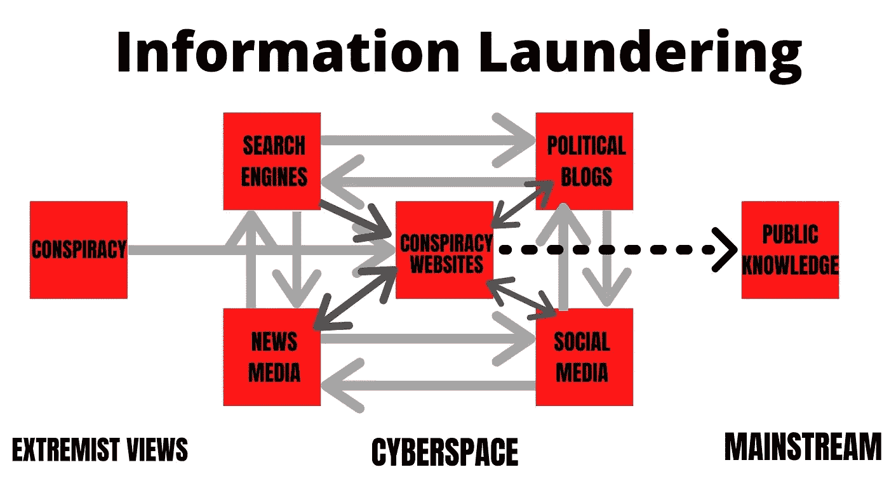
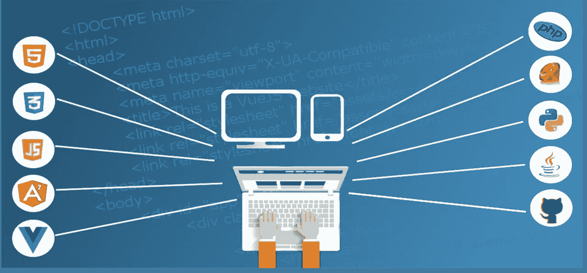
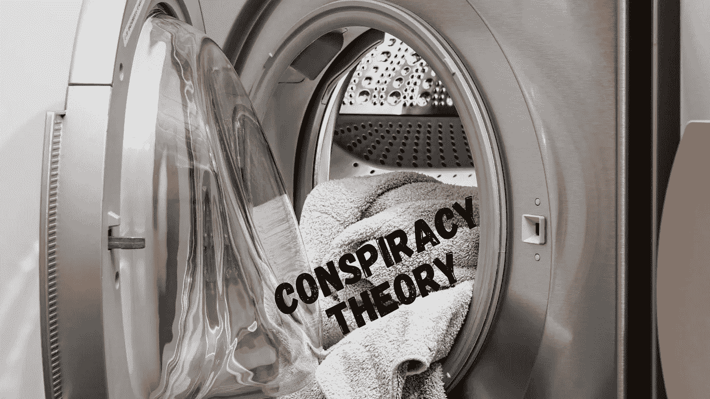

# 阴谋论如何在网络空间被“清洗”

> 原文：<https://medium.datadriveninvestor.com/how-conspiracy-theories-get-laundered-in-cyberspace-d9c3949dd245?source=collection_archive---------5----------------------->

## 我们有责任向他们挑战。

佐治亚州的一名政客最近成为新闻头条，因为她支持一种特殊的阴谋论。我不会在这里给她或特定的理论任何空气，因为那是传播理论本身。

在公共关系中，坏消息是好消息，因为争议会引发话题讨论，而[会设定媒体议程](https://online.alvernia.edu/articles/agenda-setting-theory/)。如果话题是一个特定的阴谋，讨论不仅会产生兴趣，而且当它到达主流媒体时会产生真实性。从那里，阴谋可以影响或感染公众舆论。

Image by [Gerd Altmann](https://pixabay.com/users/geralt-9301/?utm_source=link-attribution&utm_medium=referral&utm_campaign=image&utm_content=1187192) from [Pixabay](https://pixabay.com/?utm_source=link-attribution&utm_medium=referral&utm_campaign=image&utm_content=1187192)

你可能想知道——这些疯狂的想法是如何被合法化的？他们通过网络洗钱。亚当·克莱恩称之为信息洗钱的 T2 理论。他最初在对仇恨言论的研究中构思了这一理论，但阴谋论和错误信息可以包括在这一模型中。一个阴谋论可能一开始并不可信，但随着它在各种媒体中循环往复，它就被“清洗”了。克莱恩将其与洗钱联系起来。

一个想法从互联网论坛开始，产生兴趣。随着越来越多的人投稿，个人博客开始推广它。随着越来越多的博客和网站讨论这个想法，它在搜索引擎上出现的频率越来越高。这些网站的贡献者开始在社交媒体上分享这个想法。社交媒体平台通过其算法放大了这一理论，它开始出现在人们的新闻提要和趋势页面上。随着越来越多的人开始询问此事，主流媒体开始报道此事。就在那时，这一理论被广泛传播，获得了一定程度的合法性。

[Klein’s (2012)](https://doi.org/10.1111/j.1468-2885.2012.01415.x) Theory of Information Laundering. Illustration by Beth Bradford

我将用我七年级科学课上的一个被揭穿的“理论”作为例子。在描述科学方法时，我的老师告诉我们，人们以前认为蠕虫起源于暴雨。假设我在课堂上没有注意学习科学家们用经验观察来测试这个理论。

 [## 美国遭受攻击-美国州长索拉里姆网络安全报告敲响了警钟|数据驱动…

### 2020 年 3 月发布的网络空间日光浴室委员会报告对所有美国人来说都是一份至关重要的文件。在…

www.datadriveninvestor.com](https://www.datadriveninvestor.com/2020/03/29/america-under-fire-us-gov-solarium-cybersecurity-report-sounds-the-general-alarm/) 

所以我带着仍然被激起的好奇心回家了。我在网上搜索“暴风雨中形成的蠕虫”，没有发现任何有价值的东西。因为我相信媒体不可信，所以我去了我最喜欢的提供“真相”的网络论坛。我发布了我的故事——我的科学老师告诉我，蠕虫是在暴风雨中形成的，这就是为什么你会在暴风雨后的停车场看到它们。

有人回复我的帖子，证实互联网搜索没有找到证据。然后有人在一个巨大的停车场中央贴了一张虫子的照片，并问道:“一只虫子怎么可能自己爬到停车场中央呢？”另一个人补充说，因为一个科学老师说的，他一定是质疑主流科学家的“好”科学老师之一。

Photo by [Katja Schultz](https://www.flickr.com/photos/treegrow/38799468075) [(CC 2.0)](https://creativecommons.org/licenses/by/2.0/)

越来越多的人加入到我的讨论中，加入到他们自己“研究”的“发现”中然后我创建了一个网站来解决这个问题。我邀请投稿人来我的网站，我的互联网论坛上的人们在其他论坛上分享我的网站。其他网站给我的网站加链接，我加一些科研人员作为投稿人。虽然这些研究人员在各自的社区被揭穿了，但这才是重点。他们被他们的社区压制了，现在我允许他们展示他们的作品。我是言论自由的拥护者。

当我在我的网站上赚了一点钱时，我投资让它变得更加专业。我也链接到其他像我一样的网站。我采用适当的搜索引擎优化策略，让我的网站在搜索引擎中排名靠前。

Image by [Olalekan Oladipupo](https://pixabay.com/users/lakexyde-2489063/?utm_source=link-attribution&utm_medium=referral&utm_campaign=image&utm_content=1935737) from [Pixabay](https://pixabay.com/?utm_source=link-attribution&utm_medium=referral&utm_campaign=image&utm_content=1935737)

几位贡献者从我的网站向社交媒体分享他们的工作。他们利用流行标签来促进故事的传播。一些人使用[机器人](https://www.cnet.com/how-to/what-is-a-bot/)来放大他们的故事。我的网站的追随者在脸书上创建群组来分享他们自己的故事和照片。

一场巨大的暴雨袭击了东海岸，我网站的关注者在停车场拍虫子的照片。这成为社交媒体上的一种趋势，其他人想知道为什么他们在停车场看到这么多蠕虫的照片。某些媒体人物开始在他们的 YouTube 频道或有线新闻节目上谈论这件事。

越来越多的人对我的理论感兴趣。营销人员决定利用我的秘密理论，创造 t 恤、帽子和保险杠贴纸。它变成了一个排外的俱乐部。几个领导都是我俱乐部的，但是不敢透露，怕被嘲讽。

最终，一位政治家足够大胆地说她相信这一理论。一位枕头大亨在有线新闻频道上支持这一理论。主流媒体于是觉得有必要报道这一反常现象。暴雨制造蠕虫的阴谋论现在已经传播到主流媒体和广大公众。这个理论已经变得足够清晰了。

Illustration by Beth Bradford

# 我们该怎么办？

尽管我们无法阻止其他人编造阴谋论，但我们可以通过踩灭一些火种来驱散野火。

## 你花钱就能得到新闻

因为现在建立一个网站很容易，几乎任何人都可以创建一个“真正的”新闻渠道。为了维持网站，它依靠基于 [CPM](https://www.investopedia.com/terms/c/cpm.asp) 或 [CPC](https://www.investopedia.com/terms/c/cpc.asp) 的广告。如果一个网站充斥着广告和[列表](https://dictionary.cambridge.org/us/dictionary/english/listicle)，它可能不是一个声誉良好的新闻内容来源。想想这个——如果你是通过点击获得报酬的，你会不会写一些你知道会获得更多流量的故事？你会不会因为知道人们不会在主流新闻来源上看到而被诱惑去写一些有争议的理论？

一些网站也可能会推广与其网站信息无关的产品。这是一个明确的迹象，表明主要任务是赚钱，而不是告知公众。声誉好的新闻网站会有一些广告来帮助支付他们的账单，但是他们依靠订阅来支付他们的记者。在万维网和有线新闻频道出现之前，人们订阅日报。上世纪 90 年代，我曾经每月花 30 美元买一份日报送到我家。你可以以同样的价格订阅一家声誉良好的新闻机构的无限量服务。

## 谁是“专家”

对我们来说，重要的是不要自动假定被称为“专家”的人的可信度一个作家可能会用“专家”这个词来描述某人，但这是什么意思呢？如果我已经约会了 25 年，这是否意味着我是一个“约会专家？”如果我写我是一名大学教授，那会自动使我成为所有方面的“专家”吗？如果我有博士学位，这是否意味着我可以被称为公共卫生方面的“专家”？

在媒体上，我们经常会看到公众人物“在他们的领域之外”就各种话题发表意见。虽然他们有权发表自己的意见，但我们必须小心，不要认为他们对事实的解释更可信。即使有人写了一本书，也不能证明他们是专家。那本书可能是一本儿童读物。

如果某人确实拥有传染病同行评审研究的医学博士学位，我们可以放心地认为这个人是谈论疫情的可信专家。

## **透明度是关键**

在社交媒体和政治博客上，如果有人发布了一些有争议的东西，却不公开自己的身份，请三思。如果这个人透露了他们的姓名和/或工作地点，你可以搜索社交媒体和一些搜索引擎，看看他们在这个话题上是否有有效、可靠的声誉。当涉及到他们的新闻来源时，主流新闻媒体会经历一个严格的审查过程，特别是如果新闻是有争议的。

有时，人们可能会从他们的网站或其他网站上分享一个有争议的故事。检查网站的“关于我们”页面，看看贡献者是否在 LinkedIn 上可见，他们的[照片不是股票照片](https://www.bellingcat.com/news/americas/2018/10/30/unintelligent-design-surefire-intelligence/)。你也可以看看[谁拥有网站的域名](https://lookup.icann.org/)，以及这家公司在哪里。

## **核实证据**

人们应该为自己的主张提供清晰、可证实的证据。然而，有时证据本身可能是有缺陷的或不存在的。今年 5 月，佐治亚州卫生部发布了一份误导性图表，错误地显示冠状病毒病例有所减少。自己检查图表和照片。如果你做[谷歌反向图片搜索](https://support.google.com/websearch/answer/1325808?co=GENIE.Platform=Android&hl=en)，有时你可能会发现照片被修改过的证据。

如果有人写道，“研究表明……”，应该有一个具体研究的链接。我的学生可能会写，“研究表明，社交媒体的使用正在增加。”首先，这是懒。我也可能会得到，“每个人都使用社交媒体”，这更糟糕。更好、更具体的句子应该是，“2019 年《传播杂志》的一项研究显示，87%的美国人每月至少登录一次社交媒体网站。”

## **套用** [**奥卡姆剃刀**](http://math.ucr.edu/home/baez/physics/General/occam.html)

这是简约法则，意味着最简单的解释往往是正确的。阴谋论倾向于做出影响深远的主张，试图建立令人困惑或虚假的联系。如果你退后一步，看看场景中的人物，问问自己——这有理性意义吗？如果你支持的是政治阴谋论，问问你自己，如果你把角色换成你支持的政客，这个理论是否有意义。通常，我们会把与我们不同的人往坏处想，特别是当我们的身份与我们的群体联系在一起的时候。因此，我们必须调查我们自己的偏见如何影响我们的理性思考和对现实的感知。

阴谋论并不是什么新鲜事，但它们继续在网络上的黑暗地带焕发生机。然而，当我们通过网络空间帮助“清洗”它们时，它们就获得了合法性。我们可以通过质疑我们对角色的假设来对抗它们，并对我们分享和放大的内容多一点辨别能力，尤其是在公共论坛上。我们可以参与民间对话，让民主永存，而不是打败它。

**进入专家视角—** [**订阅 DDI 英特尔**](https://datadriveninvestor.com/ddi-intel)