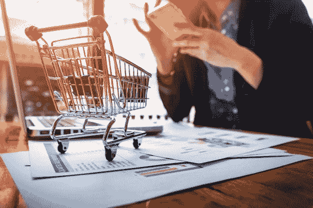
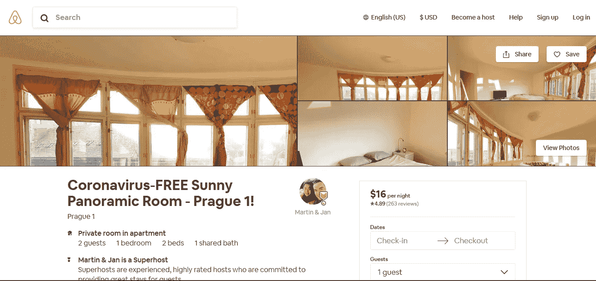
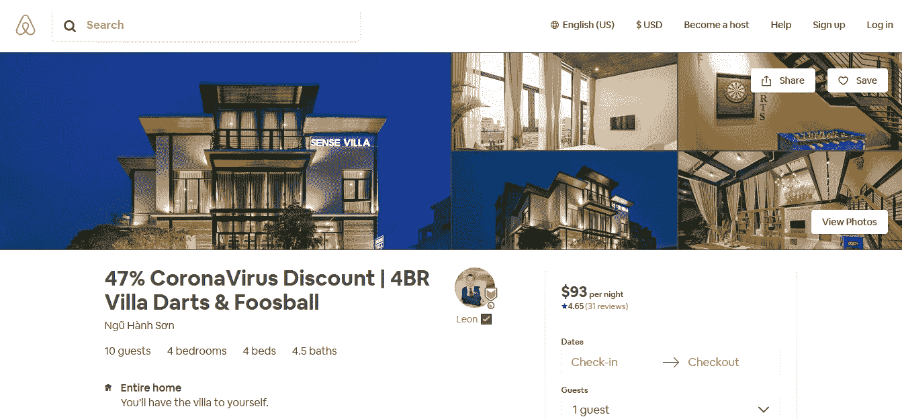

# 冠状病毒隔离如何改变购买习惯

> 原文：<https://medium.datadriveninvestor.com/how-coronavirus-quarantine-changed-buying-habits-a66224ef2178?source=collection_archive---------23----------------------->

全球隔离如何改变了购买者的行为习惯，销售中出现了哪些趋势以及品牌如何应对疫情，我们将在文章中谈论这一切。

# 谁赢了？电子商务和云服务

流行病推动创新，加速市场变化。21 世纪初，SARS 给中国的电子商务带来了强大的推动力，而今天的危机正在迅速扩展在线服务的功能。

# 食品配送

除了通过亚马逊、优步 Eats 和 Instacart 订购产品的需求自然增长之外，市场上还出现了一种新趋势——非接触式送货。它是由中国服务美团点评推出的。这项服务的本质很简单:快递员把订单放在约定的地方，并通知顾客可以去取。

在中国疫情最严重的时候，袋子里放了一张卡片，上面有准备和运送食物的人的体温信息，以及消毒信息。1-2 月，超过 80%的美团点评客户使用了这种配送。继中国公司之后，美国品牌——肯德基、必胜客、Postmates 和 insta cart——也引入了这一创新。

# 电子商务

> 时尚心理学的创始人凯特·南丁格尔说:“当买家被提醒必死无疑时，他们会变得更加冲动。”。

网上商店的消费确实大幅增长——这不仅适用于重要物品，也适用于在隔离期间提供舒适隔离的家居用品。

因此，中国电子商务巨头京东宣布增加菜肴的销售:对烘焙菜肴的需求是去年的三倍多。随着隔离期的临近，午餐盒的销量飙升:重返工作岗位的人们更喜欢从家里带食物，以将感染风险降至最低。

 [## 描述性统计和推断性统计有什么区别？数据驱动的投资者

### 描述性统计和推断性统计是统计分析的两大分支。根据定义，描述性的…

www.datadriveninvestor.com](https://www.datadriveninvestor.com/2019/02/28/descriptive-vs-inferential-statistics-whats-the-difference/) 

对好看和保持健康的渴望使得理发推子的销量增加了 4.5 倍，运动器材和瑜伽垫的销量增加了 1.5 倍。

# 移动应用

2 月上半月，中国的移动应用下载量比 2019 年的平均水平增长了 40%。仅在 2 月 2 日至 9 日的一周内，苹果商店的下载量就创下了纪录——超过 2.2 亿次。最受欢迎的细分市场是游戏和教育应用。

# 视频流

80%的互联网用户更喜欢视频，而不是博客。在欧洲和美国，对网飞的需求正在增长，而在中国，淘宝平台上的直播需求也很高。与去年同期相比，他们的人数增加了一倍多。

*   疫情期间宠物成了真正的明星，猪突然爆顶。二月份最热门的搜索之一是“活猪”数百万人看过动物吃饭、睡觉，甚至网上约会。
*   另一个视频趋势与食物有关:现场厨师被教授烹饪受欢迎的菜肴，观众安排在线晚餐，模拟去餐馆。
*   淘宝直播松下、飞利浦、戴森等品牌的专业美发师和造型师的理发课。
*   制作医用口罩原始图像的在线广播也很受欢迎。其中一款之后，眼影销量暴涨 1.5 倍。
*   淘宝直播为中国农民提供了免费直播的机会，在播出的前三天，他们卖出了 1500 万公斤的水果和蔬菜。
*   名人运动员充当训练教练，这有助于销售更多的模拟器。

# 云服务

由于在线工作的需要，对组织远程会议的程序的需求增加了，如 Zoom，Hangouts Meet from Google 等。

使用人工智能处理大量数据的服务(例如，亚马逊网络服务)越来越受欢迎。当需要加速药物的开发和临床试验时，更是如此。

在中国，社交视频平台快手与教育部合作，在中小学和大学开设了一个基于云的全国在线课程。

# 品牌如何回应疫情:幽默与操纵

知名品牌并不急于炒作冠状病毒——很少有人希望自己的名字与负面联系在一起。然而，受全球歇斯底里影响的地区的企业不得不应用情境营销。

**饮料和食物**

啤酒品牌 Corona 因名字与新病毒相似而遭受损失。美国一项[调查](https://www.marketingweek.com/coronavirus-corona-boost-sales/)的结果显示，38%的人在任何情况下都不会购买这种啤酒，另有 16%的人不确定这种饮料和冠状病毒之间有什么联系。

尽管许多人预计该品牌会对此做出创造性的回应，但 Corona 仅限于一份克制和礼貌的声明——他们表示，他们同情所有受感染的人，但他们与冠状病毒无关。该公司很乐观，认为啤酒销量仍然很高。

相比之下，胡德堡的一家新西兰酒吧利用这种情况，在社交网络上发布了穿着防护服和戴着呼吸器的男子的照片。他们手里拿着科罗纳啤酒，上面写着:“今年夏天在家里喝点科罗纳啤酒”。在社交网络和媒体的激烈反应后，该出版物被删除。

虽然 Corona 更愿意留在幕后，但另一家美国饮料制造商 Avery Soda 已经带着新型冠状病毒鸡尾酒进入了市场。该品牌通过定期发布基于当前新闻的碳酸饮料来维持其令人反感的形象:例如，“猪流感滋补品”和一种专供总统候选人的饮料。

这个故事中与众不同的是烈性饮料，由于缺乏防腐剂，许多人急于将其用作消毒剂。受欢迎的美国伏特加生产商 Tito's 被迫在推特上反复解释说，这种饮料的浓度不足以杀死病毒——伏特加只含有 40%的病毒，而不是要求的 60%。

> “我们一看到社交网络上的文章和消息，就想纠正这种情况，”蒂托的代表解释道。—“尽管如果我们的粉丝买下大量的伏特加会对生意有好处。但我们会为白白浪费一个好产品而感到羞耻，尤其是如果它没有消毒功能的话。”

在疫情最严重的时候，肯德基快餐连锁店推出了一则广告，广告中餐厅游客舔手指。在用户抱怨疫情期间的促销“不负责任的行为”后，该品牌被迫暂停了活动。

**洗涤剂和消毒剂**

生产消毒剂和医用口罩的品牌关心的不是广告，而是需求的满足，需求飙升了好几倍。三月初在亚马逊搜索的十个关键词中有九个与冠状病毒有关。Purell 手消毒剂在易贝以创纪录的 149 美元转售。

尽管所有的社交网络和交易平台——从脸书到易贝——都已经开始处理关于冠状病毒的猜测和虚假信息，但卖家仍在积极操纵买家的情绪。爱沙尼亚公司 Novads OU 在宣布销售口罩的同时附上了一条“日益恐慌”的信息，英国销售商 Easy Shopping 4 Home 称其呼吸器为“抗冠状病毒”。

**药品**

针对这种新疾病的药物和疫苗尚不存在，这一事实并没有阻止俄罗斯制造商 Otisifarm 发起阿比朵尔的广告活动，作为对抗冠状病毒的一种手段。

这种药物是 80 年代在苏联作为抗病毒药物开发的。由于其有效性在国际临床试验中存在争议，阿比朵尔不允许在欧洲和美国销售。但在俄罗斯和中国，这种药物是一种非常流行的“用于预防和治疗病毒性疾病”的手段

由于疫情，今年年初，阿比朵尔的销量急剧增加——视频在互联网上积极传播，其中“专家”谈论该药物的神奇特性。俄罗斯电台的一项广告活动报道称，阿比朵尔“甚至对冠状病毒也有效。”因此，反垄断局认定该广告违法。

然而，现在这种药物在国际在线平台上销售:例如，在易贝，一包 20 片的药物售价约为 65 美元，而在俄罗斯药店，这一价格约为 3 美元。

**旅游和房地产**

航空公司、旅游运营商和酒店经营者发现自己处于最糟糕的境地，别无选择，只能降低价格，为疫情尚未覆盖的地方做广告，并促进国内旅游。

因此，日本京都的一家旅游公司提议不要错过机会，趁人不多的时候去看看风景。推特上的文章都附有标签#NoPeople 和#NowIsTheTime，其中一张猴子的照片署名为:

"很久没有猴子比人多了."

公寓业主也在 Airbnb 上实践情景营销，Airbnb 是一个受欢迎的房屋搜索资源。“逃离冠状病毒！”“我们有卫生纸！”、“冠状病毒 47 折优惠”、“无冠状病毒阳光全景房”——这些并不都是吸引游客的优惠。

**娱乐**

虽然世界各地的电影节和电影首映被取消，但娱乐相关公司只能拿冠状病毒开玩笑。YouTube 上出现了大量诙谐的电影明星小品。

在推迟了《邦德 25》的首映式后，丹尼尔·克雷格出演了好莱坞肥皂剧《莫德斯托的沙滩》中的一集。在让观众相信没有人因冠状病毒而受伤的视频中，演员们炫耀地互不触碰，用消毒剂喷洒一切，并在影片中接吻。

# 品牌提示

在危机时期，品牌最好不要关注销售，而是关注自己的声誉。获胜者将是那些表现出客户关怀、灵活性和前瞻性的人。这里有四个企业应该采用的原则。

# 1.乐于助人的; 关心他人的

疫情是对品牌人性的考验。所以，不要问“如何多卖”的问题，而要问“如何才能支撑”的问题。这方面的一个例子是从阿里巴巴到欧莱雅的顶级公司，它们为抗击冠状病毒捐款。

即使对小企业来说，帮助也是可能的:可以是产品或服务、咨询或小额捐赠。无论如何，这样的广告会对品牌有利。

# 2.周到的沟通

> “品牌必须敏感和响应，以避免损害他们的声誉，”卓江解释说，电通宙斯盾网络在北亚的总干事。"那些采取有效的促销手段的人将会胜出."

对于酒店业的公司来说尤其如此。为了保持客户的信心和声誉:

*   不要忽视问题——诚实地报告所有事实和变化。不要依赖谣言，而要依赖官方机构的报告:世卫组织，地方当局。
*   不要给客户压力让他们做决定，不要把风险降到最低。
*   显示消费者保护。例如，许多旅游公司开始为游客提供洗手液。
*   为了提高效率，最大限度地使用沟通方式:网站、电子邮件、社交网络、推送通知等。
*   提供灵活的取消条件:退款或重新安排行程的能力。

# 3.投资数字渠道

随着越来越多的人发现自己被迫孤立，是时候增加他们在网上的存在了。创建主题应用程序、视频、游戏，例如，如何烹饪、运动、改善健康或在家照顾自己。

不得不关闭 40%门店的中国化妆品公司林清玄已经将 100 多名顾问转移到微信在线应用程序。因此，疫情中心武汉的销售额比上一年翻了一番。

# 4.战略思维

疫情迟早会结束，最好现在就开始为复苏做准备。危机过后，通过促销、开发新产品或服务来刺激销售。例如，隔离期间的一家中国旅行社从事员工发展、更新内部资源和开发新产品。

*最初发表于*[*【https://geniusee.com】*](https://geniusee.com/single-blog/how-coronavirus-quarantine-changed-buying-habits)*。*