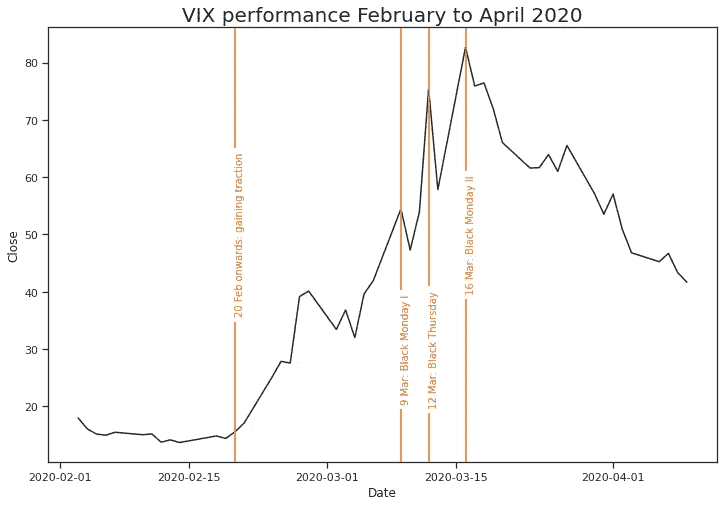
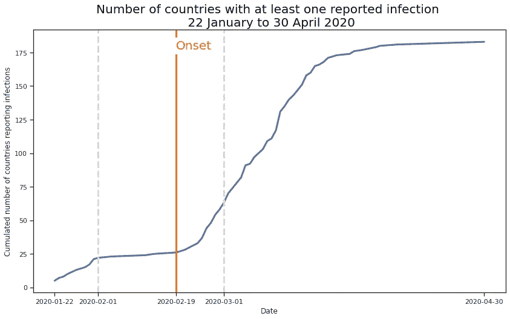
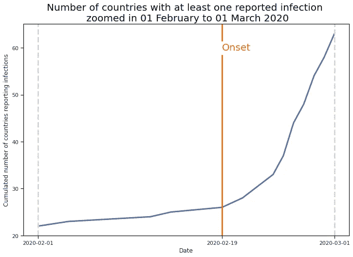
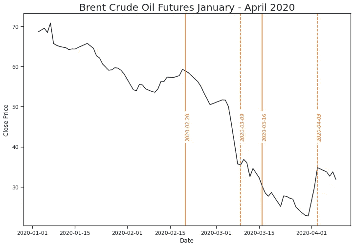
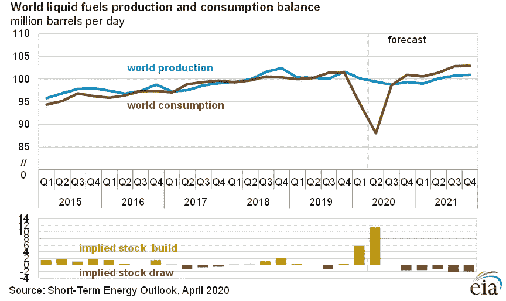
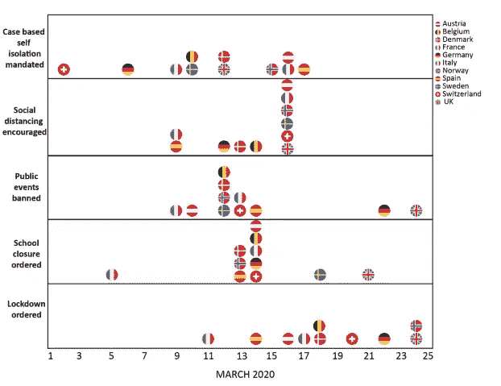
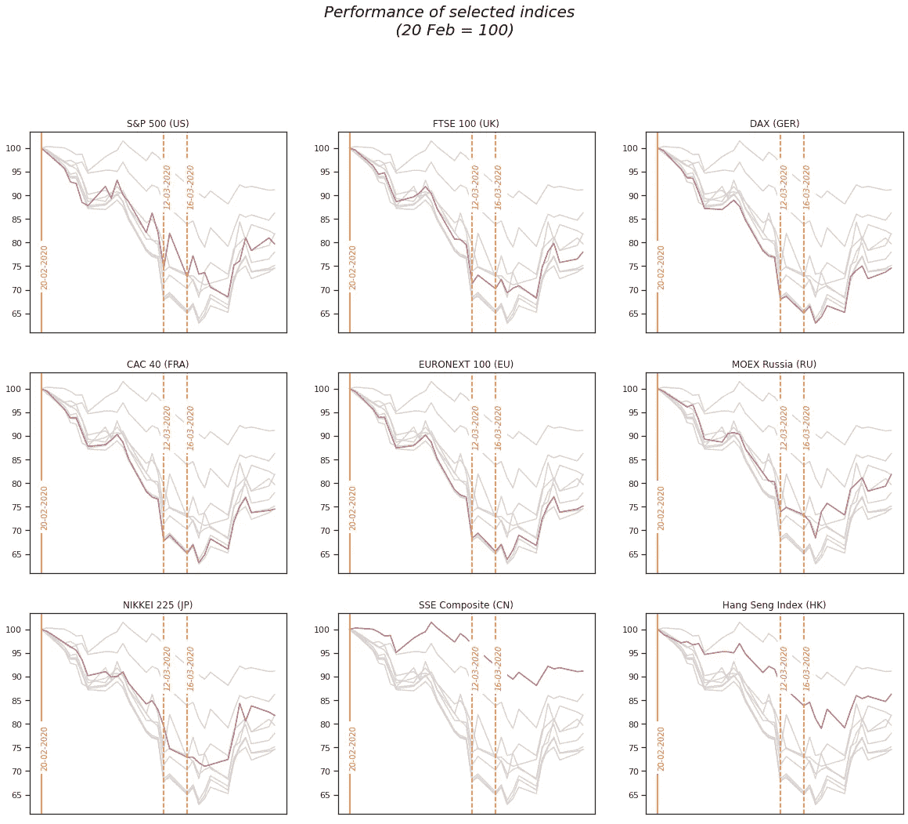

# 新冠肺炎如何影响金融市场:VIX 的故事

> 原文：<https://medium.datadriveninvestor.com/how-covid-19-infected-financial-markets-897f226bb0d0?source=collection_archive---------1----------------------->

## 虽然新冠肺炎疫情仍在进行中，但我们已经可以开始把碎片放在一起，并从已经发生的事情中学习。

# 金融市场中的恐惧和厌恶

Calculations by [riskl.io](http://www.riskl.io)

2019 年 12 月和 2020 年 1 月新冠肺炎疫情的爆发并没有对 **VIX 指数**产生影响。从 2 月中旬开始，事情迅速升级，该指数在 2020 年 3 月 16 日升至 82.69 的新纪录。不到一个月，它就超过了 2008 年 11 月 20 日*大衰退*期间的旧最高值 80.86。此外，****指数**在不到一个月的时间内设定其轨迹，于 2020 年 2 月 20 日开始攀升。在持续的新冠肺炎疫情过程中，金融市场的“恐惧”指标或更确切地说是不确定性指标创下了新的历史纪录。3 月 16 日， **VIX 指数**达到 82.69 点，超过了 2008 年 11 月 20 日在*大衰退*期间创下的 80.86 点的前纪录。“冲顶竞赛”在不到一个月前的 2 月 20 日开始，直到 3 月 16 日，金融市场在短短几天内经历了两个*和一个 [*黑色星期四*](https://en.wikipedia.org/wiki/Black_Thursday) *y* 。***

***虽然新冠肺炎疫情仍在持续，我们也无法确定接下来会发生什么，但随着 VIX 指数从历史高点回落，我们可以快速照一下镜子，了解震撼全球股市的三周半时间的关键收获。***

*** [## 使用谷歌搜索趋势预测首次申请失业救济人数|数据驱动的投资者

### 几年来，我的重点一直是使用多种替代数据来预测宏观经济统计数据…

www.datadriveninvestor.com](https://www.datadriveninvestor.com/2020/03/25/using-google-search-trends-to-predict-initial-jobless-claims/) 

下面这篇文章的目的是提供一个概述市场如何应对新冠肺炎疫情的开始，在写作时仍在进行。为了透明起见，我将主要依靠现成的数据和信息。

在我们开始之前，有一个简短的免责声明:以下内容不具有为投资决策提供指导的目的。

# VIX 解释道

VIX 指数通常被认为是金融市场恐惧的指标。 [Investopedia](https://www.investopedia.com/terms/v/vix.asp) 介绍如下:

> 由[芝加哥期权交易所(CBOE)](https://www.investopedia.com/terms/c/cboe.asp) 创建的波动率指数，或称 VIX，是一个实时的[市场指数](https://www.investopedia.com/terms/m/marketindex.asp)，代表市场对 30 天前瞻性[波动率](https://www.investopedia.com/terms/v/volatility.asp)的预期。它来源于标准普尔 500 指数期权的价格输入，提供了一种衡量市场风险和投资者情绪的方法。它也被称为“恐惧量表”或“恐惧指数”投资者、研究分析师和投资组合经理在做出投资决定之前，将 VIX 价值视为衡量市场风险、恐惧和压力的一种方式。

我认为在这种情况下“恐惧”的概念是误导的。VIX 抓住的是奈特莉不确定性的具体化。波动性上升，即价格随时间变化的幅度，表明投资者不确定未来会发生什么。这遵循了(半强)[有效市场假说](https://en.wikipedia.org/wiki/Efficient-market_hypothesis#Weak,_Semi-Strong,_and_Strong-Form_Tests)，该假说假设所有市场价格基本上都与普遍可获得的信息有关。如果新信息变得广为人知，价格也会随之变化，价格变化越大，新信息就越相关。如果新的信息被认为是相关的，但实际影响是未知的，价格开始波动=变得不稳定。此外，通过使用 S & P 500 期权作为输入， **VIX 指数**在一个相当高的高度上工作:为了震惊它，一个事件肯定必须非常重大。

# **2 月 20 日起:获得牵引力(VIX: 15.56)**

该轨迹表明，在 VIX 指数加速的最初几天，不会立即出现具有明显“啊哈”效应的大事件。这里的挑战是确定逐渐的小事件，这些小事件共同解释了市场不确定性的增加。在 [Risklio](https://www.riskl.io) 我们使用先进的数据科学和替代数据集来做到这一点，但为了保持简单(并充分了解这一来源的局限性)，我将从维基百科的[时事门户网站提供一个关于新冠肺炎的每日报道的简短摘要:](https://en.wikipedia.org/wiki/Portal:Current_events/February_2020#2020_February_21)

*   2 月 19 日 :伊朗报告首例感染
*   [**2 月 20 日**](https://en.wikipedia.org/wiki/Portal:Current_events/February_2020#2020_February_20) :南韩首例死亡归咎于新冠肺炎
*   [**2 月 21 日**](https://en.wikipedia.org/wiki/Portal:Current_events/February_2020#2020_February_21) :意大利新增 18 例感染和首次封锁；以色列和黎巴嫩报告了首例病例
*   [**2 月 22 日**](https://en.wikipedia.org/wiki/Portal:Current_events/February_2020#2020_February_22) **:** 意大利首次出现两例死亡病例，韩国和美国新增感染病例
*   [**2 月 25 日**](https://en.wikipedia.org/wiki/Portal:Current_events/February_2020#2020_February_25) **:** 奥地利、克罗地亚、瑞士、阿尔及利亚首次确诊感染病例；伊朗卫生部副部长检测呈阳性
*   [**2 月 26 日**](https://en.wikipedia.org/wiki/Portal:Current_events/February_2020#2020_February_26) :旧金山、圣地亚哥和圣克拉拉(均为加州)宣布进入紧急状态；首例病例发生在:巴西(南美首例)、罗马尼亚、格鲁吉亚、希腊、
*   [**2 月 27 日**](https://en.wikipedia.org/wiki/Portal:Current_events/February_2020#2020_February_27) **:** 美国首例不明来源感染；意大利 655 例，确认死亡 17 例；伊朗负责家庭事务的副总统确认感染；沙特阿拉伯在斋月前关闭边境；日本关闭初高中；新病例出现在:爱沙尼亚、圣马力诺
*   [**2 月 28 日**](https://en.wikipedia.org/wiki/Portal:Current_events/February_2020#2020_February_28) **:** 以下国家出现首例感染病例:白俄罗斯、摩纳哥、冰岛、阿塞拜疆、新西兰、立陶宛、墨西哥和尼日利亚

市场动荡第一阶段的主导模式，似乎是以新冠肺炎病毒的全球扩散及其最终成为全球疫情为标志的。约翰·霍普斯金的数据证实了这一点，即至少报告了一例感染的国家的累计数量。

Own calculations, data by [John Hopkins](https://github.com/CSSEGISandData/COVID-19/blob/master/csse_covid_19_data/csse_covid_19_time_series/time_series_covid19_confirmed_global.csv)

当我们放大灰色线条时，它变得更加明显。

Own calculations, data by [John Hopkins](https://github.com/CSSEGISandData/COVID-19/blob/master/csse_covid_19_data/csse_covid_19_time_series/time_series_covid19_confirmed_global.csv)

从 2 月 20 日开始，越来越多的国家报告了首例感染。出现病例的国家数量几乎翻了一番，从 2 月 20 日的 29 个增加到 2 月 27 日的 51 个(2 月 28 日为 57 个)。在此期间报告了最高的日增长率(如果由于涉及的数字较低而忽略早期的增长率)。这些信息增加了金融市场的不确定性。

3 月 11 日，当世卫组织最终宣布新冠肺炎突破疫情时，国家的数量已经增加到了 112 个。

# 2020 年 3 月 9 日:黑色星期一 I (VIX: 54.46)

随着金融市场不确定性的增加，股票市场也逐渐下跌。直到二月底，标准普尔 500 指数(VIX 指数的基础)下跌了大约。200 分，直到 2 月底。2020 年 3 月 9 日，黑色星期一(T21)，市场价格出现了真正的首次大幅下跌。

Own calculations, calculations by [riskl.io](http://www.riskl.io)

在 [Risklio](https://www.riskl.io) 我们总是不考虑事件报道的实际时间，而是考虑报道的事件对金融市场价格产生影响的时间。随着 3 月 9 日黑色星期一的到来，潜在的理由变得显而易见。维基百科叙述道

> 在开盘前，[道琼斯工业平均指数](https://en.wikipedia.org/wiki/Dow_Jones_Industrial_Average)期货市场因冠状病毒和上述油价下跌经历了 1300 点的下跌，引发了[交易抑制](https://en.wikipedia.org/wiki/Trading_curb)或断路器，导致期货市场暂停交易 15 分钟。这一预测的 1300 点跌幅将使 3 月 9 日成为道琼斯工业平均指数单日跌幅最大的一天。[【177】](https://en.wikipedia.org/wiki/2020_stock_market_crash#cite_note-177)[【178】](https://en.wikipedia.org/wiki/2020_stock_market_crash#cite_note-178)3 月 9 日开盘时，[道琼斯工业平均指数](https://en.wikipedia.org/wiki/Dow_Jones_Industrial_Average)一开盘就暴跌 1800 点，比预期低 500 点。[【179】](https://en.wikipedia.org/wiki/2020_stock_market_crash#cite_note-179)

先于*黑色星期一 I* 的是“ [2020 俄罗斯-沙特石油价格战](https://en.wikipedia.org/wiki/2020_Russia%E2%80%93Saudi_Arabia_oil_price_war)”的升级。由于新冠肺炎事件导致石油需求预期减少，在有关减少石油产量的谈判中出现争议后，沙特阿拉伯于 3 月 8 日星期六发起了对俄罗斯的价格战。期货市场做出了剧烈反应，美国能源情报署的分析标题是:“石油市场波动性正处于历史最高水平”。

Own calculations, calculations by [riskl.io](http://www.riskl.io)

不出所料，在沙特阿拉伯的声明发布后的第一个交易日，股票市场跟随了黑色星期一的轨迹。在早些时候，抛售如此激烈，以至于触发了交易断路器，以避免股市全面崩盘。

现在同样显而易见的是，在不久的将来，消费将大幅减少，预测必须通过时间的考验。

Source and deeper analysis: [EIA](https://www.eia.gov/outlooks/steo/report/global_oil.php)

这件事的政治成分也不能夸大。4 月 3 日，石油期货价格大幅上涨，原因是美国总统唐纳德·特朗普(Donald Trump)前一天发了一条推文，直接针对“交战方”:

# 2020 年 3 月 12 日:黑色星期四(VIX: 75.47)

事后看来，在全球疫情爆发后，石油价格战的爆发可能会令人惊讶。然而，只是在 3 月份之后的两周内，政治家们才接受了新冠肺炎的实际威胁。在当时受创最严重的欧洲，各国政府开始实施严格的控制措施。如上所述，世卫组织在 3 月 11 日宣布其为疫情，同一天，第一个西方国家意大利下令全国封锁。

Intervention timings for the 11 European countries, Source: [Imperial College Response Team (2020), Estimating the number of infections and the impact of nonpharmaceutical interventions on COVID-19 in 11 European countries, p.5](https://www.imperial.ac.uk/media/imperial-college/medicine/mrc-gida/2020-03-30-COVID19-Report-13.pdf)

3 月 12 日，股票价格再次大幅下跌，尽管我不想谈论政治，但不能忽视的是，主要原因之一是政治不确定性:

可以假设美国总统川普 3 月 11 日在椭圆形办公室发表的声明(同一天世卫组织宣布全球疫情)引起了很大的混乱。

Presidential

这一讲话令市场感到意外的一些例证如下:

*   目前在欧盟的美国公民重新进入美国的能力(2 分 40 秒)
*   与欧盟的货物旅行禁令的范围(2 分 44 秒)
*   美国保险公司报销新冠肺炎相关费用的范围(3 分 20 秒)

尤其是有关欧盟旅行的声明，对大西洋两岸的商业产生了重大的直接影响。特朗普总统明确将商品贸易纳入新的限制措施:

> 为了防止新病例进入我们的海岸，我们将在未来 30 天内暂停所有从欧洲到美国的旅行。新规定将于周五午夜生效。这些限制将根据实际情况进行调整。
> 
> 经过适当审查的美国人将获得豁免，这些禁令**不仅适用于大量的贸易和货物**，还适用于我们获得批准的其他各种事情。我们正在讨论从欧洲到美国的任何东西。这些限制也不适用于英国。
> 
> 来源:whitehouse.gov

仅在 2020 年 2 月，从欧盟到美国的进口就高达 327 亿美元(来源:[BEA 2020 年 4 月，第 29 页](https://www.bea.gov/system/files/2020-04/trad0220.pdf))。此外，欧盟[没有](https://en.wikipedia.org/wiki/2020_stock_market_crash#United_States_presidential_address)得到事先警告，这进一步证明了演讲的惊喜成分。特朗普在演讲后发了一条澄清性的推特，没有禁止第二天的*黑色星期四*。

Trump clarifying the scope of the EU travel ban on Twitter

# 2020 年 3 月 16 日:黑色星期一 II (VIX: 82.69)

VIX 指数在黑色星期一达到历史最高点。与黑色星期一相似，市场对前一个周末的新发展做出了反应:3 月 15 日星期日，美国美联储系统:

*   [将](https://www.federalreserve.gov/newsevents/pressreleases/monetary20200315a1.htm)联邦基金目标利率从 1.00–1.25 个基点降至 0.00–0.25 个基点。
*   宣布将购买价值 5000 亿美元的美国政府债券

这仅仅标志着美联储对新冠肺炎的回应的开始，在接下来的博客文章中将进一步探讨这一点。3 月 16 日，美联储与加拿大银行、英国银行、日本银行、欧洲中央银行、美联储和瑞士国家银行通力合作。关于采取行动的时机，值得注意的是，美联储认为有必要在周日采取行动，而****等到下周三的例会。****

****虽然 3 月 16 日导致资产价格大幅下跌，VIX 指数达到顶峰，但国际金融市场继续下跌，直到 3 月底。这也包括上海(上证)和香港(恒生)指数。****

********

****Red lines indicate that courses were lower on 15 April than on 20 Feb / grey lines are for comparison, Calculations by [risklio](http://riskl.io)****

****这意味着，随着各国央行现在采取一致行动，越来越多的国内政府致力于国内刺激计划，市场参与者已经清楚地看到，形势确实很严峻。因此，尽管预期是“恐惧”(理解为:不确定性)正在慢慢倾斜，但 VIX 指数仍然比正常时期高出一倍以上。****

# ****我们学到了什么****

****我们仍然处在一个可能发生事件的情况下，这些事件可能会冲击 VIX 指数回到潜在的创纪录水平。然而，从 2 月 20 日至 3 月 16 日这几周得出的初步积极结论是:****

*   ****市场花了一段时间才明白形势的严重性。不确定性先于明确性，来自于政府开始采取对策。****
*   ****石油价格战的同时升级加剧了市场的不确定性。****
*   ****尤其是政策制定者的第一次行动，当他们是单方面的时候，会引起不确定性，而当他们是合作的时候，会引起确定性。****

****这些黑色的日子真的是黑天鹅事件吗？我认为不是。特朗普总统禁止商品贸易之前，T2 与中国发生了漫长的贸易争端。油价争端的潜在影响并不令人惊讶，至少从 20 世纪 70 年代初的[开始。最不令人惊讶的是，金融市场会对美联储的声明做出反应，众所周知，美联储有自己的“美联储发言”](https://en.wikipedia.org/wiki/1973_oil_crisis)，专门用来避免这种反应。****

****仅仅因为 VIX 指数已经达到拐点，并不意味着标准普尔 500 也是如此。但这是另一篇博文的内容。*******