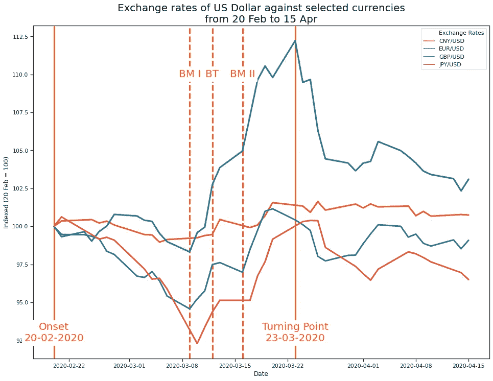
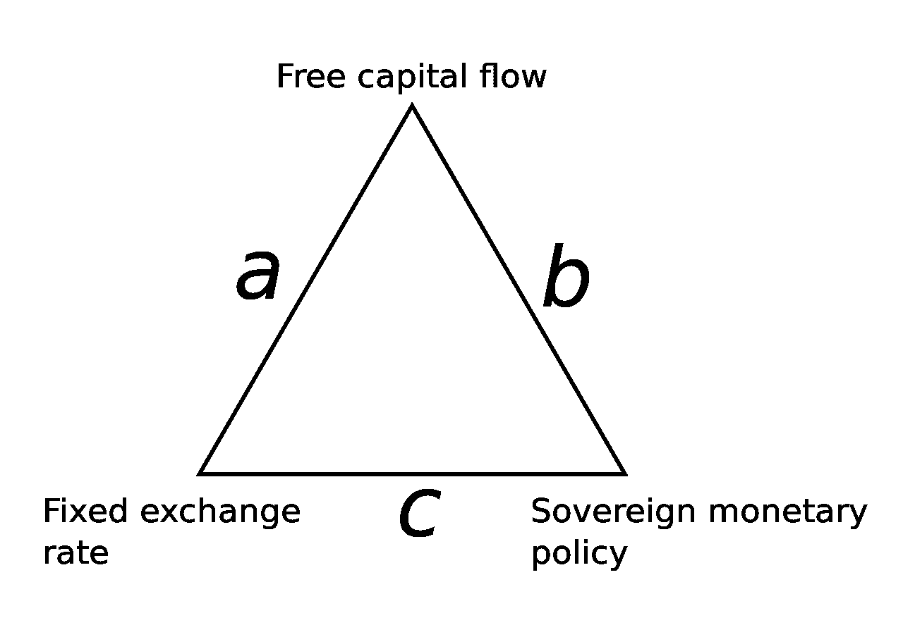
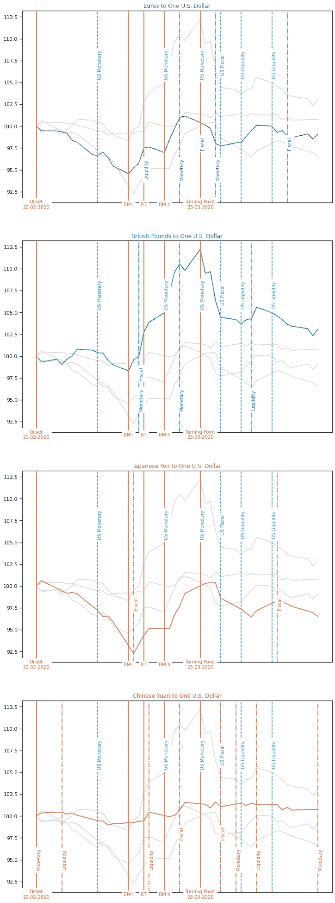

# 新冠肺炎如何影响金融市场:汇率

> 原文：<https://medium.datadriveninvestor.com/how-covid-19-infected-financial-markets-exchange-rates-3886c003ab77?source=collection_archive---------18----------------------->

虽然全球股票价格的变化只与少数投资者直接相关，但汇率变化会影响我们所有人。

同样影响我们所有人的是，这篇文章的内容是一种观点，仅供参考。它无意成为投资建议。找一个有正式执照的专业人士寻求投资建议。

Orange lines indicate relevant financial markets events: “BM I” is “Black Monday I”, “BT” is “Black Thursday” and “BM II “ is “*Black Monday II”. Calculations by* [*riskl.io*](http://www.riskl.io)*,* data from [FRED](https://fred.stlouisfed.org/)

# 新冠肺炎如何影响金融市场:一个综述

我过去的博客文章描述了新冠肺炎对以下方面的影响:

*   [VIX(或金融恐惧)指数](https://medium.com/@wernersd4/how-covid-19-infected-financial-markets-897f226bb0d0)
*   [S & P 500](https://medium.com/@wernersd4/how-covid-19-infected-financial-markets-the-s-p-500-deconstructed-dd87c20ef2bc) 涵盖的美国产业和行业
*   以及主要的全球金融市场指数。

报告显示，自 2020 年 2 月 20 日起，全球金融市场开始意识到新冠肺炎病毒对人类的威胁，越来越多的国家报告了首例感染病例。两个*黑色星期一*和一个*黑色星期四*被同时发生的石油战争和对新冠肺炎反应的重大不确定性所加剧。不到一个月之后，4 月 23 日，美联储做出了一项史无前例的决定，导致全球价格轨迹发生转折。

# 汇率:货币的价格

到目前为止，这项分析仅仅基于上市公司的股价。但货币也有金融市场价格:将一种货币兑换成另一种货币只是在公开市场上用另一种货币进行买卖。

Photo by [NeONBRAND](https://unsplash.com/@neonbrand?utm_source=medium&utm_medium=referral) on [Unsplash](https://unsplash.com?utm_source=medium&utm_medium=referral)

如果我想买 1 美元，我必须支付 x 欧元，所以汇率是 x:1 欧元:美元。汇率(从字面上看)有两条腿，这里是欧元和美元，汇率的变化可能是由其中任何一个引起的。例如，如果欧洲央行决定印制更多欧元，那么欧元对美元的汇率将会上升，因为我现在可以用一美元购买相对更多的欧元。

随着欧元相对贬值，我的美元相对升值，反之亦然。

听起来很复杂？情况变得更糟…

# 管理货币:不可能的三位一体

由于货币影响到我们所有人，它们由一群特殊的人管理，即央行经理。毕竟，央行的主要工作是“执行”货币政策。这份工作并不容易，因为你不可能同时拥有[蛋糕](https://en.wikipedia.org/wiki/You_can%27t_have_your_cake_and_eat_it)(固定汇率)、分享蛋糕(自由资本流动)和吃掉蛋糕(管理蛋糕)。这被称为[不可能的三位一体](https://en.wikipedia.org/wiki/Impossible_trinity)，我将保持简单。

The impossible trinity, source: [Wikipedia](https://en.wikipedia.org/wiki/Impossible_trinity)

*   **资本自由流动**:这基本上意味着你不能随心所欲地买卖货币，但你必须向一个中央机构申请(这被称为资本管制)
*   固定汇率:这实际上意味着，如果你想买卖一种货币，价格不是由需求或供给决定的，而是固定不变的
*   主权货币政策:你想要积极管理一种货币的原因有很多，其中之一就是找到一种不同的方式来应对紧急情况的后果，比如新冠肺炎。

# 新冠肺炎对汇率的影响

这可能算不上什么搅局者，但没错，确实有货币政策措施。我们可以理解每个事件对汇率的影响。但在这里，把两条腿都考虑进去很重要:作为一个统一的分母，我选择美元只是因为它是世界上最重要的货币。汇率数据来自[美国美联储经济数据库](https://fred.stlouisfed.org/)的数据库，我已经将数值索引到 2 月 20 日。这意味着为了了解欧洲、英国、日本和中国货币政策事件对欧元、英镑、日元和人民币的影响，也有必要考虑美国货币政策事件。幸运的是，[我们有所有这些事件](https://medium.com/@wernersd4/how-covid-19-infected-financial-markets-turning-point-1128e94d3f7f)。

为什么有些跳转没有很好地添加到事件行中？见附录。

应该如何读取汇率数据？如果额度增加，我可以用一美元(或 100 美元)购买更多单位的一种货币。其相对价值*增加*，另一种货币的价值*减少*，反之亦然。这是坏事吗？不一定。但在危机时期，它可能是投资者对一种货币未来购买力失去信心的一个指标。

Data from 20 February until 20 April, indexed to 20 February (=100); orange lines indicate relevant financial markets events: “BM I” is “Black Monday I”, “BT” is “Black Thursday” and “BM II“ is “*Black Monday II”. Light blue lines indicate US-related events. Calculations by* [*riskl.io*](http://www.riskl.io)

*   **欧元**:一个*批次* 这里发生的事情会对汇率产生直接影响。它真正显示了事件风险对欧元/美元汇率的相关性，其中个别事件会产生直接影响。我们看到了很多乒乓效应，但尤其是两个重大转折点:直到*黑色星期一 I* ，美元变得相对不那么值钱，这种情况在 2020 年 3 月 12 日发生了变化，当时欧洲央行增加了流通中的欧元数量。3 月 27 日美国创纪录的刺激方案稳定了汇率。
*   **英镑**:虽然在黑色星期一之前一切都很顺利，但美元开始升值，直到 3 月 23 日美联储通过其[无限 QE 计划](https://medium.com/@wernersd4/how-covid-19-infected-financial-markets-turning-point-1128e94d3f7f)导致整体拐点。在顶峰时期，它相对于英镑升值了 10 %,这是一个很大的数字！
*   **日元**:同时一美元的相对价值下降，直到日本政府增加支出，有效地将更多的日元投入流通，可以用一美元购买。扭转这一趋势的第二个转折点发生在 3 月 27 日，当时美国政府以创纪录的 2.2 万亿美元刺激方案作为回应。有趣的是，这一趋势并没有被日本自己创纪录的 108 万亿日元(= 1 万亿美元)刺激计划所打破。
*   **中国元(人民币):**有点平的线？请记住不可能的三位一体:如果我们看到稳定的汇率和积极的货币政策，让我们假设，当涉及到中国时，货币的自由浮动在某种程度上是被禁止的，但我肯定会谈到这一点。然而，它得出的结论是，即便是震撼美国市场的大规模事件，也对人民币的相对价值影响甚微。

# 结论

这里面有很多东西，但看到不同类型的事件如何影响不同的货币仍然非常令人吃惊。它表明，事件风险不应该只与金融市场参与者相关，而应该与参与涉及一种以上货币的商业活动的任何人相关。

## *附录:处理财务数据时的注意事项*

特别是在查看来自日本和中国的数据时，我们会看到一个重要的技术*警告*:由于我们查看的是纽约市以外币支付的电汇的*中午买入价，由于时区差异，价格点的时间戳可能与事件的时间点不同。例如，日本标准时间(JST)比纽约东部标准时间(EST)早 13 个小时。考虑到这一点，我已经提前一天移动了价格点，但你仍然可以看到事件和(预期)效果并不完全一致。也有可能这些影响是由于一些我们没有注意到的其他事件造成的。在 [Risklio](https://www.riskl.io) 我们使用机器学习来纠正这一点。*