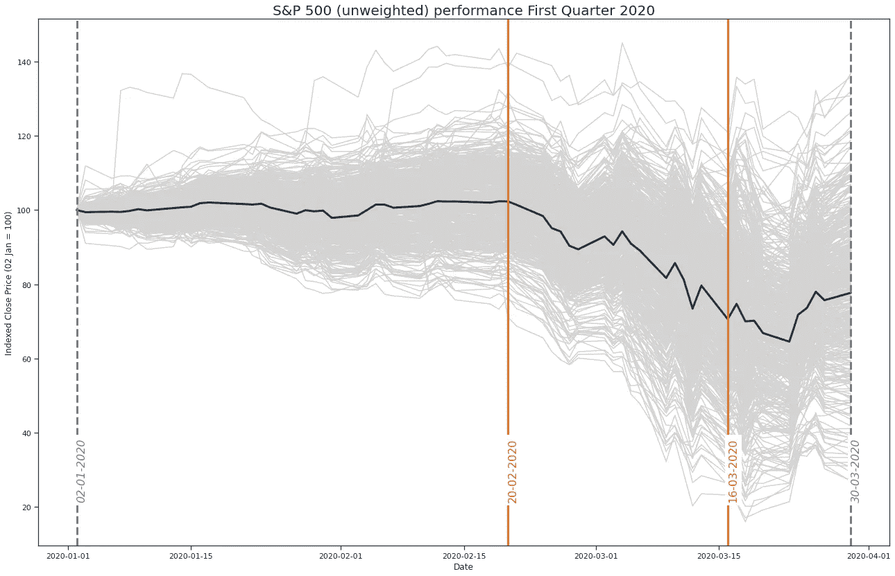
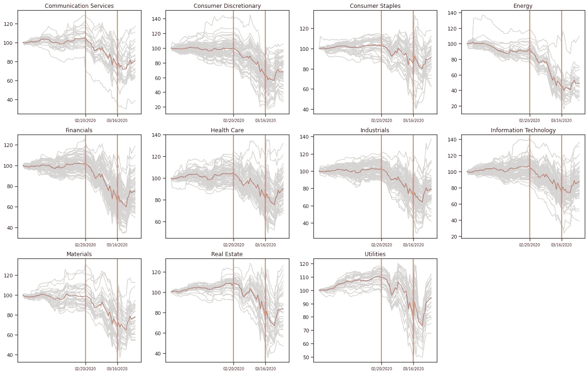
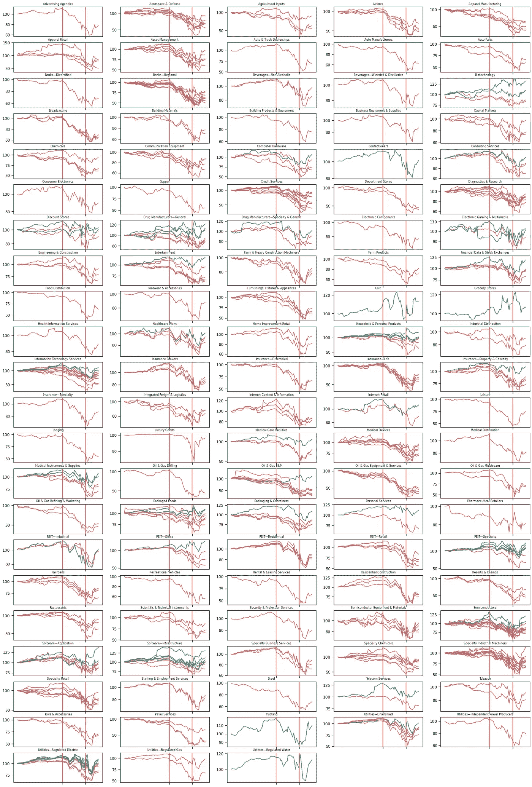

# 新冠肺炎如何影响金融市场:标准普尔 500 的故事

> 原文：<https://medium.datadriveninvestor.com/how-covid-19-infected-financial-markets-the-s-p-500-deconstructed-dd87c20ef2bc?source=collection_archive---------20----------------------->

在市场危机中，行业真的具有进攻性和防御性吗？它告诉了我们什么是被动投资

S&P500 unweighted index (RSP), the red line indicates indexed unweighted sector performance, red if the price on 1 April smaller than on 1 Jan, green otherwise. Grey lines represent individual companies within the sector. Own calculations, calculations by [riskl.io](http://riskl.io)

当大甩卖和重大不确定性主导金融市场时，我们能假设个别部门或行业会跑赢大盘吗？

值得仔细看看。在这篇短文中，我感兴趣的是防御性和进攻性股票的概念在全球金融危机中是否正确，以及这对被动投资有何影响。

 [## 影响者在聚光灯下表演|数据驱动的投资者

### 影响者营销是一个脱颖而出的游戏。结果是一个令人难忘的-和可信的-连接到一个产品或…

www.datadriveninvestor.com](https://www.datadriveninvestor.com/2020/01/15/influencers-perform-in-the-spotlight/) 

但是个体公司也可以吗？可能是的，但请记住:本文的内容是一种观点，仅供参考。它无意成为投资建议。找一个有正式执照的专业人士寻求投资建议。

# **攻防区**

No, not these ones. Photo by [Muyuan Ma](https://unsplash.com/@sammiamigo?utm_source=medium&utm_medium=referral) on [Unsplash](https://unsplash.com?utm_source=medium&utm_medium=referral)

在金融经济学中，有一个概念，即不同的商业部门对经济周期的变化有不同的反应。例如，在金融危机期间，人们不太倾向于进行长假旅行，但仍然愿意(甚至更愿意)储备日常消费品(卫生纸)。

宏观而言，对商业周期反应较强的股票被认为是“进攻性的”，反应较弱的股票被认为是“防御性的”。(你可以在[投资媒体](https://www.investopedia.com/articles/00/082800.asp)上找到更多相关信息。)通常，这需要更长的时间周期和业务波动才能被恰当地观察到。但在 Q1 2020 期间发生的这种股票价格的大幅波动，在更短期的层面上提供了对这种关系的更多见解。

# 解构标准普尔 500

剖析行业周期性的一个好方法是看行业。为了快速分析，我开始收集 S&P500 指数代表的 500 家美国公司的数据，并查看了来自[雅虎财经](http://finance.yahoo.com)的一些数据。然后，我将这些公司的部门和行业进行汇总，并将其股价指数化至 2020 年 1 月 1 日，以便进行一些交叉比较。与标准普尔 500 指数的成分股一起工作是一种使用不同聚合水平的好方法，但是当与指数本身一起工作时，我必须记住成分股是由市值加权的这一事实。幸运的是，有一些交易所交易基金追踪标准普尔 500 指数，假设权重相等。我选择了景顺标准普尔 500 同等权重 ETF ( RSP)并没有偏爱其中的一个，只是因为它可以在雅虎财经*上找到。*

# 感兴趣的事件

我还将 2020 年 Q1 最相关的日期重新绘制到图表中。请参见我关于 VIX 指数表现的博客文章。简而言之:

*   由于越来越多的公司报告感染，2 月 20 日标志着市场动荡的开始
*   3 月 9 日，黑色星期一之后，俄罗斯和沙特阿拉伯石油战争的升级进一步推波助澜
*   3 月 12 日是黑色星期四，特朗普总统给市场增加了不确定性
*   3 月 16 日是黑色星期一 II，市场对美联储降息做出反应，降息从本周的周三重新安排到周末

# **板块表现**

在这种环境下，各个*行业*的表现各不相同。总体而言，我们看到，在所有行业中，没有一家公司的表现明显优于另一家。然而，有趣的是，我们看到不同部门之间的差异更大。在每个行业中，我们看到个别公司的表现比平均水平好或差。值得注意的例外很可能是*能源*，然而它也不得不应对同时发生的[石油价格战](https://en.wikipedia.org/wiki/2020_Russia%E2%80%93Saudi_Arabia_oil_price_war)。

Indexed performance of S&P500 constituents by sector, Q1 2020\. The Coloured line indicates indexed unweighted sector performance, red if the price on 1 April smaller than on 1 Jan, green otherwise. Orange lines indicate 20 February and 16 March. Grey lines represent individual companies within the sector. Calculations by [riskl.io](http://www.riskl.io)

# 行业绩效

我还会查看标准普尔 500 指数中包含的*行业*。鉴于有大量的迷你图表，我改变了颜色，以显示哪些单个成分在 4 月 1 日之前恢复了 1 月 1 日的价格(绿色)，哪些没有恢复(红色)。总的来说，在 Q1 结束时，股价比开始时(用绿色表示)高的股票数量相对较少。

Indexed performance of S&P500 constituents by sector, Q1 2020\. The chart line is coloured red if the price on 1 April smaller than on 1 Jan, green otherwise. Orange lines indicate 20 February and 16 March. Calculations by [riskl.io](http://riskl.io)

这里发生了很多事情，但是我们仍然没有看到一个明显的赢家。你可能已经预料到科技和医疗用品的表现会相当好，但令我惊讶的是特种房地产投资信托基金的表现。但这实际上涵盖了很多不同类型的房地产，包括赌场，也包括农田。

# 系统性风险是系统性的

我看到许多金融科技公司将 ETF 宣传为具有内在风险抵御能力的金融产品。这种弹性倾向于一个被称为*非系统性风险*的概念，即单一资产价格变化的风险(=波动性)。[现代投资组合管理](https://en.wikipedia.org/wiki/Modern_portfolio_theory)的整体理念是在最大化盈利的同时最小化这种风险。但也有*系统性风险*，或 [**事件**](https://en.wikipedia.org/wiki/Systematic_risk) 影响不止一只股票的风险。这正是在新冠肺炎期间发生的事情，不幸的是，只要是你造成的损失，是什么造成的损失并不重要。

# 结论:系统性风险是系统性的

观察不同行业和部门在 2020 年第一季度的表现可以看出，当着眼于更长的时间范围(如一年或更长时间)时，进攻和防御部门的概念可能是更好的指导。尽管你可能通过投资指数跟踪型 ETF 实现了投资组合的多元化，但你仍然会亏损。也许是时候[反思](http://www.risk.finance)系统风险管理了。